# ATIONet - Manual de Fidelidad

<table>
	<tr>
		<th colspan="2" align="left">Información documento</th>
	</tr>
	<tr>
		<td>Archivo:</td>
		<td>AN-Axion-UserManal-SP</td>
	</tr>
	<tr>
		<td>Version documento:</td>
		<td>1.0</td>
	</tr>
	<tr>
		<td>Fecha:</td>
		<td>15 Febrero 2018</td>
	</tr>
	<tr>
		<td>Autor:</td>
		<td>ATIOnet LLC</td>
	</tr>
</table>

<table>
	<tr>
		<th colspan="3" align="left">Change Log</th>
	</tr>
	<tr>
		<td>Ver.</td>
		<td>Fecha</td>
		<td>Detalle cambio</td>
	</tr>
	<tr valign="top">
		<td>1.0</td>
		<td>9 Marzo 2018</td>
		<td>1.0</td>
	</tr>
	<tr valign="top">
		<td>1.1</td>
		<td>20 Abril 2018</td>
		<td>Cambio de nombre Redenciones a Canjes, cambio de columnas en la vista de Transacciones y Conciliaciones. Agregado seccion Contingencia. </td>
	</tr>
</table>

## Contents

<!-- MarkdownTOC depth=3 -->

- Visión general
- [Definiciones](#definiciones)
	- [Contrato](#contrato) 
	- [Sub cuenta](#sub-cuenta)
	- [Compañía](#compañía)
	- [Identificador](#identificador)
	- [Sitio](#sitio)
	- [Vehículo](#vehículo)
	- [Conductor](#conductor)
	- [Modulo offline](#modulo-offline)
	- [Terminal](#terminal)
- [Fidelidad](#fidelidad)
	- [Ajustes](#ajustes)
	- [Cliente de Fidelidad](#cliente-de-fidelidad)
	- [Conciliaciones](#conciliaciones)
	- [Cuenta Corriente](#cuenta-corriente)
	- [Excepciones](#excepciones)
	- [Programas](#programas)
	- [Redenciones](#redenciones)
	- [Reglas](#reglas)
	- [Transacciones](#transacciones)
	- [Transferencias](#transferencias)
	- [Unidades](#unidades)

<!-- /MarkdownTOC -->

## Visión General

ATIOnet se basa en la premisa de que las comunicaciones online entre sitios y el portal web son posibles, sin embargo, provee sólidos procedimientos de contingencia en el caso de que ocurra un error de comunicación.

La plataforma de ATIOnet es un servicio de administración de flotas con una innovadora y única oferta de mercado. Procesamiento en la nube, 100% web-based, acceso multi-usuario, disponibilidad y compartimiento de datos, actualizaciones instantáneas, seguridad, back-up automático y reducción de papeleo.

ATIOnet es un portal web para compañías de servicios de flotas que permite el procesamiento de transacciones desde cualquier aplicación de punto de venta mediante una interfaz simple y confiable. 

ATIOnet puede ser instalado en cualquier estación de servicio con uno o múltiples programas de servicios de flotas. El portal web le permite a los administradores de flotas acceso total a la información de sus vehículos.

ATIOnet hace posible que el administrador de flota opere, monitoree, cambie y edite la información de la flota en tiempo real.

## Definiciones

### Contrato 

El contrato es la relación que existe entre la network y el cliente, en el que se pauta, por ejemplo, si sera de importe o volumen, el precio al que se le va a vender el combustible, en que sitios puede cargar, entre otros.

### Sub Cuenta 

Cada vez que se asocia un identificador a un vehículo o un conductor se crea una sub cuenta. La sub cuenta es en definitiva quien va a tener una cuenta corriente, la sub cuenta va a poder recibir depósitos de dinero o producto. Las reglas también impactan a la sub cuenta.

Las sub cuentas dependen jerarquicamente del contrato.

### Compañía 

En ATIOnet, la compañía se refiere a la empresa dueña de la flota.

### Identificador 

El identificador es el medio físico que utiliza ATIONet para poder identificar un vehículo o un conductor. ATIONet soporte varios tipos de identificaciones, como ser tarjeta, tag (anillo), chip, tarjeta ATIONet, entrada manual, código de barras e iButton. Cuando se asocia un identificador a un Vehículo o Conductor se crea una sub cuenta.

### Sitio 

El Sitio representa a la estación de servicio. A un sitio se le asigna la terminal y también puede tener asociadas reglas de Ubicación.

### Modulo Offline 

El modulo offline de ATIONet se activa automáticamente cuando la estación de servicio se queda sin conexión a Internet y las autorizaciones no se pueden procesar online. En este momento entra en juego el modulo offline. Para el controlador Nano CPI es totalmente transparente. Cuando el modulo offline recupera la conectividad envía toda la información procesada localmente y también baja las novedades. Mientras haya conectividad el modulo offline esta continuamente bajando las novedades (saldos, identificadores, reglas, etc) de ATIONet.

### Terminal

La terminal (o controlador) es la representación del controlador de surtidores, que necesita parametrizarse de manera particular según el tipo de terminal. Las terminales que ATIONet maneja son ATIO-NanoCPI, ATIO-Standalone, ATIO-CG, VF-Standalone, VF-Sapphire, VF-Ruby, ControlGas y OPW-FSC3000. 

## Fidelidad

### Ajustes

En esta vista usted puede consultar los ajustes de fidelidad que se realizaron. Un ajuste de fidelidad se refiere a la quita o suma de puntos en una cuenta de fidelidad.

Los ajustes están listados por Sitio, Fecha, Hora, la cuenta de Fidelidad a la cual se le sumo o quito puntos, la cantidad de puntos sumados o restados, el código de respuesta y el mensaje de respuesta.

Para hacer las consultas mas faciles, usted cuenta con un panel de filtros. Los campos disponibles para filtrar son los siguientes:

* ***Vehículo***: Ingrese el vehículo por el cual desea filtrar.
* ***Conductor***: Ingrese el conductor por el cual desea filtrar.
* ***Sitio***: Ingrese el sitio por el cual desea filtrar.
* ***Terminal/Controlador***: Ingrese la terminal/controlador por el cual desea filtrar.
* ***Fecha Desde/Fecha Hasta***: Ingrese el rango de fechas por el cual desea filtrar.
* ***Hora Desde/Hora Hasta***: Ingrese el rango horario por el cual desea filtrar.

Cuando termine de llenar los campos, haga click en el botón "Crear Filtro" si quiere guardarlo, o simplemente haga click en el botón "Nuevo" para realizar la búsqueda.

#### Crear Ajuste de Fidelidad

Para crear un nuevo ajuste de fidelidad, haga click en el botón "Nuevo" que se encuentra en el extremo superior izquierdo de la vista.

Los campos a completar son los siguientes:

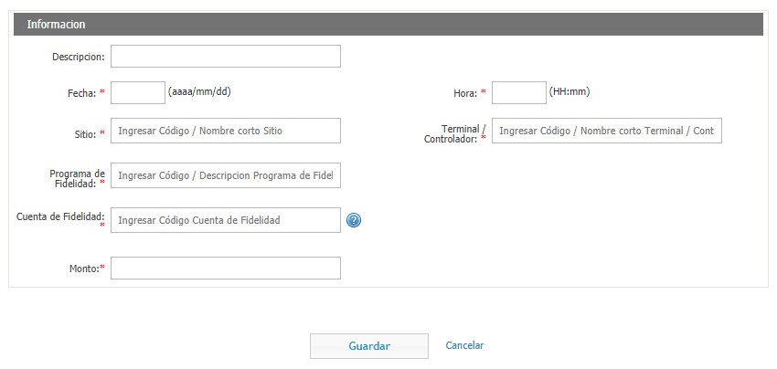

* ***Descripcion***: Ingrese una descripción del nuevo ajuste de fidelidad.
* ***Fecha***: Ingrese la fecha en la que esta realizando el nuevo ajuste de fidelidad.
* ***Hora***: Ingrese la hora en la que esta realizando el nuevo ajuste de fidelidad.
* ***Sitio***: Ingrese el sitio en el que esta realizando el nuevo ajuste de fidelidad.
* ***Terminal/Controlador***: Ingrese la terminal/controlador con el que se esta realizando el nuevo ajuste de fidelidad.
* ***Programa de Fidelidad***: Ingrese el programa de fidelidad al cual esta relacionado el nuevo ajuste de fidelidad que esta creando.
* ***Cuenta de Fidelidad***: Ingrese la cuenta de fidelidad al cual esta relacionado el nuevo ajuste de fidelidad que esta creando.
* ***Monto***: Ingrese la cantidad de puntos a sumar o quitar.

Cuando termine de llenar todos los campos haga click en el botón "Guardar".

### Canjes

Los canjes son cuando se hace el canje de puntos por un producto. En esta vista puede consultar los canjes listados por Sitio, Fecha y Hora, la cuenta de Fidelidad que realizo el canje, la cantidad de puntos que se usaron en la transacción, el código de respuesta y el mensaje de respuesta.

Esta vista cuenta con un panel de filtros para hacer mas faciles las consultas.

Los campos disponibles para filtrar son los siguientes:

* ***Vehículo***: El vehículo por el cual se quiere filtrar.
* ***Conductor***: El conductor por el cual se quiere filtrar.
* ***Sitio***: El sitio por el cual se quiere filtrar.
* ***Terminal/Controlador***: La terminal/controlador por el cual se quiere filtrar.
* ***Fecha Desde/Fecha Hasta***: Ingrese el rango de fechas por el cual quiere filtrar canjes.
* ***Hora Desde/Hora Hasta***: Ingrese el rango horario por el cual quiere filtrar canjes.

Cuando termine de llenar los campos que quiera, puede cliquear en "Crear Filtro" para guardarlo para futuras ocasiones, o simplemente en "Buscar" para filtrar los resultados.

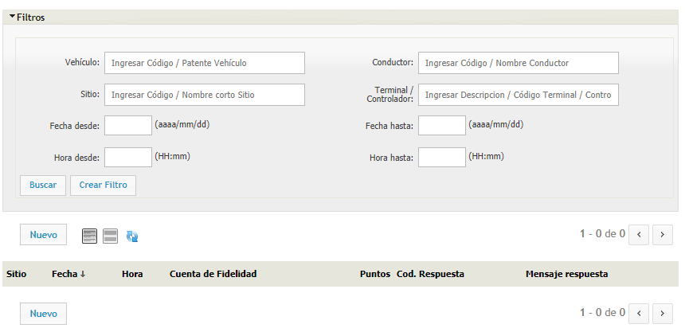

#### Crear un nuevo canje

Para crear un nuevo canje, haga click en el botón "Nuevo" que se encuentra en el extremo superior izquierdo de la vista.

Los campos a completar son los siguientes:

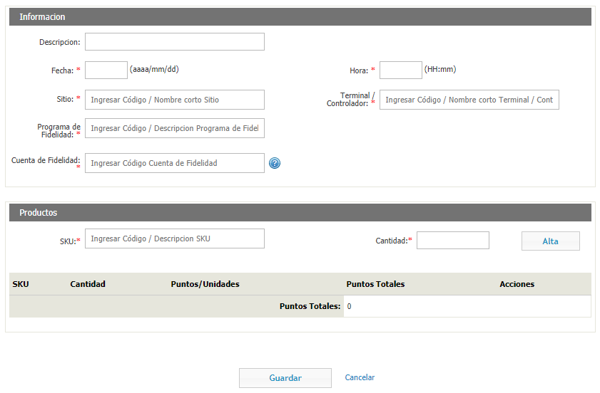

* ***Descripción***: Ingrese una descripción del canje.
* ***Fecha y Hora***: Ingrese la fecha y hora en la que ocurre el canje.
* ***Sitio***: Ingrese el sitio en donde ocurre el canje.
* ***Terminal/Controlador***: Ingrese la terminal/controlador con la que se realiza el canje.
* ***Programa de Fidelidad***: Ingrese el programa de fidelidad asociado a el canje.
* ***Cuenta de Fidelidad***: Ingrese la cuenta de fidelidad asociada a el canje.

* ***Producto***: Ingrese el SKU del producto.
* ***Cantidad***: Ingrese la cantidad de unidades del canje.

Cuando termine de llenar esos dos campos, haga click el botón de "Alta" para confirmar.

Cuando termine de llenar todos los campos, haga click en botón "Guardar".

### Cliente de Fidelidad

En esta sección, usted puede crear nuevos clientes de fidelidad. Lo primero que debe seleccionar es el Programa de Fidelidad al cual va a pertenecer este nuevo cliente de fidelidad. Luego, llenar los siguientes campos:

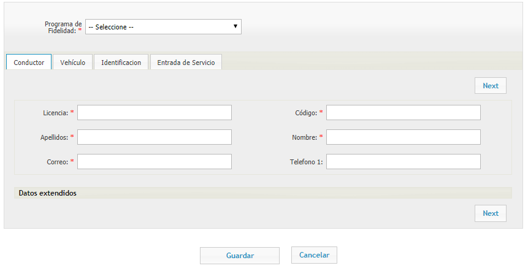

* ***Licencia***: Ingrese el numero de licencia del conductor.
* ***Código***: Ingrese el código del conductor.
* ***Apellidos***: Ingrese el o los apellidos del conductor.
* ***Nombre***: Ingrese el nombre del conductor.
* ***Correo***: Ingrese el correo electrónico del conductor.
* ***Teléfono 1***: Ingrese un numero de teléfono de contacto del conductor.

Haga click en "Datos extendidos" si quiere agregar mas información.

* ***Lic. País***: Seleccione el país de origen de la licencia del conductor.
* ***Lic. Provincia***: Seleccione la provincia de origen de la licencia del conductor.
* ***Fecha de Nacimiento***: Ingrese la fecha de nacimiento del conductor.
* ***Teléfono 2***: Ingrese otro numero de teléfono de contacto del conductor si lo tuviere.

Cuando termine de llenar estos campos, haga click el botón "Next" para agregar la información del vehículo.
 
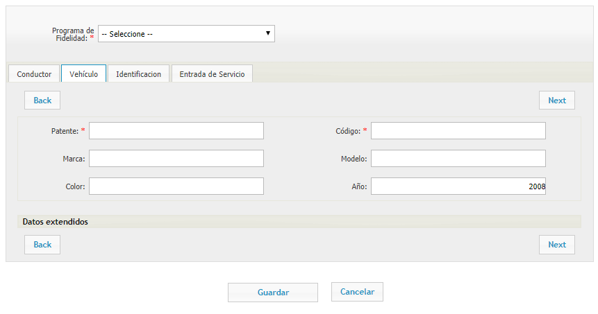

* ***Patente***: Ingrese la patente del vehículo.
* ***Código***: Ingrese el código del vehículo.
* ***Marca***: Ingrese la marca del vehículo.
* ***Modelo***: Ingrese el modelo del vehículo.
* ***Color***: Ingrese el color del vehículo.
* ***Año***: Ingrese el año del vehículo.

Haga click en "Datos extendidos" si quiere agregar mas información".

* ***Tipo***: Seleccione el tipo de vehículo que esta registrando.
* ***Numero Chasis***: Ingrese el numero de chasis.
* ***Numero motor***: Ingrese el numero de motor.
* ***Odometro Actual***: Ingrese el numero del odometro actualmente.

Cuando termine de llenar estos campos, haga click en el botón "Next" para agregar la información del identificador.

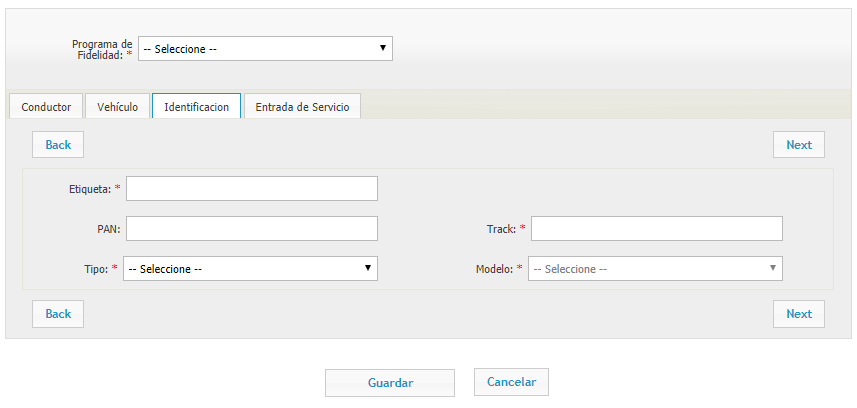

* ***Etiqueta***: La etiqueta es, por ejemplo, el nombre que aparece en el dorso de una Tarjeta. Ingrese
* ***PAN***: Ingrese el PAN del identificador.
* ***Track***: Usted puede personalizar la segunda parte del track del identificador. Ingrese aquí lo que quiere que este en el track.
* ***Tipo***: Seleccione si el identificador es de tipo Tarjeta, TAG, Chipkey, Entrada Manual, Tarjeta ATIONet o ATIONet TAG.
* ***Modelo***: Seleccione el modelo dependiendo del tipo de identificador que haya elegido.

Cuando termine de llenar estos campos, haga click en el botón "Next" para agregar la información de entrada de Servicios.

* ***Código de Hoja de Servicio***: Ingrese el código que quiere asignarle a la entrada de servicio.
* ***Grupo de tipo de entrada de servicios***: Ingrese el grupo de entrada de servicio.
* ***Tipo de entrada de servicios***: Ingrese el tipo de entrada de servicio.
* ***Ingreso***: La fecha en la que entro el vehículo para realizarle un servicio.
* ***Fecha de Expiración***: La fecha de expiración del servicio.
* ***Odometro***: Ingrese el odometro actual.
* ***Horas de motor***: Ingrese las horas de motor actuales.
* ***Servicios***: Ingrese los servicios realizados.
* ***Comentario***: Ingrese un comentario de la entrada de servicios.

Cuando termine de llenar todos los campos, puede cliquear en el botón "Guardar" para guardar los cambios.

### Conciliaciones

Esta vista solo se mostrara si el programa procesa host externo.

La vista de conciliaciones muestra el resultado del proceso de ATIONet contra el resultado del proceso del host de fidelidad externo.

En esta vista puede ver todas las conciliaciones listadas por Código de Autorización de la misma, la fecha, hora y sitio donde ocurre la transaccion; la cuenta de Fidelidad relacionada a la conciliación, el monto, la cantidad de puntos, los puntos externos de la conciliación, el estado de la transaccion y el estado de la conciliación. También cuenta con un botón para descargar una planilla con los datos de las conciliaciones.

Para hacer las consultas mas fáciles, esta vista cuenta con un panel de filtros.

Los campos disponibles para filtrar son los siguientes:

* ***Compañía***: Filtre por compañía.
* ***Diferencias de Conciliación***:
* ***Estado de Conciliación***: Seleccione si quiere filtrar las sin procesar, las reconciliadas, las que difieren, error, excluidas.
* ***Cod. Autorización***: Filtre por el código de autorización de la conciliación.
* ***Tipo***: Filtre por el tipo de transacción que se realizo.
* ***Sitio***: Filtre por el sitio donde ocurrió la conciliación.
* ***Terminal/Controlador***: Filtre por la terminal/controlador que realizo la conciliación.
* ***Lote***: Ingrese el lote por el cual desea filtrar.
* ***Numero de Comprobante***: Ingrese el numero de comprobante.
* ***Programa de Fidelidad***: Filtre por el programa de fidelidad asociado a la conciliación.
* ***Cuenta de Fidelidad***: Filtre por la cuenta de fidelidad asociada a la conciliación.
* ***Fecha Desde/Fecha Hasta***: Ingrese el rango de fechas por el cual quiere filtrar.
* ***Hora Desde/Hora Hasta***: Ingrese el rango horario por el cual quiere filtrar.
* ***Monto Desde/Monto Hasta***: Ingrese el rango de montos por el cual quiere filtrar.

Cuando termine de llenar los campos que quiera, puede cliquear en "Crear Filtro" para guardarlo para futuras ocasiones, o simplemente en "Buscar" para filtrar los resultados.

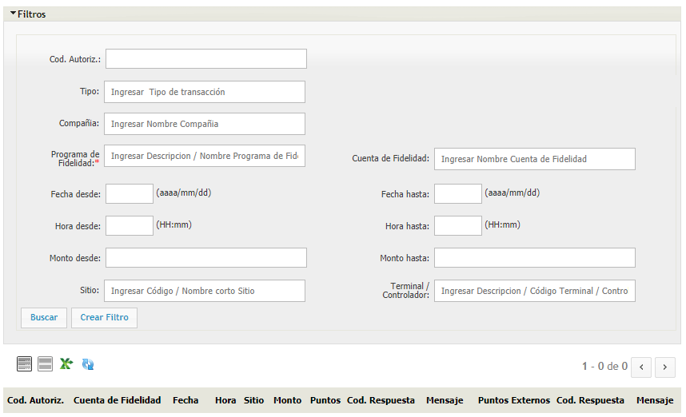

### Contingencia

En esta vista puede ver todas las contingencias listadas por Sitio, Lote, Fecha, Hora, Cuenta de Fidelidad, Monto, Puntos Ationet, el Codigo de Respuesta y el mensaje de respuesta.

Para hacer las consultas mas faciles, esta vista cuenta con un panel de filtros.

Los campos disponibles para filtrar son los siguientes:

* ***Vehículo***: Ingrese el vehículo por el cual desea filtrar.
* ***Conductor***: Ingrese el conductor por el cual desea filtrar.
* ***Sitio***: Ingrese el sitio por el cual desea filtrar.
* ***Terminal/Controlador***: Ingrese la terminal/controlador por el cual desea filtrar.
* ***Fecha Desde/Fecha Hasta***: Ingrese el rango de fechas por el cual desea filtrar.
* ***Hora Desde/Hora Hasta***: Ingrese el rango de horas por el cual desea filtrar.

Cuando termine de llenar los campos que quiera, puede cliquear en "Crear Filtro" para guardarlo para futuras ocasiones, o simplemente en "Buscar" para filtrar los resultados.

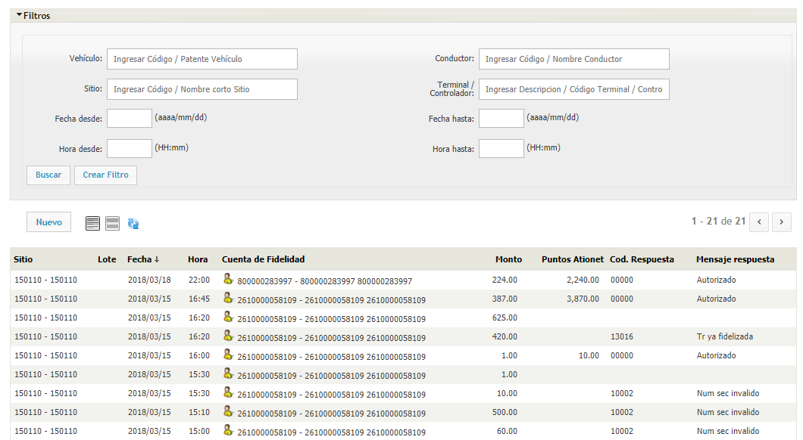

### Cuenta Corriente

En esta vista puede ver todas las cuentas corrientes listadas por Compañía, Programa de Fidelidad, Subcuenta, Balance y si esta Habilitada o no.

Para hacer las consultas mas faciles, esta vista cuenta con un panel de filtros.

Los campos disponibles para filtrar son los siguientes:

* ***Compañía***: Filtre por el nombre de la Compañía.
* ***Programa de Fidelidad***: Filtre por el programa de fidelidad.
* ***Cuentas de Fidelidad***: Filtre por cuenta de fidelidad.
* ***Fecha Desde/Fecha Hasta***: Ingrese el rango de fechas por el cual quiere filtrar.
* ***Hora Desde/Hora Hasta***: Ingrese el rango horario por el cual quiere filtrar.
* ***Monto Desde/Monto Hasta***: Ingrese el rango de montos por el cual quiere filtrar.
* ***Reporte***: Elija entre crédito o débito.
* ***Tipo***: Filtre por acumulación, redención, transferencia, ajuste o expiración.
* ***Origen***: Filtre por el origen de la cuenta corriente. Puede ser sistema web, sistema móvil, batch, transacción, interfaz API, legacy API, migración o liquidaciones.

Cuando termine de llenar los campos que quiera, puede cliquear en "Crear Filtro" para guardarlo para futuras ocasiones, o simplemente en "Buscar" para filtrar los resultados.

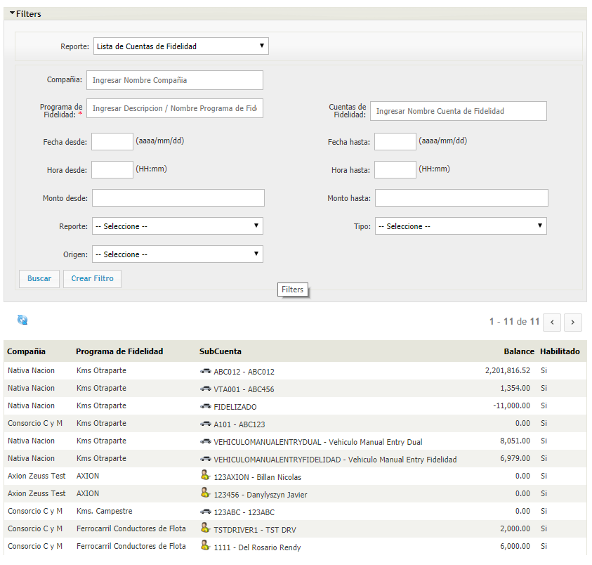

### Excepciones

En ATIONet, las excepciones son aquellas transacciones que fueron rechazadas por algún motivo.

En esta vista puede ver todas las excepciones listadas por Estado, Código de Autorización, la Fecha, Hora y el Sitio donde ocurrió la excepción; la Cuenta de Fidelidad relacionada con la excepción la cantidad de puntos, el monto, los puntos y el motivo de la excepción tanto de Ationet como del Host Externo (Las columnas que involucren al host externo solo se mostraran si el programa tiene habilitada la opción de que procese host externo). También cuenta con un botón para descargar una planilla con los datos de las excepciones.

Para hacer las consultas mas faciles, esta vista cuenta con un panel de filtros.

Los campos disponibles para filtrar son los siguientes:

* ***Cod. Autorización***: Filtre por el código de autorización de la excepción.
* ***Tipo***: Filtre por el tipo de transacción que se realizo.
* ***Compañía***: Filtre por Compañía.
* ***Programa de Fidelidad***: Filtre por el programa de fidelidad asociado a la excepción.
* ***Cuenta de Fidelidad***: Filtre por la cuenta de fidelidad asociada a la excepción.
* ***Fecha Desde/Fecha Hasta***: Ingrese el rango de fechas por el cual quiere filtrar.
* ***Hora Desde/Hora Hasta***: Ingrese el rango horario por el cual quiere filtrar.
* ***Monto Desde/Monto Hasta***: Ingrese el rango de montos por el cual quiere filtrar.
* ***Sitio***: Filtre por el sitio donde ocurrió la excepción.
* ***Terminal/Controlador***: Filtre por la terminal/controlador que realizo la excepción.

Cuando termine de llenar los campos que quiera, puede cliquear en "Crear Filtro" para guardarlo para futuras ocasiones, o simplemente en "Buscar" para filtrar los resultados.

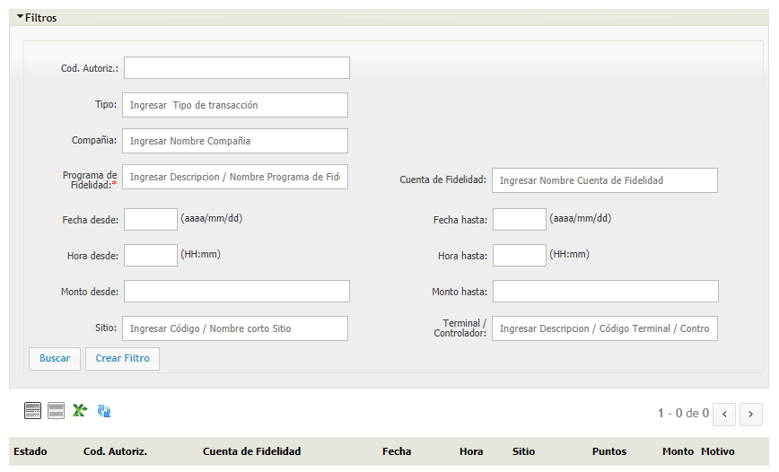

### Programas

En esta vista puede consultar los programas listados por Código, Descripcion, Compañia y Tipo de Miembros. También puede editar el programa haciendo click en el icono del lápiz que se encuentra en la columna opciones.

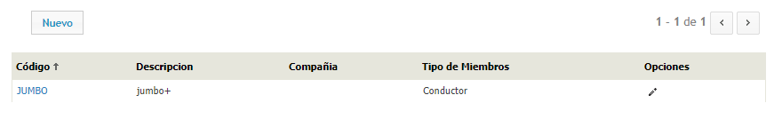

#### Crear un nuevo programa

Para crear un nuevo programa, haga click en el botón "Nuevo" que se encuentra en el extremo superior izquierdo de la vista.

Los campos a completar son los siguientes:

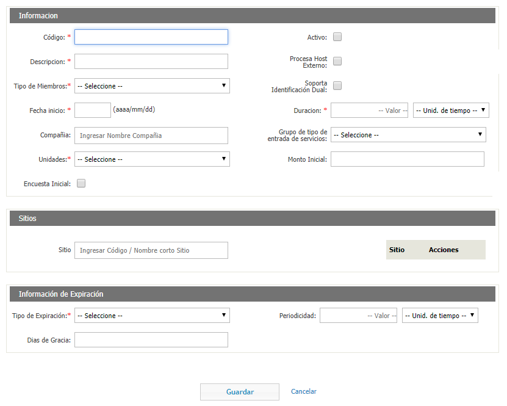

* ***Código***: El código que le quiere asignar al programa.
* ***Activo***: Tilde esta opción si el programa estará activo.
* ***Descripcion***: Ingrese una breve descripción del programa.
* ***Procesa Host Externo***: Tilde esta opción si el programa procesa host externo.
* ***Tipo de Miembros***: Seleccione si es de tipo vehículo, conductor o compañía.
* ***Soporta Identificacion Dual***: Tilde esta opción si quiere que el programa soporte identificacion dual.
* ***Fecha Inicio***: Ingrese la fecha en la que entra en vigencia el contrato.
* ***Duración***: Ingrese la duración del contrato.
* ***Compañía***: Ingrese la compañía con la cual esta relacionada el contrato.
* ***Grupo de tipo de entrada de servicios***: Seleccione el grupo de tipo de entrada de servicios.
* ***Unidades***: Seleccione en que unidad quiere que sea el contrato.
* ***Monto Inicial***: La cantidad de puntos que se le van a asignar a cada usuario que se de alta en el programa por única vez y al comienzo del mismo.
* ***Encuesta Inicial***: Tilde esta opción si requiere confirmar que se haya llenado la planilla de entrada de grupo de servicio.
* ***Sitios***: Los sitios en donde el cliente puede realizar transacciones.
* ***Tipo de Expiración***: Seleccione el tipo de expiración de los puntos del programa. Los distintos tipos de expiración son los siguientes:
	1. ***Sin Expiración***: Los puntos no expiran nunca.
	2. ***Expiración individual de puntos pasado el período de retención. No Renovable***: Cada punto vence pasado la cantidad de tiempo que indica el periodo.
	3. ***Expiración individual de puntos. Renovables***: Cada vez que se realiza una suma de puntos se estira el vencimiento la cantidad de tiempo que indica el periodo.
	4. ***Expiración en batch de los puntos del período. Período del Programa***: Al finalizar el periodo del programa, expiraran todos los puntos anteriores al periodo que acaba de terminar, es decir, los puntos adquiridos en este ultimo periodo quedaran. 
	5. ***Expiración en batch de todos los puntos. Período del Programa***: Al finalizar el periodo del programa, expiraran todos los puntos que la cuenta tenga.
	6. ***Expiración en batch de los puntos del período. Período del Miembro***: Al finalizar el periodo del miembro (La periodicidad de acuerdo a la creación de la cuenta), expiraran todos los puntos anteriores al periodo que acaba de terminar, es decir, los puntos adquiridos en este ultimo periodo quedaran.
	7. ***Expiración en batch de todos los puntos. Período del Miembro***: Al finalizar el periodo del miembro (La periodicidad de acuerdo a la creación de la cuenta), expiraran todos los puntos que la cuenta tenga.
	8. ***Expiración mensual de todos los puntos. Período del Miembro***: Todos los puntos expiran el ultimo día del mes en el que termina el periodo.
* ***Periodicidad***: La periodicidad del programa. Puede ser en días, semanas o meses.
* ***Días de Gracia***: La cantidad de días de gracia que tiene el cliente para canjear los puntos una vez vencidos los mismos.

Cuando termine de llenar todos los campos, haga click en el botón "Guardar".

### Reglas

En ATIONet las reglas son la forma en la que se computan los puntos en el sistema de fidelidad. 

En esta vista usted puede consultar las reglas listadas por Código, Descripcion, Puntos, Fecha y Hora Desde/Hasta. También puede editar la regla haciendo click en el icono del lápiz que se encuentra en la columna opciones.

#### Crear una nueva regla

Para crear una nueva regla, haga click en el botón "Nuevo" que se encuentra en el extremo superior izquierdo de la vista.

Los campos a completar son los siguientes:

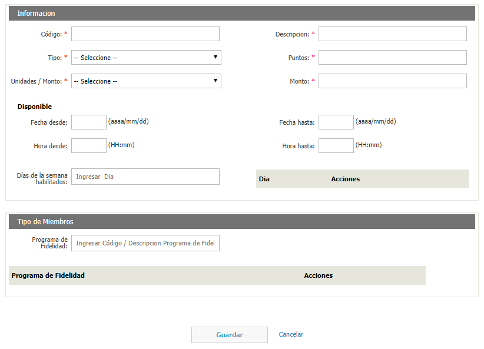

* ***Código***: El código que le quiere asignar a la nueva regla.
* ***Descripcion***: La descripción de la nueva regla.
* ***Tipo***: Seleccione el tipo de regla que puede ser de Monto de Transacción, SKU, Categoría de SKU, Método de Pago, Monto de Transacción y Método de Pago, SKU y Método de Pago o Categoría de SKU y Método de Pago.
* ***Puntos***: La cantidad de puntos que entrega la regla.
* ***Unidades/Monto***: Ingrese si la unidad/monto se va a sumar completo o redondeado. Si es completo, una transaccion que sume 28.67 puntos, va a sumar 28.67 puntos; en redondeado, va a sumar 29 puntos.
* ***Monto***: La cantidad de dinero/millas/kilómetros necesarios para sumar los puntos.
* ***Fecha Desde/Hasta***: Ingrese el rango de fechas en el cual estará activa la regla.
* ***Hora Desde/Hasta***: Ingrese el rango horario en el cual estará activa la regla.
* ***Días de la semana habilitados***: Ingrese los días de la semana en los cuales estará activa la regla.
* ***Programa de Fidelidad***: Ingrese el programa de fidelidad al cual le quiere asignar esta regla.

Cuando termine de llenar los campos cliquée el botón "Guardar".

### Transacciones

En esta vista usted puede consultar las transacciones realizadas, listadas por Código de Autorización, el sitio donde ocurrió la transacción, el lote, la fecha y hora en la que ocurrió la transaccion, la Cuenta de Fidelidad a la que esta asociada la transacción; el monto de la transacción y la cantidad de puntos que fueron otorgados por esa transacción. También cuenta con un botón para descargar una planilla con los datos de las transacciones.

Esta vista cuenta con un panel de filtros para hacer mas faciles las consultas. Los campos que tiene disponibles para filtrar son los siguientes:

* ***Compañía***: Ingrese el nombre de la compañía el cual quiere buscar transacciones relacionadas a ella.
* ***Cod. Autorización***: El código de autorización de la transacción.
* ***Tipo***: El tipo de transacción (Puede ser de Acumulación, Redención, Transferencia, Ajuste o Devolución).
* ***Sitio***: Ingrese el sitio por el cual quiere filtrar transacciones.
* ***Terminal/Controlador***: Ingrese la terminal/controlador por el cual quiere filtrar transacciones.
* ***Programa de Fidelidad***: Ingrese el nombre del programa de fidelidad el cual quiere buscar transacciones relacionadas a ella.
* ***Cuenta de Fidelidad***: Ingrese el nombre de la cuenta de fidelidad el cual quiere buscar transacciones relacionadas a ella.
* ***Fecha Desde/Fecha Hasta***: Ingrese el rango de fechas por el cual quiere filtrar transacciones.
* ***Hora Desde/Hora Hasta***: Ingrese el rango horario por el cual quiere filtrar transacciones.
* ***Monto Desde/Monto Hasta***: Ingrese el rango de montos por el cual quiere filtrar transacciones.

Cuando termine de llenar los campos que quiera, puede cliquear en "Crear Filtro" para guardarlo para futuras ocasiones, o simplemente en "Buscar" para filtrar los resultados.

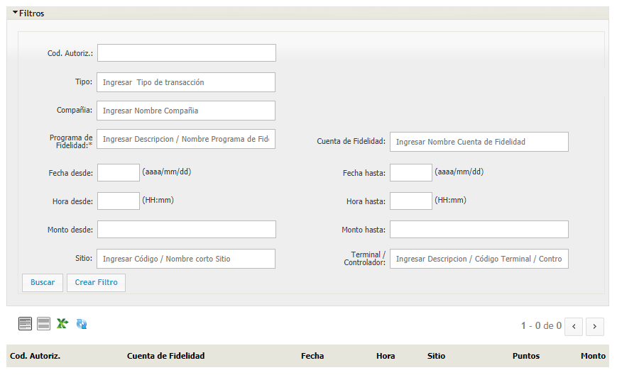

### Transferencias

En esta vista usted puede consultar las transacciones realizadas, listadas por Sitio, Fecha y Hora; la cuenta de Fidelidad de donde fueron transferidos los puntos y la cuenta de Fidelidad a la que fueron transferidos los puntos, la cantidad de puntos, el código de respuesta de la transferencia y el mensaje respuesta que arrojo la transferencia.

Esta vista cuenta con un panel de filtros para hacer mas faciles las consultas. Los campos que tiene disponibles para filtrar son los siguientes:

* ***Vehículo***: Filtre por el vehículo que realizo la transferencia.
* ***Conductor***: Ingrese el conductor por el cual quiere filtrar transferencias.
* ***Sitio***: El sitio donde se realizo la transferencia.
* ***Terminal/Controlador***: La terminal/controlador con la cual se realizo la transferencia.
* ***Fecha Desde/Fecha Hasta***: Ingrese el rango de fechas por el cual quiere filtrar transferencias.
* ***Hora Desde/Hora Hasta***: Ingrese el rango horario por el cual quiere filtrar transacciones.

Cuando termine de llenar los campos que quiera, puede cliquear en "Crear Filtro" para guardarlo para futuras ocasiones, o simplemente en "Buscar" para filtrar los resultados.

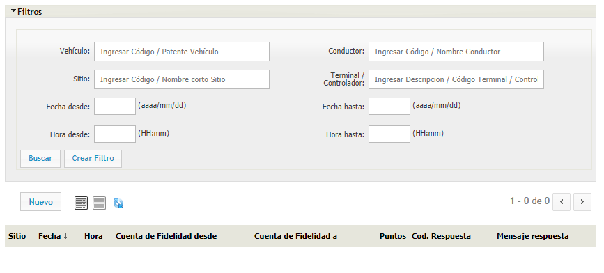

#### Crear una nueva transferencia

Para crear una nueva transferencia haga click en el botón "Nuevo" que se encuentra en el extremo superior izquierdo de la pantalla.

Los campos a completar son los siguientes:

* ***Descripcion***: Ingrese una descripción de la transferencia.
* ***Fecha y Hora***: Ingrese la fecha en la que se realizo la transferencia.
* ***Sitio***: Ingrese el sitio donde se esta realizando la transferencia.
* ***Terminal/Controlador***: Ingrese la terminal/controlador que esta realizando la transferencia.
* ***Programa de Fidelidad***: Ingrese el programa de fidelidad que esta relacionado con la transacción.
* ***Cuenta de Fidelidad***: Ingrese la cuenta de fidelidad que esta relacionado con la transaccion.
* ***Cuenta Secundaria***: Ingrese la cuenta secundaria que esta relacionada con la transaccion.
* ***Puntos***: Ingrese la cantidad de puntos a transferir.

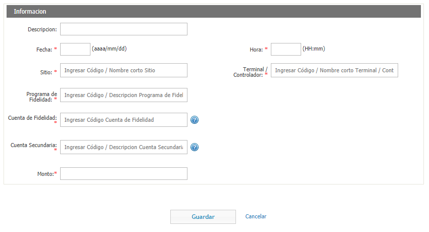

### Unidades

En ATIONet, con unidades se refiere a la unidad de medida en la que se define su programa de fidelidad, ya sea puntos, kilómetros, millas, etc.

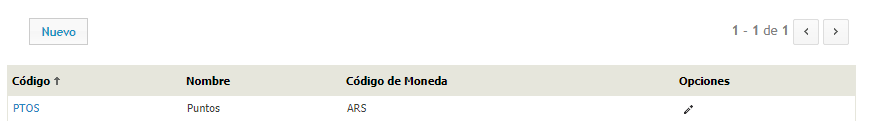

#### Crear una nueva unidad

Para crear una nueva unidad haga click en el botón "Nuevo" que se encuentra en el extremo superior izquierdo de la pantalla.

Los campos a completar son los siguientes:

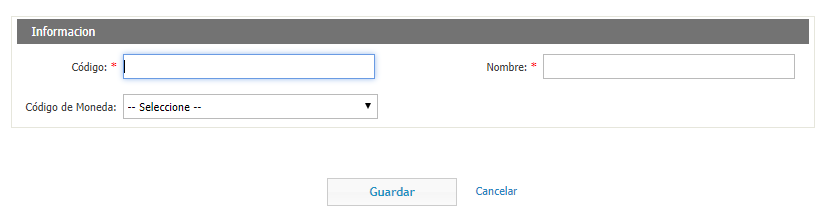

* ***Código***: El código que le quiere asignar a la nueva unidad.
* ***Nombre***: El nombre que le quiere asignar a la nueva unidad.
* ***Código de Moneda***: Si la unidad de medida que elige es una moneda, seleccione el código de moneda de la misma.