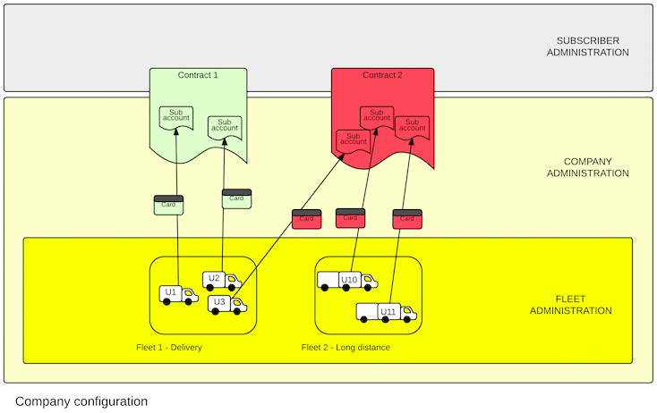

 
# ATIOnet Fleet Organization

> **About:** This document explains the different criteria and tools to map a complex or large fleet of vehicles to ATIOnet, to simplify its administration and control.   	

</br>

<table>
	<thead>
		<tr>
			<td colspan="2" class="tablehead">Document Information</td>
		</tr>
	</thead>
	<tbody>
		<tr>
			<td width="20%" class="rowhead" align="right">File:</td>
			<td>AN-Fleet_Organization-Concepts</td>
		</tr>
		<tr>
			<td align="right">Doc. Version:</td>
			<td>1.0</td>
		</tr>
		<tr>
			<td align="right">Release Date:</td>
			<td>20/July/2014</td>
		</tr>
		<tr>
			<td align="right">Author:</td>
			<td>ATIO International LLC</td>
		</tr>
	</tbody>
</table>

<table>
     <thead>
          <tr>
          	<td colspan="3">Change Log</td>
          </tr>
     </thead>
     <tbody>
        <tr>
          	<td>Ver.</td>
            <td>Date</td>
            <td>Change summary</td>
        </tr>
        <!-- Insert a table row like this for each version -->
        <tr>
          	<td>1.0</td>
          	<td>20/July/2014</td>
          	<td>Initial version</td>
        </tr>
        <!-- End of version table row -->
     </tbody>
</table>
</br>

### Contents

<!-- MarkdownTOC depth=3 -->

- Units
	- Classification and grouping attributes
- Fleet organization tips
- Finance and Administration requirements
	- Billing
	- Balances
- User interface features
	- Autocomplete
	- Named Filters

<!-- /MarkdownTOC -->


<!-- Optional Terms & Definition section -->
        

<!-- Content starts here -->
## Units 
ATIOnet recognizes two types of _cardholders_: Persons and Units, usually called Drivers and Vehicles in the retail petroleum industry. Both _persons_ and _units_ can be the subject of a transaction and are considered a _sub-account_, within a contract with a Company.
Besides the obvious particularities between the configuration attributes of a Person and a Unit, a major difference is that Units can be organized in **Fleets**.   
Units can be trucks, cars, ships, planes, stationary machinery, generators or any other kind of device that may be identified as the beneficiary (subject) of an ATIOnet transaction.

### Classification and grouping attributes

<table>
	<thead>
		<tr>
			<td width="20%" class="rowhead">Attribute</td>
			<td>Description</td>
		</tr>
	</thead>
	<tbody>
		<tr>
			<td>Code</td>                                  
			<td>Main identification key of the Unit, alphanumeric value must be unique on the Company. Should be reserved for the actual number or code for the unit on the organization.</td>
		</tr>
		<tr>
			<td>Fleet</td>
			<td>Highest level grouping entity. A Unit must belong to a Fleet and to one fleet only.</td>			
		</tr>
		<tr>
			<td>Vehicle Class</td>
			<td>Every Unit belogs to a Vehicle Class. The Class resumes some attributes related to the Unit brand/model, like fuel type or fuel capacity</td>
		</tr>			
		<tr>
			<td>Type (in Vehicle Class)</td>                
			<td>The Type of Unit is a broad classification (Light Truck, Heavy Truck, Car, etc.)</td>			
		</tr>			
		<tr>
			<td>Classification 1 to 4</td>
			<td>Each Company can define up to 4 named classification attributes according to their own needs and policies. Can be used to describe operational regions, sub-type of units, type of service, cost centers, budgetary class, etc.</td>
		</tr>
			<tr>
			<td>Service Type</td>
			<td>Tipified description of the service to which this Unit is assigned. The Service Type, combined with the Vehicle Class will enable anonymous mileage benchmarking with other ATIOnet subscribers</td>		
		</tr>
		<tr>
			<td>Service Description</td>
			<td>Label. Free description of the assigned service (route, schedule, etc.)</td>			
		</tr>
	</tbody>			
</table>


## Fleet organization tips

**_Use Fleets to represent the Operation's structure_**. A Unit belongs only to one Fleet and is the only hierarchical relation on the system, also, the Fleet Admin role can be segregated from the parent Company Admin role allowing the delegation of the administration of groups of Units to different users. These features make the Fleet the ideal tool to map the operation structure, not necessarily the organization's formal structure, but the actual dependency between the Unit and its management center, for example service bases or logistic units. 	
Fleet Admin users can re-configure the Units, assign rules, assign available Identifiers, assign Drivers, and the rest of the day-to-day functions. Except for widely distributed organizations, where a large number of fleets will be created, the Fleet level is too important to be used just for rules assignment.

**_Vehicle classes could solve the basic fuel product and transaction limit, but also work as a classification_**. Unless there is too much dispersion on the brands and models of the units, assigning a Vehicle Class during the creation of the unit will avoid to apply a Product Rule and a Transaction Limit Rule (at least as a security procedure). Vehicle classes are maintained by each fleet company, so each one can configure its own classes and not necessarily following an actual brand/model (for example, there are different brands of diesel pickups with same consumption, and fuel grade).

**_Use Custom Classification Fields as matrix structure_** CCF 1 to 4 can be used to represent a different dimension of a classification matrix. There is no hierarchy between CCFs, depending on the complexity of the map the Admin may use them as unrelated attributes (for example CCF1=Department, CCF2=Route) or choose to use two or more as levels of the same dimension (CCF1=Company, CCF2=Division, CCF3=Department).

**_Use the Service Description as a lower level grouping_** The Service Description field is conceived as a detailed indicator of what a Unit does, or is currently doing for some time. For example "East Highway Construction" or "Door to door delivery"

## Finance and Administration requirements
Budget administration and control usually adds another layer of complexity to the organization of Units in a fleet management system. A common practice is to dedicate one or more tagging resources to represent the organization's budgetary structure. ATIOnet addresses this requirements with specific tools.

The Company Contract in ATIOnet keeps the attributes that describes the financial and billing terms between the Fleet Company and the Subscriber; from global allowances and payment mode to fees and billing parameters, each agreement between a Company and the Subscriber is represented as a Contract; a Company may have many Contracts to accomodate different terms (i.e.: Debit and Credit), temporary operation (i.e.: seasonal contractors) or budget segmentation (by Division purchase orders).

Cardholders (Units or Persons) are bound to a Contract through their Identification, which bears no relation to their membership to a Fleet, so the contractual and operating requirements do not interfere with each other. Also a Unit (or Person) might be bound to many Contracts, for example a Unit which has a TAG ID (main Contract), plus a pre-paid disposable card as a contingency (secondary Contract).

>Please refer to the document: AN-Company_Contract-Concepts for details about Contract features and configuration.



### Billing

Billing configuration on the Contract governs how, when and what to include in the Contract Statement. Although a Contract is bound to a Company, a different Billing entity can be specified only for this purpose. This is useful when the operating company needs to forward the bills to a parent or consolidating company.	

### Balances
The _Balance_ of an account is the amount of money or product volume available for authorization at a given time -other restrictions and conditions may modify the actual authorized amount or volume-.

Each Contract maintains a Sub-Account for each member cardholder (Person or Unit). On the above example of the Unit with two identifications, when the primary TAG is used, the transaction will be authorized against balance of the main Contract, but when the contingency Identification is presented, the the secondary Contract will be charged.

> On any case, every transaction for the Unit will update the Unit's statistics (consumption history, quotas, mileage, etc.) which are maintained at the Unit level, regardless of what sub-account and contract is charged.


## User interface features
ATIOnet's user interface has advanced searching and filtering features that also contribute to managing a large number or Units. 

### Autocomplete
In Search and Filter boxes, text fields connected to an ATIOnet entity like Code, Fleet or a CCF have autocomplete capability. Typing a few characters of a value will automatically present a drop-down list will all matching values to select from. Also accept multiple values, to search for any value of a list (for example: Fleet=```North x``` ```South x``` will return all Units for the North AND South fleets). 

Autocomplete simplify entering complex text values, reducing typing errors and saving time. Also leverages the use of complex, multi-segment values on CCF lists, reducing the need to dedicate more than one CCF to represent a structured code. A typical example is the Division and Department tagging of Units. Instead of dedicating CCF1 to Divisions and CCF2 to Departments, a single field Division-Department could be implemented.

### Named Filters
Any search criteria on any on-screen view in ATIOnet can be saved as a named filter. Filters not only let reuse previous search criteria, but also work as a user-defined site navigation tool, users can jump from anywhere on the site to the target view selecting the desired filter from the ```My Filters``` list. Saved Filters can be private, or shared with other users.

