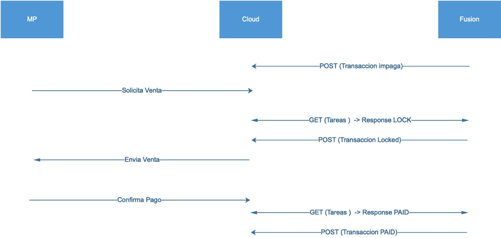

# ATIONet - Mercado Pago Transaction Protocol Specification v1.1 #

|Document Information||
|--- |--- |
|File:|AN-MercadoPago_Transaction_Protocol-Spec|
|Doc Version:|1.1|
|Release Date:|10, August 2019|
|Author:|ATIONet LLC|

|Change Log|||
|--- |--- |--- |
|Ver.|Date|Change Summary|
|1.1|10, August 2019|Initial version. Covers POST and GET Transactions|

## Contents

- [Introduction](#introduction)

- [Scope](#scope)

- [Data Security](#data-security)

- [Error Handling](#error-handling)

- [Supported Commands](#supported-commands)
	- [Controllers](#controllers)
		- [Commands Flow](#commands-flow)
		- [Get Status (A)](#get-status-a)
		- [Confirm Status (B)](#confirm-status-b)
		- [Send Transaction (C)](#send-transaction-c)

- [Objects references](#objects-references)
	- [Order object](#order-object)
	- [Items object](#items-object)	
	- [Loyalty object](#loyalty-object)

## Overview

### Introduction

This specification is intended to document ATIONet’s Mercado Pago Protocol messaging format and related features required for the systems applying for integration with ATIONet. The following sections provide descriptions of the messages themselves, the expected behavior for each supported transaction type and a common ground for the functionality of each relevant item.

## Scope

Version 1.0 of this document covers a particular version of ATIONet’s Host protocol. Although feature’s descriptions are generally not related to a particular version of the protocol, some changes may apply which would be specifically commented and identified on each feature’s
description paragraph.

## Data Security

To validate the source of transactions and data encryption, the ATIONet Native Transaction Protocol relies on a SSL connection between the Site’s Terminal or Site’s Controller and the ATIONet Host. The SSL connection is established for each request/response pair, using a certificate property of ATIONet, meaning that each request must include a system-type user and password on the Header. The user will be matched against the related ATIONet actor for each message.

Users to be used on the Transaction Protocol messaging will be created by authorized users via ATIONet Console, with the role “Controller/Terminal”.

At this time there is no provisioning to distribute or update certificates or thumbprints thru a system interface. This information will be provided at request of the Controller’s vendor during the integration project.

## Error Handling

Success/failure exits on the Mercado Pago Transaction Protocol will be handled via HTTP status codes.

Successful request will get a HTTP 200 and the resulting response.

Any interaction with the API will return a single JSON-formatted item with the “Response Code” and “Response Text”. The body of these responses will never be empty.

Failure to process the request will be indicated by an HTTP 400’s range status code. The body will contain a single JSON-formatted item with the “ResponseCode”, “ResponseMessage” and “ResponseError” fields.

- **ResponseCode**: Will contain a unique code for that specific error
- **ResponseMessage**: A short message describing the error
- **ResponseError**: Will contain the stack trace of the error, this helps debug process.

*Sample JSON body*

	{“ResponseCode”:”40001”,”ResponseMessage”:”Site not Found”,”ResponseError”:""}

Refer to [Response Codes](#112-response-codes) Table in the Reference Tables section for a complete list of supported codes.

## Supported Commands 

|Code|Name|Description|
|---|---|---|
|A|Get Status|This is the message that the controller sends to get news|
|B|Confirm Status|This is the message that the controller sends to confirm that the receibed status in message A was processed OK|
|C|Send Transaction|Message sent by the controller containing new sales generated at the POS|

### Controllers
**Verb**: POST

**URL**: https://mercadopago.ationet.com/v1/controllers

**Headers**:
- Accept-Encoding: gzip
- Authorization: Basic user:password

#### Commands Flow

#### Get Status (A)
Request Body:

	{"transaction_code":"A","site_id":"123456"}

Response Body:

	[{"pump_id":"2","reference_number":"974423","action":"L"},
	{"pump_id":"7","reference_number":"975321","action":"P"}]

|Field|Description|
|---|---|
|pump_id|The pump where the sale was done|
|reference_number|The sale number provided by the controller in the command "C"|
|action|If "L" the controller needs to lock the transaction, if "P", the controller needs to pay the transaction. Both actions needs to be done with "B" command|

#### Confirm Status (B)
Request Body:

	{"transaction_code":"B","site_id":"123456","pump_id":"7","action":"L"}

Response Body:

If the HTTP response code is different than 200, then the following structure is return 

	{“ResponseCode”:”StringValue”,”ResponseMessage”:”StringValue”,”ResponseError”:"StringValue"}

#### Send Transaction (C)
Request Body:

	{
	 "transaction_code": "C",
	 "site_id": "123456",
	 "pump_id": "7",
	 "order": {
	    "collector_id": 178106235,
	    "sponsor_id": 334249281,
	    "items": [
	      {
	        "title": " $500.00 de Premium",
	        "currency_id": "MXN",
	        "description": "$500.00 de Premium",
	        "quantity": 1.0,
	        "unit_price": 500.00
	      }
	    ],
	    "external_reference": "45ea80da",
	    "notification_url": "https://www.tusitio.com/notifiaction",
	    "loyalty": null
	  }
	}

Response Body:

If the HTTP response code is different than 200, then the following structure is return 

	{“ResponseCode”:”StringValue”,”ResponseMessage”:”StringValue”,”ResponseError”:"StringValue"}

**Note**: If a transaction is confirmed by Fusion as PAY, and then the payment is removed, Fusion will send the transaction again using the command "C".
	

## Objects references
### Order object
|Field Name|Type|Condition|Descriptions/Field Value(s)|
|---|---|---|---|
|collector_id|Long|Required|Identificador de la cuenta de Mercado Pago a la que se le acreditarán los pagos.|
|sponsor_id|Long|Required|Identificador de una cuenta de Mercado Pago que integra la solución.|
|external_reference|String|Required|Referencia para sincronizar con tu sistema.|
|notification_url|String|Required|URL a la cual se enviarán las notificaciones, definida por el integrador.|
|items|Array|Required|Lista de los productos, donde cada item es un object con los siguientes campos|
|loyalty|Object|Required|Datos necesarios para sumar puntos en un determinado programa de fidelización|

### Items object
|Field Name|Type|Condition|Descriptions/Field Value(s)|
|---|---|---|---|
|title|String|Required|Nombre del producto.|
|quantity|Entero|Required|Cantidad de este producto.|
|unit_price|Decimal|Required|Precio unitario del producto.|

### Loyalty object
|Field Name|Type|Condition|Descriptions/Field Value(s)|
|---|---|---|---|
|program|String|Required|Programa de fidelización (serviclub, payback, etc.)|
|transaction_id|String|Required|Número de transacción.|
|invoice_number|String|Required|Número de comprobante.|
|transaction_date|String|Required|Fecha y hora de la transacción (ISO 8601).|
|transaction_amount|Decimal|Required|Importe total de la transacció.|
|store_id|String|Required|Identificador único del negocio (identificador de estación de servicio o APIES).|
|products|Array|Required|Lista de los productos comprados con los siguientes atributos|
|code|String|Required|Código del producto.|
|quantity|Decimal o entero|Required|Por ejemplo 20.50 litros.|
|unit_price|Decimal|Required|Precio unitario del producto.|
|unit|String|Required|Unidad de medida si aplica (litre, etc.)|
|cashier_identification|Object|Required|Datos del empleado|
|type|String|Required|Tipo de documento (DNI, INE, etc.)|
|number|String|Required|Id de documento.|
|period|String|Required|Número del período.|
|shift|String|Required|Número del turno.|
|affinity_plan|String|Required|Plan de afinidad.|

