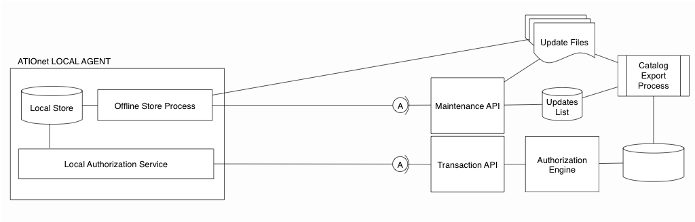

 
# ATIOnet Native Offline Technical Guide

> **About:** This document describes the complete scope for ATIOnet's Offline Subsystem.	
ATIOnet's offline authorization functionality requires the ATIOnet Local Agent component; please refer to the Local Agent documentation for more details about it.	

</br>

<table>
	<thead>
		<tr>
			<td colspan="2" class="tablehead">Document Information</td>
		</tr>
	</thead>
	<tfoot>
		<td colspan="2"> </td>
	</tfoot>
	<tbody>
		<tr>
			<td width="20%" class="rowhead" align="right">File:</td>
			<td>AN-Native_Offline_TechGuide.en</td>
		</tr>
		<tr>
			<td align="right">Doc. Version:</td>
			<td>1.0</td>
		</tr>
		<tr>
			<td align="right">Release Date:</td>
			<td>01, November 2013</td>
		</tr>
		<tr>
			<td align="right">Author:</td>
			<td>ATIO International LLC</td>
		</tr>
	</tbody>
</table>

<table>
     <thead>
          <tr>
          	<td colspan="3">Change Log</td>
          </tr>
     </thead>
     <tfoot>
          <td colspan="3"> </td>
     </tfoot>
     <tbody>
        <tr>
          	<td>**Ver.**</td>
            <td>**Date**</td>
            <td>**Change summary**</td>
        </tr>
        <tr>
          	<td>1.0</td>
          	<td>01/November/2013</td>
          	<td>First version. Focus on Pre-Authorization / Completion flow for fuel sales</td>
        </tr>
     </tbody>
</table>
</br>

### Table of Content
<!-- MarkdownTOC depth=3 -->

- Definitions
- Scope of service
  - Requirements
  - Architecture Diagram
- Functional Overview
- Offline Catalogs creation
  - Catalog Export Process
- Catalog Download and application
- Transaction Processing
- Catalog Store
- Balance penalty based on catalog aging

<!-- /MarkdownTOC -->


### Definitions

<dl>
  <dt>Capture</dt>
  <dd>The action or event that initiates a financial transaction, including the application of the local business rules</dd>
  <dt>Homebase</dt>
  <dd>A subscription plan for companies that run one or more fenced sites for a private fleet. In a Homebase subscription, the Subscriber runs the Service, control the Sites and the Fleets.</dd>
  <dt>Local</dt>
  <dd>Broadly refers to an entity that operates or belongs to the site (commerce or gas-station)</dd>
  <dt>Merchant</dt>
  <dd>The company who runs a Site or group of sites on a Network subscription.</dd>
  <dt>MTI</dt>
  <dd>Message Type Indicator, also referred as Action Code, is a numeric code that indicates the type of transaction included on a message.</dd>
  <dt>Network</dt>
  <dd>A subscription plan for companies that run a public method-of-payment, accepted on third party sites. The subscriber enrolls Fleet Companies and retail or commercial Sites. The Fleet Companies are the end-users of the Service and maintain the fleet configuration; the Merchants are the site owners companies and maintain Sites configuration. </dd>
  <dt>Retail</dt>
  <dd>A subscription plan for companies that run a public method-of-payment on sites of their own. The Retail subscriber enrolls third-party Fleet Companies as the end-users. Fleet companies retain the management of fleet's configuration.</dd>
  <dt>Subscriber</dt>
  <dd>The direct customer of ATIOnet. The person or company that operate the service.</dd>
  <dt>Terminal</dt>
  <dd>Transaction capture device at the site.</dd>
</dl>


<!--BREAK-->
</br>

## Scope of service

The ATIOnet's Native Offline Subsystem enables continuos offline operation for sites equiped with ATIOnet Local Agent. A Site with Offline support can transition back and forth from online to offline operation without user intervention or even notice. Also, if the internet link goes down in-between the authorization and the completion of the fueling, the Local Agent locally stores the transaction to be sent to ATIOnet's Host when the link is restablished.

The Offline Subsystem complies with the following design goals:

* Automatic operation
* Seamless switch between offline and online
* Store & Forward for unsent transactions
* Support for any vehicle on any site
* Support for advanced authorization rules
* Authorization penalties based on aging of local catalogs
* Encrypted storage of local catalogs

### Requirements

* ATIOnet Offline Subsystem
* ATIOnet Local Agent v. 1.0.7885 or later

### Architecture Diagram
 


## Functional Overview
ATIOnet Offline functionality is comprised of five separate mechanisms, two of them executed on ATIOnet's Host and the rest on the Local Agent at the site.
The goal of the whole subsystem is to keep the site running when the communication link with the Host is down; those offline transactions are evaluated against a local copy of Host's data which is timely synchronized while the site is online. While offline, the local offline catalogs are maintained by the Local Agent as result of the pre-authorizations and completions or sales. When the link is restablished, the stored offline transactions are sent to the Host and the local catalogs are refreshed with updates received from the Host.

1. A set of data-collection actions distributed across every relevant ATIOnet service gather update events. Every time a user action or a process modifies a balance, a vehicle, a driver, rule or any other entity relevant to the authorization logic, a News record is written to the Offline Subsystem; same applies to financial transactions processing and current accounts movements which also affect balances. 

2. Later, at regular intervals, a batch process compiles the news and prepares a Catalog Update file.

3. Following its own schedule, the Local Agent retrieves the updates and apply them to its local storage.

3. When a transaction is authorized locally, the Local Agent proceeds in the same way as the Host does, along with the pre-authorization, a balance reserve is posted for the sub-account and later when the transaction is completed, the reserve is reversed and a permanent completion is impacted against the balance. The offline condition is ignored by the capture terminal.

5. When the site is back online, the transactions locally stored on the Local Agent are uploaded to the Host using the same transactional protocol as online. Online and Offline transactions are posted with different MTI to enhance traceability. A transaction is defined as Offline or Online depending on who processed the authorization; even if the completion could be sent online, if the pre-authorization was issued by the Local Agent, the transaction will be recorded as an offline one.

**NOTE:** The Offline Subsystem is an additional module which is enabled/disabled for each Subscriber.

## Offline Catalogs creation
The goal of this mechanism is to produce a set of update files for the offline clients (Local Agents).
Each service in ATIOnet handling data used directly or indirectly by the Authorization Engine or the Current Accounts Subsystem is responsible for creating news records for the Offline Subsystem every time a record is updated.

##### Update sources
* Merchants Contract - Rules
* Company Contracts - Rules, Limits, Validity
* Sub-accounts - Vehicle & Driver maintenance
* Fleets - Vehicles classifications
* Vehicle Classes - Authorization properties
* Sites - Rules, Terminals, Controllers, Offline data
* Rules - Rules configuration
* Identifications - Identifications maintenance
* Fuel products - Fuel mappings
* Transactions - Quota counters and accumulators
* Current Accounts - Movements (Transactions, Deposits, Withdrawals, Transfers)

### Catalog Export Process
By default, every 30 minutes a process service collects news records from the different sources and produces a _Catalog Update File_. Update files are tagged with a consecutive version number; the resulting file is stored in a BLOB storage resource (file oriented storage), and registered on a list. The Update file only contains news, ie since the moment when the previous news collection started.

Each a certain number of iterations, the same process also produces a _Full Catalog File_ in addition to the Update file. The Full file contains the complete set of catalogs needed to populate a Local Agent storage from scratch. By default, a Full file is created daily.

The process is also responsible for purging old Catalog files. By default the storage maintains the Update files for twice the frequence of the Full file creation, for example, if the Full is exported daily, two full days of Updates are maintained (96 files).

During the export, source data is pre-processed as follows:

1. Model is de-normalized. To speed-up catalogs update on the Local Agent and to keep internal structures simple, some more complex models like Rules are flattened to a single attribute on the sub-account records.  
1. Rules applied to higher order entities are mapped to sub-accounts. For example, Fleet's rules are replicated automatically to every vehicle belonging to that fleet.
1. Records are marked as Deletions, Inserts or Updates
1. Property names are masked with nonsignificant values and sensitive data is encrypted.

## Catalog Download and application
By default, every 5 minutes, a separate thread on the Local Agent sends an HTTP enquiry to ATIOnet's Maintenance API with its _current offline catalogs version_. The Host compares the reported version with the Catalog list and returns a JSON body with the list of files to be downloaded and applied. The list contains the URI to the BLOB storage for each file.

A Host-side logic defines when a Full catalog and or Update file(s) must be processed. When possible the Host will provide a list of Update files, but when the current version is too old (there is a gap between the site's current version and the oldest stored update file), the Host will refer the client to the Full file plus the following list of Update files if there is any.

For each item in the file list, the Local Agent:

1. Downloads the file.
1. Unencrypts the data.
1. If the file is a Full Catalog, then it truncates all local catalog tables
1. Applies to the local offline catalog storage according to the update, insert or delete mark.
1. Updates the current offline version
1. Deletes the file on the disk

## Transaction Processing
Capture terminals connected to the Local Agent are always served in the same way, the online / offline processing is transparent to them. Depending on the link status the Local Agent applies different business logics.

#### Case I - Full Online
  1. **Pre-Authorization flow**
    1. Terminal sends a pre-authorization (MTI 100)
    1. Local Agent (L.A.) forwards the message to the Host without change (100)
    1. Host responds the message with a pre-authorization approval (110)
    1. L.A. forwards the message to the terminal without change (110)
  1. **Fueling takes place**
  1. **Completion flow**
    1. Terminal sends a completion (120)
    1. L.A. forwards the message to the Host without change (120)
    1. Host responds the message with a completion approval (130)
    1. L.A. forwards the message to the terminal without change (130)

#### Case II - Online / Offline
  1. **Pre-Authorization flow Online**
  1. **Fueling takes place**
  1. **Completion flow**
    1. Terminal sends a completion (120)
  	1. L.A. fails to send the message to the Host without change (120)
  	1. L.A. stores the message in the store & forward queue
  	1. L.A. forwards the message to the terminal without change (130)
  	1. When site is back online, L.A. retries all pending messages on the S&F queue (120)

#### Case III - Offline / Offline
  1. **Pre-Authorization**
  	1. Terminal sends a pre-authorization (100)
  	1. L.A. fails to send the message to the Host
  	1. L.A. authorizes the transaction based on local balances and rules
	  1. L.A. posts a local Balance Reserve to the sub-account for the pre-authorization ammount/volume
	  1. L.A. responds the message to the terminal (110)
  1. **Fueling takes place**
  1. **Completion flow**
  	1. Terminal sends a completion (120)
  	1. L.A. stores the message in the S&F queue changing the MTI from 120 to 125 (Offline Completion)
  	1. L.A. posts a local Balance Reserve Reversal to the sub-account for the pre-authorization ammount/volume
  	1. L.A. posts a local Completion movement to the sub-account for the actual sale ammount/volume
  	1. L.A. responds the message locally to the terminal (130)
  	1. When the S&F queue is processed (immediately after online status is detected), the trasnaction is uploaded to the host as a 125.
  	1. The Host posts the 125 message as approved.

NOTE: There is no Offline / Online case. Even if the site is back online when the fueling finish and the Completion is processed, as the authorization was issued with offline catalogs, the sale as a whole is reported as offline, regardless if it was held on the S&F queue or sent immediately.

## Catalog Store
Local Offline Catalogs are maintained on the Local Agent store. 
This store is an exclusive instance of MS-SQLServer Express created automatically by the installer. No human intervention is required during the installation to avoid sharing the _sa_ password of the instance. At startup, if the database is corrupt, the Local Agent can automatically trigger a database drop and re-creation. In this situation, the offline catalog version informed to the Host will be 0 (zero), resulting in a full catalog download.

Main tables on the local store related to Offline are:

* Identifications
* Sub-accounts (with flattened rules model)
* Fleets
* Contracts
* Fuel products (with mappings and prices)
* Terminal configuration
* Offline parameters

## Balance penalty based on catalog aging
The local authorization process on the Local Agent can apply a partial restriction rule to the available balances of the sub-accounts based on the aging of the local offline catalogs. This penalty can be used as a risk management measure against the progressive lost of accuracy of the local catalogs due to its aging.

```Aging (hours) = Current_local_system_time - Time_of_last_catalogs_update```

Being _Time_of_last_catalogs_update_ the local system time when the Update files queue was empty for that site. (The last time when the Local Agent asked the Host for Updates and the response is an empty list). 

The penalty may have several steps, each one with an hours limit and the percentage of the full balance that will be authorized. 

For example ```{12, 100%; 12, 70%; 24, 0%}``  means:

* From 0 to 12 hours of aging will authorize 100% of the balance (no penalty)
* From 12 to 24 hours will authorize a 70% of the actual balance (30% penalty)
* After 24 hours will stop decline offline authorizations

NOTE: The Aging table is part of the offline catalogs downloaded from the Host. On future versions, this table will be moved to the Parameters Download, and the penalty will be also configurable by Merchant.
