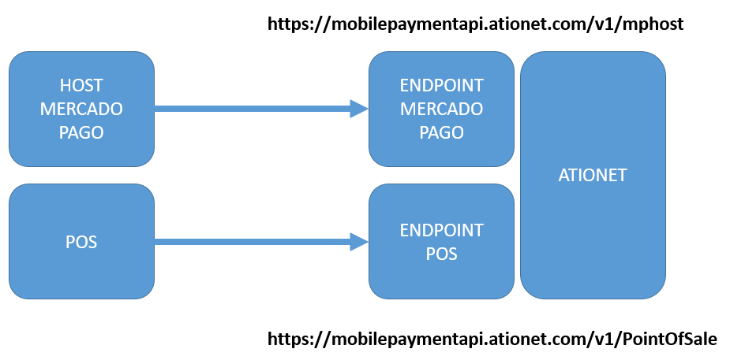
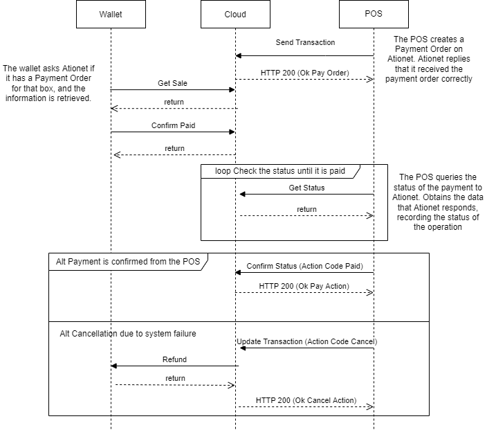

# ATIONet - POS - Mercado Pago Transaction Protocol Specification v1.1 #

|Document Information||
|--- |--- |
|File:|AN-POS_Transaction_Protocol-Spec|
|Doc Version:|1.1|
|Release Date:|28, June 2022|
|Author:|ATIONet LLC|

|Change Log|||
|--- |--- |--- |
|Ver.|Date|Change Summary|
|1.1|28, June 2022|Initial version.|

## Contents

- [Introduction](#introduction)
- [Scope](#scope)
- [Data Security](#data-security)
- [Error Handling](#error-handling)
- [Architecture](#architecture) 
	- [Controllers API](#controllers-api)
		- [Supported Commands](#supported-commands)
			- [Commands Flow](#commands-flow)
			- [Get Status (A)](#get-status-a)
			- [Confirm Status (B)](#confirm-status-b)
			- [Send Transaction (C)](#send-transaction-c)
	- [Mercado Pago API](#mercado-pago-api)
- [Objects references](#objects-references)
	- [Order object](#order-object)
	- [Items object](#items-object)	
	- [Loyalty object](#loyalty-object)

## Overview

### Introduction

This specification is intended to document ATIONet’s POS Protocol with Mercado Pago integration messaging format and related features required for the systems applying for integration with ATIONet. The following sections provide descriptions of the messages themselves, the expected behavior for each supported transaction type and a common ground for the functionality of each relevant item.

## Scope

Version 1.0 of this document covers a particular version of ATIONet’s Host protocol. Although feature’s descriptions are generally not related to a particular version of the protocol, some changes may apply which would be specifically commented and identified on each feature’s
description paragraph.

## Data Security

To validate the source of transactions and data encryption, the ATIONet Native Transaction Protocol relies on a SSL connection between the Site’s Terminal or Site’s Controller and the ATIONet Host. The SSL connection is established for each request/response pair, using a certificate property of ATIONet, meaning that each request must include a system-type user and password on the Header. The user will be matched against the related ATIONet actor for each message.

Users to be used on the Transaction Protocol messaging will be created by authorized users via ATIONet Console.

At this time there is no provisioning to distribute or update certificates or thumbprints thru a system interface. This information will be provided at request of the Controller’s vendor during the integration project.

## Error Handling

Success/failure exits on the POS Transaction Protocol will be handled via HTTP status codes.

Successful request will get a HTTP 200 and the resulting response.

Any interaction with the API will return a single JSON-formatted item with the “Response Code” and “Response Text”. The body of these responses will never be empty.

Failure to process the request will be indicated by an HTTP 400’s range status code. The body will contain a single JSON-formatted item with the “ResponseCode”, “ResponseMessage” and “ResponseError” fields.

- **ResponseCode**: Will contain a unique code for that specific error
- **ResponseMessage**: A short message describing the error
- **ResponseError**: Will contain the stack trace of the error, this helps debug process.

*Sample JSON body*

	{“ResponseCode”:”40001”,”ResponseMessage”:”Site not Found”,”ResponseError”:""}

Possible values for ResponseCode:

|ResponseCode|ResponseMessage|
|---|---|
|0|Received command is not a valid POS Protocol command|
|1|Site Id is null or empty|
|2|Unable to confirm transaction due to invalid parameters or status|
|3|Action given for transaction code is invalid|
|4|Transaction amount is zero or negative|
|5|Missing parameters for transaction creation request|
|6|Error during serialization/processing of request. Trace is sent as part of message|
|7|Given parameters are invalid for request|
|8|Unable to confirm order payment|
|9|Site has no Access Token and it's required for operation|
|10|Order has no aproved payments.|
|100|Requested Site Id was not found|
|102|The given site has a refund pending on one of it's fuel points|

## Architecture
This cloud module contains 2 main components, the one that talks to the controllers and the one that talks to Mercado Pago. Both are HTTPS web APIs.

### Controllers API
#### Supported Commands 

|Code|Name|Description|
|---|---|---|
|A|Get Status|This is the message that the controller sends to get news|
|B|Confirm Status|This is the message that the controller sends to confirm that the received status in message A was processed OK|
|C|Send Transaction|Message sent by the controller containing new sales generated at the POS|
|U|Update Transaction|Message sent from the POS to clear or cancel transactions|

**Verb**: POST

**URL**: https://mobilepaymentapi.ationet.com/v1/PointOfSale 

**Headers**:
- Accept-Encoding: gzip
- Authorization: Basic user:password

#### Commands Flow

#### Get Status (A)
Request Body:

	{"transaction_code":"A","site_id":"123456"}

Response Body:

	[{“pump_id":"7","external_reference":"975321", “action”: “P”, “payment_type”: “Mercado Pago”, “paymentObject”:”<serializedobject>”},
	{“pump_id”:”10”, ”action”:”E”,“error_code”:”102”}]

|Field|Description|
|---|---|
|pump_id|The pump where the sale was done|
|external_reference|The sale number provided by the controller in the command "C"|
|action|If the response does not have Action, it indicates that the payment was not processed. if “P”, the transaction has been paid. If “E”, the controller needs to set pump as in ERROR in the cloud and controlles must avoid sending any command until it is fixed. Same error must be returned as a response to every GetStatus request until it is fixed.|
|payment_type|It will be present only if action is “P”. It is the payment type used to pay. See table below for possible values.|
|paymentObject|It will be present only if action is “P”. It is a serialized string representation of the Payment Object provided by Mercado Pago.|
|error_code|It will be present only if action is “E”. It is an error code that represent a particular error on a particular pump. Note: Same error_code must be returned by the cloud as a response to every GetStatus request until it is fixed.|

Possible values for payment_type:

|Payment_type|Description|
|---|---|
|Mercado Pago|Transaction was paid through Mercado Pago.|

#### Confirm Status (B)
Request Body:

	{"transaction_code":"B","site_id":"123456","pump_id":"7", "external_reference":"974423", “status”:”OK}

Response Body:

If the HTTP response code is different than 200, then the following structure is return 

	{“ResponseCode”:”StringValue”,”ResponseMessage”:”StringValue”,”ResponseError”:"StringValue"}

Special Case 1: 

If pump is in a particular error (for instance reverse pending), a particular and specific ResponseCode (same error_code returned in GetStatus) must be returned. See Error Handling section for more details. 

Special Case 2: 

If the POS receives a “P” action requiring Payment of sale but Payment Object status is not approved, the POS will not send ConfirmStatus because it must not pay the sale. Instead, it will unlock the sale and notify the cloud by sending Update Transaction (U) with Clear (C) action to make the sale available for future QR scanning.

#### Send Transaction (C)
Request Body:

	{
	 "transaction_code": "C",
	 "site_id": "123456",
	 "pump_id": "7",
	 "order": {
	    "collector_id": 178106235,
	    "items": [
	      {
	        "title": " $500.00 de Premium",
	        "description": "$500.00 de Premium",
	        "quantity": 1.0,
	        "unit_price": 500.00,
		"total_amount": 500.00,
	      }
	    ],
	    "external_reference": "45ea80da",
	    "url": "pos notification valid url"
	    "loyalty": null
	  }
	}

Response Body:

If the HTTP response code is different than 200, then the following structure is return 

	{“ResponseCode”:”StringValue”,”ResponseMessage”:”StringValue”,”ResponseError”:"StringValue"}

**Note**: If pump is in a particular error (for instance reverse pending), a particular and specific ResponseCode (same error_code returned in GetStatus) must be returned. See Error Handling section for more details.
	

### Mercado Pago API
Mercado Pago API reference: https://www.mercadopago.com.ar/developers/es/guides/instore-payments/qr-payments/qr-gas-station

## Objects references
### Order object
|Field Name|Type|Condition|Descriptions/Field Value(s)|
|---|---|---|---|
|collector_id|Long|Required|Identificador de la cuenta de Mercado Pago a la que se le acreditarán los pagos.|
|sponsor_id|Long|Required|Identificador de una cuenta de Mercado Pago que integra la solución.|
|external_reference|String|Required|Referencia para sincronizar con tu sistema.|
|url|String|Optional|URL a la cual se enviarán las notificaciones, definida por el integrador. Para utilizar esta opción, será necesario contar con la configuración de la autenticación en la suscripción de la network. En caso de no suministrar la url, se deberá efectuar el GetStatus para obtener la información del pago|
|items|Array|Required|Lista de los productos, donde cada item es un object con los siguientes campos|
|loyalty|Object|Required|Datos necesarios para sumar puntos en un determinado programa de fidelización|

### Items object
|Field Name|Type|Condition|Descriptions/Field Value(s)|
|---|---|---|---|
|title|String|Required|Nombre del producto.|
|quantity|Entero|Required|Cantidad de este producto.|
|unit_price|Decimal|Required|Precio unitario del producto.|
|total_amount|Decimal|Required|Monto total del item.|

### Loyalty object
|Field Name|Type|Condition|Descriptions/Field Value(s)|
|---|---|---|---|
|program|String|Required|Programa de fidelización (serviclub, payback, etc.)|
|transaction_id|String|Required|Número de transacción.|
|invoice_number|String|Required|Número de comprobante.|
|transaction_date|String|Required|Fecha y hora de la transacción (ISO 8601).|
|transaction_amount|Decimal|Required|Importe total de la transacció.|
|store_id|String|Required|Identificador único del negocio (identificador de estación de servicio o APIES).|
|products|Array|Required|Lista de los productos comprados con los siguientes atributos|
|code|String|Required|Código del producto.|
|quantity|Decimal o entero|Required|Por ejemplo 20.50 litros.|
|unit_price|Decimal|Required|Precio unitario del producto.|
|unit|String|Required|Unidad de medida si aplica (litre, etc.)|
|cashier_identification|Object|Required|Datos del empleado|
|type|String|Required|Tipo de documento (DNI, INE, etc.)|
|number|String|Required|Id de documento.|
|period|String|Required|Número del período.|
|shift|String|Required|Número del turno.|
|affinity_plan|String|Required|Plan de afinidad.|

