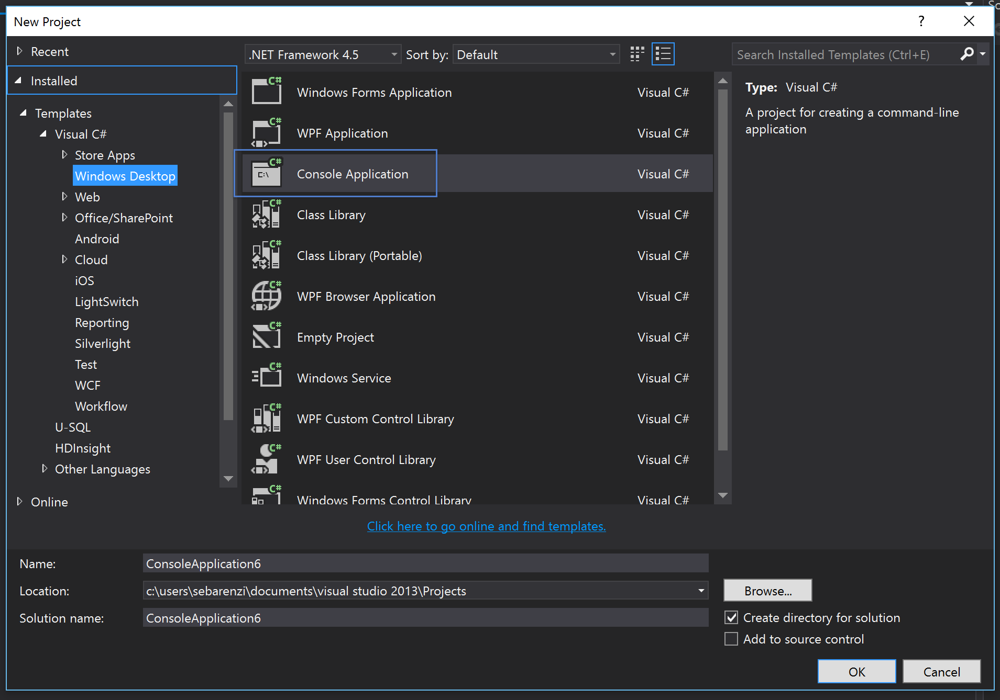
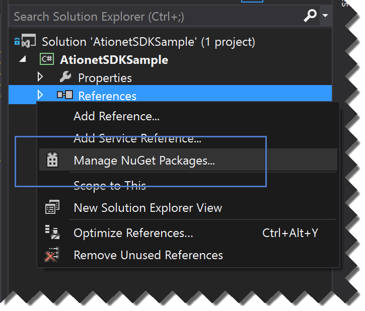
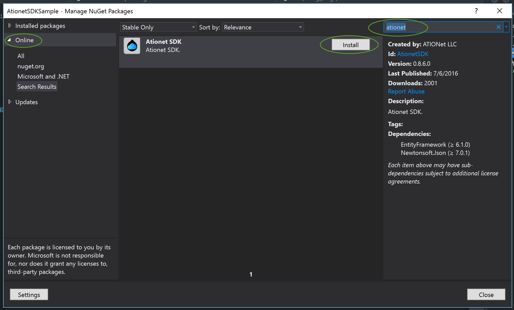

 
# ATIOnet .NET SDK Reference
> **About:** This document describes and explains how to consume the .NET SDK for all ATIOnet APIs.	


<BR/>

|Document Information||
|--- |--- |
|File:|AN-SDK-Reference|
|Doc. Version:|1.0|
|Release Date:|10, July 2016|
|Author:|ATIOnet LLC|

|Change Log|||
|--- |--- |--- |
|Ver.|Date|Change summary|
|1.0|10/July/2016|Initial version|

</br>

<!--###Table of Content -->

## Contents

<!-- MarkdownTOC depth=3 -->

- [Introduction](#introduction)
- [Download / Installation](#download-installation)
- [Operation Types](#operation-types)
  -  [Auth](#auth)
  -  [Api](#api)
  -  [FMS](#fms)
  -  [Interface](#interface)
  -  [Loyalty](#loyalty)
  -  [Retail](#retail)
- [Consuming the SDK](#consuming-the-sdk)
  -  [Operation Types methods](#operation-types-methods)
	  -  [Auth Methods](#auth-methods)
	  -  [Api Methods](#api-methods)
	  -  [FMS Methods](#fms-methods)
	  -  [Interface Methods](#interface-methods)
	  -  [Loyalty Methods](#loyalty-methods)
	  -  [Retail Methods](#retail-methods)
- [Appendix A - Native Authorization Protocol Messages](#appendix-a---native-authorization-protocol-messages)
<!-- /MarkdownTOC -->

## Introduction
The ATIOnet SDK (Software development Kit) helps any developer that wants to interact with ATIOnet Platform. If you are integrating an existing software or want to extract data out of ATIOnet, the SDK will make this much easier, taking care of all the HTTP communication, error handling and retry policies.
ATIOnet SDK can be consumed from any .NET language.

## Download / Installation
ATIOnet SDK is hosted in [www.nuget.org](http://www.nuget.org). NuGet is the package manager for the Microsoft development platform including .NET. The NuGet client tools provide the ability to produce and consume packages. The NuGet Gallery is the central package repository used by all package authors and consumers.

## Operation Types
ATIOnet SDK is able to handle most of the ATIOnet modules (Operation Types). These operations are very specific to the responsibility they have in the platform, like for example *Authorization*, *FMS (Fuel Management Systems)*, *Loyalty*, etc. Each of this Operation Type, has a corresponding  module in the SDK. the complete list of *Operations Types* are listed below.


### Auth
The Auth Operation Type is the one in charge of interacting with the authorization engine. The authorization engine is the component that receives authorizations requests and decides if the transaction is approved or not. This SDK Operation Type should be use if you are building a POS or a terminal that will be sending authorization requests to ATIOnet. 

### Api
The Api Operation Type was design to be used by 3rd party software that need to get information from ATIOnet. With this Operation Type you can perform the functions performed by the ATIOnet Console.

### FMS
The FMS Operation Type is the one in charge of interacting with the FMS module. ATIOnet supports receiving *Inventory* and *Deliveries* transactions through this interface.

### Interface
The Interface Operation Type was design to be used by 3rd party software that need to get information from ATIOnet. With this Operation Type you can download transactions (fleet, loyalty, retail, rejected, approved and exceptions), current account movements, current account balances and loyalty current account.

### Loyalty
The Loyalty Operation Type is the one in charge of interacting with the Loyalty module. Using this Operation Type you will be able to send Loyalty transactions to ATIOnet among other features.

### Retail
The Retail Operation Type is the one in charge of interacting with the Retail module. Using this Operation Type you will be able to send Retail information (transactions, batch closes, etc) to ATIOnet among other features.


## Consuming the SDK
For this example we will use Visual Studio 2013 and we will create a Console Application.

1.  Inside Visual Studio create a new Console Application

1.  Once the project is created, open the *Solution Explorer*, right click the project and select *Manage NuGet Packages*. This will open a pop up.


3.  Inside the NuGet pop up, in the left part select *Online*, then in the right top corner type *ationet*. This will bring the list of packages found with this criteria. In this case only 1, **ATIOnet SDK**. Click *Install*, this will install the ATIOnet SDK packages and dependencies. Please accept terms and conditions for dependencies packages. 


1.  In the sample below you will see how to download transactions. Open the Program.cs and type the following code:

```javascript


var client = new Ationet.Sdk.Interface.InterfaceOperations("https://native.ationet.com/", 
    "[YOUR-USERNAME]", "[YOUR-PASSWORD]");
var transactions = client.GetTransactions("XYZ", "", "", DateTime.Now.AddDays(-1));

foreach (var tran in transactions.Content)
{
    Console.WriteLine("{0} - {1} - {2}", tran.AuthorizationCode, tran.TerminalCode, tran.ProductAmountDispensed);
}


```

First, you need an instance of the *InterfaceOperations* class. The constructor of this class requires 3 parameters, the url, username and password.
Once you have an instance of the *InterfaceOperations* class you can start calling the different methods. Find below the list of all the methods by *Operation Type*:


## Operation Types methods
Each Operation Type class has multiple methods to perform specific operation against ATIOnet. Each of this methods has a set of parameters, some of them to determine behaviour and others to filter data.

### Auth Methods


<table>
     <thead>
        <tr> 
			<td>Method</td>
			<td>Parameters</td>
			<td>Description</td>
		</tr>
     </thead>
     <tbody>
        <tr>
          	<td>SendConfirmation</td>
            <td>AuthTransactionRequest</td>
            <td>Sends a <i>Confirmation</i> message to the host (learn more about transactions flow here: https://github.com/Ationet/ationetdocs/blob/master/AN-Transaction_Flows-TechGuide.md)</td>
        </tr>
        <tr>
          	<td>SendConfirmationAsync</td>
            <td>AuthTransactionRequest</td>
            <td>Async version of the previous method</td>
        </tr>
        <tr>
          	<td>SendPreAuthorization</td>
            <td>AuthTransactionRequest</td>
            <td>Sends a <i>Pre Authorization</i> message to the host (learn more about transactions flow here: https://github.com/Ationet/ationetdocs/blob/master/AN-Transaction_Flows-TechGuide.md)</td>
        </tr>
        <tr>
          	<td>SendPreAuthorizationAsync</td>
            <td>AuthTransactionRequest</td>
            <td>Async version of the previous method</td>
        </tr>
        <tr>
          	<td>SendSale</td>
            <td>AuthTransactionRequest</td>
            <td>Sends a <i>Sale</i> message to the host (learn more about transactions flow here: https://github.com/Ationet/ationetdocs/blob/master/AN-Transaction_Flows-TechGuide.md)</td>
        </tr>
        <tr>
          	<td>SendSaleAsync</td>
            <td>AuthTransactionRequest</td>
            <td>Async version of the previous method</td>
        </tr>
	</tbody>
</table>
<BR/>

You can download a fully functional sample code from here: [ATIONet Auth Sample](https://github.com/atioint/ationetsdksamples)

### Api Methods

#### AuditLog
|Type|Name|Description|
|--- |--- |--- |
|string|NetworkDateString||
|DateTime?|NetworkDate||
|string|NewData||
|string|OriginalData||
|Guid? |EntityId||
|string |MerchantName||
|string |CompanyName||
|string |NetworkName||
|string |UserName||
|Guid |UserId||
|string |OriginDescription||
|int? |Origin||
|string |ActionDescription||
|int |Action||
|string |SubCategoryDescription||
|int? |SubCategory||
|string |CategoryDescription||
|int |Category||
|int |Environment||
|Guid? |MerchantId||
|Guid? |CompanyId||
|Guid? |NetworkId||
|Guid |Id||
|DateTime |RealDate||
|string |RealDateString||

|Method|Parameters (Type / var name / default value / Descr)|Response|Description|
|--- |--- |--- |--- |
|GetLogs|List&lt;Guid>  userIds <BR> List&lt;int>  categories <BR> string dateFrom <BR> string dateTo = null <BR> Guid? idCompany = null<BR> int page = 1 <BR>int pageSize = 50 <BR>int? action = null <BR>int? subCategory = null <BR>string timeFrom = null <BR>string timeTo = null|AuditLogDto|Get list of the AuditLogDto|
|GetLogsAsync|List&lt;Guid>  userIds <BR>List&lt;int>  categories<BR> string dateFrom <BR>string dateTo = null <BR>Guid? idCompany = null <BR>int page = 1 <BR>int pageSize = 50 <BR>int? action = null <BR>int? subCategory = null <BR>string timeFrom = null <BR>string timeTo = null|AuditLogDto|Get list of the AuditLogDto|
	
#### BrandFuelMasterDto
|Type|Name|Description|
|--- |--- |--- |
|Guid |Id||
|Guid |FuelMasterId||
|string |FuelMasterName||
|string |Name||

|Method|Parameters|Response|Description|
|--- |--- |--- |--- |
|GetBrandFuels|Guid brandId <BR> string searchText|BrandFuelMasterDto|Get Brand Fuels|
|GetBrandFuelsAsync|Guid brandId <BR> string searchText|BrandFuelMasterDto|Get Brand Fuels|
	
#### BrandDto
|Type|Name|Description|
|--- |--- |--- |
|Guid |Id||
|Guid |NetworkId||
|string |Name||
|List BrandFuelMasterDto |BrandFuelMasters||
|string |BrandFuelMastersNames||

|Method|Parameters|Response|Description|
|--- |--- |--- |--- |
|GetBrands|int page = 1 <BR>int pageSize = 50 <BR>string orderField = "name" <BR>string orderType = "asc"|BrandDto|Get list of the BrandDto|
|GetBrandsAsync|int page = 1 <BR>int pageSize = 50 <BR>string orderField = "name" <BR>string orderType = "asc"|BrandDto|Get list of the BrandDto|
|GetBrand|Guid id|BrandDto|Get individual BrandDto|
|GetBrandAsync|Guid id|BrandDto|Get individual BrandDto|
|CreateBrand|BrandDto data|BrandDto|Create BrandDto|
|CreateBrandAsync|BrandDto data|BrandDto|Create BrandDto|
|UpdateBrand|BrandDto data|string|Update BrandDto|
|UpdateBrandAsync|BrandDto data|string|Update BrandDto|
	
#### CompanyDto
|Type|Name|Description|
|--- |--- |--- |
|string |Custom1||
|string |Custom0||
|byte? |DesactivationType||
|bool |Active||
|string |ContactPhone2||
|string |ContactPhone1||
|string |ContactEmail||
|string |ContactName||
|DateTime |UpdateDate||
|byte |Type||
|DateTime |CreationDate||
|string |IndustryDescription||
|Guid |IndustryId||
|string |Custom2||
|string |TaxpayerCategoryDescription||
|string |TaxPayerId||
|string |City||
|string |ZipCode||
|string |StateDescription||
|Guid |StateId||
|string |CountryDescription||
|Guid |CountryId||
|string |Street2||
|string |Street1||
|string |Name||
|string |Code||
|Guid |NetworkId||
|Guid |Id||
|Guid |TaxpayerCategoryId||
|string |Custom3||
|string |LabelCustom1||
|string |LabelCustom2||
|string |LabelCustom3||
|string |LabelCustom4||
|string |EnableCustom1||
|string |EnableCustom2||
|string |EnableCustom3||
|string |EnableCustom4||
|string |EdiFactCFDIUseCode||
|bool |IsEdiFactBilling||

|Method|Parameters|Response|Description|
|--- |--- |--- |--- |
|GetCompanies|List&lt;Guid>  companyIds = null <BR>string code = null <BR>string name = null <BR>string custom0 = null <BR>string custom1 = null <BR>string custom2 = null <BR>string custom3 = null <BR>DateTime? updateDate = null <BR>int page = 1 <BR>int pageSize = 50 <BR>string orderField = "name" <BR>string orderType = "asc"|CompanyDto|Get list of the CompanyDto|
|GetCompaniesAsync|List&lt;Guid> companyIds = null <BR>string code = null <BR>string name = null <BR>string custom0 = null <BR>string custom1 = null <BR>string custom2 = null <BR>string custom3 = null <BR>DateTime? updateDate = null <BR>int page = 1 <BR>int pageSize = 50 <BR>string orderField = "name" <BR>string orderType = "asc"|CompanyDto|Get list of the CompanyDto|
|GetCompany|Guid id|CompanyDto|Get individual CompanyDto|
|GetCompanyAsync|Guid id|CompanyDto|Get individual CompanyDto|
|CreateCompany|CompanyDto data|CompanyDto|Create CompanyDto|
|CreateCompanyAsync|CompanyDto data|CompanyDto|Create CompanyDto|
|UpdateCompany|Guid id <BR>CompanyDto data|string|Update CompanyDto|
|UpdateCompanyAsync|Guid id <BR>CompanyDto data|string|Update CompanyDto|

#### CompanyClassificationsConfigurationDto
|Data|Description|
|--- |--- |
|Guid IdCompany|Identification of de Company|
|string Classification1Label|classification 1 Label|
|string Classification2Label|classification 2 Label|
|string Classification3Label|classification 3 Label|
|string Classification4Label|classification 4 Label|
|bool Classification1Enabled|status for the use of the company|
|bool Classification2Enabled|status for the use of the company|
|bool Classification3Enabled|status for the use of the company|
|bool Classification4Enabled|status for the use of the company|

|Method|Parameters|Response|Description|
|--- |--- |--- |--- |
|GetCompaniesClassificationsConfiguration||CompanyClassificationsConfigurationDto|Get the configuractions of the Classifications Companies|
|GetCompaniesClassificationsConfigurationAsync||CompanyClassificationsConfigurationDto|Get the configuractions of the Classifications Companies|
|UpdateCompaniesClassificationsConfiguration|CompanyClassificationsConfigurationDto data|string|Update configuractions of the Classifications Companies|
|UpdateCompaniesClassificationsConfigurationAsync|CompanyClassificationsConfigurationDto data|string|Update configuractions of the Classifications Companies|

#### CompaniesGroupsMovementDto
|Data|Description|
|--- |--- |
|string TypeDescription||
|Guid? IdOrigen||
|byte Origen||
|DateTime NetworkDate||
|DateTime RealDate||
|bool IsDebit||
|string DisplayDateTimeString||
|Guid? IdCurrencyCode||
|string Description||
|byte Type||
|string CompaniesGroupDescription||
|Guid IdCompaniesGroup||
|Guid IdNetwork||
|Guid Id||
|decimal Amount||
|string DisplayNetworkDateTimeString||


|Method|Parameters|Response|Description|
|--- |--- |--- |--- |
|GetCompaniesGroupsMovements||CompaniesGroupsMovementDto|Get list of the CompaniesGroupsMovementDto|
|GetCompaniesGroupsMovements|Guid? companiesGroupId = null <BR>string companiesGroupCode = null <BR>string dateFrom = null <BR>string dateTo = null <BR>decimal? amountFrom = null <BR>decimal? amountTo = null <BR>byte? type = null <BR>byte? origin = null <BR>int page = 1 <BR>int pageSize = 50 <BR>string orderField = "networkDate" <BR>string orderType = "asc"|CompaniesGroupsMovementDto|Get list of the CompaniesGroupsMovementDto|
|GetCompaniesGroupsMovementsAsync|Guid? companiesGroupId = null <BR>string companiesGroupCode = null <BR>string dateFrom = null <BR>string dateTo = null <BR>decimal? amountFrom = null <BR>decimal? amountTo = null <BR>byte? type = null <BR>byte? origin = null <BR>int page = 1 <BR>int pageSize = 50 <BR>string orderField = "networkDate" <BR>string orderType = "asc"|CompaniesGroupsMovementDto|Get list of the CompaniesGroupsMovementDto|
|GetCompaniesGroupsMovementAsync|Guid id|CompaniesGroupsMovementDto|Get individual CompaniesGroupsMovementDto|
|CreateCompaniesGroupsMovement|CompanyClassificationsConfigurationDto data|string|Create a CompaniesGroupsMovement|
|CreateCompaniesGroupsMovementAsync|CompanyClassificationsConfigurationDto data|string|Create a CompaniesGroupsMovement|

#### CompanyClassificationDto
|Data|Description|
|--- |--- |
|Guid Id||
|Guid IdCompany||
|string Code||
|string Description||

|Method|Parameters|Response|Description|
|--- |--- |--- |--- |
|GetCompaniesClassifications1|string code = null <BR>string description = null <BR>int page = 1 <BR>int pageSize = 50 <BR>string orderType = "asc"|CompanyClassificationDto|Get list of the CompanyClassificationDto|
|GetCompaniesClassifications1Async|string code = null <BR>string description = null <BR>int page = 1 <BR>int pageSize = 50 <BR>string orderType = "asc"|CompanyClassificationDto|Get list of the CompanyClassificationDto|
|GetCompaniesClassifications2|string code = null <BR>string description = null <BR>int page = 1 <BR>int pageSize = 50 <BR>string orderType = "asc"|CompanyClassificationDto|Get list of the CompanyClassificationDto|
|GetCompaniesClassifications2Async|string code = null <BR>string description = null <BR>int page = 1 <BR>int pageSize = 50 <BR>string orderType = "asc"|CompanyClassificationDto|Get list of the CompanyClassificationDto|
|GetCompaniesClassifications3|string code = null <BR>string description = null <BR>int page = 1 <BR>int pageSize = 50 <BR>string orderType = "asc"|CompanyClassificationDto|Get list of the CompanyClassificationDto|
|GetCompaniesClassifications3Async|string code = null <BR>string description = null <BR>int page = 1 <BR>int pageSize = 50 <BR>string orderType = "asc"|CompanyClassificationDto|Get list of the CompanyClassificationDto|
|GetCompaniesClassifications4|string code = null <BR>string description = null <BR>int page = 1 <BR>int pageSize = 50 <BR>string orderType = "asc"|CompanyClassificationDto|Get list of the CompanyClassificationDto|
|GetCompaniesClassifications4Async|string code = null <BR>string description = null <BR>int page = 1 <BR>int pageSize = 50 <BR>string orderType = "asc"|CompanyClassificationDto|Get list of the CompanyClassificationDto|
|GetCompanyClassifications1|Guid id|CompanyClassificationDto|Get individual CompanyClassificationDto|
|GetCompanyClassifications1Async|Guid id|CompanyClassificationDto|Get individual CompanyClassificationDto|
|GetCompanyClassifications2|Guid id|CompanyClassificationDto|Get individual CompanyClassificationDto|
|GetCompanyClassifications2Async|Guid id|CompanyClassificationDto|Get individual CompanyClassificationDto|
|GetCompanyClassifications3|Guid id|CompanyClassificationDto|Get individual CompanyClassificationDto|
|GetCompanyClassifications3Async|Guid id|CompanyClassificationDto|Get individual CompanyClassificationDto|
|GetCompanyClassifications4|Guid id|CompanyClassificationDto|Get individual CompanyClassificationDto|
|GetCompanyClassifications4Async|Guid id|CompanyClassificationDto|Get individual CompanyClassificationDto|
|CreateCompaniesClassification1|CompanyClassificationDto data|CompanyClassificationDto|Create CompanyClassificationDto|
|CreateCompaniesClassification1Async|CompanyClassificationDto data|CompanyClassificationDto|Create CompanyClassificationDto|
|CreateCompaniesClassification2|CompanyClassificationDto data|CompanyClassificationDto|Create CompanyClassificationDto|
|CreateCompaniesClassification2Async|CompanyClassificationDto data|CompanyClassificationDto|Create CompanyClassificationDto|
|CreateCompaniesClassification3|CompanyClassificationDto data|CompanyClassificationDto|Create CompanyClassificationDto|
|CreateCompaniesClassification3Async|CompanyClassificationDto data|CompanyClassificationDto|Create CompanyClassificationDto|
|CreateCompaniesClassification4|CompanyClassificationDto data|CompanyClassificationDto|Create CompanyClassificationDto|
|CreateCompaniesClassification4Async|CompanyClassificationDto data|CompanyClassificationDto|Create CompanyClassificationDto|
|UpdateCompaniesClassification1|CompanyClassificationDto data|CompanyClassificationDto|Update CompanyClassificationDto|
|UpdateCompaniesClassification1Async|CompanyClassificationDto data|CompanyClassificationDto|Update CompanyClassificationDto|
|UpdateCompaniesClassification2|CompanyClassificationDto data|CompanyClassificationDto|Update CompanyClassificationDto|
|UpdateCompaniesClassification2Async|CompanyClassificationDto data|CompanyClassificationDto|Update CompanyClassificationDto|
|UpdateCompaniesClassification3|CompanyClassificationDto data|CompanyClassificationDto|Update CompanyClassificationDto|
|UpdateCompaniesClassification3Async|CompanyClassificationDto data|CompanyClassificationDto|Update CompanyClassificationDto|
|UpdateCompaniesClassification4|CompanyClassificationDto data|CompanyClassificationDto|Update CompanyClassificationDto|
|UpdateCompaniesClassification4Async|CompanyClassificationDto data|CompanyClassificationDto|Update CompanyClassificationDto|
|DeleteCompaniesClassification1|Guid id|string|delete CompanyClassificationDto|
|DeleteCompaniesClassification1Async|Guid id|string|delete CompanyClassificationDto|
|DeleteCompaniesClassification2|Guid id|string|delete CompanyClassificationDto|
|DeleteCompaniesClassification2Async|Guid id|string|delete CompanyClassificationDto|
|DeleteCompaniesClassification3|Guid id|string|delete CompanyClassificationDto|
|DeleteCompaniesClassification3Async|Guid id|string|delete CompanyClassificationDto|
|DeleteCompaniesClassification4|Guid id|string|delete CompanyClassificationDto|
|DeleteCompaniesClassification4Async|Guid id|string|delete CompanyClassificationDto|

#### CompanyContractDto
|Type|Name|Description|
|--- |--- |--- |
|List CompanyContractProductDto  |Products||
|List CompanyContractSiteDto  |Sites||
|List CompanyContractFuelDto  |Fuels||
|CompanyContractBillingDto |Billing||
|decimal? |ReactivationAmount||
|byte? |DeactivationType||
|bool |Active||
|bool |ValidateSites||
|decimal? |SecurityLimit||
|decimal? |Limit||
|Guid? |CurrencyId||
|byte |CurrentAccountMode||
|List |CompanyContractDiscountDto  Discounts||
|short |BalanceMode||
|byte |Periodicity||
|string |StartDate||
|decimal |Version||
|string |InternalCode||
|byte |Mode||
|string |Description||
|string |Code||
|byte |Type||
|Guid |NetworksCompanyId||
|Guid |CompanyId||
|Guid |NetworkId||
|Guid |Id||
|short |Duration||
|bool |MoneyBalance||
|string |CompanyName||
|string |CurrencyCode||

#### CompanyContractBillingDto
|Type|Name|Description|
|--- |--- |--- |
|string |Name ||
|string |City ||
|string |Street1 ||
|string |Street2 ||
|string |ZipCode ||
|string |TaxPayerId ||
|Guid |CurrencyId ||
|byte |Type ||
|byte? |PeriodicityMode ||
|short? |PeriodicityValue ||
|string |CutTime ||
|byte? |CutDay ||
|byte? |CutMonth ||
|bool |Manual ||
|bool |DeductChargesFromBalance ||
|bool |SeparateChargesDocument ||
|int |StatementDueDays ||
|string |CountryDescription ||
|string |StateDescription ||
|string |CurrencyCode ||

|Method|Parameters|Response|Description|
|--- |--- |--- |--- |
|GetContracts|string companyCode = null <BR>List Guid contractIds = null <BR>string code = null <BR>int page = 1 <BR>int pageSize = 50 <BR>string orderField = "description" <BR>string orderType = "asc"|CompanyContractDto|Get list of the CompanyContractDto|
|GetContractsAsync|string companyCode = null <BR>List Guid contractIds = null <BR>string code = null <BR>int page = 1 <BR>int pageSize = 50 <BR>string orderField = "description" <BR>string orderType = "asc"|CompanyContractDto|Get list of the CompanyContractDto|
|GetContract|Guid id|CompanyContractDto|Get individual CompanyContractDto|
|GetContractAsync|Guid id|CompanyContractDto|Get individual CompanyContractDto|
|CreateContract|CompanyContractDto data|CompanyContractDto|Create CompanyContractDto|
|CreateContractAsync|CompanyContractDto data|CompanyContractDto|Create CompanyContractDto|
|UpdateContract|CompanyContractDto data|CompanyContractDto|Update CompanyContractDto|
|UpdateContractAsync|CompanyContractDto data|CompanyContractDto|Update CompanyContractDto|
	
#### CompanyContractsClassificationDto
|Data|Description|
|--- |--- |
|Guid Id||
|Guid IdNetwork||
|string Code||
|string Description||

|Method|Parameters|Response|Description|
|--- |--- |--- |--- |
|GetCompanyContractsClassifications|int index <BR>int page = 1 <BR>int pageSize = 50 <BR>string orderType = "asc"|CompanyContractsClassificationDto|Get list of the CompanyContractsClassificationDto|
|GetCompanyContractsClassificationsAsync|int index <BR>int page = 1 <BR>int pageSize = 50 <BR>string orderType = "asc"|CompanyContractsClassificationDto|Get list of the CompanyContractsClassificationDto|
|CreateCompanyContractsClassification|CompanyContractsClassificationDto data|CompanyContractsClassificationDto|Get individual CompanyContractsClassificationDto|
|CreateCompanyContractsClassificationAsync|CompanyContractsClassificationDto data|CompanyContractsClassificationDto|Get individual CompanyContractsClassificationDto|
|UpdateCompanyContractsClassification|Guid id <BR>CompanyContractsClassificationDto data|CompanyContractsClassificationDto|Update CompanyContractsClassificationDto|
|UpdateCompanyContractsClassificationAsync|Guid id <BR>CompanyContractsClassificationDto data|CompanyContractsClassificationDto|Update CompanyContractsClassificationDto|
	
#### CompanyContractsClassificationsConfigurationDto
|Data|Description|
|--- |--- |
|Guid IdNetwork||
|bool EnableClassification0||
|string Classification0||
|bool EnableClassification1||
|string Classification1||
|bool EnableClassification2||
|string Classification2||
|bool EnableClassification3||
|string Classification3||

|Method|Parameters|Response|Description|
|--- |--- |--- |--- |
|GetCompanyContractsClassificationsConfiguration|Guid id|CompanyContractsClassificationsConfigurationDto|Get individual CompanyContractsClassificationsConfigurationDto|
|GetCompanyContractsClassificationsConfigurationAsync|Guid id|CompanyContractsClassificationsConfigurationDto|Get individual CompanyContractsClassificationsConfigurationDto|
|UpdateCompanyContractsClassificationsConfiguration|Guid id <BR>CompanyContractsClassificationsConfigurationDto data|string|Update CompanyContractsClassificationsConfigurationDto|
|UpdateCompanyContractsClassificationsConfigurationAsync|Guid id <BR>CompanyContractsClassificationsConfigurationDto data|string|Update CompanyContractsClassificationsConfigurationDto|
	
#### CompanyContractOverLimitDto
|Data|Description|
|--- |--- |
|Guid Id||
|Guid IdCompanyContract||
|string ContractName||
|Guid IdCompany||
|string CompanyName||
|Guid IdNetwork||
|string DateFrom||
|string DateTo||
|string CreationDate||
|string CreationNetworkDate||
|string NetworkTimeZone||
|decimal Value||
|byte Type||
|byte State||

|Method|Parameters|Response|Description|
|--- |--- |--- |--- |
|GetCompanyContractOverLimits|Guid? idCompany = null <BR>Guid? idCompanyContract = null <BR>string dateFrom = null <BR>string dateTo = null <BR>string creationDate = null <BR>byte? filterType = null <BR>int page = 1 <BR>int pageSize = 50 <BR>string orderField = "idFuelMaster" <BR>string orderType = "asc"|CompanyContractOverLimitDto|Get list of the CompanyContractOverLimitDto|
|GetCompanyContractOverLimitsAsync|Guid? idCompany = null <BR>Guid? idCompanyContract = null <BR>string dateFrom = null <BR>string dateTo = null <BR>string creationDate = null <BR>byte? filterType = null <BR>int page = 1 <BR>int pageSize = 50 <BR>string orderField = "idFuelMaster" <BR>string orderType = "asc"|CompanyContractOverLimitDto|Get list of the CompanyContractOverLimitDto|
|GetCompanyContractOverLimit|Guid id|CompanyContractOverLimitDto|Get individual CompanyContractOverLimitDto|
|GetCompanyContractOverLimitAsync|Guid id|CompanyContractOverLimitDto|Get individual CompanyContractOverLimitDto|
|CreateCompanyContractOverLimit|CompanyContractOverLimitDto data|CompanyContractOverLimitDto|Create CompanyContractOverLimitDto|
|CreateCompanyContractOverLimitAsync|CompanyContractOverLimitDto data|CompanyContractOverLimitDto|Create CompanyContractOverLimitDto|
|UpdateCompanyContractOverLimit|Guid id <BR>CompanyContractOverLimitDto data|CompanyContractOverLimitDto|Update CompanyContractOverLimitDto|
|UpdateCompanyContractOverLimitAsync|Guid id <BR>CompanyContractOverLimitDto data|CompanyContractOverLimitDto|Update CompanyContractOverLimitDto|

#### CompanyInvoiceDto
|Data|Description|
|--- |--- |
|Guid Id||
|Guid IdNetwork||
|Guid IdCompany||
|string InvoiceNumber||
|byte Type||
|DateTime Date||
|decimal Net||
|decimal Taxes||
|decimal? Total||
|IEnumerable CompanyInvoiceDetailDto CompaniesInvoicesDetails||
|IEnumerable TransactionDto  Transactions||

|Method|Parameters|Response|Description|
|--- |--- |--- |--- |
|GetInvoices|string companyCode = null <BR>List Guid companyIds = null <BR>string invoiceNumber = null <BR>byte? invoiceType = null <BR>DateTime? dateFrom = null <BR>DateTime? dateTo = null <BR>int page = 1 <BR>int pageSize = 50 <BR>string orderField = "description" <BR>string orderType = "asc"|CompanyInvoiceDto|Get list of the CompanyInvoiceDto|
|GetInvoicesAsync|string companyCode = null <BR>List Guid companyIds = null <BR>string invoiceNumber = null <BR>byte? invoiceType = null <BR>DateTime? dateFrom = null <BR>DateTime? dateTo = null <BR>int page = 1 <BR>int pageSize = 50 <BR>string orderField = "description" <BR>string orderType = "asc"|CompanyInvoiceDto|Get list of the CompanyInvoiceDto|
|GetInvoice|Guid id|CompanyInvoiceDto|Get individual CompanyInvoiceDto|
|GetInvoiceAsync|Guid id|CompanyInvoiceDto|Get individual CompanyInvoiceDto|
|CreateInvoice|CompanyInvoiceDto data|CompanyInvoiceDto|Create CompanyInvoiceDto|
|CreateInvoiceAsync|CompanyInvoiceDto data|CompanyInvoiceDto|Create CompanyInvoiceDto|
|UpdateInvoice|CompanyInvoiceDto data|string|Update CompanyInvoiceDto|
|UpdateInvoiceAsync|CompanyInvoiceDto data|string|Update CompanyInvoiceDto|
	
#### ConsumerCardClientDto
|Data|Description|
|--- |--- |
| string Street1 ||
| string Street2 ||
| string PhoneNumber1 ||
| string PhoneNumber2 ||
| short Type ||
| Guid TypeModelId ||
| string TypeModelDescription ||
| string ZipCode ||
| Guid NetworkId ||
| string PIN ||
| bool RequiresPINChange ||
| bool RequiresPIN ||
| bool IdentificationActive ||
| string IdentificationExpirationDate ||
| string TrackNumber ||
| string CompleteName ||
| string PAN ||
| string TypeDescription ||
| string City ||
| Guid? StateId ||
| Guid Id ||
| decimal? Balance ||
| byte IdentificationState ||
| string IdentificationDescription ||
| Guid ConsumerCardProgramId ||
| Guid ConsumerCardIdentificationId ||
| Guid ConsumerCardSubAccountId ||
| string StateDescription ||
| string ConsumerCardProgramName ||
| string UserAtionetEmail ||
| string LastName ||
| string FirstName ||
| string Birthdate ||
| DateTime CreationDate ||
| Guid? CountryId ||
| string CountryDescription ||
| string Email ||
| string NetworkLogo ||

|Method|Parameters|Response|Description|
|--- |--- |--- |--- |
|GetConsumerCardClients|Guid? programId = null <BR>string pan = null <BR>string name = null <BR>int page = 1 <BR>int pageSize = 50 <BR>string orderField = "label" <BR>string orderType = "asc"|ConsumerCardClientDto|Get list of the ConsumerCardClientDto|
|GetConsumerCardClientsAsync|Guid? programId = null <BR>string pan = null <BR>string name = null <BR>int page = 1 <BR>int pageSize = 50 <BR>string orderField = "label" <BR>string orderType = "asc"|ConsumerCardClientDto|Get list of the ConsumerCardClientDto|
|GetConsumerCardClient|Guid id|ConsumerCardClientDto|Get individual ConsumerCardClientDto|
|GetConsumerCardClientAsync|Guid id|ConsumerCardClientDto|Get individual ConsumerCardClientDto|
	
#### ConsumerCardMovementDto
|Data|Description|
|--- |--- |
| Guid? ConsumerCardProgramId ||
| Guid ConsumerCardClientId ||
| Guid? DestinationConsumerCardClientId ||
| Guid? SiteId ||
| ConsumerCardMovementTypeEnum Type ||
| decimal Amount ||
| string Description ||

|Method|Parameters|Response|Description|
|--- |--- |--- |--- |
|CreateMovement|ConsumerCardMovementDto data|ConsumerCardMovementDto|Create a ConsumerCardMovementDto|
|CreateMovementAsync|ConsumerCardMovementDto data|ConsumerCardMovementDto|Create a ConsumerCardMovementDto|
	
#### ConsumerCardTransactionsContingencyDto
|Data|Description|
|--- |--- |
| decimal UnitPrice ||
| decimal Amount ||
| string ShiftNumber ||
| string PumpNumber ||
| int? Odometer ||
| int? EngineHours ||
| string DriverId ||
| string VehicleId ||
| string Miscellaneous ||
| byte State ||
| string ResponseCode ||
| string ResponseMessage ||
| string Comments ||
| string ImageFileName ||
| Guid? ReasonId ||
| decimal Volume ||
| string FuelName ||
| Guid FuelMasterId ||
| string TerminalCode ||
| Guid Id ||
| Guid? TransactionId ||
| Guid NetworkId ||
| string NetworkName ||
| Guid ConsumerCardProgramId ||
| string ConsumerCardProgramName ||
| Guid ConsumerCardClientId ||
| string ReasonName ||
| string ConsumerCardClientPAN ||
| string Date ||
| string Time ||
| Guid MerchantId ||
| string MerchantName ||
| Guid SiteId ||
| string SiteName ||
| Guid TerminalId ||
| string AuthorizationCode ||
| ConsumerCardTransactionsContingencyImageDto Image ||
	
#### ConsumerCardTransactionsContingencyImageDto
|Data|Description|
|--- |--- |
| string FileExtension ||
| byte[] FileContent ||
| ChangeTypeEnum ChangeType ||

|Method|Parameters|Response|Description|
|--- |--- |--- |--- |
|GetConsumerCardTransactionsContingencies|Guid? idConsumerCardClient = null<BR> Guid? idProgram = null<BR> Guid? idSite = null<BR> Guid? idTerminal = null<BR> Guid? idFuelMaster = null<BR> string dateFrom = null<BR> string timeFrom = null<BR> string dateTo = null<BR> string timeTo = null<BR> string authorizationCode = null<BR>byte? state = null<BR> Guid? idReason = null<BR> string order = "desc"<BR> int page = 1<BR> int pageSize = 50|ConsumerCardTransactionsContingencyDto|Get list of the ConsumerCardTransactionsContingencyDto|
|GetConsumerCardTransactionsContingenciesAsync|Guid? idConsumerCardClient = null<BR> Guid? idProgram = null<BR> Guid? idSite = null<BR> Guid? idTerminal = null<BR> Guid? idFuelMaster = null<BR> string dateFrom = null<BR> string timeFrom = null<BR> string dateTo = null<BR> string timeTo = null<BR> string authorizationCode = null<BR>byte? state = null<BR> Guid? idReason = null<BR> string order = "desc"<BR> int page = 1<BR> int pageSize = 50|ConsumerCardTransactionsContingencyDto|Get list of the ConsumerCardTransactionsContingencyDto|
|GetConsumerCardTransactionsContingency|Guid id|ConsumerCardTransactionsContingencyDto|Get individual ConsumerCardTransactionsContingencyDto|
|GetConsumerCardTransactionsContingencyAsync|Guid id|ConsumerCardTransactionsContingencyDto|Get individual ConsumerCardTransactionsContingencyDto|
|CreateConsumerCardTransactionsContingency|ConsumerCardTransactionsContingencyDto dto|ConsumerCardTransactionsContingencyDto|Create ConsumerCardTransactionsContingencyDto|
|CreateConsumerCardTransactionsContingencyAsync|ConsumerCardTransactionsContingencyDto dto|ConsumerCardTransactionsContingencyDto|Create ConsumerCardTransactionsContingencyDto|
|UpdateConsumerCardTransactionsContingency|ConsumerCardTransactionsContingencyDto dto|string|Update ConsumerCardTransactionsContingencyDto|
|UpdateConsumerCardTransactionsContingency|ConsumerCardTransactionsContingencyDto dto|string|Update ConsumerCardTransactionsContingencyDto|

#### CurrentAccountReportDto
|Data|Description|
|--- |--- |
|short? CompanyContractDuration||
|int? CompanyContractAccountsLimit||
|decimal? CompanyContractVersion||
|string ContractCode||
|decimal? Balance||
|bool? IsDebit||
|decimal? CreditLimit||
|decimal? OverLimit||
|Guid? StatementId||
|string MovementTypeDescription||
|string CompanyContractDescription||
|string VehicleDescription||
|string DriverDescription||
|string CompleteName||
|string FuelName||
|string ModeDescription||
|decimal? Debit||
|decimal? Credit||
|decimal BillingValue||
|bool Enable||
|string CompanyContractExpirationDate||
|string IdentificationsDescription||
|string LocalDateShortString||
|byte? CompanyContractPeriodicity||
|DateTime? CompanyContractStartDate||
|string SiteFuelName||
|string NetworkFuelName||
|Guid Id||
|Guid? IdMovement||
|Guid? IdCompanyContract||
|Guid? IdFuelMaster||
|Guid? IdSubAccount||
|string Description||
|decimal Amount||
|Guid? IdCurrencyCode||
|Guid? IdUserAtionet||
|byte MovementType||
|string NetworkName||
|string LocalTimeString||
|string CompanyName||
|string MovementIdOrigin||
|string MovementDescription||
|byte ContractMode||
|Guid? VehicleId||
|string VehiclePlate||
|string VehicleCode||
|Guid? DriverId||
|string DriverCode||
|string DriverFirstName||
|string DriverLastName||
|string FuelMasterName||
|DateTime MovementDate||
|string DisplayDateTimeString||

|Method|Parameters|Response|Description|
|--- |--- |--- |--- |
|GetContractsBalance|Guid? idContract <BR>string dateFrom = null <BR>string dateTo = null <BR>string order = "desc" <BR>int page = 1 <BR>int pageSize = 50|CurrentAccountReportDto|Get list of the CurrentAccountReportDto|
|GetContractsBalanceAsync|Guid? idContract <BR>string dateFrom = null <BR>string dateTo = null <BR>string order = "desc" <BR>int page = 1 <BR>int pageSize = 50|CurrentAccountReportDto|Get list of the rentAccountReportDto|
|GetContractsMovements|Guid idContract <BR>string dateFrom = null <BR>string dateTo = null <BR>string order = "desc" <BR>int page = 1 <BR>int pageSize = 50|CurrentAccountReportDto|Get list of the CurrentAccountReportDto|
|GetContractsMovementsAsync|Guid idContract <BR>string dateFrom = null <BR>string dateTo = null <BR>string order = "desc" <BR>int page = 1 <BR>int pageSize = 50|CurrentAccountReportDto|Get list of the CurrentAccountReportDto|
|GetSubAccountsBalance|Guid? idContract=null <BR>Guid? idSubAccount=null <BR>string dateFrom = null <BR>string dateTo = null <BR>string order = "desc" <BR>int page = 1 <BR>int pageSize = 50|CurrentAccountReportDto|Get list of the CurrentAccountReportDto|
|GetSubAccountsBalanceAsync|Guid? idContract=null <BR>Guid? idSubAccount=null <BR>string dateFrom = null <BR>string dateTo = null <BR>string order = "desc" <BR>int page = 1 <BR>int pageSize = 50|CurrentAccountReportDto|Get list of the CurrentAccountReportDto|
|GetSubAccountsMovements|Guid? idContract=null <BR>Guid? idSubAccount=null <BR>string dateFrom = null <BR>string dateTo = null <BR>string order = "desc" <BR>int page = 1 <BR>int pageSize = 50|CurrentAccountReportDto|Get list of the CurrentAccountReportDto|
|GetSubAccountsMovementsAsync|Guid? idContract=null <BR>Guid? idSubAccount=null <BR>string dateFrom = null <BR>string dateTo = null <BR>string order = "desc" <BR>int page = 1 <BR>int pageSize = 50|CurrentAccountReportDto|Get list of the CurrentAccountReportDto|

#### CountryDto
|Data|Description|
|--- |--- |
|Guid Id||
|string Name||

|Method|Parameters|Response|Description|
|--- |--- |--- |--- |
|GetCountries|int page = 1 <BR>int pageSize = 50|CompanyInvoiceDto|Get list of the CountryDto|
|GetCountriesAsync|int page = 1 <BR>int pageSize = 50|CountryDto|Get list of the CountryDto|
	
#### DispersionDto
|Data|Description|
|--- |--- |
|Guid ContractId||
|Guid? FuelMasterId||
|List<DispersionSubAccountDto> DispersionSubAccounts||
|string Description||
|decimal Balance||
|byte DispersionMode||
	
#### DispersionSubAccountDto
|Data|Description|
|--- |--- |
|Guid SubAccountId||
|decimal? Amount||

|Method|Parameters|Response|Description|
|--- |--- |--- |--- |
|Disperse|DispersionDto data|DispersionDto|Create DispersionDto|
|DisperseAsync|DispersionDto data|DispersionDto|Create DispersionDto|

#### DocumentTypeAcceptedDto
|Data|Description|
|--- |--- |
|Guid Id||
|Guid IdNetwork||
|string Code||
|string Description||
|bool Validator||
|bool Active||

|Method|Parameters|Response|Description|
|--- |--- |--- |--- |
|GetDocumentTypesAccepted|string code = null<BR> string description = null<BR> bool? validator = null<BR> bool? active = null<BR>int page = 1<BR> int pageSize = 50<BR> string orderField = "code"<BR> string orderType = "asc"|DocumentTypeAcceptedDto|Get list of the DocumentTypeAcceptedDto|
|GetDocumentTypesAcceptedAsync|string code = null<BR> string description = null<BR> bool? validator = null<BR> bool? active = null<BR>int page = 1<BR> int pageSize = 50<BR> string orderField = "code"<BR> string orderType = "asc"|DocumentTypeAcceptedDto|Get list of the DocumentTypeAcceptedDto|	
|GetDocumentTypeAccepted|Guid id|DocumentTypeAcceptedDto|Get individual DocumentTypeAcceptedDto|
|GetDocumentTypeAcceptedAsync|Guid id|DocumentTypeAcceptedDto|Get individual DocumentTypeAcceptedDto|
|CreateDocumentTypeAccepted|DocumentTypeAcceptedDto data|DocumentTypeAcceptedDto|Create DocumentTypeAcceptedDto|
|CreateDocumentTypeAcceptedAsync|DocumentTypeAcceptedDto data|DocumentTypeAcceptedDto|Create DocumentTypeAcceptedDto|
|UpdateDocumentTypeAccepted|Guid id <BR>DocumentTypeAcceptedDto data|string|Update DocumentTypeAcceptedDto|
|UpdateDocumentTypeAcceptedAsync|Guid id <BR>DocumentTypeAcceptedDto data|string|Update DocumentTypeAcceptedDto|
|DeleteDocumentTypeAccepted|Guid id|string|Delete DocumentTypeAcceptedDto|
|DeleteDocumentTypeAcceptedAsync|Guid id|string|Delete DocumentTypeAcceptedDto|
	
#### DriverDto
|Data|Description|
|--- |--- |
| string Clasification3Description ||
| Guid? Clasification4Id ||
| string Clasification4Description ||
| List<DriverRuleDto> Rules ||
| List<DriverVehicleDto2> Vehicles ||
| List<DriverIdentificationDto> Identifications ||
| List<DriverLoyaltyIdentificationDto> LoyaltyIdentifications ||
| List<SystemNotificationDto> Notifications ||
| string Balance ||
| string Consumption ||
| Guid? Clasification3Id ||
| string IdentificationsDescription ||
| string LoyaltyIdentificationsDescription ||
| List<DriverVehicleDto> VehiclesDrivers ||
| string Custom0 ||
| string Custom1 ||
| string Custom2 ||
| string Custom3 ||
| decimal? AvaliableAmount ||
| decimal? AvaliableVolume ||
| IEnumerable<DriverBalanceDto> Balances ||
| IEnumerable<DriverQuotaRuleBalanceDto> QuotaRules ||
| string LoyaltyProgramsDescription ||
| string Clasification2Description ||
| Guid? Clasification2Id ||
| string Clasification1Description ||
| Guid Id ||
| Guid CompanyId ||
| string CompanyName ||
| string Code ||
| string LastName ||
| string FirstName ||
| string CompleteName ||
| string Birthdate ||
| string LicenseNumber ||
| bool Enabled ||
| bool IsCodeAutomaticallyGenerated ||
| Guid? CountryId ||
| string CountryName ||
| Guid? StateId ||
| string StateName ||
| string City ||
| string Street1 ||
| string Street2 ||
| string ZipCode ||
| string PhoneNumber1 ||
| string PhoneNumber2 ||
| string Email ||
| Guid? Clasification1Id ||
| decimal? AverageCost ||
| List<SubAccountDto> SubAccounts ||
	
#### DriverRuleDto
|Data|Description|
|--- |--- |
| Guid RuleId ||
| string RuleName ||
| short RuleType ||
| string RuleTypeDescription ||
| Guid DriverId ||
| string DriverName ||
| string Description ||
	
#### DriverVehicleDto2
|Data|Description|
|--- |--- |
| Guid VehicleId ||
| string VehicleCode ||
| string VehiclePlate ||
| Guid DriverId ||
| string DriverName ||
| bool RequireVehicleIdentification ||
| bool RequireDriverIdentification ||
| bool IsLoyalty ||
		
#### DriverIdentificationDto
|Data|Description|
|--- |--- |
| Guid IdentificationId ||
| string IdentificationLabel ||
| string IdentificationTypeModel ||
| byte IdentificationStatus ||
| Guid ContractId ||
| string PIN ||
| string PAN ||
| bool Active ||
| string CompanyContractDescription ||
| string ExpirationDate ||
		
#### DriverLoyaltyIdentificationDto
|Data|Description|
|--- |--- |
| Guid LoyaltyIdentificationId ||
| string LoyaltyIdentificationLabel ||
| string LoyaltyIdentificationTypeModel ||
| Guid DriverId ||
| string DriverName ||
			
#### SystemNotificationDto
|Data|Description|
|--- |--- |
| Guid? VehicleId ||
| string Payload ||
| byte? UserState ||
| string UserAtionetDestination ||
| string UserAtionetCreated ||
| Guid? IdMerchant ||
| Guid? IdCompany ||
| object Message ||
| string Subject ||
| Guid? DriverId ||
| byte State ||
| Guid? UserAtionetDestinationId ||
| Guid? UserAtionetCreatedId ||
| DateTime CreatedDate ||
| string DestinationAddresses ||
| string Origin ||
| byte Channel ||
| Guid? NotificationFormatId ||
| Guid? NetworkId ||
| Guid Id ||
| byte Type ||
| string CreatedDateString ||
			
#### DriverVehicleDto
|Data|Description|
|--- |--- |
| bool RequireVehicleIdentification ||
| string VehicleClasification4Description ||
| Guid? VehicleClasification4Id ||
| string VehicleClasification3Description ||
| Guid? VehicleClasification3Id ||
| string VehicleClasification2Description ||
| Guid? VehicleClasification2Id ||
| string VehicleClasification1Description ||
| Guid? VehicleClasification1Id ||
| string VehicleVehiclesClassDescription ||
| Guid VehicleVehiclesClassId ||
| string VehicleFleetDescription ||
| bool RequireDriverIdentification ||
| Guid VehicleFleetId ||
| short VehicleServiceType ||
| string VehicleServiceDescription ||
| int? VehicleCurrentEngineHours ||
| string VehicleChassisNumber ||
| string VehicleEngineNumber ||
| int? VehicleCurrentOdometer ||
| int? VehicleYear ||
| bool VehicleEnabled ||
| string VehiclePlate ||
| string VehicleCode ||
| Guid VehicleId ||
| Guid Id ||
| int? VehicleInitialOdometer ||
| bool IsLoyalty ||
	
|Method|Parameters|Response|Description|
|--- |--- |--- |--- |
|GetDrivers|List<Guid> identificationIds = null <BR> List<Guid> ruleIds = null <BR> List<Guid> classification1Ids = null <BR> List<Guid> classification2Ids = null <BR> List<Guid> classification3Ids = null <BR> List<Guid> classification4Ids = null <BR> List<Guid> contractIds = null <BR> string code = null <BR> string searchText = null <BR> string name = null <BR> string custom0 = null <BR> string custom1 = null <BR> string custom2 = null <BR> string custom3 = null <BR> int page = 1 <BR> int pageSize = 50 <BR> string orderField = "code" <BR> string orderType = "asc" <BR> bool paginate = true|DriverDto|Get list of the DriverDto|
|GetDriversAsync|List<Guid> identificationIds = null <BR> List<Guid> ruleIds = null <BR> List<Guid> classification1Ids = null <BR> List<Guid> classification2Ids = null <BR> List<Guid> classification3Ids = null <BR> List<Guid> classification4Ids = null <BR> List<Guid> contractIds = null <BR> string code = null <BR> string searchText = null <BR> string name = null <BR> string custom0 = null <BR> string custom1 = null <BR> string custom2 = null <BR> string custom3 = null <BR> int page = 1 <BR> int pageSize = 50 <BR> string orderField = "code" <BR> string orderType = "asc" <BR> bool paginate = true|DriverDto|Get list of the DriverDto|
|GetDriver|Guid id|DriverDto|Get individual DriverDto|
|GetDriverAsync|Guid id|DriverDto|Get individual DriverDto|
|CreateDriver|DriverDto data|DriverDto|Create DriverDto|
|CreateDriverAsync|DriverDto data|DriverDto|Create DriverDto|
|UpdateDriver|Guid id <BR>DriverDto data|string|Update DriverDto|
|UpdateDriverAsync|Guid id <BR>DriverDto data|string|Update DriverDto|
			
#### ImportDriversDto
|Data|Description|
|--- |--- |
| byte[] File ||
| bool NeedIdentification ||
| Guid? IdCompanyContract ||
| short? IdentificationsType ||
| Guid? IdIdentificationsTypeModel ||
| Guid? IdProgram ||
| Guid? IdLoyaltyProgram ||
| ImportDto ImportResult ||
				
#### ImportDto
|Data|Description|
|--- |--- |
| List<ImportItemDto> listItemError ||
| long correctProcessedQuantity ||
| long errorProcessedQuantity ||
| long totalProcessedQuantity ||
| bool withErrors ||
| string successfullyImportedTotal ||
| string failedToBeImportedTotal ||
| string totalProcessed ||
| bool needIdentification ||
| bool IdentificationResult ||
| string identificationOrderNumber ||
| string identificationErrorText ||
| string identificationMessageResult ||
					
#### ImportItemDto
|Data|Description|
|--- |--- |
| long row ||
| List<string> errorList ||
	
|Method|Parameters|Response|Description|
|--- |--- |--- |--- |
|ImportDrivers|ImportDriversDto data|ImportDriversDto|Import ImportDriversDto|
|ImportDriversAsync|ImportDriversDto data|ImportDriversDto|Import ImportDriversDto|

#### ImportDriversBatchDto
|Data|Description|
|--- |--- |
| List<DriverBatchDto> Drivers ||
	
|Method|Parameters|Response|Description|
|--- |--- |--- |--- |
|ImportDriversBatch|ImportDriversBatchDto data|ImportDriversBatchDto|Import ImportDriversBatchDto|
|ImportDriversBatchAsync|ImportDriversBatchDto data|ImportDriversBatchDto|Import ImportDriversBatchDto|

#### ImportDriversTemplateDto
|Data|Description|
|--- |--- |
| string FileExtension ||
| string FileName ||
| byte[] FileContents ||
	
|Method|Parameters|Response|Description|
|--- |--- |--- |--- |
|GetDriverImportTemplate||ImportDriversTemplateDto|Get individual ImportDriversTemplateDto|
|GetDriverImportTemplateAsync||ImportDriversTemplateDto|Get individual ImportDriversTemplateDto|
	
#### ExternalDocumentDto
|Data|Description|
|--- |--- |
| Dictionary<string, string> Data ||
| string Number ||
| string DocumentDateString ||
| DateTime DocumentDate ||
| string DocumentTypeCode ||
| Guid DocumentTypeId ||
| string NetworkTimeZone ||
| string RealDateString ||
| DateTime RealDate ||
| string DateString ||
| DateTime Date ||
| string MerchantCode ||
| string MerchantName ||
| Guid? MerchantId ||
| string CompanyCode ||
| string CompanyName ||
| Guid? CompanyId ||
| Guid NetworkId ||
| Guid Id ||
| decimal? Amount ||
| FileStorageDto File ||
	
#### FileStorageDto
|Data|Description|
|--- |--- |
| Guid Id ||
| Guid IdFile ||
| Guid IdNetwork ||
| Guid? IdCompany ||
| Guid? IdMerchant ||
| byte IdEntity ||
| Guid IdUser ||
| DateTime UploadDate ||
| DateTime UploadRealDate ||
| string NetworkTimeZone ||
| string FileName ||
| string FileExtension ||
| string FileFullUrl ||
| byte[] FileContent ||
| DocumentStatusEnum DocumentStatus ||
	
|Method|Parameters|Response|Description|
|--- |--- |--- |--- |
|GetExternalDocuments|string companyId = null <BR>string merchantId = null <BR>string dateFrom = null <BR>string dateTo = null <BR>string documentNumber = null <BR>string documentTypeCode = null <BR>int page = 1 <BR>int pageSize = 50 <BR>string orderField = "code" <BR>string orderType = "asc"|ExternalDocumentDto|Get list of the  ExternalDocumentDto|
|GetExternalDocumentsAsync|string companyId = null <BR>string merchantId = null <BR>string dateFrom = null <BR>string dateTo = null <BR>string documentNumber = null <BR>string documentTypeCode = null <BR>int page = 1 <BR>int pageSize = 50 <BR>string orderField = "code" <BR>string orderType = "asc"|ExternalDocumentDto|Get list of the  ExternalDocumentDto|
|GetExternalDocument|Guid id|ExternalDocumentDto|Get individual ExternalDocumentDto|
|GetExternalDocumentAsync|Guid id|ExternalDocumentDto|Get individual ExternalDocumentDto|

#### FleetDto
|Data|Description|
|--- |--- |
|string Clasification4Description||
|Guid? IdClasification4||
|string Clasification3Description||
|Guid? IdClasification3||
|string Clasification2Description||
|Guid? IdClasification2||
|string Clasification1Description||
|Guid? IdClasification1||
|string Code||
|string City||
|string StateDescription||
|Guid? IdState||
|string CountryDescriptiion||
|Guid? IdCountry||
|string Streep2||
|string Street1||
|string Name||
|string CompanyDescription||
|Guid IdCompany||
|Guid Id||
|List EntityRuleDto  Rules||
	
#### EntityRuleDto
|Data|Description|
|--- |--- |
| Guid Id ||
| string Description ||
| short? RuleType ||
| string RuleTypeDescription ||
| string Value ||

|Method|Parameters|Response|Description|
|--- |--- |--- |--- |
|GetFleets|List<Guid> ruleIds = null <BR>List<Guid> classification1Ids = null <BR>List<Guid> classification2Ids = null <BR>List<Guid> classification3Ids = null <BR>List<Guid> classification4Ids = null <BR>string code = null <BR>string searchText = null <BR>string name = null <BR>int page = 1 <BR>int pageSize = 50 <BR>string orderField = "name" <BR>string orderType = "asc"|FleetDto|Get list of the FleetDto|
|GetFleetsAsync|List<Guid> ruleIds = null <BR>List<Guid> classification1Ids = null <BR>List<Guid> classification2Ids = null <BR>List<Guid> classification3Ids = null <BR>List<Guid> classification4Ids = null <BR>string code = null <BR>string searchText = null <BR>string name = null <BR>int page = 1 <BR>int pageSize = 50 <BR>string orderField = "name" <BR>string orderType = "asc"|FleetDto|Get list of the FleetDto|
|GetFleet|Guid id|FleetDto|Get individual FleetDto|
|GetFleetAsync|Guid id|FleetDto|Get individual FleetDto|
|CreateFleet|FleetDto data|FleetDto|Create FleetDto|
|CreateFleetAsync|FleetDto data|FleetDto|Create FleetDto|
|UpdateFleet|Guid id <BR>FleetDto data|string|Update FleetDto|
|UpdateFleetAsync|Guid id <BR>FleetDto data|string|Update FleetDto|

#### FraudAlertConfigurationDto
|Data|Description|
|--- |--- |
| Guid Id ||
| Guid NetworkId ||
| byte Type ||
| string TypeDescription ||
| byte Periodicity ||
| short PeriodicityValue ||
| int? TransactionsQuantity ||
| decimal? Amount ||
| decimal? Volume ||
| int? Distance ||
| bool Active ||
| string Description ||
| byte? TransactionMode ||
| byte? SubAccountOwner ||

|Method|Parameters|Response|Description|
|--- |--- |--- |--- |
|GetFraudAlertsConfigurations|string code = null<BR>string name = null <BR>int page = 1<BR> int pageSize = 50<BR> string orderField = "name"<BR> string orderType = "asc"|FraudAlertConfigurationDto|Get list of the FraudAlertConfigurationDto|
|GetFraudAlertsConfigurationsAsync|string code = null<BR>string name = null <BR>int page = 1<BR> int pageSize = 50<BR> string orderField = "name"<BR> string orderType = "asc"|FraudAlertConfigurationDto|Get list of the FraudAlertConfigurationDto|	
|GetFraudAlertsConfiguration|Guid id|FraudAlertConfigurationDto|Get individual FraudAlertConfigurationDto|
|GetFraudAlertsConfigurationAsync|Guid id|FraudAlertConfigurationDto|Get individual FraudAlertConfigurationDto|
|CreateFraudAlertsConfiguration|FraudAlertConfigurationDto data|FraudAlertConfigurationDto|Create FraudAlertConfigurationDto|
|CreateFraudAlertsConfigurationAsync|FraudAlertConfigurationDto data|FraudAlertConfigurationDto|Create FraudAlertConfigurationDto|
|UpdateFraudAlertsConfigurationAsync|Guid id <BR>FraudAlertConfigurationDto data|string|Update FraudAlertConfigurationDto|
|UpdateFraudAlertsConfigurationAsyncAsync|Guid id <BR>FraudAlertConfigurationDto data|string|Update FraudAlertConfigurationDto|
|DeleteFraudAlertsConfiguration|Guid id|string|Delete FraudAlertConfigurationDto|
|DeleteFraudAlertsConfigurationAsync|Guid id|string|Delete FraudAlertConfigurationDto|	
	
#### FuelDto
|Data|Description|
|--- |--- |
|string CodeBrandFuelMasterDescription||
|Guid Id||
|Guid MerchantId||
|string MerchantName||
|Guid SiteId||
|string SiteShortName||
|Guid FuelsMasterId||
|string FuelMasterDescription||
|string BrandFuelMasterDescription||
|string Code||

|Method|Parameters|Response|Description|
|--- |--- |--- |--- |
|GetFuels|int page = 1 <BR>int pageSize = 50 <BR>string orderField = "code" <BR>string orderType = "asc"|FuelDto|Get list of the FuelDto|
|GetFuelsAsync|int page = 1 <BR>int pageSize = 50 <BR>string orderField = "code" <BR>string orderType = "asc"|FuelDto|Get list of the FuelDto|
|GetFuel|Guid id|FuelDto|Get individual FuelDto|
|GetFuelAsync|Guid id|FuelDto|Get individual FuelDto|
|CreateFuel|FuelDto data|FuelDto|Create FuelDto|
|CreateFuelAsync|FuelDto data|FuelDto|Create FuelDto|
|UpdateFuel|Guid id FuelDto data|string|Update FuelDto|
|UpdateFuelAsync|Guid id FuelDto data|string|Update FuelDto|

#### FuelsMasterDto
|Data|Description|
|--- |--- |
|Guid Id||
|short? Type||
|string Code||
|string Description||
|byte? ContingencyCode||

|Method|Parameters|Response|Description|
|--- |--- |--- |--- |
|GetFuelsMasters|string code = null <BR>string description = null <BR>string searchText = null <BR>int page = 1 <BR>int pageSize = 50 <BR>string orderField = "code" <BR>string orderType = "asc"|FuelsMasterDto|Get list of the FuelsMasterDto|
|GetFuelsMastersAsync|string code = null <BR>string description = null <BR>string searchText = null <BR>int page = 1 <BR>int pageSize = 50 <BR>string orderField = "code" <BR>string orderType = "asc"|FuelsMasterDto|Get list of the FuelsMasterDto|
|GetFuelsMaster|Guid id|FuelsMasterDto|Get individual FuelsMasterDto|
|GetFuelsMasterAsync|Guid id|FuelsMasterDto|Get individual FuelsMasterDto|
	
#### FuelsMastersGroupDto
|Data|Description|
|--- |--- |
| Guid Id ||
| string Code ||
| string Name ||
| string Description ||
| decimal CO2EmissionCoefficient ||
| List<FuelsMasterDto>FuelsMastersDto ||

|Method|Parameters|Response|Description|
|--- |--- |--- |--- |
|GetFuelsMastersGroups|string code = null <BR>string name = null <BR>string description = null <BR>string searchText = null <BR>int page = 1 <BR>int pageSize = 50 <BR>string orderField = "code" <BR>string orderType = "asc"|FuelsMastersGroupDto|Get list of FuelsMastersGroupDto|
|GetFuelsMastersGroupsAsync|string code = null <BR>string name = null <BR>string description = null <BR>string searchText = null <BR>int page = 1 <BR>int pageSize = 50 <BR>string orderField = "code" <BR>string orderType = "asc"|FuelsMastersGroupDto|Get list of FuelsMastersGroupDto|
|GetFuelsMastersGroup|Guid id|FuelsMastersGroupDto|Get individual FuelsMastersGroupDto|
|GetFuelsMastersGroupAsync|Guid id|FuelsMastersGroupDto|Get individual FuelsMastersGroupDto|	
		
#### GenerateCodeDto
|Data|Description|
|--- |--- |
| string Code ||
	
|Method|Parameters|Response|Description|
|--- |--- |--- |--- |
|GetGenerateCode|byte type <BR>Guid? idCompany = null <BR>Guid? idMerchant = null <BR>string siteName = null|GenerateCodeDto|Get individual GenerateCodeDto|
|GetGenerateCodeAsync|byte type <BR>Guid? idCompany = null <BR>Guid? idMerchant = null <BR>string siteName = null|GenerateCodeDto|Get individual GenerateCodeDto|

#### GiftCardClientDto
|Data|Description|
|--- |--- |
|string PIN||
|bool RequiresPIN||
|bool IdentificationActive||
|string TypeModelDescription||
|Guid TypeModelId||
|short Type||
|int RequestOrder||
|DateTime? RequestOrderDate||
|byte GiftCardState||
|DateTime CreationDate||
|int? PINDigits||
|Guid? GiftCardRequestOrderId||
|Guid GiftCardProgramValueId||
|Guid GiftCardDriverId||
|Guid GiftCardSubAccountId||
|Guid GiftCardIdentificationId||
|Guid GiftCardProgramId||
|string IdentificationLabel||
|string IdentificationTrackNumber||
|decimal? Balance||
|Guid NetworkId||
|Guid Id||
|string GiftCardProgramName||
|string PAN||

|Method|Parameters|Response|Description|
|--- |--- |--- |--- |
|GetGiftCardClients|Guid? programId = null <BR>byte? cardState = null <BR>DateTime? CreatedFrom = null <BR>DateTime? CreatedTo = null <BR>decimal? BalanceFrom = null <BR>decimal? BalanceTo = null <BR>bool? active = null <BR>int page = 1 <BR>int pageSize = 50 <BR>string orderField = "label" <BR>string orderType = "asc" <BR>string pan = ""|GiftCardClientDto|Get list of the GiftCardClientDto|
|GetGiftCardClientsAsync|Guid? programId = null <BR>byte? cardState = null <BR>DateTime? CreatedFrom = null <BR>DateTime? CreatedTo = null <BR>decimal? BalanceFrom = null <BR>decimal? BalanceTo = null <BR>bool? active = null <BR>int page = 1 <BR>int pageSize = 50 <BR>string orderField = "label" <BR>string orderType = "asc" <BR>string pan = ""|GiftCardClientDto|Get list of the GiftCardClientDto|
|GetGiftCardClient|Guid id|GiftCardClientDto|Get individual GiftCardClientDto|
|GetGiftCardClientAsync|Guid id|GiftCardClientDto|Get individual GiftCardClientDto|
|CreateGiftCardClient|GiftCardClientDto data|GiftCardClientDto|Create GiftCardClientDto|
|CreateGiftCardClientAsync|GiftCardClientDto data|GiftCardClientDto|Create GiftCardClientDto|
|UpdateGiftCardClient|Guid id <BR>GiftCardClientDto data|string|Update GiftCardClientDto|
|UpdateGiftCardClientAsync|Guid id <BR>GiftCardClientDto data|string|Update GiftCardClientDto|

#### GiftCardProgramDto
|Data|Description|
|--- |--- |
|List GiftCardProgramValueDto  Values||
|List GiftCardProgramSiteDto  Sites||
|List GiftCardProgramFuelDto  Fuels||
|List GiftCardProgramDiscountDto  Discounts||
|string BINRange||
|short? CardDuration||
|byte? CardPeriodicity||
|bool ActiveCards||
|bool ValidateSites||
|string StartDate||
|short Duration||
|byte Periodicity||
|byte CurrentAccountMode||
|bool Rechargable||
|bool SingleUse||
|string Description||
|string Name||
|string Code||
|string NetworkName||
|Guid NetworkId||
|Guid Id||
|GiftCardProgramIdentificationTypeModelDto IdentificationsTypesModel||
|GiftCardProgramRuleDto Rule||

#### GiftCardProgramValueDto
|Data|Description|
|--- |--- |
| Guid Id ||
| Guid GiftCardProgramId ||
| decimal Value ||
		
#### GiftCardProgramSiteDto
|Data|Description|
|--- |--- |
| Guid SiteId ||
| string SiteName ||
| string SiteCode ||
| List<GiftCardProgramFuelDto> Fuels ||
		
#### GiftCardProgramFuelDto
|Data|Description|
|--- |--- |
| Guid FuelMasterId ||
| string FuelMasterName ||
| decimal? Price ||
		
#### GiftCardProgramFuelDto
|Data|Description|
|--- |--- |
| Guid FuelMasterId ||
| string FuelMasterName ||
| decimal? Price ||
		
#### GiftCardProgramDiscountDto
|Data|Description|
|--- |--- |
| Guid Id ||
| Guid? SiteId ||
| string SiteName ||
| Guid? FuelId ||
| string FuelName ||
| byte Type ||
| string TypeName ||
| decimal Value ||
| string DateFrom ||
| string TimeFrom ||
| string DateTo ||
| string TimeTo ||
| byte State ||
		
#### GiftCardProgramIdentificationTypeModelDto
|Data|Description|
|--- |--- |
| Guid Id ||
| Guid? NetworkId ||
| bool IgnoreTerminalVehicleIdBehavior ||
| bool RequirePin ||
| int? PinDigits ||
| bool RequiresPINChange ||
		
#### GiftCardProgramRuleDto
|Data|Description|
|--- |--- |
| string ProgramDescription ||
| Guid? ProgramId ||
| string RuleTypeDescription ||
| byte Owner ||
| bool TrailerNumberReprompt ||
| bool TruckUnitNumberReprompt ||
| bool DriverPINReprompt ||
| bool DriverIdReprompt ||
| string Description ||
| short? RuleType ||
| int? EngineHoursMaxVariation ||
| int? EngineHoursMinVariation ||
| bool EngineHoursReprompt ||
| int? OdometerMaxVariation ||
| int? OdometerMinVariation ||
| bool OdometerReprompt ||
| bool MiscellaneousReprompt ||
| bool SecondaryTrackReprompt ||
| bool VehiclePINReprompt ||
| int? Retries ||
| string NetworkName ||
| Guid? NetworkId ||
| Guid Id ||
| bool VehicleIdReprompt ||
| bool SecondaryTrack ||

|Method|Parameters|Response|Description|
|--- |--- |--- |--- |
|GetGiftCardPrograms|Guid? NetworkId <BR>Guid? IdSite <BR>string name = null <BR>int page = 1 <BR>int pageSize = 50 <BR>string orderField = "label" <BR>string orderType = "asc"|GiftCardProgramDto|Get list of the GiftCardProgramDto|
|GetGiftCardProgramsAsync|Guid? NetworkId <BR>Guid? IdSite <BR>string name = null <BR>int page = 1 <BR>int pageSize = 50 <BR>string orderField = "label" <BR>string orderType = "asc"|GiftCardProgramDto|Get list of the GiftCardProgramDto|
|GetGiftCardProgram|Guid id|GiftCardProgramDto|Get individual GiftCardProgramDto|
|GetGiftCardProgramAsync|Guid id|GiftCardProgramDto|Get individual GiftCardProgramDto|
|CreateGiftCardProgram|GiftCardProgramDto data|GiftCardProgramDto|Create GiftCardProgramDto|
|CreateGiftCardProgramAsync|GiftCardProgramDto data|GiftCardProgramDto|Create GiftCardProgramDto|
|UpdateGiftCardProgram|Guid id <BR>GiftCardProgramDto data|string|Update GiftCardProgramDto|
|UpdateGiftCardProgramAsync|Guid id <BR>GiftCardProgramDto data|string|Update GiftCardProgramDto|

#### GiftCardTransactionsContingencyDto
|Data|Description|
|--- |--- |
| decimal UnitPrice ||
| decimal Amount ||
| string ShiftNumber ||
| string PumpNumber ||
| int? Odometer ||
| int? EngineHours ||
| string DriverId ||
| string VehicleId ||
| string Miscellaneous ||
| byte State ||
| string ResponseCode ||
| string ResponseMessage ||
| string Comments ||
| string ImageFileName ||
| Guid? ReasonId ||
| decimal Volume ||
| string FuelName ||
| Guid FuelMasterId ||
| string TerminalCode ||
| Guid Id ||
| Guid? TransactionId ||
| Guid NetworkId ||
| string NetworkName ||
| Guid GiftCardProgramId ||
| string GiftCardProgramName ||
| Guid GiftCardClientId ||
| string ReasonName ||
| string GiftCardClientPAN ||
| string Date ||
| string Time ||
| Guid MerchantId ||
| string MerchantName ||
| Guid SiteId ||
| string SiteName ||
| Guid TerminalId ||
| string AuthorizationCode ||
| GiftCardTransactionsContingencyImageDto Image ||

#### GiftCardTransactionsContingencyImageDto
|Data|Description|
|--- |--- |
| string FileExtension ||
| byte[] FileContent ||
| ChangeTypeEnum ChangeType ||

|Method|Parameters|Response|Description|
|--- |--- |--- |--- |
|GetGiftCardTransactionsContingencies| Guid? idGiftCardClient = null <BR>Guid? idProgram = null <BR>Guid? idSite = null <BR>Guid? idTerminal = null <BR>Guid? idFuelMaster = null <BR>string dateFrom = null <BR>string timeFrom = null <BR>string dateTo = null <BR>string timeTo = null <BR>string authorizationCode = null <BR>byte? state = null <BR>Guid? idReason = null <BR>string order = "desc" <BR>int page = 1 <BR>int pageSize = 50|GiftCardTransactionsContingencyDto|Get list of the GiftCardTransactionsContingencyDto|
|GetGiftCardTransactionsContingenciesAsync|Guid? idGiftCardClient = null <BR>Guid? idProgram = null <BR>Guid? idSite = null <BR>Guid? idTerminal = null <BR>Guid? idFuelMaster = null <BR>string dateFrom = null <BR>string timeFrom = null <BR>string dateTo = null <BR>string timeTo = null <BR>string authorizationCode = null <BR>byte? state = null <BR>Guid? idReason = null <BR>string order = "desc" <BR>int page = 1 <BR>int pageSize = 50|GiftCardTransactionsContingencyDto|Get list of the GiftCardTransactionsContingencyDto|
|GetGiftCardTransactionsContingency|Guid id|GiftCardTransactionsContingencyDto|Get individual GiftCardTransactionsContingencyDto|
|GetGiftCardTransactionsContingencyAsync|Guid id|GiftCardTransactionsContingencyDto|Get individual GiftCardTransactionsContingencyDto|
|CreateGiftCardTransactionsContingency|GiftCardTransactionsContingencyDto data|GiftCardTransactionsContingencyDto|Create GiftCardTransactionsContingencyDto|
|CreateGiftCardTransactionsContingencyAsync|GiftCardTransactionsContingencyDto data|GiftCardTransactionsContingencyDto|Create GiftCardTransactionsContingencyDto|
|UpdateGiftCardTransactionsContingency|GiftCardTransactionsContingencyDto data|string|Update GiftCardTransactionsContingencyDto|
|UpdateGiftCardTransactionsContingencyAsync|GiftCardTransactionsContingencyDto data|string|Update GiftCardTransactionsContingencyDto|

#### GlobalSearchDto
|Data|Description|
|--- |--- |
| Guid Id ||
| int Type ||
| int? SubType ||
| string Title ||
| string Description ||

|Method|Parameters|Response|Description|
|--- |--- |--- |--- |
|GetGlobalSearch|string searchText|GlobalSearchDto|Get individual GlobalSearchDto|
|GetGlobalSearchAsync|string searchText|GlobalSearchDto|Get individual GlobalSearchDto|

#### IdentificationDto
|Data|Description|
|--- |--- |
|string SubAccountDescription||
|Guid? DriverId||
|Guid? VehicleId||
|Guid? ProgramId||
|string ProgramDescription||
|Guid? LoyaltyProgramId||
|string LoyaltyProgramDescription||
|Guid? ContractId||
|string ContractDescription||
|bool RequiresPINChange||
|Guid? IdCompany||
|string CompanyName||
|string DriverCode||
|string DriverFirstName||
|string DriverLastName||
|string VehicleCode||
|string VehiclePlate||
|Guid? SubAccountId||
|string DriverDescription||
|string PIN||
|string ExpirationDateShort||
|Guid NetworkId||
|string NetworkName||
|Guid Id||
|byte UseType||
|short? Type||
|Guid TypeModelId||
|string TypeModelDescription||
|string Label||
|string TrackNumber||
|string PAN||
|byte State||
|bool Active||
|string CreationDate||
|string UpdateDate||
|string AssignmentDate||
|string ExpirationDate||
|string AssignmentDateShort||
|int? RequestOrder||
|string VehicleDescription||

|Method|Parameters|Response|Description|
|--- |--- |--- |--- |
|GetIdentifications|List<Guid> contractIds = null <BR>List<Guid> subAccount = null <BR>List<byte?> types = null <BR>List<byte?> state = null <BR>byte? subAccountOwner = null <BR>string label = null <BR>Guid? vehicle = null <BR>Guid? driver = null <BR>byte? type = null <BR>Guid? model = null <BR>Guid? program = null <BR>byte? status = null <BR>byte? active = null <BR>string pan = null <BR>int page = 1 <BR>int pageSize = 50 <BR>string orderField = "label" <BR>string orderType = "asc"|IdentificationDto|Get list of the IdentificationDto|
|GetIdentificationsAsync|List<Guid> contractIds = null <BR>List<Guid> subAccount = null <BR>List<byte?> types = null <BR>List<byte?> state = null <BR>byte? subAccountOwner = null <BR>string label = null <BR>Guid? vehicle = null <BR>Guid? driver = null <BR>byte? type = null <BR>Guid? model = null <BR>Guid? program = null <BR>byte? status = null <BR>byte? active = null <BR>string pan = null <BR>int page = 1 <BR>int pageSize = 50 <BR>string orderField = "label" <BR>string orderType = "asc"|IdentificationDto|Get list of the IdentificationDto|
|GetIdentification|Guid id|IdentificationDto|Get individual IdentificationDto|
|GetIdentificationAsync|Guid id|IdentificationDto|Get individual IdentificationDto|
|CreateIdentification|IdentificationDto data|IdentificationDto|Create IdentificationDto|
|CreateIdentificationAsync|IdentificationDto data|IdentificationDto|Create IdentificationDto|
|UpdateIdentification|Guid id <BR>IdentificationDto data|string|Update IdentificationDto|
|UpdateIdentificationAsync|Guid id <BR>IdentificationDto data|string|Update IdentificationDto|

#### IdentificationCompactDto
|Data|Description|
|--- |--- |
| Guid Id ||
| string Description ||
| bool RequirePin ||
| int? PinDigits ||
| string PIN ||
| bool Instalable ||

|Method|Parameters|Response|Description|
|--- |--- |--- |--- |
|GetIdentificationsToAssign|Guid entityId <BR>bool isDriver <BR>Guid? companyContractId = null <BR>string searchText = null|IdentificationCompactDto|Get individual IdentificationCompactDto|
|GetIdentificationsToAssignAsync|Guid entityId <BR>bool isDriver <BR>Guid? companyContractId = null <BR>string searchText = null|IdentificationCompactDto|Get individual IdentificationCompactDto|
	
#### IdentificationsChangePinDto
|Data|Description|
|--- |--- |
| Guid Id ||
| string PIN ||

|Method|Parameters|Response|Description|
|--- |--- |--- |--- |
|UpdateIdentificationChangePin|Guid id <BR>IdentificationsChangePinDto data|string|Update Pin of identification|
|UpdateIdentificationChangePinAsync|Guid id <BR>IdentificationsChangePinDto data|string|Update Pin of identification|

#### IdentificationsProviderDto
|Data|Description|
|--- |--- |
|Guid Id||
|Guid IdNetwork||
|tring Name||
|string Email||
|string EmailTemplate||
|string SettingExportFiles||
|int? IdentificationsPerFile||
|bool SendDeliveryLabel||

|Method|Parameters|Response|Description|
|--- |--- |--- |--- |
|GetIdentificationsProviders|string name = null <BR>int page = 1 <BR>int pageSize = 50 <BR>string orderField = "name" <BR>string orderType = "asc"|IdentificationsProviderDto|Get list of the IdentificationsProviderDto|
|GetIdentificationsProvidersAsync|string name = null <BR>int page = 1 <BR>int pageSize = 50 <BR>string orderField = "name" <BR>string orderType = "asc"|IdentificationsProviderDto|Get list of the IdentificationsProviderDto|
|GetIdentificationProvider|Guid id|IdentificationsProviderDto|Get individual IdentificationsProviderDto|
|GetIdentificationProviderAsync|Guid id|IdentificationsProviderDto|Get individual IdentificationsProviderDto|
|CreateIdentificationProvider|IdentificationsProviderDto data|IdentificationsProviderDto|Create IdentificationsProviderDto|
|CreateIdentificationProviderAsync|IdentificationsProviderDto data|IdentificationsProviderDto|Create IdentificationsProviderDto|
|UpdateIdentificationProvider|Guid id <BR>IdentificationsProviderDto data|string|Update IdentificationsProviderDto|
|UpdateIdentificationProviderAsync|Guid id <BR>IdentificationsProviderDto data|string|Update IdentificationsProviderDto|

#### IdentificationTypeModelDto
|Data|Description|
|--- |--- |
|Guid Id||
|Guid IdNetwork||
|short IdentificationType||
|string Description||
|bool Instalable||
|bool Personalized||
|bool Reusable||
|bool MultipleAssign||
|bool ValidateExpDate||
|bool RequierePin||
|int PinDigits||
|bool IgnoreTerminalVehicleIdBehavior||
|bool CustomTrack||
|bool RequiresPINChange||

|Method|Parameters|Response|Description|
|--- |--- |--- |--- |
|GetIdentificationTypeModels|short? identificationType = null <BR>bool? installable = null <BR>bool? personalize = null <BR>bool includeGiftCard = false <BR>int page = 1 <BR>int pageSize = 50 <BR>string orderField = "name" <BR>string orderType = "asc"|IdentificationTypeModelDto|Get list of the IdentificationTypeModelDto|
|GetIdentificationTypeModelsAsync|short? identificationType = null <BR>bool? installable = null <BR>bool? personalize = null <BR>bool includeGiftCard = false <BR>int page = 1 <BR>int pageSize = 50 <BR>string orderField = "name" <BR>string orderType = "asc"|IdentificationTypeModelDto|Get list of the IdentificationTypeModelDto|
|GetIdentificationtypeModel|Guid id|IdentificationTypeModelDto|Get individual IdentificationTypeModelDto|
|GetIdentificationtypeModelAsync|Guid id|IdentificationTypeModelDto|Get individual IdentificationTypeModelDto|

#### IdentityDto
|Data|Description|
|--- |--- |
| DateTime? UpdateRealDate ||
| string NetworkTimezoneCode ||
| DateTime CreatedNetworkDate ||
| DateTime CreatedRealDate ||
| bool UserConsent ||
| string ReportedCopy ||
| string ReportedProcedureNumber ||
| string ReportedIssueDate ||
| string ReportedBirthDate ||
| string ReportedSex ||
| string ReportedLastName ||
| string ReportedFirstName ||
| string ReportedCountry ||
| string ReportedIdentityNumber ||
| string ProfilePicture ||
| string PhoneNumber ||
| string ZipCode ||
| string StreetAddress ||
| DateTime? BirthDate ||
| string Alias ||
| string Name ||
| byte? IdentityNumberType ||
| string IdentityNumber ||
| Guid IdNetwork ||
| Guid Id ||
| DateTime? UpdateNetworkDate ||
| List<IdentityLoyaltyIdentificationDto> LoyaltyIdentifications ||
	
#### IdentityLoyaltyIdentificationDto
|Data|Description|
|--- |--- |
| Guid Id ||
| Guid IdCommunity ||
| Guid IdCompany ||
| Guid? IdFleet ||
| string CommunityName ||
| short? CommunityTarget ||
| string Label ||
| string TrackNumber ||
| short Type ||
| Guid IdIdentificationModel ||
| bool Active ||
| string PAN ||

|Method|Parameters|Response|Description|
|--- |--- |--- |--- |
|GetIdentities|string identitiyNumber = null <BR>string name = null <BR>bool? userConsent = null <BR>string searchText = null <BR>int page = 1 <BR>int pageSize = 50 <BR>string orderField = "name" <BR>string orderType = "asc"|IdentityDto|Get list of the IdentityDto|
|GetIdentitiesAsync|string identitiyNumber = null <BR>string name = null <BR>bool? userConsent = null <BR>string searchText = null <BR>int page = 1 <BR>int pageSize = 50 <BR>string orderField = "name" <BR>string orderType = "asc"|IdentityDto|Get list of the IdentityDto|
|GetIdentity|Guid id|IdentityDto|Get individual IdentityDto|
|GetIdentityAsync|Guid id|IdentityDto|Get individual IdentityDto|
|CreateIdentity|IdentityDto data|IdentityDto|Create IdentityDto|
|CreateIdentityAsync|IdentityDto data|IdentityDto|Create IdentityDto|
|UpdateIdentity|Guid id IdentityDto data|string|Update IdentityDto|
|UpdateIdentityAsync|Guid id IdentityDto data|string|Update IdentityDto|
	
#### InvoicesTypeDto
|Data|Description|
|--- |--- |
| Guid Id ||
| string Code ||
| string Name ||
| string Description ||

|Method|Parameters|Response|Description|
|--- |--- |--- |--- |
|GetInvoicesTypes|string code = null <BR>string name = null <BR>string searchText = null <BR>int page = 1 <BR>int pageSize = 50 <BR>string orderField = "code" <BR>string orderType = "asc"|InvoicesTypeDto|Get list of the InvoicesTypeDto|
|GetInvoicesTypesAsync|string code = null <BR>string name = null <BR>string searchText = null <BR>int page = 1 <BR>int pageSize = 50 <BR>string orderField = "code" <BR>string orderType = "asc"|InvoicesTypeDto|Get list of the InvoicesTypeDto|
|GetInvoiceType|Guid id|InvoicesTypeDto|Get individual InvoicesTypeDto|
|GetInvoiceTypeAsync|Guid id|InvoicesTypeDto|Get individual InvoicesTypeDto|
|CreateInvoiceType|InvoicesTypeDto data|InvoicesTypeDto|Create InvoicesTypeDto|
|CreateInvoiceTypeAsync|InvoicesTypeDto data|InvoicesTypeDto|Create InvoicesTypeDto|
|UpdateInvoiceType|Guid id InvoicesTypeDto data|string|Update InvoicesTypeDto|
|UpdateInvoiceTypeAsync|Guid id InvoicesTypeDto data|string|Update InvoicesTypeDto|

#### LoyaltyAccountDto
|Data|Description|
|--- |--- |
| string VehicleCode ||
| string VehiclePlate ||
| Guid? IdFleet ||
| Guid? IdVehicle ||
| string DriverLastName ||
| string DriverFirstName ||
| string DriverEmail ||
| string DriverCode ||
| string DriverLicenseNumber ||
| Guid? IdDriver ||
| short CommunityTarget ||
| Guid IdNetwork ||
| string IdentityName ||
| byte IdentitiyNumberType ||
| string IdentityNumber ||
| Guid IdIdentity ||
| Guid IdCompany ||
| Guid IdCommunity ||
| Guid Id ||
| List IdentityDto Identities ||
| List LoyaltyAccountIdentificationDto LoyaltyClientCards ||
		
#### LoyaltyAccountIdentificationDto
|Data|Description|
|--- |--- |
| Guid Id ||
| string IdentificationLabel ||
| string IdentificationTrackNumber ||
| short IdentificationType ||
| Guid IdIdentificationModel ||
| bool Active ||
| string IdentificationPAN ||

|Method|Parameters|Response|Description|
|--- |--- |--- |--- |
|GetLoyaltyAccounts|string searchText = null <BR>string identificationLabel = null <BR>string identificationTrackNumber = null <BR>Guid? idCommunity = null <BR>Guid? idIdentity = null <BR>string identityNumber = null <BR>int page = 1 <BR>int pageSize = 50 <BR>string orderField = "label" <BR>string orderType = "asc"|LoyaltyAccountDto|Get list of the LoyaltyAccountDto|
|GetLoyaltyAccounts|string searchText = null <BR>string identificationLabel = null <BR>string identificationTrackNumber = null <BR>Guid? idCommunity = null <BR>Guid? idIdentity = null <BR>string identityNumber = null <BR>int page = 1 <BR>int pageSize = 50 <BR>string orderField = "label" <BR>string orderType = "asc"|LoyaltyAccountDto|Get list of the LoyaltyAccountDto|
|GetLoyaltyAccount|Guid id|LoyaltyAccountDto|Get individual LoyaltyAccountDto|
|GetLoyaltyAccountAsync|Guid id|LoyaltyAccountDto|Get individual LoyaltyAccountDto|
|CreateLoyaltyAccount|LoyaltyAccountDto data|LoyaltyAccountDto|Create LoyaltyAccountDto|
|CreateLoyaltyAccountAsync|LoyaltyAccountDto data|LoyaltyAccountDto|Create LoyaltyAccountDto|
|UpdateLoyaltyAccount|Guid id LoyaltyAccountDto data|string|Update LoyaltyAccountDto|
|UpdateLoyaltyAccountAsync|Guid id LoyaltyAccountDto data|string|Update LoyaltyAccountDto|

#### LoyaltyTransactionDto
|Data|Description|
|--- |--- |
|Guid? DriverId||
|string VehiclePlate||
|string VehicleCode||
|Guid? VehicleId||
|string FleetName||
|string FleetCode||
|string DriverCode||
|Guid? FleetId||
|string SecondaryLoyaltyAccountDescription||
|Guid? SecondaryLoyaltyAccountId||
|bool IsPrimaryLoyaltyAccountVehicle||
|string PrimaryLoyaltyAccountDescription||
|Guid? PrimaryLoyaltyAccountId||
|string SecondaryIdentificationPAN||
|bool IsSecondaryLoyaltyAccountVehicle||
|string DriverCompleteName||
|string AccountTypeDescription||
|string InvoiceNumber||
|bool EHVoided||
|bool Voided||
|short EHState||
|byte State||
|short ConciliationState||
|decimal? LoyaltyPoints||
|decimal? EHLoyaltyPoints||
|string EHComments||
|string EHAuthorizationCode||
|string UnitName||
|decimal? TransactionAmount||
|decimal? Amount||
|string EntryMethod||
|string ShiftNumber||
|int? BatchNumber||
|string SecondaryIdentificationLabel||
|List< PaymentsMethodDto PaymentMethods||
|Guid? SecondaryIdentificationId||
|string PrimaryIdentificationLabel||
|string StatusDescription||
|short? Status||
|string ModeDescription||
|short? Mode||
|string TypeDescription||
|short Type||
|string HostDateTime||
|string ResponseMessage||
|string AuthorizationCode||
|string TransactionSequenceNumber||
|string SubscriberName||
|string SubscriberCode||
|Guid? SubscriberId||
|Guid Id||
|string ResponseCode||
|string SubscriberDateTime||
|string SubscriberTimeZone||
|string SiteDateTime||
|Guid? PrimaryIdentificationId||
|string CompanyTaxpayerId||
|string CompanyName||
|string CompanyCode||
|Guid? CompanyId||
|string TerminalCode||
|Guid? TerminalId||
|string SiteName||
|string SiteCode||
|Guid? SiteId||
|string MerchantName||
|string MerchantCode||
|Guid? MerchantId||
|string DateTime||
|string SiteTimeZone||
|string PrimaryIdentificationPAN||
|List LoyaltyTransactionsProductDto  Products||

#### LoyaltyTransactionsProductDto
|Data|Description|
|--- |--- |
| Guid Id ||
| decimal? Quantity ||
| string UnitCode ||
| string SKUDescription ||
| string ProductCode ||
| decimal? UnitPrice ||
| decimal? Total ||

|Method|Parameters|Response|Description|
|--- |--- |--- |--- |
|GetLoyaltyTransactions|string dateTimeFrom = null <BR>string dateTimeTo = null <BR>int page = 1 <BR>int pageSize = 50 <BR>string orderField = "code" <BR>string orderType = "asc"|LoyaltyTransactionDto|Get list of the LoyaltyTransactionDto|
|GetLoyaltyTransactionsAsync|string dateTimeFrom = null <BR>string dateTimeTo = null <BR>int page = 1 <BR>int pageSize = 50 <BR>string orderField = "code" <BR>string orderType = "asc"|LoyaltyTransactionDto|Get list of the LoyaltyTransactionDto|
|GetLoyaltyTransaction|Guid id|LoyaltyTransactionDto|Get individual LoyaltyTransactionDto|
|GetLoyaltyTransactionAsync|Guid id|LoyaltyTransactionDto|Get individual LoyaltyTransactionDto|

#### MerchantContractDto
|Data|Description|
|--- |--- |
| ContractCurrentAccountModeEnum CurrentAccountMode ||
| string BillingRecepientEmails ||
| string MerchantCity ||
| string MerchantStreet1 ||
| string MerchantStreet2 ||
| string MerchantZipCode ||
| string MerchantTaxPayerId ||
| List<MerchantContractProductDto> Products ||
| bool BillingManual ||
| bool BillingDeductChargesFromBalance ||
| string BillingCutTime ||
| byte? BillingCutDay ||
| string BillingCutMonth ||
| string CountryDescription ||
| string StateDescription ||
| string CurrencyCode ||
| bool BillingSeparateChargesDocument ||
| bool IsCodeAutomaticallyGenerated ||
| List<MerchantContractSiteDto> Sites ||
| EdifactContractFiscalConfigurationDto EdifactConfigurationDto ||
| Guid Id ||
| Guid NetworkId ||
| Guid MerchantId ||
| string MerchantName ||
| Guid NetworksMerchantId ||
| string Code ||
| string Description ||
| List<MerchantContractFuelDto> Fuels ||
| Guid? CurrencyId ||
| Guid? StateId ||
| string ClearingCurrencyCode ||
| DateTime StartDate ||
| byte Periodicity ||
| short Duration ||
| decimal? Limit ||
| BillingProcessTypeEnum BillingProcessType ||
| Guid? CountryId ||
| Guid? IdRackPricesList ||
				
#### MerchantContractProductDto
|Data|Description|
|--- |--- |
| MerchantContractProductBillingDto BillingData ||
| List<MerchantContractProductModifierDto> Modifiers ||
| bool Enabled ||
| bool RollUp ||
| decimal? Ceiling ||
| decimal? Threshold ||
| byte? IdentificationType ||
| string ApplicationName ||
| byte ApplicationType ||
| byte ConceptType ||
| decimal Quantity ||
| string CurrencyCode ||
| Guid? CurrencyId ||
| decimal Price ||
| string Description ||
| Guid ProductId ||
| Guid Id ||
		
#### MerchantContractProductModifierDto
|Data|Description|
|--- |--- |
| Guid Id ||
| byte Class ||
| string ClassName ||
| byte Type ||
| string TypeName ||
| byte? RangeType ||
| string RangeTypeName ||
| byte? CeilingType ||
| string CeilingTypeName ||
| decimal? Ceiling ||
| bool Included ||
| bool Stepped ||
| List<Step> Steps ||
		
#### Step
|Data|Description|
|--- |--- |
| Guid Id ||
| decimal? RangeFrom ||
| decimal? RangeTo ||
| decimal Value ||	
		
#### MerchantContractProductBillingDto
|Data|Description|
|--- |--- |
| byte Event ||
| string EventName ||
| byte? PeriodicityMode ||
| short? PeriodicityValue ||
| string CutTime ||
| byte? CutDay ||
| byte? CutMonth ||
		
#### MerchantContractSiteDto
|Data|Description|
|--- |--- |
| Guid SiteId ||
| string SiteName ||
| List<MerchantContractFuelDto> Fuels ||
		
#### MerchantContractFuelDto
|Data|Description|
|--- |--- |
| Guid Id ||
| Guid FuelMasterId ||
| string FuelMasterName ||
| string FuelMasterCode ||
| Guid? CurrencyId ||
| string CurrencyCode ||
| decimal? Price ||
| decimal? VolumeLimit ||
| decimal? SecurityLimit ||
| decimal? OverLimit ||
| DateTime? OverLimitStartDate ||
| DateTime? OverLimitEndDate ||
		
#### EdifactContractFiscalConfigurationDto
|Data|Description|
|--- |--- |
| Guid? Id ||
| Guid? IdCompanyContract ||
| Guid? IdMerchantContract ||
| int? RegimeCode ||
| int? ElectronicInvoiceUseCode ||
| int? PaymentForm ||
| int? PaymentMethod ||
| int? ReceiversCode ||
	
|Method|Parameters|Response|Description|
|--- |--- |--- |--- |
|GetMerchantContracts|string merchantCode = null <BR>List<Guid> contractIds = null <BR>string code = null <BR>bool? valid = null <BR>string description = null <BR>Guid? merchantId = null <BR>Guid? siteId = null <BR>byte? mode = null <BR>byte? balanceMode = null <BR>Guid? countryId = null <BR>Guid? stateId = null <BR>bool? moneyBalance = null <BR>int page = 1 <BR>int pageSize = 50 <BR>string orderField = "description" <BR>string orderType = "asc"|MerchantContractDto|Get list of the MerchantContractDto|
|GetMerchantContractsAsync|string merchantCode = null <BR>List<Guid> contractIds = null <BR>string code = null <BR>bool? valid = null <BR>string description = null <BR>Guid? merchantId = null <BR>Guid? siteId = null <BR>byte? mode = null <BR>byte? balanceMode = null <BR>Guid? countryId = null <BR>Guid? stateId = null <BR>bool? moneyBalance = null <BR>int page = 1 <BR>int pageSize = 50 <BR>string orderField = "description" <BR>string orderType = "asc"|MerchantContractDto|Get list of the MerchantContractDto|
|GetMerchantContract|Guid id|MerchantContractDto|Get individual MerchantContractDto|
|GetMerchantContractAsync|Guid id|MerchantContractDto|Get individual MerchantContractDto|
|CreateMerchantContract|MerchantContractDto data|MerchantDto|Create MerchantContractDto|
|CreateMerchantContractAsync|MerchantContractDto data|MerchantDto|Create MerchantContractDto|
|UpdateMerchantContract|MerchantContractDto data|string|Update MerchantContractDto|
|UpdateMerchantContractAsync|MerchantContractDto data|string|Update MerchantContractDto|	

#### MerchantDto
|Data|Description|
|--- |--- |
|string Custom1||
|string Custom0||
|bool Active||
|string ContactPhone2||
|string ContactPhone1||
|string ContactEmail||
|string ContactName||
|DateTime CreationDate||
|string IndustryDescription||
|Guid IndustryId||
|string Custom2||
|string TaxPayerId||
|string ZipCode||
|string StateDescription||
|Guid StateId||
|string CountryDescription||
|Guid CountryId||
|string Street2||
|string Street1||
|string Name||
|string Code||
|Guid Id||
|string City||
|string Custom3||

|Method|Parameters|Response|Description|
|--- |--- |--- |--- |
|GetMerchants|List Guid  merchantIds = null <BR>string code = null <BR>string name = null <BR>string custom0 = null <BR>string custom1 = null <BR>string custom2 = null <BR>string custom3 = null <BR>int page = 1 <BR>int pageSize = 50 <BR>string orderField = "name" <BR>string orderType = "asc"|MerchantDto|Get list of the MerchantDto|
|GetMerchantsAsync|List Guid  merchantIds = null <BR>string code = null <BR>string name = null <BR>string custom0 = null <BR>string custom1 = null <BR>string custom2 = null <BR>string custom3 = null <BR>int page = 1 <BR>int pageSize = 50 <BR>string orderField = "name" <BR>string orderType = "asc"|MerchantDto|Get list of the MerchantDto|
|GetMerchant|Guid id|MerchantDto|Get individual MerchantDto|
|GetMerchantAsync|Guid id|MerchantDto|Get individual MerchantDto|
|CreateMerchant|MerchantDto data|MerchantDto|Create MerchantDto|
|CreateMerchantAsync|MerchantDto data|MerchantDto|Create MerchantDto|
|UpdateMerchant|Guid id MerchantDto data|string|Update MerchantDto|
|UpdateMerchantAsync|Guid id MerchantDto data|string|Update MerchantDto|
	
#### MerchantContractBalanceDto
|Data|Description|
|--- |--- |
| string MerchantCode ||
| string MerchantName ||
| string ContractCode ||
| string ContractDescription ||
| string FuelMasterCode ||
| string FuelMasterDescription ||
| string CurrencyCode ||
| decimal Amount ||
	
|Method|Parameters|Response|Description|
|--- |--- |--- |--- |
|GetMerchantContractBalance|Guid? merchantContractId|MerchantContractBalanceDto|Get individual MerchantContractBalanceDto|
|GetMerchantContractBalanceAsync|Guid? merchantContractId|MerchantContractBalanceDto|Get individual MerchantContractBalanceDto|

#### MovementDto
|Data|Description|
|--- |--- |
|string OriginId||
|byte Origin||
|byte Type||
|DateTime NetworkDate||
|string NetworkTimeZone||
|DateTime RealDate||
|bool Reversed||
|string Description||
|Guid? UserAtionetId||
|Guid? ProcessBillingStatementId||
|Guid? FastTrackId||
|Guid? TransactionId||
|Guid CompanyId||
|Guid Id||
|Guid? LastMovementId||
|List MovementsDetailDto  DetailsMovementDto||
	
#### MovementsDetailDto
|Data|Description|
|--- |--- |
| Guid Id ||
| Guid MovementId ||
| Guid CompanyContractId ||
| Guid? SubAccountId ||
| Guid? FuelMasterId ||
| Guid? CurrencyCodeId ||
| decimal Amount ||
| bool IsDebit ||
| DateTime RealDate ||

|Method|Parameters|Response|Description|
|--- |--- |--- |--- |
|GetMovements|Guid? idCompany= null <BR>Guid? fastTrackId = null <BR>Guid? lastMovementId = null <BR>Guid? processBillingStatementId = null <BR>Guid? transactionId = null <BR>Guid? userAtionetId = null <BR>string originId = null <BR>string description = null <BR>byte? origin = null <BR>byte? type = null <BR>bool? reversed = null <BR>string realDateFrom = null <BR>string realDateTo = null <BR>string order = "desc" <BR>int page = 1 <BR>int pageSize = 50|MovementDto|Get list of the MovementDto|
|GetMovementsAsync|Guid? idCompany= null <BR>Guid? fastTrackId = null <BR>Guid? lastMovementId = null <BR>Guid? processBillingStatementId = null <BR>Guid? transactionId = null <BR>Guid? userAtionetId = null <BR>string originId = null <BR>string description = null <BR>byte? origin = null <BR>byte? type = null <BR>bool? reversed = null <BR>string realDateFrom = null <BR>string realDateTo = null <BR>string order = "desc" <BR>int page = 1 <BR>int pageSize = 50|MovementDto|Get list of the MovementDto|
|GetMovement|Guid id|MovementDto|Get individual MovementDto|
|GetMovementAsync|Guid id|MovementDto|Get individual MovementDto|

#### CurrentAccountMovementDto
|Data|Description|
|--- |--- |
| Guid Id ||
| Guid CompanyContractId ||
| Guid? SubAccountIdFrom ||
| Guid? SubAccountIdTo ||
| Guid? FuelMasterId ||
| Guid? SiteID ||
| byte Type ||
| decimal Amount ||
| string Description ||
	
|Method|Parameters|Response|Description|
|--- |--- |--- |--- |
|CreateMovement|CurrentAccountMovementDto data|CurrentAccountMovementDto|Create CurrentAccountMovementDto|
|CreateMovementAsync|CurrentAccountMovementDto data|CurrentAccountMovementDto|Create CurrentAccountMovementDto|

#### NetworkDto
|Data|Description|
|--- |--- |
|string StateName||
|string TimeZone||
|string City||
|string Street1||
|string Street2||
|string ZipCode||
|string PhoneNumber1||
|string PhoneNumber2||
|string ContactName||
|string ContactEmail||
|string CreationDate||
|Guid StateId||
|Guid BrandId||
|string IdentificationRequestMail||
|string SupportMail||
|string SenderMail||
|bool IsEdiFactBillingProcessType||
|List NetworkCustomFieldsConfigurationDto  CustomFieldsConfigurations||
|List NetworkCompanyDto  Companies||
|List NetworkMerchantDto  Merchants||
|List NetworkFiscalConfigurationDto  FiscalConfigurations||
|string PrimaryColor||
|string SecondaryColor||
|string AccentColor||
|string BrandName||
|string NetworkLogoURL||
|string CountryName||
|string TaxPayerId||
|Guid Id||
|string Name||
|short Type||
|byte? BalanceMode||
|byte? CurrentAccountMode||
|byte BillingProcessType||
|short EdiFactTaxRegimeCode||
|string Code||
|string InternalCode||
|bool Active||
|bool SupportsLoyalty||
|Guid CountryId||
|bool SupportsInventory||
|bool SupportsTracking||
|bool SupportsFleet||
|bool SupportsAnalytics||
|bool SupportsConsumerCard||
|bool SupportsWorkflows||
|bool SupportsDriverMobileApp||
|bool SupportsCompanyMobileApp||
|bool SupportsMerchantMobileApp||
|bool SupportsNetworkMobileApp||
|Guid IndustryId||
|string IndustryDescription||
|bool SupportsOffline||
|string NetworkLogoExtension||

#### NetworkCustomFieldsConfigurationDto
|Data|Description|
|--- |--- |
| short Entity ||
| bool Enabled ||
| bool ReadOnly ||
| int CustomField ||
| string Label ||
	
#### NetworkMerchantDto
|Data|Description|
|--- |--- |
| Guid MerchantId ||
| string MerchantName ||
| string MerchantCode ||
	
#### NetworkFiscalConfigurationDto
|Data|Description|
|--- |--- |
| Guid Id ||
| Guid IdNetwork ||
| short Type ||
| string Configuration ||
	
#### NetworkCompanyDto
|Data|Description|
|--- |--- |	
| Guid CompanyId ||
| string CompanyName ||
| string CompanyCode ||
	
|Method|Parameters|Response|Description|
|--- |--- |--- |--- |
|GetNetworkAsync||NetworkDto|Get individual NetworkDto|
|GetNetworkAsync||NetworkDto|Get individual NetworkDto|

#### UsersAtionetNotificationsSubscriptionDto
|Data|Description|
|--- |--- |
|List NotificationSubscriptionDto NotificationSuscriptionDto||

#### NotificationSubscriptionDto
|Data|Description|
|--- |--- |
| int AlertType ||
| string AlertTypeName ||
| int CategoryType ||
| string CategoryTypeName ||
| List<NotificationChannelDto> Channels ||
| string Configuration ||

#### NotificationChannelDto
|Data|Description|
|--- |--- |
| string ChannelName ||
| byte Channel ||
| bool Suscribed ||

|Method|Parameters|Response|Description|
|--- |--- |--- |--- |
|GetUsersAtionetNotificationsSubscription||UsersAtionetNotificationsSubscriptionDto|Get UsersAtionetNotificationsSubscriptionDto|
|GetUsersAtionetNotificationsSubscriptionAsync||UsersAtionetNotificationsSubscriptionDto|Get UsersAtionetNotificationsSubscriptionDto|
|UpdateNotificationSubscription|UsersAtionetNotificationsSubscriptionDto data|string|Update UsersAtionetNotificationsSubscriptionDto|
|UpdateNotificationSubscriptionAsync|UsersAtionetNotificationsSubscriptionDto data|string|Update UsersAtionetNotificationsSubscriptionDto|

#### PaymentsMethodDto
|Data|Description|
|--- |--- |
|Guid Id||
|Guid NetworkId||
|string Code||
|string Description||
|decimal? Total||
|DateTime UpdateDate||

|Method|Parameters|Response|Description|
|--- |--- |--- |--- |
|GetPaymentsMethods|List Guid paymentsMethodIds = null <BR>string code = null <BR>string description = null <BR>DateTime? updateDate = null <BR>int page = 1 <BR>int pageSize = 50 <BR>string orderField = "code" <BR>string orderType = "asc"|PaymentsMethodDto|Get list of the PaymentsMethodDto|
|GetPaymentsMethodsAsync|List Guid paymentsMethodIds = null <BR>string code = null <BR>string description = null <BR>DateTime? updateDate = null <BR>int page = 1 <BR>int pageSize = 50 <BR>string orderField = "code" <BR>string orderType = "asc"|PaymentsMethodDto|Get list of the PaymentsMethodDto|
|GetPaymentsMethod|Guid id|PaymentsMethodDto|Get individual PaymentsMethodDto|
|GetPaymentsMethodAsync|Guid id|PaymentsMethodDto|Get individual PaymentsMethodDto|
|CreatePaymentsMethod|PaymentsMethodDto data|PaymentsMethodDto|Create PaymentsMethodDto|
|CreatePaymentsMethodAsync|PaymentsMethodDto data|PaymentsMethodDto|Create PaymentsMethodDto|
|UpdatePaymentsMethod|Guid id <BR>PaymentsMethodDto data|string|Update PaymentsMethodDto|
|UpdatePaymentsMethodAsync|Guid id <BR>PaymentsMethodDto data|string|Update PaymentsMethodDto|

#### ProgramDto
|Data|Description|
|--- |--- |
| string VoucherAmounts ||
| short? Duration ||
| byte? Periodicity ||
| bool ReturnsBalance ||
| bool ValidateExpDate ||
| bool SupportsDryProducts ||
| string BINRange ||
| decimal? GiftCardAmount ||
| bool IsRechargeable ||
| byte SupportsOffline ||
| byte SupportsContingency ||
| byte ApplyContractsSites ||
| byte BalanceMode ||
| byte Type ||
| string Description ||
| string CompanyName ||
| Guid? CompanyId ||
| string NetworkName ||
| Guid NetworkId ||
| string InternalCode ||
| Guid Id ||
| ProgramRuleDto Rule ||
| ProgramRuleDto RuleLocation ||
	
#### ProgramRuleDto
|Data|Description|
|--- |--- |
| bool SecondaryTrack ||
| bool VehicleIdReprompt ||
| string ProgramDescription ||
| Guid? ProgramId ||
| string RuleTypeDescription ||
| byte Owner ||
| bool TrailerNumberReprompt ||
| bool TruckUnitNumberReprompt ||
| bool DriverPINReprompt ||
| bool DriverIdReprompt ||
| string Description ||
| short? RuleType ||
| int? EngineHoursMaxVariation ||
| int? EngineHoursMinVariation ||
| bool EngineHoursReprompt ||
| int? OdometerMaxVariation ||
| int? OdometerMinVariation ||
| bool OdometerReprompt ||
| bool MiscellaneousReprompt ||
| bool SecondaryTrackReprompt ||
| bool VehiclePINReprompt ||
| int? Retries ||
| string NetworkName ||
| Guid? NetworkId ||
| Guid Id ||
| List<Guid> SitesIds ||
| List<Guid> ZonesIds ||

|Method|Parameters|Response|Description|
|--- |--- |--- |--- |
|GetPrograms|List Guid programIds = null</br> string description = null</br> int page = 1</br> int pageSize = 50</br> string orderField = "name"</br> string orderType = "asc" string orderType = "asc"|List&lt;ProgramDto>|Get list of the ProgramDto|
|GetProgramsAsync|List Guid programIds = null</br> string description = null</br> int page = 1</br> int pageSize = 50</br> string orderField = "name"</br> string orderType = "asc" string orderType = "asc"|List&lt;ProgramDto>|Get list of the ProgramDto|
|GetProgram|Guid id|ProgramDto|Get individual ProgramDto|
|GetProgramAsync|Guid id|ProgramDto|Get individual ProgramDto|
|CreateProgram|ProgramDto data|ProgramDto|Create ProgramDto|
|CreateProgramAsync|ProgramDto data|ProgramDto|Create ProgramDto|
|UpdateProgram|Guid id</br> ProgramDto data|string|Update ProgramDto|
|UpdateProgramAsync|Guid id</br> ProgramDto data|string|Update ProgramDto|
		
#### RackPricesListDto
|Data|Description|
|--- |--- |
| Guid Id ||
| Guid IdCurrencyCode ||
| string Name ||
| string Code ||
| string RealCreatedDate ||
| string NetworkCreatedDate ||
| string NetworkTimeZone ||
| bool Active ||
| short? GroupingType ||
| bool HasCurrentRackPrices ||
| List<RackPriceDto> RackPrices ||

#### RackPriceDto
|Data|Description|
|--- |--- |
| public string SiteClassifications3Name ||
| string FuelName ||
| string FuelMasterName ||
| string DisplayFuelName ||
| decimal Value ||
| string DateFrom ||
| string TimeFrom ||
| string DateTo ||
| string TimeTo ||
| string CreationDate ||
| string NetworkCreationDate ||
| string NetworkTimeZone ||
| bool IsFuture ||
| bool IsHistoric ||
| string DateTimeFrom ||
| string SiteClassifications3Code ||
| Guid? IdSiteClassifications3 ||
| string SiteClassifications2Name ||
| string SiteClassifications2Code ||
| Guid Id ||
| string NetworkName ||
| Guid IdFuelMaster ||
| Guid? IdSite ||
| string SiteName ||
| string SiteCode ||
| Guid? IdZone ||
| string DateTimeTo ||
| string ZoneName ||
| Guid? IdSiteClassifications0 ||
| string SiteClassifications0Code ||
| string SiteClassifications0Name ||
| Guid? IdSiteClassifications1 ||
| string SiteClassifications1Code ||
| string SiteClassifications1Name ||
| Guid? IdSiteClassifications2 ||
| string ZoneCode ||
| short Type ||

|Method|Parameters|Response|Description|
|--- |--- |--- |--- |
|GetRackPricesLists|string name = null <BR>string code = null <BR>bool? active = null <BR>Guid? idCurrency = null <BR>int page = 1 <BR>int pageSize = 50 <BR>string orderField = "name" <BR>string orderType = "asc"|List&lt;RackPricesListDto>|Get list of the RackPricesListDto|
|GetRackPricesListsAsync|string name = null <BR>string code = null <BR>bool? active = null <BR>Guid? idCurrency = null <BR>int page = 1 <BR>int pageSize = 50 <BR>string orderField = "name" <BR>string orderType = "asc"|List&lt;RackPricesListDto>|Get list of the RackPricesListDto|
|GetRackPricesList|Guid id|RackPricesListDto|Get individual RackPricesListDto|
|GetRackPricesListAsync|Guid id|RackPricesListDto|Get individual RackPricesListDto|
|CreateRackPricesList|RackPricesListDto data|RackPricesListDto|Create RackPricesListDto|
|CreateRackPricesListAsync|RackPricesListDto data|RackPricesListDto|Create RackPricesListDto|
|UpdateRackPricesList|RackPricesListDto data|string|Update RackPricesListDto|
|UpdateRackPricesListAsync|RackPricesListDto data|string|Update RackPricesListDto|
	
#### IdentificationsRequestStatusDto
|Data|Description|
|--- |--- |
|Guid Id||
|string Description||
|string StatusMessage||
|bool Error||

|Method|Parameters|Response|Description|
|--- |--- |--- |--- |
|GetIdentificationRequestStatus|short type <BR>short origin <BR>Guid idCompanyContract <BR>Guid idProgram <BR>List<Guid> idsList <BR>Guid? idLoyaltyProgram = null|IdentificationsRequestStatusDto|Get list of the IdentificationsRequestStatusDto|
|GetIdentificationRequestStatusAsync|short type <BR>short origin <BR>Guid idCompanyContract <BR>Guid idProgram <BR>List<Guid> idsList <BR>Guid? idLoyaltyProgram = null|IdentificationsRequestStatusDto|Get list of the IdentificationsRequestStatusDto|
	
#### IdentificationOrderDto
|Data|Description|
|--- |--- |
|Guid IdCompanyContract||
|Guid? IdProgram||
|Guid? IdLoyaltyProgram||
|Guid? IdIdentificationsTypesModel||
|List Guid EntityIds||
|short Type||

|Method|Parameters|Response|Description|
|--- |--- |--- |--- |
|CreateRequestIdentificationVehicle|IdentificationOrderDto data|IdentificationOrderDto|Create Request Identification Vehicle|
|CreateRequestIdentificationVehicleAsync|IdentificationOrderDto data|IdentificationOrderDto|Create Request Identification Vehicle|
|CreateRequestIdentificationDriver|IdentificationOrderDto data|IdentificationOrderDto|Create Request Identification Driver|
|CreateRequestIdentificationDriverAsync|IdentificationOrderDto data|IdentificationOrderDto|Create Request Identification Driver|
|CreateRequestIdentificationDriver|IdentificationOrderDto data|IdentificationOrderDto|Create Request Identification Driver|
|CreateRequestIdentificationDriverAsync|IdentificationOrderDto data|IdentificationOrderDto|Create Request Identification Driver|
	
#### IdentificationsRequestChangeStatusDto
|Data|Description|
|--- |--- |
|List Guid Ids||

|Method|Parameters|Response|Description|
|--- |--- |--- |--- |
|SetRequestIdentificationDelivery|IdentificationsRequestChangeStatusDto data|string|Set IdentificationsRequestChangeStatusDto|
|SetRequestIdentificationDeliveryAsync|IdentificationsRequestChangeStatusDto data|string|Set IdentificationsRequestChangeStatusDto|
	
#### IdentificationsRequestDto
|Data|Description|
|--- |--- |
| int RequestedQuantity ||
| int RequestOrder ||
| string UseTypeDescription ||
| byte UseType ||
| string StateDescription ||
| short State ||
| string ReceptionDate ||
| Guid? IdCountryDelivery ||
| string CountryDelivery ||
| Guid? IdStateDelivery ||
| string StateDelivery ||
| string CityDelivery ||
| string ZipCodeDelivery ||
| int RequestedValue ||
| string Street2Delivery ||
| string DeliveryDate ||
| string RequestDate ||
| string LoyaltyProgramName ||
| Guid? LoyaltyProgramId ||
| string ProgramName ||
| Guid? ProgramId ||
| Guid? CompanyContractId ||
| string CompanyName ||
| Guid? CompanyId ||
| string NetworkName ||
| Guid NetworkId ||
| short? Type ||
| Guid Id ||
| string Street1Delivery ||
| IEnumerable<IdentificationDto> IdentificationsList ||

|Method|Parameters|Response|Description|
|--- |--- |--- |--- |
|GetIdentificationsRequests|List<Guid> idsCompanyContract = null <BR>int? orderNumber = null <BR>byte? state = null <BR>Guid? idProgram = null <BR>Guid? idLoyaltyProgram = null <BR>int page = 1 <BR>int pageSize = 50 <BR>string orderField = "label" <BR>string orderType = "asc"|IdentificationsRequestDto|Get list of the IdentificationsRequestDto|
|GetIdentificationsRequestsAsync|List<Guid> idsCompanyContract = null <BR>int? orderNumber = null <BR>byte? state = null <BR>Guid? idProgram = null <BR>Guid? idLoyaltyProgram = null <BR>int page = 1 <BR>int pageSize = 50 <BR>string orderField = "label" <BR>string orderType = "asc"|IdentificationsRequestDto|Get list of the IdentificationsRequestDto|
|GetIdentificationsRequest|Guid id|IdentificationsRequestDto|Get individual IdentificationsRequestDto|
|GetIdentificationsRequestAsync|Guid id|IdentificationsRequestDto|Get individual IdentificationsRequestDto|
	
#### IdentificationExportDto
|Data|Description|
|--- |--- |
| byte[] File ||

|Method|Parameters|Response|Description|
|--- |--- |--- |--- |
|GetIdentificationsRequestExport|Guid id|IdentificationExportDto|Get individual IdentificationExportDto|
|GetIdentificationsRequestExportAsync|Guid id|IdentificationExportDto|Get individual IdentificationExportDto|

#### RuleDto
|Data|Description|
|--- |--- |
| bool PINBlock ||
| int? PINRetriesLimit ||
| bool TruckUnitNumberReprompt ||
| bool TrailerNumberReprompt ||
| decimal? ContingencyLimit ||
| decimal? OfflineLimit ||
| List<Guid> SitesIds ||
| byte Owner ||
| string OwnerDescription ||
| List<DaysTimeRuleTypeDto> DaysTimeRuleType ||
| string RuleTypeDescription ||
| string RuleValues ||
| Guid? ProgramId ||
| bool DriverPINReprompt ||
| string ProgramDescription ||
| bool VehicleIdReprompt ||
| bool SecondaryTrack ||
| List<Guid> FuelsIds ||
| List<RuleFuelDto> Fuels ||
| List<RuleDriverDto> Drivers ||
| List<RuleVehicleDto> Vehicles ||
| List<RuleFleetDto> Fleets ||
| List<RuleZoneDto> Zones ||
| List<RuleFuelGroupDto> FuelGroups ||
| List<RuleSiteDto> Sites ||
| bool NonBlocking ||
| List<Guid> FuelGroupsIds ||
| List<Guid> ZonesIds ||
| bool ExactDateTime ||
| bool DriverIdReprompt ||
| int? EngineHoursMaxVariation ||
| int? EngineHoursMinVariation ||
| Guid Id ||
| Guid? NetworkId ||
| string NetworkName ||
| Guid? CompanyId ||
| string CompanyName ||
| Guid? MerchantId ||
| string MerchantName ||
| Guid? CompanyContractId ||
| string ContractDescription ||
| short? RuleType ||
| string Description ||
| byte? Periodicity ||
| short? PeriodicityAmount ||
| decimal? MoneyQuota ||
| decimal? VolumeQuota ||
| int? TimeFrom ||
| int? TimeTo ||
| int? DateFrom ||
| int? DateTo ||
| decimal? SecurityLimit ||
| int? TransactionsQuantity ||
| int? Retries ||
| bool VehiclePINReprompt ||
| bool SecondaryTrackReprompt ||
| bool MiscellaneousReprompt ||
| bool OdometerReprompt ||
| int? OdometerMinVariation ||
| int? OdometerMaxVariation ||
| bool EngineHoursReprompt ||
| Guid? SKUCategoryId ||
| string SKUCategoryDescription ||
	
#### DaysTimeRuleTypeDto
|Data|Description|
|--- |--- |
| byte Day ||
| List<TimeRangesDto> TimeRanges ||

#### TimeRangesDto
|Data|Description|
|--- |--- |
| string TimeFrom ||
| string TimeTo ||
| int TimeFromInt { get; }
| int TimeToInt { get; }

#### RuleFuelDto
|Data|Description|
|--- |--- |
| Guid IdRule ||
| string RuleName ||
| short RuleType ||
| Guid IdFuel ||
| string FuelName ||
| string FuelCode ||

#### RuleDriverDto
|Data|Description|
|--- |--- |		
		public Guid IdRule ||
| string RuleName ||
| short RuleType ||
| Guid IdDriver ||
| string DriverName ||
| string DriverCode ||

#### RuleVehicleDto
|Data|Description|
|--- |--- |		
| Guid IdRule ||
| string RuleName ||
| short RuleType ||
| string RuleTypeDescription ||
| Guid IdVehicle ||
| string VehicleCode ||
| string VehiclePlate ||
| string Description ||

#### RuleFleetDto
|Data|Description|
|--- |--- |	
| Guid IdRule ||
| string RuleName ||
| short RuleType ||
| string RuleTypeDescription ||
| Guid IdFleet ||
| string FleetName ||
| string FleetCode ||
| string Description ||	

#### RuleZoneDto
|Data|Description|
|--- |--- |
| Guid ZoneId ||
| string ZoneName ||
| string ZoneCode ||

#### RuleFuelGroupDto
|Data|Description|
|--- |--- |
| Guid FuelGroupId ||
| string FuelGroupsName ||
| string FuelGroupsCode ||

#### RuleSiteDto
|Data|Description|
|--- |--- |
| Guid SiteId ||
| string SiteName ||
| string SiteDescription ||
| string SiteCode ||

|Method|Parameters|Response|Description|
|--- |--- |--- |--- |
|GetRules|string rule = null</br> short? ruleType = null</br> Guid? idVehicle = null</br> Guid? idDriver = null</br> Guid? idFleet = null</br> string customer = null</br> string company = null</br> string contract = null</br> bool? nonBlocking = null</br> int page = 1</br> int pageSize = 50</br> string orderField = "description"</br> string orderType = "asc"|List&lt;RuleDto>|Get list of the RuleDto|
|GetRulesAsync|string rule = null</br> short? ruleType = null</br> Guid? idVehicle = null</br> Guid? idDriver = null</br> Guid? idFleet = null</br> string customer = null</br> string company = null</br> string contract = null</br> bool? nonBlocking = null</br> int page = 1</br> int pageSize = 50</br> string orderField = "description"</br> string orderType = "asc"|List&lt;RuleDto>|Get list of the RuleDto|
|GetRule|Guid id|RuleDto|Get individual RuleDto|
|GetRuleAsync|Guid id|RuleDto|Get individual RuleDto|
|CreateRule|RuleDto data|RuleDto|Create RuleDto|
|CreateRuleAsync|RuleDto data|RuleDto|Create RuleDto|
|UpdateRule|Guid id <BR>RuleDto data|string|Update RuleDto|
|UpdateRuleAsync|Guid id <BR>RuleDto data|string|Update RuleDto|
|DeleteRule|Guid id|string|Get individual RuleDto|
|DeleteRuleAsync|Guid id|string|Get individual RuleDto|
	
#### RuleQuotaUpdateDto
|Data|Description|
|--- |--- |
| List<Guid> Ids ||
| bool Increase ||
| bool IsPercentage ||
| decimal Value ||
| bool TransactionEnabled ||
| bool MoneyEnabled ||
| bool VolumeEnabled ||

|Method|Parameters|Response|Description|
|--- |--- |--- |--- |
|UpdateRuleQuotaBulk|Guid id <BR>RuleQuotaUpdateDto data|string|Update RuleQuotaUpdateDto|
|UpdateRuleQuotaBulkAsync|Guid id <BR>RuleQuotaUpdateDto data|string|Update RuleQuotaUpdateDto|
	
#### SalesOrderDto
|Data|Description|
|--- |--- |
| int? QuantityIdentifications ||
| string PaymentReference ||
| decimal? RequestedTotalAmount ||
| decimal? RequestedTaxesAmount ||
| decimal? RequestedNetAmount ||
| decimal? RequestedCommisionAmount ||
| decimal? RequestedAmount ||
| string NetworkDateTimeZone ||
| DateTime? UpdateRealDate ||
| DateTime? UpdateDate ||
| DateTime? RequestRealDate ||
| DateTime? RequestDate ||
| byte State ||
| byte Type ||
| Guid? RquestIdentificationId ||
| Guid CompanyContractId ||
| Guid CompanyId ||
| Guid NetworkId ||
| Guid Id ||
| int? OrderNumber ||
| string ContractDescription ||

|Method|Parameters|Response|Description|
|--- |--- |--- |--- |
|GetSalesOrders|Guid? companyContractId = null <BR>Guid? identificationRequestId = null <BR>byte? type = null <BR>byte? state = null <BR>string paymentReference = null <BR>int page = 1 <BR>int pageSize = 50 <BR>string orderField = "PaymentReference" <BR>string orderType = "asc"|SalesOrderDto|Get list of the SalesOrderDto|
|GetSalesOrdersAsync|Guid? companyContractId = null <BR>Guid? identificationRequestId = null <BR>byte? type = null <BR>byte? state = null <BR>string paymentReference = null <BR>int page = 1 <BR>int pageSize = 50 <BR>string orderField = "PaymentReference" <BR>string orderType = "asc"|SalesOrderDto|Get list of the SalesOrderDto|
|GetSalesOrder|Guid id|SalesOrderDto|Get individual SalesOrderDto|
|GetSalesOrderAsync|Guid id|SalesOrderDto|Get individual SalesOrderDto|
|ConfirmSalesOrder|SalesOrderDto data|string|Confirm SalesOrderDto|
|ConfirmSalesOrderAsync|SalesOrderDto data|string|Confirm SalesOrderDto|
|CancelSalesOrder|SalesOrderDto data|string|Cancel SalesOrderDto|
|CancelSalesOrderAsync|SalesOrderDto data|string|Cancel SalesOrderDto|
|PaidSalesOrderAsync|SalesOrderDto data|string|Paid SalesOrderDto|
|PaidSalesOrderAsyncAsync|SalesOrderDto data|string|Paid SalesOrderDto|
	
#### SalesOrderBalanceRechargeDto
|Data|Description|
|--- |--- |
| Guid CompanyContractId ||
| decimal RequestedAmount ||
| decimal RequestedCommisionAmount ||
| decimal RequestedNetAmount ||
| decimal RequestedTaxesAmount ||
| decimal RequestedTotalAmount ||

|Method|Parameters|Response|Description|
|--- |--- |--- |--- |
|CreateSalesOrderBalanceRecharge|SalesOrderBalanceRechargeDto data|SalesOrderBalanceRechargeDto|Create SalesOrderBalanceRechargeDto|
|CreateSalesOrderBalanceRechargeAsync|SalesOrderBalanceRechargeDto data|SalesOrderBalanceRechargeDto|Create SalesOrderBalanceRechargeDto|
	
#### IdentificationOrderDto
|Data|Description|
|--- |--- |
| Guid IdCompanyContract ||
| Guid? IdProgram ||
| Guid? IdLoyaltyProgram ||
| Guid? IdIdentificationsTypesModel ||
| List<Guid> EntityIds ||
| short Type ||

|Method|Parameters|Response|Description|
|--- |--- |--- |--- |
|CreateSalesOrderIdentificationsSalesVehicles|IdentificationOrderDto data|IdentificationOrderDto|Create Sales Order Identifications Sales Vehicles|
|CreateSalesOrderIdentificationsSalesVehiclesAsync|IdentificationOrderDto data|IdentificationOrderDto|Create Sales Order Identifications Sales Vehicles|
|CreateSalesOrderIdentificationsSalesDrivers|IdentificationOrderDto data|IdentificationOrderDto|Create Sales Order Identifications Sales Drivers|
|CreateSalesOrderIdentificationsSalesDriversAsync|IdentificationOrderDto data|IdentificationOrderDto|Create Sales Order Identifications Sales Drivers|
	
#### ServiceFileEntryDto
|Data|Description|
|--- |--- |
|DateTime RecordDate||
|byte? ServiceFileTargetType||
|byte? TransactionType||
|int? EngineHours||
|int? Odometer||
|string FreeText||
|string StockKeepingUnitDescription||
|string ServiceEntryClass3Description||
|string ServiceEntryClass2Description||
|string ServiceEntryClass1Description||
|string ServiceEntryTypeGroupDescription||
|string ServiceEntryTypeDescription||
|string ServiceFileCode||
|string DriverDescription||
|string VehicleDescription||
|string NetworkName||
|Guid? IdStockKeepingUnit||
|Guid? IdServiceEntryClass3||
|Guid? IdServiceEntryClass2||
|Guid? IdServiceEntryClass1||
|Guid? IdLoyaltyTransaction||
|Guid? IdTransaction||
|Guid? IdServiceEntryTypeGroup||
|Guid? IdServiceEntryType||
|Guid? IdServiceFile||
|Guid? IdDriver||
|Guid? IdVehicle||
|Guid? IdNetwork||
|Guid Id||
|DateTime? EntryDate||
|DateTime? ExpirationDate||

|Method|Parameters|Response|Description|
|--- |--- |--- |--- |
|GetServiceFileEntries|List Guid loyaltyPrograms = null <BR>List identifications = null <BR>List drivers = null <BR>List vehicles = null <BR>List groups = null <BR>List types = null <BR>List products = null <BR>string memberDate = null <BR>string dateFrom = null <BR>string dateTo = null <BR>int page = 1 <BR>int pageSize = 50|List&lt;ServiceFileEntryDto>|Get list of the ServiceFileEntryDto|
|GetServiceFileEntriesAsync|List Guid loyaltyPrograms = null <BR>List identifications = null <BR>List drivers = null <BR>List vehicles = null <BR>List groups = null <BR>List types = null <BR>List products = null <BR>string memberDate = null <BR>string dateFrom = null <BR>string dateTo = null <BR>int page = 1 <BR>int pageSize = 50|List&lt;ServiceFileEntryDto>|Get list of the ServiceFileEntryDto|
|GetServiceFileEntry|Guid id|ServiceFileEntryDto|Get individual ServiceFileEntryDto|
|GetServiceFileEntryAsync|Guid id|ServiceFileEntryDto|Get individual ServiceFileEntryDto|
|CreateServiceFileEntry|ServiceFileEntryDto data|ServiceFileEntryDto|Create ServiceFileEntryDto|
|CreateServiceFileEntryAsync|ServiceFileEntryDto data|ServiceFileEntryDto|Create ServiceFileEntryDto|

#### SiteDto
|Type|Name|Description|
|--- |--- |--- |
| double? Latitude ||
| double? Longitude ||
| string TimeZone ||
| decimal? MaxDiffVolume ||
| decimal? MaxDiffAmount ||
| Guid? IdSiteClassification0 ||
| Guid? IdSiteClassification1 ||
| Guid? IdSiteClassification2 ||
| string Code ||
| Guid? IdSiteClassification3 ||
| string SiteClassification1Description ||
| string SiteClassification2Description ||
| string SiteClassification3Description ||
| Guid? IdZone ||
| string ZoneName ||
| string ZoneCode ||
| Guid CurrencyId ||
| string CurrencyCode ||
| string SiteClassification0Description ||
| bool IsCodeAutomaticallyGenerated ||
| string City ||
| bool RequiresFuelMapping ||
| Guid Id ||
| string ShortName ||
| string FullName ||
| string Street1 ||
| string Street2 ||
| Guid? CountryId ||
| string CountryDescription ||
| Guid? StateId ||
| byte? SiteType ||
| string StateDescription ||
| string LanguageDescription ||
| Guid MerchantId ||
| string MerchantName ||
| Guid BrandId ||
| string BrandName ||
| string ZipCode ||
| string PhoneNumber1 ||
| string PhoneNumber2 ||
| Guid? LanguageId ||
| int MobilePaymentMethod ||


|Method|Parameters (Type - Name - Default Value - Description)|Response|Description|
|--- |--- |--- |--- |
|GetSites|List&lt;Guid> - merchantIds - null - TBD<BR>List&lt;Guid> - countryIds - null - TBD<BR>List&lt;Guid> - stateIds - null - TBD<BR>List&lt;Guid> - ruleIds - null - TBD<BR>string - code - null - TBD<BR>string - shortName - null - TBD<BR>string - fullName - null - TBD<BR>int - page - 1 - TBD<BR>int - pageSize - 50 - TBD<BR>string - orderField - "code" - TBD<BR>string - orderType - "asc" - TBD<BR>double? - atitude - null - TBD<BR>double? - longitude - null - TBD<BR>double - distance - 5000 - TBD<BR>Guid? - idZone - null - TBD|List&lt;SiteDto>|Get List SiteDto|
|GetSitesAsync|List&lt;Guid> - merchantIds - null - TBD<BR>List&lt;Guid> - countryIds - null - TBD<BR>List&lt;Guid> - stateIds - null - TBD<BR>List&lt;Guid> - ruleIds - null - TBD<BR>string - code - null - TBD<BR>string - shortName - null - TBD<BR>string - fullName - null - TBD<BR>int - page - 1 - TBD<BR>int - pageSize - 50 - TBD<BR>string - orderField - "code" - TBD<BR>string - orderType - "asc" - TBD<BR>double? - atitude - null - TBD<BR>double? - longitude - null - TBD<BR>double - distance - 5000 - TBD<BR>Guid? - idZone - null - TBD|List&lt;SiteDto>|Get List SiteDto|
|GetSite|Guid - id - Identification of Site|SiteDto|Get individual SiteDto|
|GetSiteAsync|Guid - id - Identification of Site|SiteDto|Get individual SiteDto|
|CreateSite|SiteDto - data - - Represent a Site entity to Create|SiteDto|Create SiteDto|
|CreateSiteAsync|SiteDto - data - - Represent a Site entity to Create|SiteDto|Create SiteDto|
|UpdateSite|Guid - id - - Identification of Site<BR>SiteDto - data - - Represent a Site entity to Update|string|Update SiteDto|
|UpdateSiteAsync|Guid - id - - Identification of Site<BR>SiteDto - data - Represent a Site entity to Update|string|Update SiteDto|

#### SkuDto
|Type|Name|Description|
|--- |--- |--- |
|bool|Weighable||
|bool|Fractional||
|byte|POSProductType||
|bool|Stockable||
|bool|Consignment||
|int?|StockMinVolumeDefault||
|bool|Salable||
|int?|StockMaxVolumeDefault||
|int?|RestockVolumeDefault||
|DateTime |AvailabilityFrom||
|DateTime? |AvailabilityTo||
|List&lt;SkuItemDto> |StockKeepingUnitsItems||
|List&lt;SkuRewardDto> |StockKeepingUnitsRewards||
|List&lt;SkuTaxDto> |StockKeepingUnitsTaxes||
|int? |RestockDaysDefault||
|List&lt;SkuSiteDto> |StockKeepingUnitsSites||
|Guid? |IdFuelBlend||
|byte |Fuel||
|Guid |Id||
|Guid |NetworkId||
|string |Code||
|string |DescriptionFull||
|string |DescriptionShort||
|string |DescriptionUltraShort||
|int? |FuelGrade||
|bool |IsPos||
|bool |IsReward||
|bool |IsService||
|bool |IsLoyalty||
|string |IdStockUnitOfMeasure||
|Guid |StockKeepingUnitsCategoryId||
|Guid? |IdCostPriceGroup||
|bool |IsFleetDry||
|DateTime |UpdateDate||

|Method|Parameters (Type - Name - Default Value - Description)|Response|Description|
|--- |--- |--- |--- |
|GetSku|List&lt;Guid> - skuIds - null - TBD<br> string - code - null - TBD<br> bool - isPos - false - TBD<br> bool - isLoyalty - false - TBD<br> bool - isFleetDry - false - TBD<br> bool - isReward - false - TBD<br> bool - isService - false - TBD<br> string descriptionShort - null - TBD<br> DateTime? updateDate - null - TBD<br> int - page - 1 - TBD<br> int - pageSize - 50 - TBD<br> string - orderField - "code" - TBD<br> string - orderType - "asc"|List&lt;SkuDto>|Get List SkuDto|
|GetSkuAsync|List&lt;Guid> - skuIds - null - TBD<br> string - code - null - TBD<br> bool - isPos - false - TBD<br> bool - isLoyalty - false - TBD<br> bool - isFleetDry - false - TBD<br> bool - isReward - false - TBD<br> bool - isService - false - TBD<br> string descriptionShort - null - TBD<br> DateTime? updateDate - null - TBD<br> int - page - 1 - TBD<br> int - pageSize - 50 - TBD<br> string - orderField - "code" - TBD<br> string - orderType - "asc"|List&lt;SkuDto>|Get List SkuDto|
|GetSku|Guid - id - Identification of Sku|SkuDto|Get individual SkuDto|
|GetSkuAsync|Guid - id - Identification of Sku|SiteDto|Get individual SkuDto|
|CreateSku|SiteDto - data - - Represent a Sku entity to Create|SkuDto|Create SkuDto|
|CreateSkuAsync|SiteDto - data - - Represent a Sku entity to Create|SkuDto|Create SkuDto|
|UpdateSku|Guid - id - - Identification of Sku<BR>SiteDto - data - - Represent a Sku entity to Update|string|Update SkuDto|
|UpdateSkuAsync|Guid - id - - Identification of Sku<BR>SiteDto - data - Represent a Sku entity to Update|string|Update SkuDto|

#### SkuCategoryDto
|Type|Name|Description|
|--- |--- |--- |
| Guid Id ||
| Guid NetworkId ||
| string Code ||
| string Name ||
| string Abbreviation ||
| bool IsPos ||
| bool IsFleetDry ||
| bool IsReward ||
| bool IsService ||
| bool IsLoyalty ||
| Guid? StockKeepingUnitsCategory1Id ||
| SkuCategoryDto StockKeepingUnitsCategoryParent ||
| DateTime UpdateDate ||

|Method|Parameters (Type - Name - Default Value - Description)|Response|Description|
|--- |--- |--- |--- |
|GetSkuCategories|List<Guid> skuCategoryIds = null <BR>string code = null <BR>string name = null <BR>DateTime? updateDate = null <BR>int page = 1 <BR>int pageSize = 50 <BR>string orderField = "level1code" <BR>string orderType = "asc"|List&lt;SkuCategoryDto>|Get List SkuCategoryDto|
|GetSkuCategoriesAsync|List<Guid> skuCategoryIds = null <BR>string code = null <BR>string name = null <BR>DateTime? updateDate = null <BR>int page = 1 <BR>int pageSize = 50 <BR>string orderField = "level1code" <BR>string orderType = "asc"|List&lt;SkuCategoryDto>|Get List SkuCategoryDto|
|GetSkuCategory|Guid - id - Identification of Sku Category|SkuCategoryDto|Get individual SkuCategoryDto|
|GetSkuCategoryAsync|Guid - id - Identification of Sku Category|SkuCategoryDto|Get individual SkuCategoryDto|
|CreateSkuCategory|SkuCategoryDto - data - - Represent a Sku Category entity to Create|SkuCategoryDto|Create SkuCategoryDto|
|CreateSkuCategoryAsync|SkuCategoryDto - data - - Represent a Sku Category entity to Create|SkuCategoryDto|Create SkuCategoryDto|
|UpdateSkuCategory|Guid - id - - Identification of Sku<BR>SkuCategoryDto - data - - Represent a Sku Category entity to Update|string|Update SkuCategoryDto|
|UpdateSkuCategoryAsync|Guid - id - - Identification of Sku<BR>SkuCategoryDto - data - Represent a Sku Category entity to Update|string|Update SkuCategoryDto|
	
#### StateDto
|Data|Description|
|--- |--- |
| Guid Id ||
| Guid IdCountry ||
| string Description ||

|Method|Parameters|Response|Description|
|--- |--- |--- |--- |
|GetStates|Guid idCountry <BR>int page = 1 <BR>int pageSize = 50|StateDto|Get list StateDto|
|GetStatesAsync|Guid idCountry <BR>int page = 1 <BR>int pageSize = 50|StateDto|Get list StateDto|
			
#### SubAccountDto
|Data|Description|
|--- |--- |
| int? VehicleEngineHours ||
| int? VehicleOdometer ||
| int? VehicleYear ||
| string VehicleCode ||
| Guid? VehicleId ||
| string DriverLastName ||
| string DriverFirstName ||
| string DriverCode ||
| Guid? DriverId ||
| List<Guid> IdentificationIds ||
| decimal Limit ||
| decimal Consumption ||
| decimal PreviousBalance ||
| decimal CurrentBalance ||
| DateTime BalanceDate ||
| string ContractDescription ||
| string IdentificationsDescription ||
| string Description ||
| Guid Id ||
| decimal VehicleConsumption ||
| string FleetDescription ||

|Method|Parameters|Response|Description|
|--- |--- |--- |--- |
|GetSubAccounts|List<Guid> idsSubAccount = null, List<Guid> idsClassification1 = null, List<Guid> idsClassification2 = null, List<Guid> idsClassification3 = null, List<Guid> idsClassification4 = null, List<string> vehicleCodes = null, List<string> driverCodes = null, Guid? idCompany = null, Guid? idIdentification = null, Guid? idDriver = null, Guid? idVehicle = null, Guid? idFleet = null, Guid? idContract = null, byte subAccountOwner = (byte)SubAccountOwnerEnum.Both, string identificationLabel = null, string identificationPAN = null, string identificationTrack = null, string vehicleCode = null, string vehiclePlate = null, string description = null, string driverCode = null, string driverName = null, string searchText = null, string order = "asc", int page = 1, int pageSize = 50|SubAccountDto|Get list SubAccountDto|
|GetSubAccountsAsync|List<Guid> idsSubAccount = null, List<Guid> idsClassification1 = null, List<Guid> idsClassification2 = null, List<Guid> idsClassification3 = null, List<Guid> idsClassification4 = null, List<string> vehicleCodes = null, List<string> driverCodes = null, Guid? idCompany = null, Guid? idIdentification = null, Guid? idDriver = null, Guid? idVehicle = null, Guid? idFleet = null, Guid? idContract = null, byte subAccountOwner = (byte)SubAccountOwnerEnum.Both, string identificationLabel = null, string identificationPAN = null, string identificationTrack = null, string vehicleCode = null, string vehiclePlate = null, string description = null, string driverCode = null, string driverName = null, string searchText = null, string order = "asc", int page = 1, int pageSize = 50|SubAccountDto|Get list SubAccountDto|
|GetSubAccount|Guid id|SubAccountDto|Get individual SubAccountDto|
|GetSubAccountAsync|Guid id|SubAccountDto|Get individual SubAccountDto|
			
#### SystemNotificationDto
|Data|Description|
|--- |--- |
| Guid? VehicleId ||
| string Payload ||
| byte? UserState ||
| string UserAtionetDestination ||
| string UserAtionetCreated ||
| Guid? IdMerchant ||
| Guid? IdCompany ||
| object Message ||
| string Subject ||
| Guid? DriverId ||
| byte State ||
| Guid? UserAtionetDestinationId ||
| Guid? UserAtionetCreatedId ||
| DateTime CreatedDate ||
| string DestinationAddresses ||
| string Origin ||
| byte Channel ||
| Guid? NotificationFormatId ||
| Guid? NetworkId ||
| Guid Id ||
| byte Type ||
| string CreatedDateString ||

|Method|Parameters|Response|Description|
|--- |--- |--- |--- |
|GetSystemNotifications|List<byte> userStates = null <BR>string dateTimeFrom = null <BR>string dateTimeTo = null <BR>int page = 1 <BR>int pageSize = 50 <BR>bool paginate = true <BR>byte? state = null <BR>byte? type = null <BR>string subject = null <BR>byte? userState = null <BR>byte? channel = null <BR>List<Guid> idsDrivers = null <BR>List<Guid> idsVehicles = null|SystemNotificationDto|Get list SystemNotificationDto|
|GetSystemNotificationsAsync|List<byte> userStates = null <BR>string dateTimeFrom = null <BR>string dateTimeTo = null <BR>int page = 1 <BR>int pageSize = 50 <BR>bool paginate = true <BR>byte? state = null <BR>byte? type = null <BR>string subject = null <BR>byte? userState = null <BR>byte? channel = null <BR>List<Guid> idsDrivers = null <BR>List<Guid> idsVehicles = null|SystemNotificationDto|Get list SystemNotificationDto|
|GeSystemNotification|Guid id|SystemNotificationDto|Get individual SystemNotificationDto|
|GetSystemNotificationAsync|Guid id|SystemNotificationDto|Get individual SystemNotificationDto|
|UpdateSystemNotification|SystemNotificationDto data|string|Update SystemNotificationDto|
|UpdateSystemNotificationAsync|SystemNotificationDto data|string|Update SystemNotificationDto|
	
#### TaxDto
|Data|Description|
|--- |--- |
| short? UseMode ||
| string CurrentValueString ||
| string TypeDescription ||
| string CodeDescription ||
| TaxesBillingConfigurationDto TaxBillingConfiguration ||
| List<TaxesValidityDto> TaxValidities ||
| bool Included ||
| bool Active ||
| string UseModeDescription ||
| short? Mode ||
| short? Type ||
| string Description ||
| string Code ||
| Guid NetworkId ||
| Guid Id ||
| string ModeDescription ||
		
#### TaxesBillingConfigurationDto
|Data|Description|
|--- |--- |
| Guid Id ||
| Guid? TaxId ||
| byte? BillingType ||
| byte? Factor ||
| string Code ||
| string Description ||
		
#### TaxesValidityDto
|Data|Description|
|--- |--- |
| Guid Id ||
| Guid NetworkId ||
| Guid TaxId ||
| decimal Amount ||
| DateTime DateFrom ||
| DateTime? DateTo ||
| string DisplayDateFrom ||
| string DisplayDateTo ||

|Method|Parameters|Response|Description|
|--- |--- |--- |--- |
|GetTaxes|List<Guid> taxIds = null <BR>Guid? networkId = null <BR>string code = null <BR>string description = null <BR>short? type = null <BR>short? mode = null <BR>short? useMode = null <BR>int page = 1 <BR>int pageSize = 50 <BR>string orderField = "code" <BR>string orderType = "asc"|TaxDto|Get list TaxDto|
|GetTaxesAsync|List<Guid> taxIds = null <BR>Guid? networkId = null <BR>string code = null <BR>string description = null <BR>short? type = null <BR>short? mode = null <BR>short? useMode = null <BR>int page = 1 <BR>int pageSize = 50 <BR>string orderField = "code" <BR>string orderType = "asc"|TaxDto|Get list TaxDto|
|GetTax|Guid id|TaxDto|Get individual TaxDto|
|GetTaxAsync|Guid id|TaxDto|Get individual TaxDto|
|CreateTax|TaxDto data|TaxDto|Create TaxDto|
|CreateTaxAsync|TaxDto data|TaxDto|Create TaxDto|
|UpdateTaxDto|Guid id <BR>TaxDto data|string|Update TaxDto|
|UpdateTaxDtoAsync|Guid id <BR>TaxDto data|string|Update TaxDto|
	
#### TerminalDto
|Data|Description|
|--- |--- |
| bool Active ||
| byte VehicleIdUsage ||
| int? LastTSN ||
| string FuelsMasterDescription ||
| Guid? FuelsMasterId ||
| int? MaxVolumeCutOff ||
| byte DriverIdUsage ||
| bool TagReader ||
| string Description ||
| string Code ||
| string ProtocolName ||
| Guid ProtocolId ||
| string TerminalTypeName ||
| Guid TerminalTypeId ||
| string SiteShortName ||
| Guid SiteId ||
| string MerchantName ||
| Guid MerchantId ||
| Guid Id ||
| int? InvoiceNumberInContingencySequence ||
| List<TerminalConfigurationDto> Configurations ||
		
#### TerminalConfigurationDto
|Data|Description|
|--- |--- |
| MessageTypeEnum MessageType ||
| TransactionTypeEnum TransactionType ||
| List<AuthorizerPropertiesConfigurationDto> AuthorizerPropertiesConfigurations ||

|Method|Parameters|Response|Description|
|--- |--- |--- |--- |
|GetTerminals|List<Guid> merchantIds = null <BR>List<Guid> siteIds = null <BR>string code = null <BR>string description = null <BR>int page = 1 <BR>int pageSize = 50 <BR>string orderField = "code" <BR>string orderType = "asc"|TerminalDto|Get list TerminalDto|
|GetTerminalsAsync|List<Guid> merchantIds = null <BR>List<Guid> siteIds = null <BR>string code = null <BR>string description = null <BR>int page = 1 <BR>int pageSize = 50 <BR>string orderField = "code" <BR>string orderType = "asc"|TerminalDto|Get list TerminalDto|
|GetTerminal|Guid id|TerminalDto|Get individual TerminalDto|
|GetTerminalAsync|Guid id|TerminalDto|Get individual TerminalDto|
|CreateTerminal|TerminalDto data|TerminalDto|Create TerminalDto|
|CreateTerminalAsync|TerminalDto data|TerminalDto|Create TerminalDto|
|UpdateTerminalDto|Guid id <BR>TerminalDto data|string|Update TerminalDto|
|UpdateTerminalDtoAsync|Guid id <BR>TerminalDto data|string|Update TerminalDto|

#### TransactionDto
|Data|Description|
|--- |--- |
| decimal? ConciliationProductUnitPriceMerchant ||
| decimal? ConciliationProductUnitPriceCompany ||
| decimal? ConciliationTransactionAmountDispensed ||
| decimal? ConciliationTransactionAmountAuthorized ||
| decimal? ConciliationTransactionAmountRequested ||
| decimal? ConciliationTransactionAmountCompany ||
| decimal? ConciliationTransactionAmountMerchant ||
| Guid? IdCurrencyMerchant ||
| string MerchantCurrencyCode ||
| decimal? MerchantCurrencyFactor ||
| decimal? ConciliationProductUnitPriceRequested ||
| decimal? MerchantProductAmountDispensed ||
| decimal? MerchantProductAmountRequested ||
| decimal? MerchantProductAmount ||
| decimal? MerchantProductUnitPriceDispensed ||
| decimal? MerchantProductUnitPriceAuthorized ||
| decimal? MerchantProductUnitPriceRequested ||
| decimal? MerchantProductUnitPrice ||
| decimal? MerchantTransactionAmountDispensed ||
| decimal? MerchantTransactionAmountAuthorized ||
| decimal? MerchantTransactionAmountRequested ||
| decimal? MerchantTransactionAmount ||
| decimal? MerchantProductAmountAuthorized ||
| Guid? IdCurrencyCompany ||
| decimal? ConciliationProductUnitPriceAuthorized ||
| decimal? ConciliationProductAmountCompany ||
| decimal? ConversionProductAmountDispensed ||
| decimal? ConversionProductAmountAuthorized ||
| decimal? ConversionRequestedCurrencyAmount ||
| decimal? ConversionCurrencyAmountCompany ||
| decimal? ConversionCurrencyAmountMerchant ||
| decimal? ConversionProductUnitPriceDispensed ||
| decimal? ConversionProductUnitPriceAuthorized ||
| decimal? ConversionProductUnitPriceRequested ||
| decimal? ConversionProductUnitPriceMerchant ||
| decimal? ConversionProductUnitPriceCompany ||
| decimal? ConciliationProductUnitPriceDispensed ||
| decimal? ConversionTransactionAmountDispensed ||
| decimal? ConversionTransactionAmountRequested ||
| decimal? ConversionTransactionAmountCompany ||
| decimal? ConversionTransactionAmountMerchant ||
| Guid? IdCurrencyConciliation ||
| string ConciliationCurrencyCode ||
| decimal? ConciliationCurrencyFactor ||
| decimal? ConciliationProductAmountDispensed ||
| decimal? ConciliationProductAmountAuthorized ||
| decimal? ConciliationProductAmountRequested ||
| decimal? ConciliationProductAmountMerchant ||
| decimal? ConversionTransactionAmountAuthorized ||
| string CompanyCurrencyCode ||
| decimal? CompanyCurrencyFactor ||
| decimal? CompanyProductAmountDispensed ||
| string ClassificationLabel4 ||
| string VehicleClassDescription ||
| string VehicleClassificationValue1 ||
| string VehicleClassificationValue2 ||
| string VehicleClassificationValue3 ||
| string VehicleClassificationValue4 ||
| string DriverClassificationValue1 ||
| string DriverClassificationValue2 ||
| string DriverClassificationValue3 ||
| string DriverClassificationValue4 ||
| string ClassificationLabel3 ||
| string ContingencyReason ||
| List<TransactionModifierDto> Modifiers ||
| Dictionary<string <BR>string> CustomerData ||
| Dictionary<string <BR>string> FastTrackData ||
| Dictionary<string <BR>decimal> TaxesData ||
| decimal? LocationStartLatitude ||
| decimal? LocationStartLongitude ||
| decimal? LocationStartAltitude ||
| decimal? LocationEndLatitude ||
| decimal? LocationEndLongitude ||
| decimal? LocationEndAltitude ||
| TransactionCustomerDataDto CustomerDataDto ||
| string ClassificationLabel2 ||
| string ClassificationLabel1 ||
| string EntryMethod ||
| decimal? CompanyProductAmountAuthorized ||
| decimal? CompanyProductAmountRequested ||
| decimal? CompanyProductAmount ||
| decimal? CompanyProductUnitPriceDispensed ||
| decimal? CompanyProductUnitPriceAuthorized ||
| decimal? CompanyProductUnitPriceRequested ||
| decimal? CompanyProductUnitPrice ||
| decimal? CompanyTransactionAmountDispensed ||
| decimal? CompanyTransactionAmountAuthorized ||
| decimal? CompanyTransactionAmountRequested ||
| decimal? CompanyTransactionAmount ||
| string MeasurementUnitCode ||
| string CurrencyCode ||
| string FuelCode ||
| string FuelNetworkName ||
| string FuelSiteName ||
| Guid? FuelMasterId ||
| string FuelMasterCode ||
| string FuelMasterDescription ||
| string InvoiceNumber ||
| int? BatchNumber ||
| string ShiftNumber ||
| string PumpNumber ||
| decimal? SiteCurrencyFactor ||
| string ConversionCurrencyCode ||
| Guid? IdCurrencyConversion ||
| decimal? SiteTransactionAmountMerchant ||
| string SiteCode ||
| string SiteName ||
| Guid? TerminalId ||
| string TerminalCode ||
| Guid? CompanyId ||
| string CompanyCode ||
| string CompanyName ||
| string CompanyTaxpayerId ||
| Guid? CompanyContractId ||
| string CompanyContractCode ||
| Guid? SiteId ||
| string CompanyContractDescription ||
| string SubContractDescription ||
| string PrimaryIdentificationTrack ||
| string SecondaryIdentificationTrack ||
| Guid? PrimaryIdentificationId ||
| string PrimaryIdentificationLabel ||
| string PrimaryIdentificationPAN ||
| string PrimaryIdentificationTypeDescription ||
| string PrimaryIdentificationExpirationDate ||
| Guid? SecondaryIdentificationId ||
| string SecondaryIdentificationLabel ||
| string SubContractCode ||
| string MerchantTaxPayerId ||
| string MerchantName ||
| string MerchantCode ||
| Guid Id ||
| Guid? SubscriberId ||
| string SubscriberCode ||
| string SubscriberName ||
| string TransactionequenceNumber ||
| string AuthorizationCode ||
| string ResponseCode ||
| string ResponseMessage ||
| short Type ||
| string TypeDescription ||
| short Mode ||
| string ModeDescription ||
| short Status ||
| short DisputeStatus ||
| string StatusDescription ||
| byte State ||
| string HostDateTime ||
| string SubscriberDateTime ||
| string SubscriberTimeZone ||
| string SiteDateTime ||
| string SiteTimeZone ||
| string DateTime ||
| Guid? MerchantId ||
| string SecondaryIdentificationPAN ||
| TransactionMovementsERPDto TransactionMovementERPDto ||
| Guid? PrimarySubAccountId ||
| bool IsPrimarySubAccountVehicle ||
| decimal? ProductUnitPriceCompany ||
| decimal? ProductUnitPriceMerchant ||
| decimal? ProductAmountCompany ||
| decimal? ProductAmountMerchant ||
| decimal? TransactionAmountCompany ||
| decimal? TransactionAmountMerchant ||
| Guid? IdCurrencySite ||
| string SiteCurrencyCode ||
| decimal? SiteProductAmountDispensed ||
| decimal? SiteProductAmountAuthorized ||
| decimal? TransactionAmountDispensed ||
| decimal? SiteProductAmountRequested ||
| decimal? SiteProductAmountMerchant ||
| decimal? SiteProductUnitPriceDispensed ||
| decimal? SiteProductUnitPriceAuthorized ||
| decimal? SiteProductUnitPriceRequested ||
| decimal? SiteProductUnitPriceMerchant ||
| decimal? SiteProductUnitPriceCompany ||
| decimal? SiteTransactionAmountDispensed ||
| decimal? SiteTransactionAmountAuthorized ||
| decimal? SiteTransactionAmountRequested ||
| decimal? SiteTransactionAmountCompany ||
| decimal? SiteProductAmountCompany ||
| decimal? ProductNetAmountDispensed ||
| decimal? ProductAmountDispensed ||
| decimal? ProductVolumeDispensed ||
| Guid? SecondarySubAccountId ||
| string SecondarySubAccountDescription ||
| bool IsSecondarySubAccountVehicle ||
| Guid? FleetId ||
| string FleetCode ||
| string FleetName ||
| Guid? VehicleId ||
| string VehicleCode ||
| string VehiclePlate ||
| Guid? DriverId ||
| string DriverCode ||
| decimal? TransactionNetAmount ||
| string DriverCompleteName ||
| string AccountTypeDescription ||
| decimal? ProductUnitPriceRequested ||
| decimal? ProductVolumeRequested ||
| decimal? ProductAmountRequested ||
| decimal? TransactionAmountRequested ||
| decimal? ProductUnitPriceAuthorized ||
| decimal? ProductVolumeAuthorized ||
| decimal? ProductAmountAuthorized ||
| decimal? TransactionAmountAuthorized ||
| decimal? ProductUnitPriceDispensed ||
| string PrimarySubAccountDescription ||
| string FuelERPCode ||
		
#### TransactionModifierDto
|Data|Description|
|--- |--- |
| Guid TransactionId ||
| byte ModifierClass ||
| string ModifierClassDescription ||
| byte ModifierType ||
| string ModifierTypeDescription ||
| decimal ModifierValue ||
| decimal ModifierTotal ||
| decimal? BaseValue ||
		
#### TransactionCustomerDataDto
|Data|Description|
|--- |--- |
| int? MinOdometer ||
| int? Odometer ||
| int? LastEngineHours ||
| int? MaxEngineHours ||
| int? MinEngineHours ||
| int? EngineHours ||
| string Miscellaneous ||
| int? MaxOdometer ||
| string TruckUnitNumber ||
| string PurchaseOrderNumber ||
| string TripNumber ||
| string DriverLicenseNumber ||
| string DriverLicenseState ||
| string DriverId ||
| decimal? TrailerHourMeterReading ||
| string TrailerNumber ||
| string VehicleId ||
| int? LastOdometer ||
		
#### TransactionsMovementsERPDto
|Data|Description|
|--- |--- |
| decimal? InvoiceTotalAmount ||
| decimal? OrderTotalAmount ||
| decimal? TaxAmount5 ||
| decimal? TaxAmount4 ||
| decimal? TaxAmount3 ||
| decimal? TaxAmount2 ||
| short ERPState ||
| decimal? TaxAmount1 ||
| decimal NetAmount ||
| decimal NetPrice ||
| string ERPInvoicedDateString ||
| DateTime? ERPInvoicedDate ||
| string ERPDateString ||
| DateTime ERPDate ||
| decimal? TaxAmount0 ||
| string ERPInvoiceNumber ||

|Method|Parameters|Response|Description|
|--- |--- |--- |--- |
|GetTransactions|List<Guid> idsIdentification = null <BR>List<Guid> idsSubAccount = null <BR>List<Guid> idsDriver = null <BR>List<Guid> idsFleet = null <BR>List<Guid> idsVehicle = null <BR>List<Guid> idsSite = null <BR>List<Guid> idsTerminal = null <BR>List<Guid> idsFuelMaster = null <BR>List<Guid> idsContract = null <BR>List<Guid> idsClassification1 = null <BR>List<Guid> idsClassification2 = null <BR>List<Guid> idsClassification3 = null <BR>List<Guid> idsClassification4 = null <BR>List<byte?> subAccountType = null <BR>List<byte> modes = null <BR>List<byte> states = null <BR>string terminalCode = null <BR>string authrizationCode = null <BR>string localTransactionDateFrom = null <BR>string LocalTransactionDateTo = null <BR>byte reportType = (byte)TransactionReportTypeEnum.Approved <BR>byte? declinedType = null <BR>byte? exceptionType = null <BR>byte? dateType = null <BR>byte timeIntervalType = (byte)TimeIntervalTypeEnum.Fixed <BR>byte timePeriod = (byte)TimePeriodEnum.Year <BR>bool fuelOut = true <BR>string dateTimeFrom = null <BR>string dateTimeTo = null <BR>string shiftNumber = null <BR>string invoiceNumber = null <BR>Guid? idCompany = null <BR>Guid? idMerchant = null <BR>Guid? idProgram = null <BR>string order = "desc" <BR>int page = 1 <BR>int pageSize = 50 <BR>bool paginate = true|TransactionDto|Get list TransactionDto|
|GetTransactionsAsync|List<Guid> idsIdentification = null <BR>List<Guid> idsSubAccount = null <BR>List<Guid> idsDriver = null <BR>List<Guid> idsFleet = null <BR>List<Guid> idsVehicle = null <BR>List<Guid> idsSite = null <BR>List<Guid> idsTerminal = null <BR>List<Guid> idsFuelMaster = null <BR>List<Guid> idsContract = null <BR>List<Guid> idsClassification1 = null <BR>List<Guid> idsClassification2 = null <BR>List<Guid> idsClassification3 = null <BR>List<Guid> idsClassification4 = null <BR>List<byte?> subAccountType = null <BR>List<byte> modes = null <BR>List<byte> states = null <BR>string terminalCode = null <BR>string authrizationCode = null <BR>string localTransactionDateFrom = null <BR>string LocalTransactionDateTo = null <BR>byte reportType = (byte)TransactionReportTypeEnum.Approved <BR>byte? declinedType = null <BR>byte? exceptionType = null <BR>byte? dateType = null <BR>byte timeIntervalType = (byte)TimeIntervalTypeEnum.Fixed <BR>byte timePeriod = (byte)TimePeriodEnum.Year <BR>bool fuelOut = true <BR>string dateTimeFrom = null <BR>string dateTimeTo = null <BR>string shiftNumber = null <BR>string invoiceNumber = null <BR>Guid? idCompany = null <BR>Guid? idMerchant = null <BR>Guid? idProgram = null <BR>string order = "desc" <BR>int page = 1 <BR>int pageSize = 50 <BR>bool paginate = true|TransactionDto|Get list TransactionDto|
|GetTransaction|Guid id|TransactionDto|Get individual TransactionDto|
|GetTransactionAsync|Guid id|TransactionDto|Get individual TransactionDto|

#### TransactionContingencyDto
|Data|Description|
|--- |--- |
| string AttendantCode ||
| bool Reject ||
| bool Approve ||
| string SecondarySubAccountValue ||
| string PrimarySubAccountValue ||
| bool HasDriver ||
| bool HasVehicle ||
| string DriverCompleteName ||
| string MerchantName ||
| string VehicleFleetDescription ||
| string SecondaryIdentificationLabel ||
| string SecondarySubAccountDescription ||
| Guid? SecondarySubAccountId ||
| string PrimaryIdentificationLabel ||
| string PrimarySubAccountDescription ||
| Guid PrimarySubAccountId ||
| string FuelsMasterCode ||
| IEnumerable<TerminalDto> Terminals ||
| string VehiclePlate ||
| Guid MerchantId ||
| string NetworkName ||
| Guid NetworkId ||
| string CompanyDescription ||
| string SiteCurrencyCode ||
| string SiteDescription ||
| string BrandedFuelMasterDescription ||
| string CompanyContractDescription ||
| string PrimaryIdentificationDescription ||
| string ResponseMessage ||
| string ResponseCode ||
| string LocalDateShortString ||
| byte State ||
| int? EngineHours ||
| int? Odometer ||
| string ShiftNumber ||
| decimal ProductAmountDispensed ||
| decimal ProductUnitPriceDispensed ||
| decimal ProductVolumeDispensed ||
| string AuthorizationCode ||
| Guid Id ||
| string Miscellaneous ||
| string PumpSide ||
| string LocalTimeString ||
| int LocalTransactionDate ||
| string TransactionProductCode ||
| Guid? TransactionId ||
| Guid FuelId ||
| Guid SiteId ||
| Guid TerminalId ||
| string Time ||
| string Date ||
| Guid? SecondaryIdentificationId ||
| int LocalTransactionTime ||
| Guid? SecondaryAccountEntityId ||
| Guid PrimaryAccountEntityId ||
| string ReasonName ||
| Guid? ReasonId ||
| string TerminalIdentification ||
| string DriverDescription ||
| string VehicleDescription ||
| bool SecondaryVehicle ||
| bool PrimaryVehicle ||
| Guid PrimaryIdentificationId ||
| string PurchaseOrderNumber ||
		
#### TransactionContingencyDto
|Data|Description|
|--- |--- |
| string FileExtension ||
| byte[] FileContent ||
| ChangeTypeEnum ChangeType ||

|Method|Parameters|Response|Description|
|--- |--- |--- |--- |
|GetTransactionContingencies|List<Guid> idsIdentification = null <BR>List<Guid> idsSubAccount = null <BR>List<Guid> idsDriver = null <BR>List<Guid> idsFleet = null <BR>List<Guid> idsVehicle = null <BR>List<Guid> idsSite = null <BR>List<Guid> idsTerminal = null <BR>List<Guid> idsFuelMaster = null <BR>string terminalCode = null <BR>string authorizationCode = null <BR>string dateTimeFrom = null <BR>string dateTimeTo = null <BR>Guid? idCompany = null <BR>Guid? idMerchant = null <BR>Guid? idProgram = null <BR>string order = "desc" <BR>int page = 1 <BR>int pageSize = 50|TransactionContingencyDto|Get list TransactionContingencyDto|
|GetTransactionContingenciesAsync|List<Guid> idsIdentification = null <BR>List<Guid> idsSubAccount = null <BR>List<Guid> idsDriver = null <BR>List<Guid> idsFleet = null <BR>List<Guid> idsVehicle = null <BR>List<Guid> idsSite = null <BR>List<Guid> idsTerminal = null <BR>List<Guid> idsFuelMaster = null <BR>string terminalCode = null <BR>string authorizationCode = null <BR>string dateTimeFrom = null <BR>string dateTimeTo = null <BR>Guid? idCompany = null <BR>Guid? idMerchant = null <BR>Guid? idProgram = null <BR>string order = "desc" <BR>int page = 1 <BR>int pageSize = 50|TransactionContingencyDto|Get list TransactionContingencyDto|
|GetTransactionContingency|Guid id|TransactionContingencyDto|Get individual TransactionContingencyDto|
|GetTransactionContingencyAsync|Guid id|TransactionContingencyDto|Get individual TransactionContingencyDto|
|CreateTransactionContingency|TransactionContingencyDto data|TransactionContingencyDto|Create TransactionContingencyDto|
|CreateTransactionContingencyAsync|TransactionContingencyDto data|TransactionContingencyDto|Create TransactionContingencyDto|
|UpdateTransactionContingencyDto|TransactionContingencyDto data|string|Update TransactionContingencyDto|
|UpdateTransactionContingencyDtoAsync|TransactionContingencyDto data|string|Update TransactionContingencyDto|

#### TransactionsCostReportDto
|Data|Description|
|--- |--- |
| Guid? FuelMasterId ||
| string FuelName ||
| List<TransactionsCostReportItemDto> Periods ||
| decimal Total ||
| decimal Average ||
		
#### TransactionsCostReportItemDto
|Data|Description|
|--- |--- |
| decimal? Amount ||
| short? DateGroupValue ||
| string DateGroupValueDescription { get; }

|Method|Parameters|Response|Description|
|--- |--- |--- |--- |
|GetTransactionsCostReport|Guid idContract <BR>List<Guid> idsDriver = null <BR>List<Guid> idsFleet = null <BR>List<Guid> idsVehicle = null <BR>string dateTimeFrom = null <BR>string dateTimeTo = null|TransactionsCostReportDto|Get list TransactionsCostReportDto|
|GetTransactionsCostReportAsync|Guid idContract <BR>List<Guid> idsDriver = null <BR>List<Guid> idsFleet = null <BR>List<Guid> idsVehicle = null <BR>string dateTimeFrom = null <BR>string dateTimeTo = null|TransactionsCostReportDto|Get list TransactionsCostReportDto|

#### TransactionDisputeDto
|Data|Description|
|--- |--- |
| bool Reject ||
| bool Approve ||
| string StateDescription ||
| string ReasonDescription ||
| string SiteDescription ||
| string MerchantName ||
| string CompanyName ||
| string TimeString ||
| string DateString ||
| TransactionDto Transaction ||
| string SystemDate ||
| string CommentCompanySystemDate ||
| string CommentMerchantSystemDate ||
| string CommentNetworkSystemDate ||
| string NetworkTimeZoneCode ||
| string HostResponse ||
| string CommentNetworkDateTime ||
| string CommentNetwork ||
| string CommentMerchantDateTime ||
| string CommentMerchant ||
| string CommentCompanyDateTime ||
| string CommentCompany ||
| short State ||
| short Reason ||
| string DateTime ||
| string ApplicationCode ||
| Guid Id ||
| Guid TransactionId ||
| string ContingencyReason ||

|Method|Parameters|Response|Description|
|--- |--- |--- |--- |
|GetTransactionsDisputes|List<Guid> idsDriver = null <BR>List<Guid> idsFleet = null <BR>List<Guid> idsVehicle = null <BR>List<Guid> idsSite = null <BR>List<Guid> idsTerminal = null <BR>Guid? idIdentification = null <BR>Guid? idCompany = null <BR>Guid? idMerchant = null <BR>string applicationCode = null <BR>int? state = null <BR>int? type = null <BR>string authorizationCode = null <BR>string dateFromRequest = null <BR>string dateToRequest = null <BR>string dateFromClosed = null <BR>string dateToClosed = null <BR>string order = "desc" <BR>int page = 1 <BR>int pageSize = 50|TransactionDisputeDto|Get list TransactionDisputeDto|
|GetTransactionsDisputesAsync|List<Guid> idsDriver = null <BR>List<Guid> idsFleet = null <BR>List<Guid> idsVehicle = null <BR>List<Guid> idsSite = null <BR>List<Guid> idsTerminal = null <BR>Guid? idIdentification = null <BR>Guid? idCompany = null <BR>Guid? idMerchant = null <BR>string applicationCode = null <BR>int? state = null <BR>int? type = null <BR>string authorizationCode = null <BR>string dateFromRequest = null <BR>string dateToRequest = null <BR>string dateFromClosed = null <BR>string dateToClosed = null <BR>string order = "desc" <BR>int page = 1 <BR>int pageSize = 50|TransactionDisputeDto|Get list TransactionDisputeDto|
|GetTransactionDispute|Guid id|TransactionDisputeDto|Get individual TransactionDisputeDto|
|GetTransactionDisputeAsync|Guid id|TransactionDisputeDto|Get individual TransactionDisputeDto|
|CreateTransactionDispute|TransactionDisputeDto data|TransactionDisputeDto|Create TransactionDisputeDto|
|CreateTransactionDisputeAsync|TransactionDisputeDto data|TransactionDisputeDto|Create TransactionDisputeDto|
|UpdateTransactionDisputeDto|TransactionDisputeDto data|string|Update TransactionDisputeDto|
|UpdateTransactionDisputeDtoAsync|TransactionDisputeDto data|string|Update TransactionDisputeDto|

#### TransactionsGroupDto
|Data|Description|
|--- |--- |
| byte? DateGroupType ||
| string FuelName ||
| Guid? FuelMasterId ||
| string SiteCode ||
| string SiteName ||
| Guid? SiteId ||
| string VehicleCode ||
| string VehiclePlate ||
| Guid? VehicleId ||
| string FleetCode ||
| string FleetName ||
| Guid? FleetId ||
| string DriverCode ||
| string DriverFirstName ||
| string DriverLastName ||
| Guid? DriverId ||
| string ContractCode ||
| string ContractDescription ||
| Guid? ContractId ||
| string CompanyCode ||
| string CompanyName ||
| Guid? CompanyId ||
| string MerchantCode ||
| string MerchantName ||
| Guid? MerchantId ||
| decimal? Price ||
| decimal? Volume ||
| decimal? Amount ||
| int Count ||
| short? DateGroupValue ||
| byte? ReportType ||
		
|Method|Parameters|Response|Description|
|--- |--- |--- |--- |
|GetTransactionsGroups|Guid? idMerchant = null <BR>List<Guid> idsSite = null <BR>List<Guid> idsFuelMaster = null <BR>bool groupMerchant = false <BR>bool groupSite = false <BR>bool groupFuel = false <BR>Guid? idCompany = null <BR>Guid? idContract = null <BR>List<Guid> idsDriver = null <BR>List<Guid> idsFleet = null <BR>List<Guid> idsVehicle = null <BR>bool groupCompany = false <BR>bool groupContract = false <BR>bool groupDriver = false <BR>bool groupFleet = false <BR>bool groupVehicle = false <BR>List<byte?> subAccountType = null <BR>byte reportType = (byte)TransactionReportTypeEnum.Approved <BR>bool groupReportType = false <BR>byte? dateType = null <BR>byte? groupDatePeriod = null <BR>string dateTimeFrom = null <BR>string dateTimeTo = null <BR>string order = "asc" <BR>int page = 1 <BR>int pageSize = 50|TransactionsGroupDto|Get list TransactionsGroupDto|
|GetTransactionsGroupsAsync|Guid? idMerchant = null <BR>List<Guid> idsSite = null <BR>List<Guid> idsFuelMaster = null <BR>bool groupMerchant = false <BR>bool groupSite = false <BR>bool groupFuel = false <BR>Guid? idCompany = null <BR>Guid? idContract = null <BR>List<Guid> idsDriver = null <BR>List<Guid> idsFleet = null <BR>List<Guid> idsVehicle = null <BR>bool groupCompany = false <BR>bool groupContract = false <BR>bool groupDriver = false <BR>bool groupFleet = false <BR>bool groupVehicle = false <BR>List<byte?> subAccountType = null <BR>byte reportType = (byte)TransactionReportTypeEnum.Approved <BR>bool groupReportType = false <BR>byte? dateType = null <BR>byte? groupDatePeriod = null <BR>string dateTimeFrom = null <BR>string dateTimeTo = null <BR>string order = "asc" <BR>int page = 1 <BR>int pageSize = 50|TransactionsGroupDto|Get list TransactionsGroupDto|

#### TransactionPerformanceDto
|Data|Description|
|--- |--- |
| string VehicleClassificationDescription2 ||
| string VehicleClassificationDescription3 ||
| string VehicleClassificationDescription4 ||
| string DriverClassificationDescription1 ||
| string DriverClassificationDescription2 ||
| string DriverClassificationDescription3 ||
| string DriverClassificationDescription4 ||
| string PrimaryClassification1 ||
| string PrimaryClassification2 ||
| string PrimaryClassification3 ||
| string PrimaryClassification4 ||
| int? Odometer ||
| int? EngineHours ||
| string CompanyContractDescription ||
| string ShiftNumber ||
| string VehicleClassificationDescription1 ||
| string SecondaryIdentificationLabel ||
| string PeriodPerformanceFormated ||
| decimal? PeriodPerformance ||
| Guid Id ||
| bool PrimaryVehicle ||
| string SubAccountDescription ||
| string LocalDate ||
| string LocalTime ||
| string SiteDescription ||
| string TerminalTranNumber ||
| Guid? IdVehicle ||
| string NetworkFuelName ||
| string IdentificationSecundaryLabel ||
| decimal? ProductVolumeDispensed ||
| string ProductVolumeDispensedFormated ||
| decimal? ProductAmountDispensed ||
| string ProductAmountDispensedFormated ||
| decimal? Performance ||
| string PerformanceFormated ||
| string IdentificationPrimaryLabel ||
| string AuthorizationCode ||

|Method|Parameters|Response|Description|
|--- |--- |--- |--- |
|GetTransactionsPerformances|List<Guid> idsIdentification = null <BR>List<Guid> idsDriver = null <BR>List<Guid> idsVehicle = null <BR>List<Guid> idsSite = null <BR>List<Guid> idsTerminal = null <BR>List<Guid> idsFuelMaster = null <BR>List<Guid> idsContract = null <BR>List<Guid> idsClassification1 = null <BR>List<Guid> idsClassification2 = null <BR>List<Guid> idsClassification3 = null <BR>List<Guid> idsClassification4 = null <BR>string authrizationCode = null <BR>string dateTimeFrom = null <BR>string dateTimeTo = null <BR>string shiftNumber = null <BR>bool performanceByPeriod = false <BR>bool performanceExceptions = false <BR>string order = "desc" <BR>int page = 1 <BR>int pageSize = 50|TransactionPerformanceDto|Get list TransactionPerformanceDto|
|GetTransactionsPerformancesAsync|List<Guid> idsIdentification = null <BR>List<Guid> idsDriver = null <BR>List<Guid> idsVehicle = null <BR>List<Guid> idsSite = null <BR>List<Guid> idsTerminal = null <BR>List<Guid> idsFuelMaster = null <BR>List<Guid> idsContract = null <BR>List<Guid> idsClassification1 = null <BR>List<Guid> idsClassification2 = null <BR>List<Guid> idsClassification3 = null <BR>List<Guid> idsClassification4 = null <BR>string authrizationCode = null <BR>string dateTimeFrom = null <BR>string dateTimeTo = null <BR>string shiftNumber = null <BR>bool performanceByPeriod = false <BR>bool performanceExceptions = false <BR>string order = "desc" <BR>int page = 1 <BR>int pageSize = 50|TransactionPerformanceDto|Get list TransactionPerformanceDto|

#### UserAtionetProfilePictureDto
|Data|Description|
|--- |--- |
| Guid UserId ||
| UserAtionetImageDto Image ||
		
#### UserAtionetImageDto
|Data|Description|
|--- |--- |
| string FileExtension ||
| string FileFullUrl ||
| byte[] Content ||

|Method|Parameters|Response|Description|
|--- |--- |--- |--- |
|GetUserAtionetProfilePicture||UserAtionetProfilePictureDto|Get UserAtionetProfilePictureDto|
|GetUserAtionetProfilePictureAsync||UserAtionetProfilePictureDto|Get UserAtionetProfilePictureDto|
|UpdateUserAtionetProfilePicture|Guid id <BR>UserAtionetProfilePictureDto data|string|Update UserAtionetProfilePictureDto|
|UpdateUserAtionetProfilePictureAsync|Guid id <BR>UserAtionetProfilePictureDto data|string|Update UserAtionetProfilePictureDto|

#### UserAtionetProfileWidgetDto
|Data|Description|
|--- |--- |
| Guid UserId ||
| List<UserAtionetWidgetDto> Widgets ||
		
#### UserAtionetWidgetDto
|Data|Description|
|--- |--- |
| byte Widget ||
| string Name ||
| bool Selected ||

|Method|Parameters|Response|Description|
|--- |--- |--- |--- |
|GetUserAtionetProfileWidget||UserAtionetProfileWidgetDto|Get list UserAtionetProfileWidgetDto|
|GetUserAtionetProfileWidgetAsync||UserAtionetProfileWidgetDto|Get list UserAtionetProfileWidgetDto|
|UpdateUserAtionetProfileWidget|Guid id <BR>UserAtionetProfileWidgetDto data|string|Update UserAtionetProfileWidgetDto|
|UpdateUserAtionetProfileWidgetAsync|Guid id <BR>UserAtionetProfileWidgetDto data|string|Update UserAtionetProfileWidgetDto|

#### UserAtionetProfileDto
|Data|Description|
|--- |--- |
| List<RolesStruct> ConsumerCardClients ||
| List<RolesStruct> Sites ||
| List<RolesStruct> Merchants ||
| List<RolesStruct> Fleets ||
| List<RolesStruct> Companies ||
| List<RolesStruct> Networks ||
| string ProfilePicture ||
| string SocialSecurity ||
| List<RolesStruct> CompaniesGroups ||
| string PhoneNumber2 ||
| string ZipCode ||
| Guid StateId ||
| Guid CountryId ||
| string Street2 ||
| string Street1 ||
| string Name ||
| string UserName ||
| Guid Id ||
| string PhoneNumber1 ||
| RolesStruct? Driver ||

|Method|Parameters|Response|Description|
|--- |--- |--- |--- |
|GetUserAtionetProfile|Guid id|UserAtionetProfileDto|Get UserAtionetProfileDto|
|GetUserAtionetProfileAsync|Guid id|UserAtionetProfileDto|Get UserAtionetProfileDto|

#### AvailableEntity
|Data|Description|
|--- |--- |
| Guid Id ||
| string Name ||
| string Type ||
| string RoleName ||

|Method|Parameters|Response|Description|
|--- |--- |--- |--- |
|UpdateUserAtionetProfilePreference|AvailableEntity data|string|Update AvailableEntity|
|UpdateUserAtionetProfilePreferenceAsync|AvailableEntity data|string|Update AvailableEntity|

#### UserChangePasswordDto
|Data|Description|
|--- |--- |
| string OldPassword ||
| string NewPassword ||

|Method|Parameters|Response|Description|
|--- |--- |--- |--- |
|UpdateUserAtionetProfileChangePassword|UserChangePasswordDto data|string|Change Password|
|UpdateUserAtionetProfileChangePasswordAsync|UserChangePasswordDto data|string|Change Password|

#### UsersAtionetDto 
|Type|Name|Description|
|--- |--- |--- |
|bool |IsApproved||
|bool? |isLockedOut||
|bool |IsOnlyApiUser||
|string |Provider||
|string |ConsumerCarClientNewPassword||
|string |ConsumerCarClientPassword||
|string |ConsumerCarClientPANNumber||
|RolesStruct? |Driver||
|List&lt;RolesStruct> |CompaniesGroups||
|List&lt;RolesStruct> |ConsumerCardClients||
|List&lt;RolesStruct> |Sites||
|List&lt;RolesStruct> |Merchants||
|List&lt;RolesStruct> |Fleets||
|List&lt;RolesStruct> |Companies||
|List&lt;RolesStruct> |Networks||
|IEnumerable&lt;ConsumerCardIdentificationsStruct> |ConsumerCardIdentifications||
|List&lt;string> |PhonePNSTokens||
|string |SocialSecurity||
|string |PhoneNumber2||
|string |PhoneNumber1||
|string |ZipCode||
|Guid |StateId||
|Guid |CountryId||
|string |Street2||
|string |Street1||
|string |NewPassword||
|string |OldPassword||
|string |Name||
|string |UserName||
|Guid |Id||
|string |ProfilePicture||

#### ResetUserAtionetPassword 
|Type|Name|Description|
|--- |--- |--- |
|Guid |UserId||
|string |NewPassword||
|string |Message||

|Method|Parameters (Type - Name - Default Value - Description)|Response|Description|
|--- |--- |--- |--- |
|GetUsers|string - userName - null- TBD<br> int - page - 1- TBD<br> int - pageSize - 50- TBD<br> string - orderField - "userName"- TBD<br> string - orderType - "asc"- TBD<br> string - name - null- TBD<br> string - socialSecurityNumber - null|List&lt;SiteDto>|Get List UsersAtionetDto|
|GetUsersAsync|string - userName - null- TBD<br> int - page - 1- TBD<br> int - pageSize - 50- TBD<br> string - orderField - "userName"- TBD<br> string - orderType - "asc"- TBD<br> string - name - null- TBD<br> string - socialSecurityNumber - null|List&lt;UsersAtionetDto>|Get List UsersAtionetDto|
|GetUser|Guid - id - Identification of User|UsersAtionetDto|Get individual UsersAtionetDto|
|GetUserAsync|Guid - id - Identification of User|SiteDto|Get individual UsersAtionetDto|
|CreateUser|SiteDto - data - - Represent a User entity to Create|UsersAtionetDto|Create UsersAtionetDto|
|CreateUserAsync|SiteDto - data - - Represent a User entity to Create|UsersAtionetDto|Create UsersAtionetDto|
|UpdateUser|Guid - id - - Identification of User<BR>SiteDto - data - - Represent a User entity to Update|string|Update UsersAtionetDto|
|UpdateUserAsync|Guid - id - - Identification of User<BR>SiteDto - data - Represent a User entity to Update|string|Update UsersAtionetDto|
|ResetUserAtionetPassword|ResetUserAtionetPasswordDto - data - - Represent a User entity needed to Reset Password|ResetUserAtionetPasswordDto|Reset User Password|
|ResetUserAtionetPasswordAsync|ResetUserAtionetPasswordDto - data - - Represent a User entity needed to Reset Password|ResetUserAtionetPasswordDto|Reset User Password|
|UnlockedUser|Guid - id - - Identification of User|string|Unlocked User|
|UnlockedUserAsync|Guid - id - - Identification of User|string|Unlocked User|
|LockedUser|Guid - id - - Identification of User|string|Locked User|
|LockedUserAsync|Guid - id - - Identification of User|string|Locked User|

#### VehicleDto
|Data|Description|
|--- |--- |
| string LabelCustom3 ||
| string LabelCustom2 ||
| string LabelCustom1 ||
| bool EnableCustom4 ||
| bool EnableCustom3 ||
| bool EnableCustom2 ||
| string LabelCustom4 ||
| bool EnableCustom1 ||
| string Custom2 ||
| string Custom1 ||
| string Custom0 ||
| string SubModel ||
| string Model ||
| string Brand ||
| string Custom3 ||
| IEnumerable<RuleVehicleDto> Rules ||
| IEnumerable<RuleFleetDto> FleetRules ||
| decimal? AvaliableAmount ||
| decimal? TotalCO2 ||
| decimal? AverageCost ||
| decimal? AverageTravel ||
| decimal? AverageConsumption ||
| List<SystemNotificationDto> Notifications ||
| IEnumerable<VehicleServiceFileEntriesDto> ServiceFileEntries ||
| List<VehicleRuleDto> ExclusiveRules ||
| List<VehicleIdentificationDto> Identifications ||
| string Colour ||
| string VehicleTypeCode ||
| Guid VehicleTypeId ||
| IEnumerable<FleetQuotaRuleBalanceDto> FleetQuotaRules ||
| IEnumerable<VehicleQuotaRuleBalanceDto> QuotaRules ||
| IEnumerable<VehicleBalanceDto> Balances ||
| decimal? AvaliableVolume ||
| List<VehicleDriverDto> VehiclesDrivers ||
| decimal? TotalTravel ||
| string Clasification4Label ||
| string Clasification2Label ||
| int? InitialOdometer ||
| short ServiceType ||
| string ServiceDescription ||
| int? CurrentEngineHours ||
| string ChassisNumber ||
| string EngineNumber ||
| Guid FleetId ||
| DateTime? LastEngineHoursDate ||
| int? CurrentOdometer ||
| int? Year ||
| bool Enabled ||
| string Plate ||
| string Code ||
| Guid Id ||
| DateTime? LastOdometerDate ||
| string FleetDescription ||
| Guid CompanyId ||
| string CompanyName ||
| string Clasification1Label ||
| bool EnableClasification4 ||
| bool EnableClasification3 ||
| bool EnableClasification2 ||
| bool EnableClasification1 ||
| string Clasification4Description ||
| Guid? Clasification4Id ||
| string Clasification3Description ||
| Guid? Clasification3Id ||
| string Clasification2Description ||
| Guid? Clasification2Id ||
| string Clasification1Description ||
| Guid? Clasification1Id ||
| string VehiclesClassDescription ||
| Guid VehiclesClassId ||
| string Clasification3Label ||
| List<SubAccountDto> SubAccounts ||
		
#### VehicleServiceFileEntriesDto
|Data|Description|
|--- |--- |
| string EntryDate ||
| string ServiceFileEntryTypeDescription ||
| string TypeDescription ||
| string RecordDate ||
		
#### VehicleRuleDto
|Data|Description|
|--- |--- |
| Guid RuleId ||
| string RuleName ||
| byte RuleType ||
		
#### VehicleIdentificationDto
|Data|Description|
|--- |--- |
| Guid IdentificationId ||
| string IdentificationLabel ||
| string IdentificationTypeModel ||
| byte IdentificationStatus ||
| Guid ContractId ||
| string PIN ||
| string PAN ||
| bool Active ||
| string CompanyContractDescription ||
| string ExpirationDate ||
		
#### FleetQuotaRuleBalanceDto
|Data|Description|
|--- |--- |
| Guid FleetId ||
| string FleetName ||
		
#### VehicleDriverDto
|Data|Description|
|--- |--- |
| Guid DriverId ||
| string DriverCode ||
| string DriverLastName ||
| string DriverFirstName ||
| bool RequireDriverIdentification ||
| bool RequireVehicleIdentification ||
| bool IsLoyalty ||

|Method|Parameters|Response|Description|
|--- |--- |--- |--- |
|GetVehicles|List<Guid> fleetIds = null <BR>List<Guid> identificationIds = null <BR>List<Guid> ruleIds = null <BR>List<Guid> classification1Ids = null <BR>List<Guid> classification2Ids = null <BR>List<Guid> classification3Ids = null <BR>List<Guid> classification4Ids = null <BR>List<Guid> contractIds = null <BR>string code = null <BR>string searchText = null <BR>string plate = null <BR>string custom0 = null <BR>string custom1 = null <BR>string custom2 = null <BR>string custom3 = null <BR>int? page = 1 <BR>int? pageSize = 50 <BR>string orderField = "code" <BR>string orderType = "asc" <BR>bool paginate = true|VehicleDto|Get list VehicleDto|
|GetVehiclesAsync|List<Guid> fleetIds = null <BR>List<Guid> identificationIds = null <BR>List<Guid> ruleIds = null <BR>List<Guid> classification1Ids = null <BR>List<Guid> classification2Ids = null <BR>List<Guid> classification3Ids = null <BR>List<Guid> classification4Ids = null <BR>List<Guid> contractIds = null <BR>string code = null <BR>string searchText = null <BR>string plate = null <BR>string custom0 = null <BR>string custom1 = null <BR>string custom2 = null <BR>string custom3 = null <BR>int? page = 1 <BR>int? pageSize = 50 <BR>string orderField = "code" <BR>string orderType = "asc" <BR>bool paginate = true|VehicleDto|Get list VehicleDto|
|GetVehicle|Guid id|VehicleDto|Get individual VehicleDto|
|GetVehicleAsync|Guid id|VehicleDto|Get individual VehicleDto|
|CreateVehicle|VehicleDto data|VehicleDto|Create VehicleDto|
|CreateVehicleAsync|VehicleDto data|VehicleDto|Create VehicleDto|
|UpdateVehicleDto|Guid id <BR>VehicleDto data|string|Update VehicleDto|
|UpdateVehicleDtoAsync|Guid id <BR>VehicleDto data|string|Update VehicleDto|
|DeleteVehicleDto|Guid id |string|Delete VehicleDto|
|DeleteVehicleDtoAsync|Guid id|string|Delete VehicleDto|

#### ImportVehiclesDto
|Data|Description|
|--- |--- |
| byte[] File ||
| bool NeedIdentification ||
| Guid? IdCompanyContract ||
| short? IdentificationsType ||
| Guid? IdIdentificationsTypeModel ||
| Guid? IdProgram ||
| Guid? IdLoyaltyProgram ||
| ImportDto ImportResult ||

|Method|Parameters|Response|Description|
|--- |--- |--- |--- |
|ImportVehicles|ImportVehiclesDto data|ImportVehiclesDto|Import Vehicles|
|ImportVehiclesAsync|ImportVehiclesDto data|ImportVehiclesDto|Import Vehicles|

#### ImportBatchVehiclesDto
|Data|Description|
|--- |--- |
| List VehicleBatchDto Vehicles ||

#### VehicleBatchDto
|Data|Description|
|--- |--- |
| VehicleDto VehicleDto ||
| bool Success ||
| string Message ||

|Method|Parameters|Response|Description|
|--- |--- |--- |--- |
|ImportVehiclesBatch|ImportBatchVehiclesDto data|ImportBatchVehiclesDto|Import batch Vehicles|
|ImportVehiclesBatchAsync|ImportBatchVehiclesDto data|ImportBatchVehiclesDto|Import batch Vehicles|

#### ImportVehiclesTemplateDto
|Data|Description|
|--- |--- |
| string FileExtension ||
| string FileName ||
| byte[] FileContents ||

|Method|Parameters|Response|Description|
|--- |--- |--- |--- |
|GetVehicleImportTemplate||ImportVehiclesTemplateDto|Get ImportVehiclesTemplateDto|
|GetVehicleImportTemplateAsync||ImportVehiclesTemplateDto|Get ImportVehiclesTemplateDto|

#### VehiclesClassDto
|Data|Description|
|--- |--- |
| Guid Id ||
| Guid IdVehicleType ||
| string VehicleTypeDescription ||
| string Brand ||
| string Model ||
| decimal TheoricalConsumption ||
| Guid IdCompany ||
| int? MinMileage ||
| int? MaxMileage ||
| List VehiclesClassesFuelsMasterDto VehiclesClassesFuelsMaster ||
		
#### VehiclesClassesFuelsMasterDto
|Data|Description|
|--- |--- |
| Guid Id ||
| Guid IdFuelMaster ||
| decimal VolumeLimit ||
| string Description ||

|Method|Parameters|Response|Description|
|--- |--- |--- |--- |
|GetVehiclesClasses||VehiclesClassDto|Get list VehiclesClassDto|
|GetVehiclesClassesAsync||VehiclesClassDto|Get list VehiclesClassDto|
|GetVehiclesClass|Guid id|VehiclesClassDto|Get individual VehiclesClassDto|
|GetVehiclesClassAsync|Guid id|VehiclesClassDto|Get individual VehiclesClassDto|
|CreateVehiclesClass|VehiclesClassDto data|VehiclesClassDto|Create VehiclesClassDto|
|CreateVehiclesClassAsync|VehiclesClassDto data|VehiclesClassDto|Create VehiclesClassDto|
|UpdateVehiclesClassDto|Guid id <BR>VehiclesClassDto data|string|Update VehiclesClassDto|
|UpdateVehiclesClassDtoAsync|Guid id <BR>VehiclesClassDto data|string|Update VehiclesClassDto|

#### VehiclesCo2ReportDto
|Data|Description|
|--- |--- |
| DateTime? PreviousLastTransactionDate ||
| DateTime? CurrentLastTransactionDate ||
| int MonthGroup ||
| int YearGroup ||
| string FuelMasterDescription ||
| Guid? FuelMasterId ||
| string ContractDescription ||
| string ContractCode ||
| Guid? ContractId ||
| string FleetName ||
| string FleetCode ||
| Guid FleetId ||
| string VehicleCode ||
| string VehiclePlate ||
| Guid VehicleId ||
| decimal CO2Emissions ||
| int Traveled ||

|Method|Parameters|Response|Description|
|--- |--- |--- |--- |
|GetVehiclesCo2Report|Guid? idContract = null <BR>Guid? idFleet = null <BR>Guid? idVehicle = null <BR>string dateTimeFrom = null <BR>string dateTimeTo = null <BR>byte? dateType = null <BR>int page = 1 <BR>int pageSize = 50 <BR>bool paginate = true|VehiclesCo2ReportDto|Get list VehiclesCo2ReportDto|
|GetVehiclesCo2ReportAsync|Guid? idContract = null <BR>Guid? idFleet = null <BR>Guid? idVehicle = null <BR>string dateTimeFrom = null <BR>string dateTimeTo = null <BR>byte? dateType = null <BR>int page = 1 <BR>int pageSize = 50 <BR>bool paginate = true|VehiclesCo2ReportDto|Get list VehiclesCo2ReportDto|

#### VehiclesConsumptionReportDto
|Data|Description|
|--- |--- |
| Guid VehicleId ||
| string VehiclePlate ||
| string VehicleCode ||
| Guid FleetId ||
| string FleetCode ||
| string FleetName ||
| List VehicleConsumptionReportItemDto Periods ||

#### VehicleConsumptionReportItemDto
|Data|Description|
|--- |--- |
| decimal TotalVolume ||
| decimal Traveled ||
| decimal Average ||
| decimal MaxOdometer ||
| int YearGroup ||
| int MonthGroup ||

|Method|Parameters|Response|Description|
|--- |--- |--- |--- |
|GetVehiclesConsumptionReport|Guid? idContract = null <BR>Guid? idFleet = null <BR>Guid? idVehicle = null <BR>string dateTimeFrom = null <BR>string dateTimeTo = null <BR>byte? dateType = null|VehiclesConsumptionReportDto|Get list VehiclesConsumptionReportDto|
|GetVehiclesConsumptionReportAsync|Guid? idContract = null <BR>Guid? idFleet = null <BR>Guid? idVehicle = null <BR>string dateTimeFrom = null <BR>string dateTimeTo = null <BR>byte? dateType = null|VehiclesConsumptionReportDto|Get list VehiclesConsumptionReportDto|

#### VehiclePerformanceDto
|Data|Description|
|--- |--- |
| string IdentificationsDescription ||
| string Brand ||
| string Custom3 ||
| string Custom2 ||
| string Custom1 ||
| string Custom0 ||
| string Clasification4Description ||
| Guid? Clasification4Id ||
| string Clasification3Description ||
| Guid? Clasification3Id ||
| string Clasification2Description ||
| Guid? Clasification2Id ||
| decimal? Performance ||
| string Clasification1Description ||
| decimal? Consumption ||
| int? CurrentEngineHours ||
| string ChassisNumber ||
| string EngineNumber ||
| int? CurrentOdometer ||
| string FleetName ||
| string CompanyName ||
| int? Year ||
| bool Enabled ||
| string Plate ||
| string Code ||
| Guid Id ||
| Guid? Clasification1Id ||
| string PerformanceFormated ||

|Method|Parameters|Response|Description|
|--- |--- |--- |--- |
|GetVehiclesPerformance|List<Guid> fleetIds = null <BR>List<Guid> identificationIds = null <BR> List<Guid> classification1Ids = null <BR>List<Guid> classification2Ids = null <BR>List<Guid> classification3Ids = null <BR>List<Guid> classification4Ids = null <BR>string dateTimeFrom = null <BR>string dateTimeTo = null <BR>bool exceptions = false <BR> string code = null <BR>string searchText = null <BR>string plate = null <BR>string custom0 = null <BR>string custom1 = null <BR>string custom2 = null <BR>string custom3 = null <BR>int? page = 1 <BR>int? pageSize = 50 <BR>string orderField = "code" <BR>string orderType = "asc" <BR>bool paginate = true|VehiclePerformanceDto|Get list VehiclePerformanceDto|
|GetVehiclesPerformanceAsync|List<Guid> fleetIds = null <BR>List<Guid> identificationIds = null <BR> List<Guid> classification1Ids = null <BR>List<Guid> classification2Ids = null <BR>List<Guid> classification3Ids = null <BR>List<Guid> classification4Ids = null <BR>string dateTimeFrom = null <BR>string dateTimeTo = null <BR>bool exceptions = false <BR> string code = null <BR>string searchText = null <BR>string plate = null <BR>string custom0 = null <BR>string custom1 = null <BR>string custom2 = null <BR>string custom3 = null <BR>int? page = 1 <BR>int? pageSize = 50 <BR>string orderField = "code" <BR>string orderType = "asc" <BR>bool paginate = true|VehiclePerformanceDto|Get list VehiclePerformanceDto|

#### VehiclesTypeDto
|Data|Description|
|--- |--- |
| Guid Id ||
| string Code ||
| string Description ||

|Method|Parameters|Response|Description|
|--- |--- |--- |--- |
|GetVehiclesType|string culture = null|VehiclesTypeDto|Get list VehiclesTypeDto|
|GetVehiclesTypeAsync|string culture = null|VehiclesTypeDto|Get list VehiclesTypeDto|

#### LitersWidgetDto
|Data|Description|
|--- |--- |
| List<string> Categories ||
| List<List<decimal>> Liters ||
| int CategoriesCount ||
| int DaysCount ||
| int StartYear ||
| int StartMonth ||
| int StartDay ||
| string Series ||

|Method|Parameters|Response|Description|
|--- |--- |--- |--- |
|GetLitersWidget|int entityType = -1 <BR>Guid? idEntity = null|LitersWidgetDto|Get LitersWidgetDto|
|GetLitersWidgetAsync|int entityType = -1 <BR>Guid? idEntity = null|LitersWidgetDto|Get LitersWidgetDto|

#### BalanceWidgetDto
|Data|Description|
|--- |--- |
| Guid? IdCompany ||
| Guid? IdCompanyContract ||
| string CompanyName ||
| string CompanyCode ||
| string CompanyContractCode ||
| int RemainingOperatingDays ||

|Method|Parameters|Response|Description|
|--- |--- |--- |--- |
|GetBalanceWidget|Guid? idCompany = null <BR>Guid? idCompanyContract = null|BalanceWidgetDto|Get BalanceWidgetDto|
|GetBalanceWidgetAsync|Guid? idCompany = null <BR>Guid? idCompanyContract = null|BalanceWidgetDto|Get BalanceWidgetDto|

#### HealthWidgetDto
|Data|Description|
|--- |--- |
| List<HealthWidgetItemDto> HealthItems ||

#### HealthWidgetItemDto
|Data|Description|
|--- |--- |
| HealthWidgetStatusEnum Status ||
| string Mesagge ||
| HealthWidgetEntitiesEnum Entity ||
| string ActionMesagge ||

|Method|Parameters|Response|Description|
|--- |--- |--- |--- |
|GetHealthWidget||HealthWidgetDto|Get HealthWidgetDto|
|GetHealthWidgetAsync||HealthWidgetDto|Get HealthWidgetDto|

#### CompanyContractStatusWidgetDto
|Data|Description|
|--- |--- |
| Guid Id ||
| ContractModeEnum Mode ||
| decimal AvailableBalance ||
| decimal ConsumedBalance ||
| decimal AvailableBalancePercent ||
| decimal ConsumedBalancePercent ||
| decimal Balance ||
| string Name ||
| string Code ||
| DateTime? StartDate ||
| DateTime? ExpirationDate ||
| int? DaysToExpirationDate ||
| int DaysToNextCuteBillingDate ||
| DateTime? NextCuteBillingDate ||

|Method|Parameters|Response|Description|
|--- |--- |--- |--- |
|GetCompanyContractStatusWidget|List<Guid> contractIds = null|CompanyContractStatusWidgetDto|Get CompanyContractStatusWidgetDto|
|GetCompanyContractStatusWidgetAsync|List<Guid> contractIds = null|CompanyContractStatusWidgetDto|Get CompanyContractStatusWidgetDto|

#### CO2EmissionsDto
|Data|Description|
|--- |--- |
| string FuelsMasterGroupsCode ||
| string FuelsMasterGroupsDescription ||
| int PeriodNumber ||
| decimal CO2Emissions ||
| int CountVehicles ||

|Method|Parameters|Response|Description|
|--- |--- |--- |--- |
|GetCO2Emissions|Guid? idCompanyContract = null <BR>Guid? idFleet = null <BR>Guid? idVehicle = null <BR>Guid? idDriver = null <BR>DateTime? startDate = null|CO2EmissionsDto|Get CO2EmissionsDto|
|GetCO2EmissionsAsync|Guid? idCompanyContract = null <BR>Guid? idFleet = null <BR>Guid? idVehicle = null <BR>Guid? idDriver = null <BR>DateTime? startDate = null|CO2EmissionsDto|Get CO2EmissionsDto|

#### VehiclesCo2WidgetDto
|Data|Description|
|--- |--- |
| Guid VehicleId ||
| string VehiclePlate ||
| string VehicleCode ||
| Guid FleetId ||
| string FleetCode ||
| string FleetName ||
| List<VehiclesCo2WidgetFuelEmissionDto> EmissionByFuel ||
| decimal TotalAverage ||
		
#### VehiclesCo2WidgetFuelEmissionDto
|Data|Description|
|--- |--- |
| Guid FuelMasterId ||
| string FuelMasterDescription ||
| decimal Amount ||
| decimal Average ||

|Method|Parameters|Response|Description|
|--- |--- |--- |--- |
|GetVehiclesCo2Widget|Guid? idContract = null <BR>Guid? idFleet = null <BR>Guid? idVehicle = null <BR>string dateTimeFrom = null <BR>string dateTimeTo = null <BR>byte? dateType = null <BR>int page = 1 <BR>int pageSize = 50 <BR>string orderField = "totalCo2Emission" <BR>string orderType = "asc"|VehiclesCo2WidgetDto|Get VehiclesCo2WidgetDto|
|GetVehiclesCo2WidgetAsync|Guid? idContract = null <BR>Guid? idFleet = null <BR>Guid? idVehicle = null <BR>string dateTimeFrom = null <BR>string dateTimeTo = null <BR>byte? dateType = null <BR>int page = 1 <BR>int pageSize = 50 <BR>string orderField = "totalCo2Emission" <BR>string orderType = "asc"|VehiclesCo2WidgetDto|Get VehiclesCo2WidgetDto|
		
#### FlaggedTransactionsWidgetDto
|Data|Description|
|--- |--- |
| Guid Id ||
| byte State ||
| string StateDescription ||
| int? LocalTransactionDate ||
| int? LocalTransactionTime ||
| string LocalDateTimeString ||
| string AuthorizationCode ||
| string TerminalDescription ||
| string ResponseMessage ||

|Method|Parameters|Response|Description|
|--- |--- |--- |--- |
|GetFlaggedTransactionsWidget|Guid? idCompany = null|FlaggedTransactionsWidgetDto|Get FlaggedTransactionsWidgetDto|
|GetFlaggedTransactionsWidgetAsync|Guid? idCompany = null|FlaggedTransactionsWidgetDto|Get FlaggedTransactionsWidgetDto|

#### ZoneDto
|Data|Description|
|--- |--- |
| Guid Id ||
| Guid IdNetwork ||
| string Code ||
| string Name ||
| string Description ||
| string ContactEmails ||
| string TerritoryManager ||

|Method|Parameters|Response|Description|
|--- |--- |--- |--- |
|GetZones|string code = null <BR>string name = null <BR>string searchText = null <BR>int page = 1 <BR>int pageSize = 50 <BR>string orderField = "code" <BR>string orderType = "asc"|ZoneDto|Get list ZoneDto|
|GetZonesAsync|string code = null <BR>string name = null <BR>string searchText = null <BR>int page = 1 <BR>int pageSize = 50 <BR>string orderField = "code" <BR>string orderType = "asc"|ZoneDto|Get list ZoneDto|
|GetZone|Guid id|ZoneDto|Get individual ZoneDto|
|GetZoneAsync|Guid id|ZoneDto|Get individual ZoneDto|
|CreateZone|ZoneDto data|ZoneDto|Create ZoneDto|
|CreateZoneAsync|ZoneDto data|ZoneDto|Create ZoneDto|
|UpdateZoneDto|Guid id <BR>ZoneDto data|string|Update ZoneDto|
|UpdateZoneDtoAsync|Guid id <BR>ZoneDto data|string|Update ZoneDto|
	
#### GlobalSearch 
|Type|Name|Description|
|--- |--- |--- |
|Guid |Id||
|int |Type||
|int? |SubType||
|string |Description||

|Method|Parameters (Type - Name - Default Value - Description)|Response|Description|
|--- |--- |--- |--- |
|GetGlobalSearch|string - searchText - - TBD|List&lt;GlobalSearchDto>|Get List GlobalSearchDto|
|GetGlobalSearchAsync|string - searchText - - TBD<|List&lt;GlobalSearchDto>|Get List GlobalSearchDto|
		
#### UsersAtionetNotificationsSubscriptionDto 
|Type|Name|Description|
|--- |--- |--- |
|List&lt;NotificationSubscriptionDto> |NotificationSuscriptionDto||

#### NotificationSubscriptionDto 
|Type|Name|Description|
|--- |--- |--- |
|int |AlertType|Representa un NotificationAlertTypeEnum|
|string |AlertTypeName||
|List&lt;NotificationChannelDto> |Channels||
|string |Configuration|corresponde a un json que se representa diferentes entidades dependiendo del AlertType <BR>OdometerConfigurationJson cuando AlertType = 23 <BR>AmountDebitNotificationConfigurationJson cuando AlertType = 26<BR>PercentCreditNotificationConfigurationJson cuando AlertType = 25 |
	
#### NotificationChannelDto 
|Type|Name|Description|
|--- |--- |--- |
|string |ChannelName||
|byte |Channel| Representa un NotificationChannelEnum|
|bool |Suscribed||

|Method|Parameters (Type - Name - Default Value - Description)|Response|Description|
|--- |--- |--- |--- |
|GetUsersAtionetNotificationsSubscription||UsersAtionetNotificationsSubscriptionDto|Get UsersAtionetNotificationsSubscriptionDto|
|GetUsersAtionetNotificationsSubscriptionAsync||UsersAtionetNotificationsSubscriptionDto|Get UsersAtionetNotificationsSubscriptionDto|
|UpdateNotificationSubscription|UsersAtionetNotificationsSubscriptionDto - data - - Represent a UsersAtionetNotificationsSubscriptionDto entity to Update|string|Update UsersAtionetNotificationsSubscriptionDto|
|UpdateNotificationSubscriptionAsync|UsersAtionetNotificationsSubscriptionDto - data - Represent a UsersAtionetNotificationsSubscriptionDto entity to Update|string|Update UsersAtionetNotificationsSubscriptionDto|

#### IdentificationCompactDto 
|Type|Name|Description|
|--- |--- |--- |
|Guid |Id||
|string |Description||
|bool |RequirePin||
|int? |PinDigits||
|string |PIN||
|bool |Instalable||

|Method|Parameters (Type - Name - Default Value - Description)|Response|Description|
|--- |--- |--- |--- |
|GetIdentificationsToAssign|Guid - Id -  - TBD<br> bool - isDriver -  - TBD<br>Guid? - companyContractId - null - TBD<br>  string - searchText - null - TBD<br>|List&lt;IdentificationCompactDto>|Get List IdentificationCompactDto|
|GetIdentificationsToAssignAsync|Guid - Id -  - TBD<br> bool - isDriver -  - TBD<br>Guid? - companyContractId - null - TBD<br>  string - searchText - null - TBD<br>|List&lt;IdentificationCompactDto>|Get List IdentificationCompactDto|

#### RuleQuotaUpdateDto 
|Type|Name|Description|
|--- |--- |--- |
|List&lt;Guid> |Ids||
|bool |Increase||
|bool |IsPercentage||
|decimal |Value||
|bool |QuantityEnabled||
|bool |MoneyEnabled||
|bool |VolumeEnabled||

|Method|Parameters (Type - Name - Default Value - Description)|Response|Description|
|--- |--- |--- |--- |
|UpdateRuleQuotaBulk|RuleQuotaUpdateDto - data - - Represent a RuleQuotaUpdateDto entity to Update|string|Update Rules type Quota|
|UpdateRuleQuotaBulkAsync|RuleQuotaUpdateDto - data - Represent a RuleQuotaUpdateDto entity to Update|string|Update Rules type Quota|
	
### FMS Methods
<table>
     <thead>
        <tr> 
			<td>Method</td>
			<td>Parameters</td>
			<td>Description</td>
		</tr>
     </thead>
     <tbody>
        <tr>
          	<td>UploadNativeDeliveries</td>
            <td>TerminalCode (string), trama (List<FMSDeliveryData>), SystemModel (string), SystemVersion (string)</td>
            <td>loren impsum</td>
        </tr>
        <tr>
          	<td>UploadNativeDelivery</td>
            <td>TerminalCode (string), trama (FMSDeliveryData), SystemModel (string), SystemVersion (string)</td>
            <td>loren impsum</td>
        </tr>
        <tr>
          	<td>UploadNativeInventories</td>
            <td>TerminalCode (string), trama (List<FMSInventoryData>), SystemModel (string), SystemVersion (string)</td>
            <td>loren impsum</td>
        </tr>
        <tr>
          	<td>UploadNativeInventory</td>
            <td>TerminalCode (string), trama (FMSInventoryData), SystemModel (string), SystemVersion (string)</td>
            <td>loren impsum</td>
        </tr>
	</tbody>
</table>

### Interface Methods
<table>
     <thead>
        <tr> 
			<td>Method</td>
			<td>Parameters</td>
			<td>Description</td>
		</tr>
     </thead>
     <tbody>
        <tr>
          	<td>BalanceTransferContractToSubAccount</td>
            <td></td>
            <td>Transfers money from the contract to a sub account</td>
        </tr>
        <tr>
          	<td>BalanceTransferSubAccountToContract</td>
          	<td></td>
          	<td>Transfers money from the sub account to the contract</td>
        </tr>
        <tr>
          	<td>BalanceTransferSubAccountToSubAccount</td>
            <td></td>
            <td>Transfers money between sub accounts</td>
        </tr>
        <tr>
          	<td>BalanceTransferToContract</td>
            <td></td>
            <td>Transfers (deposit) money to a contract</td>
        </tr>
        <tr>
          	<td>BalanceTransferToSubAccount</td>
            <td></td>
            <td>Transfers (deposit) money to a sub account</td>
        </tr>
        <tr>
          	<td>BalanceWithdrawFromContract</td>
            <td></td>
            <td>Removes (Withdraw) money from a contract</td>
        </tr>
        <tr>
          	<td>BalanceWithdrawFromSubAccount</td>
            <td></td>
            <td>This method removes (Withdraw) money from a sub account</td>
        </tr>
        <tr>
          	<td>ContractBalanceDownload</td>
            <td></td>
            <td>This method downloads a contracts balances list</td>
        </tr>
		<tr>
          	<td>FastTrackDownload</td>	
            <td></td>
            <td>This method downloads a fast track list</td>
        </tr>
        <tr>
          	<td>GetDeliveries</td>
            <td></td>
            <td>This method downloads a deliveries list</td>
        </tr>
        <tr>
          	<td>GetExceptions</td>
            <td></td>
            <td>This method downloads a transaction exceptions list</td>
        </tr>
        <tr>
          	<td>GetInventories</td>
            <td></td>
            <td>This method downloads an inventories list</td>
        </tr>
        <tr>
          	<td>GetMovements</td>
            <td></td>
            <td>This method downloads current account movements</td>
        </tr>
        <tr>
          	<td>GetRetailBatchCloses</td>
            <td></td>
            <td>This method downloads retail batch closes</td>
        </tr>
        <tr>
          	<td>GetRetailTransactions</td>
            <td></td>
            <td>This method downloads retail transactions</td>
        </tr>
        <tr>
          	<td>GetStatements</td>
            <td></td>
            <td>This method downloads the statements</td>
        </tr>
        <tr>
          	<td>GetTransactions</td>
            <td></td>
            <td>This method downloads fleet transactions</td>
        </tr>
		<tr>
          	<td>GetTransactionsDisputes</td>
            <td></td>
            <td>This method downloads fleet transactions which are or were disputed</td>
        </tr>
        <tr>
          	<td>GetUncontrolledTransactions</td>
            <td></td>
            <td>This method downloads uncontrolled transactions</td>
        </tr>
		<tr>
          	<td>InsertFastTrackOrder</td>
            <td></td>
            <td>This method inserts fast tracks (trip orders)</td>
        </tr>
        <tr>
          	<td>InsertFastTrackOrder</td>
            <td></td>
            <td>This method inserts fast tracks (trip orders)</td>
        </tr>
        <tr>
          	<td>SubAccountBalanceDownload</td>
            <td></td>
            <td>This method downloads the balance of the sub accounts</td>
        </tr>
     </tbody>
</table>

### Loyalty Methods
<table>
     <thead>
        <tr> 
			<td>Method</td>
			<td>Parameters</td>
			<td>Description</td>
		</tr>
     </thead>
     <tbody>
        <tr>
          	<td>SendLoyaltyAccumulation</td>
            <td></td>
            <td>loren impsum</td>
        </tr>
        <tr>
          	<td>SendLoyaltyAccumulationAsync</td>
            <td></td>
            <td>loren impsum</td>
        </tr>
        <tr>
          	<td>SendLoyaltyBalanceInquiry</td>
            <td></td>
            <td>loren impsum</td>
        </tr>
        <tr>
          	<td>SendLoyaltyBalanceInquiryAsync</td>
            <td></td>
            <td>loren impsum</td>
        </tr>
	</tbody>
</table>

### Retail Methods
<table>
     <thead>
        <tr> 
			<td>Method</td>
			<td>Parameters</td>
			<td>Description</td>
		</tr>
     </thead>
     <tbody>
        <tr>
          	<td>SendRetailBatchClose</td>
            <td></td>
            <td>loren impsum</td>
        </tr>
        <tr>
          	<td>SendRetailBatchCloseAsync</td>
            <td></td>
            <td>loren impsum</td>
        </tr>
        <tr>
          	<td>SendSaleRecordsUpload</td>
            <td></td>
            <td>loren impsum</td>
        </tr>
        <tr>
          	<td>SendSaleRecordsUploadAsync</td>
            <td></td>
            <td>loren impsum</td>
        </tr>
	</tbody>
</table>

## Appendix A - Native Authorization Protocol Messages

Check this [document](AN-SDK-Reference.md) to have detailed information about each field in each message under the Native Authorization Protocol 
