#Procedimientos para la operación de la terminal autonoma ATIONet

<table>
	<tr>
		<th colspan="2" align="left">
			Información de documento
		</th>
	</tr>
	<tr>
		<td>
			Archivo:
		</td>
		<td>
			AN-Stand_AloneTerminalUserManual_SP
		</td>
	</tr>
	<tr>
		<td>
		 Version documento:
		</td>
		<td>
		 1.2
		</td>
	</tr>
	<tr>
		<td>
		 Fecha creación:
		</td>
		<td>
		 03, Agosto 2015
		</td>
	</tr>
	<tr>
		<td>
		 Autor:
		</td>
		<td>
		 ATIONet LLC
		</td>
	</tr>
</table>

<table>
	<tr>
		<th colspan="3" align="left">
			Change Log
		</th>
	</tr>
	<tr>
		<td>
			Ver.
		</td>
		<td>
			Date
		</td>
		<td>
			Change Summary
		</td>
	</tr>
	<tr valign="top">
		<td>
			
1.0

		</td>
		<td>
			
03 Ago 2015

		</td>
		<td>
			
Version inicial

		</td>
	</tr>
	<tr valign="top">
		<td>
			
1.1

		</td>
		<td>
			
21 Feb 2017

		</td>
		<td>
			
Se agrego seccion de parametros de terminal

		</td>
	</tr>
	<tr valign="top">
		<td>
			
1.2

		</td>
		<td>
			
14 Jun 2018

		</td>
		<td>
			
Se agrego seccion de ping, terminal information y productos.

		</td>
	</tr>
</table>

<!-- MarkdownTOC depth=2 -->

* [Introducción](#introducción)
* [Componentes](#componentes)
* [Cambio de Rollo de Papel Térmico](#cambio-de-rollo-de-papel-térmico)
* [Ingreso de caracteres Alfabéticos (Letras)](#ingreso-de-caracteres-alfabéticos-(Letras))
* [Teclas de Navegación](#teclas-de-navegación)
* [Configuración de parámetros](#configuración-de-parámetros)
* [Procedimiento Operativo](#procedimiento-operativo)
  *  [Pre-Autorización](#pre-autorización)
  *  [Confirmación](#confirmación)
  *  [Borrar Pre Pendiente](#borrar-pre-pendiente)
  *  [Venta](#venta)
  *  [Consulta de Saldo](#consulta-de-saldo)
* [Menú de Mantenimiento](#menú-de-mantenimiento)
  *  [Cierre de Lote](#cierre-de-Lote)
  *  [Reimprimir Último](#reimprimir-ultimo)
  *  [Anular Transacción](#anular-transacción)
* [Menú de Configuración](#menú-de-configuración)
  *  [Clave Supervisor](#clave-supervisor)
  *  [Otros Productos](#otros-productos)
  *  [Crear Nuevos Productos](#crear-nuevos-productos)
  *  [Editar Productos](#editar-productos)
  *  [Borrar Productos](#borrar-productos)
 
<!-- /MarkdownTOC -->

##Introducción

Este manual está orientado a acompañar al usuario de la terminal autónoma de ATIONET. La terminal autónoma de ATIONET permite al usuario autorizar transacciones de flotilla en los servidores de ATIONET desde una simple terminal similar a las popularizadas por las tarjetas de crédito.

##Componentes

La terminal autónoma de ATIONET consta de un único componente desde donde se realizan todas las operaciones. Se trata de la terminal de operación de ahora en más denominada TPV (Terminal Punto de Venta). Desde esta terminal el operador realizará todas las operaciones necesarias, para autorizar y completar las transacciones de despacho a las flotillas.

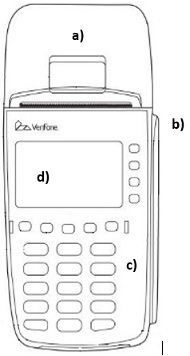

####Identificación TPV

a) Tapa Rollo Papel

b) Lector Banda Magnética

c) Teclado tipo Teléfono

d) Display

## Cambio de Rollo de Papel Térmico

<table>
	<tr>
		<td width=50%>Imagen</td>
		<td width=50%>Descripción</td>
	</tr>
		<tr>
			<td></td>
			<td> Antes de procesar transacciones que requieran un recibo o quedar registradas, deberá instalar papel en la impresora. El TPV utiliza un rollo de papel térmico de una hoja Unos 45 cm antes del final del rollo, en el borde del papel aparece una línea rosa que indica que se está por acabar el papel. Después de que aparezca esta línea, quedará suficiente papel en el rollo para terminar al menos una transacción.
		</td>
	</tr>
	<tr>
		<td>
			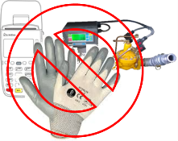
		</td>
		<td>
			Antes de operar el cualquier sistema electrónico deberá usted quitarse los guantes, ya que estos pueden dañar el equipo
		</td>
	</tr>
	<tr>
		<td colspan=2 align="center">
               Para cambiar el rollo de papel proceda como se indica continuación:	
		</td>
	</tr>
	<tr>
		<td>
			
		</td>
		<td>
			Identificación  
			a) Pestillo de la puerta de la impresora. 
			b) Tapa o cubierta de la impresora. 
		</td>
	</tr>
	<tr>
		<td>
			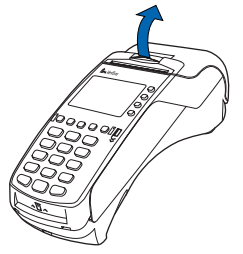
		</td>
		<td>
 			Con su dedo y con cuidado sujete por debajo del pestillo y tire hacia arriba para abrir la tapa del rollo de papel.
		</td>
	</tr>
	<tr>
		<td>
			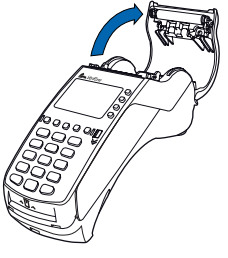
		</td>
		<td>
 			Saque el rollo de papel usado, si lo hubiere, de la bandeja de la impresora tirando de él hacia arriba.
		</td>
	</tr>
	<tr>
		<td>
			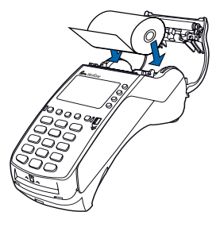
		</td>
		<td>
			a) Afloje el borde inicial quitando la banda protectora. 
			b) Desenrolle el papel hasta llegar a la parte sin residuos de pegamento. 
			c) Sujete el rollo de modo que el papel se alimente desde su parte inferior. 
			d) Deje caer el rollo de papel en la bandeja de la impresora. 
			e) Tire del papel hasta pasar la zona con residuos de pegamento. 
		</td>
	</tr>
	<tr>
		<td>
			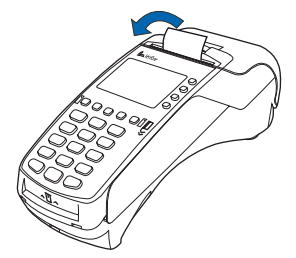
		</td>
		<td>
			a) Cierre la tapa del rollo de papel ejerciendo una ligera presión sobre ella hasta que encaje, dejando que sobresalga por la puerta de la impresora un poco de papel posterior a la zona con residuos de pegamento.  
			b) Corte el papel en la banda metálica dentada de la impresora.
		</td>
	</tr>
</table>

## Ingreso de caracteres Alfabéticos (Letras)

En general toda la operación de la terminal se realiza con caracteres numéricos de fácil acceso desde el teclado tipo telefónico. Ocasionalmente puede ser necesario ingresar algun carácter alfanumérico (por el ejemplo al ingresar una placa de vehículo), en esas ocasiones por favor siga las siguientes instrucciones:

<table>
	<tr>
		<td width=50%>Imagen</td>
		<td width=50%>Descripción</td>
	</tr>
	<tr>
		<td>
			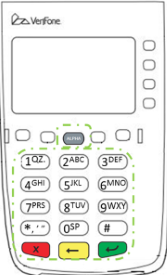
		</td>
		<td> 
			En modo normal, la tecla  [ALPHA] le permite ingresar uno de los dos o más símbolos o caracteres asignados a las teclas en el teclado de tipo "teléfono" (tenga en cuenta que esto está en modo normal y es específica de la aplicación). 
			 
			Utilice la tecla  [ALPHA] para introducir hasta 50 diferentes letras o símbolos mediante el siguiente procedimiento:
		</td>
	</tr>	
	<tr>
		<td>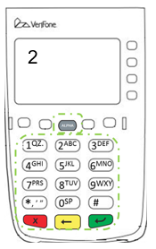</td>
		<td>
			1) Pulsar la tecla en el teclado de tipo "teléfono"  la letra deseada o símbolo, por ejemplo: para cualquiera de las siguientes [2, A, B o C] presione la tecla [2].
		</td>
	</tr>
	<tr>
		<td>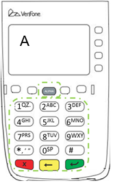</td>
		<td>
			2) Presione una vez la tecla  [ALPHA] para mostrar la primera letra, Continuando con nuestro ejemplo, pulse la tecla [2] y luego  [ALPHA] para visualizar la letra A.
		</td>
	</tr>
	<tr>
		<td>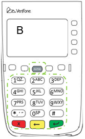</td>
		<td>
			3) Si presiona nuevamente la tecla  [ALPHA] tantas veces como sea necesario se iran mostrando los otros caracteres o letras asignados a la tecla que presiono antes de ALPHA. Por ejemplo, presione 2 para mostrar el número 2; Presione la tecla  [ALPHA] alfa una vez para mostrar la letra A, dos veces para mostrar B, o tres veces para visualizar C. Si pulsas  [ALPHA] una vez más, muestra el número 2.
		</td>
	</tr>
	<tr>
		<td>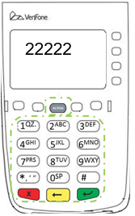</td>
		<td>
			Nota: Si mantiene presionado una de las teclas en el teclado tipo "telefónico" sin usar la tecla  [ALPHA], el mismo carácter se repite hasta que deja de presionar la tecla. Por ejemplo, si presiona 2 y lo mantiene presionado sin soltar, aparece en la pantalla "2222222..."
		</td>
	</tr>
	<tr>
		<td>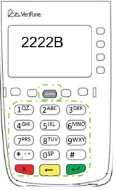</td>
		<td>
			Si dos o más caracteres aparecen en la pantalla del TPV, presionar  [ALPHA] cambia el último carácter en la línea a la siguiente letra, número o símbolo en la secuencia de teclas.
		</td>
	</tr>
</table>

## Teclas de Navegación

Durante toda la operación de la TPV se utilizan las teclas inferiores de color para Confirmar (Verde), Cancelar (Rojo) o Retroceder (Amarillo). Utilice las mismas para volver a la pantalla anterior o confirmar y pasar a la pantalla siguiente en cualquiera de los procesos de la TPV.

<table>
	<tr>
		<td width=50%>Imagen</td>
		<td width=50%>Descripción</td>
	</tr>
	<tr>
		<td></td>
		<td> 
			Utilice las teclas inferiores de color para confirmar, retroceder o cancelar en cualquiera de los flujos de la TPV.
		</td>
	</tr>
</table>

## Configuración de parámetros

Antes de empezar a operar la terminal es necesario configurar algunos parámetros. Los parametros que empiezan con un asterisco son propios del sistema operativo y no deben ser cambiados. Para cambiar los parámetros de la terminal siga estos pasos:

<table>
	<tr>
		<td width=50%>Imagen</td>
		<td width=50%>Descripción</td>
	</tr>
	<tr>
		<td>
			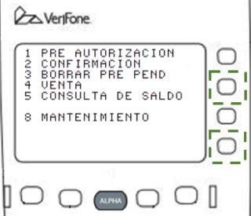
		</td>
		<td> 
			En la pantalla principal de la terminar presione los botones F2 y F4 simultaneamente
		</td>
	</tr>	
	<tr>
		<td>
			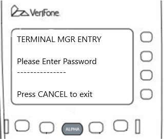
		</td>
		<td> 
			Ingrese: 284647 + enter
		</td>
	</tr>	
	<tr>
		<td>
			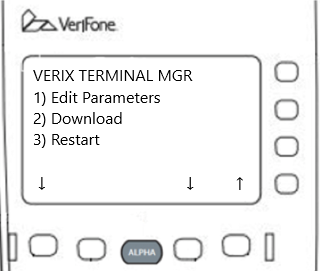
		</td>
		<td> 
			Presione 1 o navegue con las teclas F7 y F8 hasta estar sobre la opcion de editar parametros y luego presione enter.
		</td>
	</tr>	
	<tr>
		<td>
			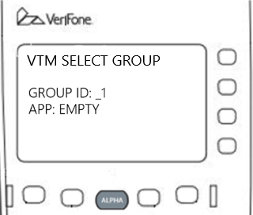
		</td>
		<td> 
			Presione Enter.
		</td>
	</tr>
	<tr>
		<td>
			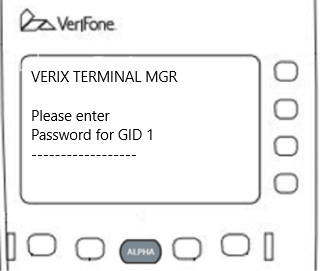
		</td>
		<td> 
			Ingrese: 284647 + enter
		</td>
	</tr>
	<tr>
		<td>
			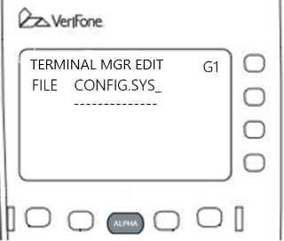
		</td>
		<td> 
			Presiona enter. Navegue con la flecha arriba y abajo los posible parametros. Seleccione el que desea modificar. La lista completa de parametros podra ser encontrada abajo.
		</td>
	</tr>

</table>

<table>
	<tr>
		<td>#TERM_LANGUAGE</td>
		<td>Determina el lenguaje de la aplicación. Los valores posible son: ENG o SPA</td>
	</tr>
	<tr>
		<td>#TERM_PASSWORD</td>
		<td>La clave de supervisor</td>
	</tr>
	<tr>
		<td>#TERM_IBUTTON</td>
		<td>Habilita el lector de iButtons. Los valores posibles son: 1 o 0</td>
	</tr>
	<tr>
		<td>#TERM_BARCODE</td>
		<td>Habilita el lector de barcode. Los valores posibles son: 1 o 0</td>
	</tr>
	<tr>
		<td>#TERM_PROXIMITY</td>
		<td>Habilita el lector de proximidad. Los valores posibles son 1 o 0</td>
	</tr>
	<tr>
		<td>#TERM_PINPAD</td>
		<td>Habilita el pinpad. Los valores posibles son 1 o 0</td>
	</tr>
	<tr>
		<td>#TERM_PINPAD_BAUDRATE</td>
		<td></td>
	</tr>
	<tr>
		<td>#TERM_PINPAD_IDLE</td>
		<td></td>
	</tr>
	<tr>
		<td>#TERM_TRACK1</td>
		<td>Habilita la impresion del track 1 en el ticket. Los valores posibles son 1 o 0</td>
	</tr>
	<tr>
		<td>#TERM_TRACK1LABEL</td>
		<td>Rotulo titulo del track 1 en el ticket</td>
	</tr>
	<tr>
		<td>#TERM_DHCP=1</td>
		<td>Habilita el DHCP. Los valores posibles son 1 o 0</td>
	</tr>
	<tr>
		<td>#TERM_IP</td>
		<td>IP de la terminal (obvia el DHCP si esto esta configurado)</td>
	</tr>
	<tr>
		<td>#TERM_SUBNETMASK</td>
		<td>Marcara de subred</td>
	</tr>
	<tr>
		<td>#TERM_GATEWAY</td>
		<td>Gateway de red</td>
	</tr>
	<tr>
		<td>#TERM_DNSPRI</td>
		<td>DNS primario</td>
	</tr>
	<tr>
		<td>#TERM_DNSSEC</td>
		<td>DNS secundario</td>
	</tr>
	<tr>
		<td>#TERM_RECEIPT_NUMBER</td>
		<td>El tipo de ticket que se imprimira en las ventas</td>
	</tr>
	<tr>
		<td>#SITE_CODE</td>
		<td>El codigo del sitio</td>
	</tr>
	<tr>
		<td>#SITE_ADDRESS</td>
		<td>La direccion del sitio</td>
	</tr>
	<tr>
		<td>#SITE_NAME</td>
		<td>El nombre del sitio</td>
	</tr>
	<tr>
		<td>#SITE_CUIT</td>
		<td>El CUIT del sitio si lo tuviera</td>
	</tr>
	<tr>
		<td>#AN_DEFAULTPROMPT</td>
		<td>Habilita el uso de prompts</td>
	</tr>
	<tr>
		<td>#AN_DRIVERID</td>
		<td>Activa el prompt de driver id</td>
	</tr>
	<tr>
		<td>#AN_VEHICLEID</td>
		<td>Activa el prompt de id de vehiculo</td>
	</tr>
	<tr>
		<td>#AN_ODOMETER</td>
		<td>Activa el prompt de odometro</td>
	</tr>
	<tr>
		<td>#AN_ENGINEHOURS</td>
		<td>Activa el prompt de horometro</td>
	</tr>
	<tr>
		<td>#AN_TRAILER</td>
		<td>Activa el prompt de trailer</td>
	</tr>
	<tr>
		<td>#AN_MISCELLANEOUS</td>
		<td>Activa el prompt de miscelaneo</td>
	</tr>
	<tr>
		<td>#AN_TRUCKUNIT</td>
		<td>Activa el prompt de truck</td>
	</tr>
	<tr>
		<td>#AN_SECONDARYTRACK</td>
		<td>Activa el prompt de secondary track</td>
	</tr>
	<tr>
		<td>#AN_PRIMARYPIN</td>
		<td>Activa el prompt de PIN primario</td>
	</tr>
	<tr>
		<td>#AN_SECONDARYPIN</td>
		<td>Activa el prompt de PIN secundario</td>
	</tr>
	<tr>
		<td>#AN_URL</td>
		<td>URL de la API Ationet. Los valores posibles pueden ser native.ationet.com , native-beta.ationet.com o native-test.ationet.com </td>
	</tr>
	<tr>
		<td>#AN_TERMINALID</td>
		<td>El id de la terminal configurado en el portal Ationet</td>
	</tr>
	<tr>
		<td>#AN_LOCALAGENT</td>
		<td>Habilita la conexion con el Local Agent. Los valores posibles son 1 o 0</td>
	</tr>
	<tr>
		<td>#AN_LAIP</td>
		<td>IP del Local Agent</td>
	</tr>
</table>

## Procedimiento Operativo

<table>
	<tr>
		<td width=50%>Imagen</td>
		<td width=50%>Descripción</td>
	</tr>
	<tr>
		<td></td>
		<td> 
			ANTES DE OPERAR EL SISTEMA ELECTRÓNICO, DEBERÁ QUITARSE LOS GUANTES, YA QUE ESTOS PUEDEN DAÑAR EL EQUIPO. 
			 
			PARA LA OPERACIÓN DE LOS EQUIPOS ELECTRÓNICOS (REGISTRO Y TERMINALES PUNTO DE VENTA) EL OPERADOR O PERSONA A MANIPULAR DEBERÁ QUITARSE LOS GUANTES PROTECTORES.
		</td>
	</tr>
	<tr>
		<td>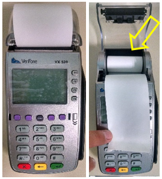</td>
		<td> 
			Antes de proceder con el despacho, valide que la terminal punto de venta tenga suficiente papel para poder imprimir los tickets, si no tiene suficiente papel revise la sección "Cambio de Rollo de Papel Térmico"
		</td>
	</tr>
	<tr>
		<td>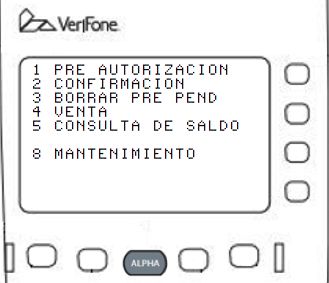</td>
		<td> 
			 Una vez encendido el equipo, la TPV muestra las opciones del Menú Principal para empezar a operar con el sistema. 
			 
			Seleccione la opción deseada siguiendo el siguiente criterio: 
			 
			
			1. Para comenzar una transacción y pedir al servidor la pre-autorización de despacho. 
			2. Una vez realizado el despacho informe al sistema el valor final de la transacción. 
			3. Si por alguna razón el cliente desistió de la operación, libere el saldo usando esta opción. 
			4. Informe una venta realizada sin pre-autorización. 
			5. Para consultar el saldo disponible antes de comenzar una transacción. 
			8. Para realizar tareas de mentenimiento. 
		</td>
	</tr>
</table>

### Pre-Autorización:
 Durante una operación normal la transacción se divide en dos operaciones. Primero se realiza una pre-autorización desde la TPV para obtener la autorización para realizar el despacho y el monto del máximo a despachar. Después de realizado el despacho se realiza la confirmación en la cual se informa el monto real entregado en la transacción. La pre-autorización implica comunicarse con el sistema central y obtener el saldo que éste autoriza. Implica también capturar dicho saldo para que no pueda ser utilizado simultáneamente desde otro lugar. Esto implica que SIEMPRE, después de una pre-autorización debe realizarse una Confirmación (opción 2 del menú) o bien Borrar Pre Pend (opción 3 del menú) para actualizar el saldo en el sistema central. Comience la Pre-autorización presionando la opción (1) en el teclado y siga las instrucciones a continuación:

<table>
	<tr>
		<td width=50%>Imagen</td>
		<td width=50%>Descripción</td>
	</tr>
	<tr>
		<td></td>
		<td> 
			Seleccione la opción 1 del Menú para realizar una pre-autorización y comenzar a operar. O presione la tecla ALPHA y tipee el identificador.
		</td>
	</tr>
	<tr>
		<td>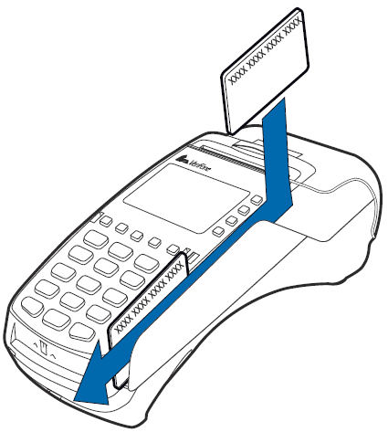</td>
		<td> 
			La tarjeta que le fue asignada al vehículo deberá usted deslizarla en la ranura lectora de la terminal de arriba hacia abajo con la banda magnética (franja café o negra) viendo hacia la pantalla del equipo, para poder iniciar la operación de despacho, al hacer esta acción la terminal solicitara ingresar datos del despacho.
		</td>
	</tr>
	<tr>
		<td>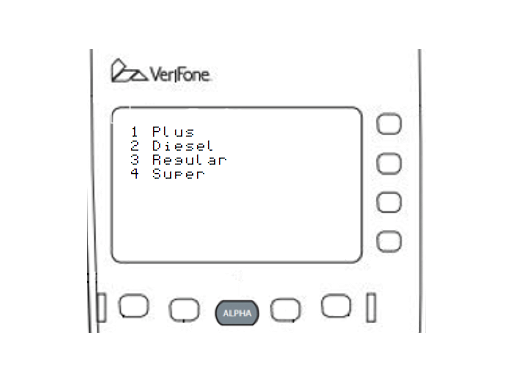</td>
		<td> 
			Seleccione el número correspondiente al producto que desea despachar.
		</td>
	</tr>
	<tr>
		<td></td>
		<td> 
			Una vez completos todos los datos la terminal mostrará el mensaje "PROCESANDO…" mientras se comunica con los sistemas centrales para pedir autorización.
		</td>
	</tr>
	<tr>
		<td>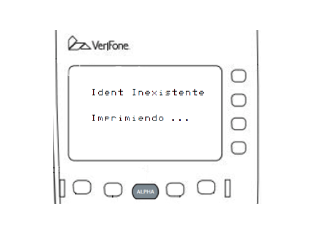</td>
		<td> 
			Si la transacción no es autorizada el sistema responderá con un mensaje de error e imprimira un ticket indicandolo. En el ejemplo: "Identificador Inexistente". Por favor refierase al anexo ERRORES al final de este documento para mas detalles.
		</td>
	</tr>
	<tr>
		<td>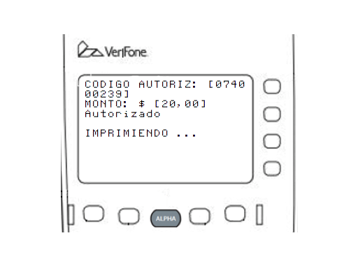</td>
		<td> 
			Si la transacción es autorizada el sistema responderá con un mensaje de confirmación como el del ejemplo e imprimrá un ticket de autorización. En el ticket se indica el monto autorizado a despachar para ese identificador en esa transacción.    
			 Proceda con el despacho siguiendo lo indicado en el ticket.
		</td>
	</tr>

</table>

### Confirmación:
 Una vez completado el despacho es NECESARIO confirmar la transacción en el sistema. Para ello debe elegir la opción 2 el menú principal y seguir las instrucciones. Comience la Confirmación presionando la opción (2) en el teclado y siga las instrucciones a continuación:

<table>
	<tr>
		<td width=50%>Imagen</td>
		<td width=50%>Descripción</td>
	</tr>
	<tr>
		<td>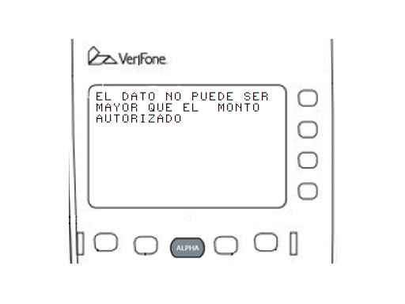</td>
		<td> 
			Recuerde que el monto despachado no puede ser mayor al monto autorizado en la pre-autorización. 
			 
			Si en la Confirmación ingresa un monto mayor al pre-autorizado recibirá un mensaje de error y la transacción NO se confirmará. 
			 
			Presione la tecla verde para volver a ingresar el monto correcto.
		</td>
	</tr>
	<tr>
		<td></td>
		<td> 
			Si los datos ingresados son correctos la operación será confirmada en el servidor. 
			 
			La pantalla mostrará el mensaje de "OPERACIÓN COMPLETADA" y la TPV imprimirá el ticket de la transacción. 
			 
			Esta primera copia del ticket es para la estación y normalmente se solicita que sea firmada por el cliente.
		</td>
	</tr>
	<tr>
		<td></td>
		<td> 
			A continuación, el TPV ofrecerá imprimir una segunda copia para el cliente. Presione la tecla verde para imprimir o la tecla roja para no hacerlo.
		</td>
	</tr>
</table>

### Borrar Pre Pendiente:
 
Si por alguna circunstancia se ha realizado una o más pre-autorizaciones y no se han realizado los despachos correspondientes, será necesario proceder a liberar el saldo de esas pre-autorizaciones para normalizar el balance de la cuenta. Para hacerlo presione la opción (3) en el menú principal y siga las siguientes instrucciones:    

<table>
	<tr>
		<td width=50%>Imagen</td>
		<td width=50%>Descripción</td>
	</tr>
	<tr>
		<td></td>
		<td> 
			El TPV solicitará que presente la identificación a la que está asociada la pre-autorización que se desea anular. O presione la tecla ALPHA y tipee el identificador. 
			 
			Deslice por el lector la misma tarjeta que utilizó para solicitar la pre-autorización.
		</td>
	</tr>
	<tr>
		<td></td>
		<td> 
			La tarjeta que le fue asignada al vehículo deberá usted deslizarla en la ranura lectora de la terminal de arriba hacia abajo con la banda magnética (franja café o negra) viendo hacia la pantalla del equipo.
		</td>
	</tr>
	<tr>
		<td></td>
		<td> 
			Una vez leida la tarjeta la terminal mostrará el mensaje "PROCESANDO..." mientras se comunica con los sistemas centrales para anular la pre-autorización.
		</td>
	</tr>
	<tr>
		<td>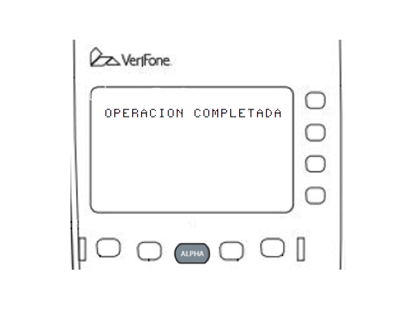</td>
		<td> 
			 Cuando el servidor haya respondido confirmando la anulación de la pre-autorización la pantalla mostrará un mensaje de confirmación. El saldo de la pre-autorización ya está disponible para ser utilizado.
		</td>
	</tr>
</table>

### Venta:
 En algunas circunstancias puede darse el caso que la venta ya se haya realizado y el despacho completado sin respetar el flujo normal de Pre-autorización y Confirmación. En ese caso para ingresar dicha venta al sistema será necesario utilizar la opción 4 del menú principal: Venta. Es importante tener en cuenta que al procesar una Venta el sistema aplicará las mismas restricciones que hubiera aplicado en una pre-autorización, por lo tanto, si se intenta ingresar una Venta por un monto, producto o volumen no autorizado para ese identificador en ese momento la Venta será rechazada. Si esto sucede será necesario comunicarse con el centro de ayuda para determinar como proceder con dicha venta. Para ingresar una venta presione la opción (4) en el menú principal y siga las siguientes instrucciones:

<table>
	<tr>
		<td width=50%>Imagen</td>
		<td width=50%>Descripción</td>
	</tr>
	<tr>
		<td></td>
		<td> 
			El TPV solicitará que presente la identificación a la que está asociada la Venta que se desea informar. O presione la tecla ALPHA y tipee el identificador. 
			 
			Deslice por el lector la tarjeta de flota.
		</td>
	</tr>
	<tr>
		<td></td>
		<td> 
			La tarjeta que le fue asignada al vehículo deberá usted deslizarla en la ranura lectora de la terminal de arriba hacia abajo con la banda magnética (franja café o negra) viendo hacia la pantalla del equipo.
		</td>
	</tr>
	<tr>
		<td></td>
		<td> 
			Una vez leida la tarjeta la terminal mostrará el mensaje "PROCESANDO…" mientras se comunica con los sistemas centrales para reportar la transacción.
		</td>
	</tr>
	<tr>
		<td></td>
		<td> 
			 Si la transacción no es autorizada el sistema responderá con un mensaje de error e imprimira un ticket indicándolo. En el ejemplo: "Identificador Inexistente". Por favor refiérase al anexo ERRORES al final de este documento para más detalles.
		</td>
	</tr>
	<tr>
		<td></td>
		<td> 
			Si los datos ingresados son correctos la operación será confirmada en el servidor. 
			 
			La pantalla mostrará el mensaje de "OPERACIÓN COMPLETADA" y la TPV imprimirá el ticket de la transacción. 
			 
			Esta primera copia del ticket es para la estación y normalmente se solicita que sea firmada por el cliente.
		</td>
	</tr>
	<tr>
		<td></td>
		<td> 
			Si la transacción es autorizada el sistema responderá con un mensaje de confirmación como el del ejemplo e imprimrá un ticket de autorización.
		</td>
	</tr>
	<tr>
		<td></td>
		<td> 
			A continuación el TPV ofrecerá imprimir una segunda copia para el cliente. Presione la tecla verde para imprimir o la tecla roja para no hacerlo.
		</td>
	</tr>
</table>

### Consulta de Saldo:
 Esta transacción permite consultar al sistema central cuál es el máximo que puede ser despachado en la siguiente transacción a un determinado identificador. Realice esta consulta cuando no este seguro los límites del vehículo involucrado para evitar realizar múltiples intentos de pre-autorización que puedan ser denegados. En caso que el saldo informado no se corresponda con el que el cliente cree tener, será necesario comunicarse con el centro de ayuda para determinar como proceder con dicha venta. Para realizar una consulta de saldo presione la opción (5) en el menú principal y siga las siguientes instrucciones:

<table>
	<tr>
		<td width=50%>Imagen</td>
		<td width=50%>Descripción</td>
	</tr>
	<tr>
		<td></td>
		<td> 
			Seleccione la opción 5 del Menú para realizar una consulta de saldo y comenzar a operar. O presione la tecla ALPHA y tipee la identificacion.
		</td>
	</tr>
	<tr>
		<td></td>
		<td> 
			La tarjeta que le fue asignada al vehículo deberá usted deslizarla en la ranura lectora de la terminal de arriba hacia abajo con la banda magnética (franja café o negra) viendo hacia la pantalla del equipo, para poder iniciar la operación de despacho, al hacer esta acción la terminal solicitará ingresar datos del despacho.
		</td>
	</tr>
	<tr>
		<td></td>
		<td> 
			Una vez leída la tarjeta, la terminal mostrará el mensaje "PROCESANDO..." mientras se comunica con los sistemas centrales para consultar el saldo.
		</td>
	</tr>
	<tr>
		<td>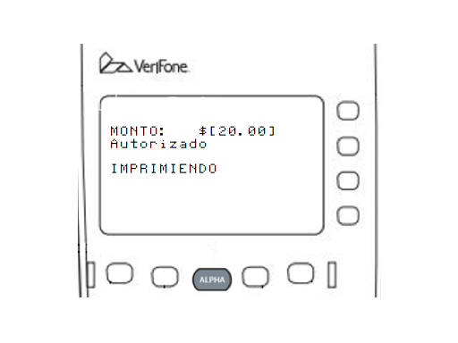</td>
		<td> 
			El Sistema responderá en pantalla con el monto máximo a despachar e imprimirá un ticket con dicha información.
		</td>
	</tr>
</table>

### Estado de Terminales

En el archivo CONFIG.SYS, existe un parametro llamado #TERM_PING. Ese parametro se puede setear en 3, 5 o 15 y simboliza cada cuantos minutos la terminal va a intentar comunicarse con ATIONet. Si se ingresa un numero que no sea 3, 5 o 15, la terminal va a intentar comunicarse cada 15 minutos. Si ATIONet recibe esa comunicacion de la terminal, se mostrara en el widget de la consola un tic al lado del codigo de dicha terminal. Si en vez de un tic, hay una cruz, eso significa que ATIONet no recibio comunicacion en las ultimas 5 horas.

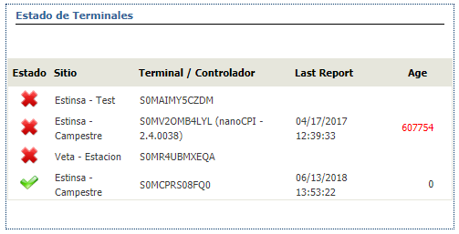

### Menú de Mantenimiento:

 El Menú de mantenimiento permite acceder a operaciones del sistema que no están directamente relacionadas con la operación transaccional del mismo. Es decir, operaciones que no se hacen con la misma frecuencia que aquellas destinadas a procesar transacciones en el sistema. En este menú encontramos cuatro opciones: 
 

1.Cierre de Lote  
2.Reimprimir Último  
3.Anular transacción  
4.Activar giftcard  
 
Para ingresar al Menú de Configuración presione la opción (8) en el menú de mantenimiento.  

<table>
	<tr>
		<td width=50%>Imagen</td>
		<td width=50%>Descripción</td>
	</tr>
	<tr>
		<td>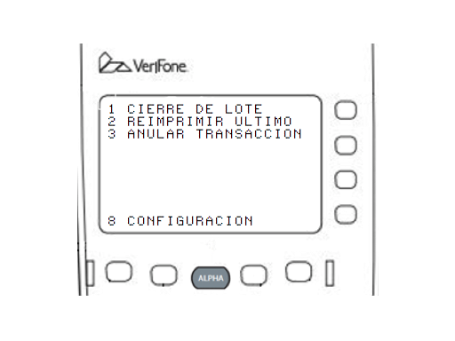</td>
		<td> 
			EL TPV solicitará que elija alguna de las siguientes opciones.
		</td>
	</tr>
</table>

### Cierre de Lote:
 Este concepto permite agrupar un conjunto de transacciones para su posterior análisis y procesamiento conjunto. Habitualmente se recomienda realizar un cierre de lote por cada cierre de turno operativo en la estación. De esta manera se pueden reconciliar fácilmente las transacciones del turno que fueron pagadas con alguno de los medios de pago procesados por ATIONET. Para hacerlo presione la opción (1) en el menú de mantenimiento y siga las siguientes instrucciones:

<table>
	<tr>
		<td width=50%>Imagen</td>
		<td width=50%>Descripción</td>
	</tr>
	<tr>
		<td>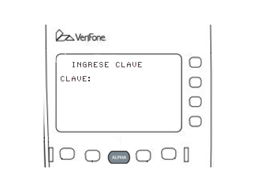</td>
		<td> 
			Para poder proceder con el cierre de lote será necesario contar con permisos de supervisor. Por favor ingrese la clave de supervisor.
		</td>
	</tr>
	<tr>
		<td></td>
		<td> 
			El TPV solicitará al Sistema Central cerrar un lote y procesará el mismo. Durante ese proceso se mostrará la pantalla de "PROCESANDO...".
		</td>
	</tr>
	<tr>
		<td></td>
		<td> 
			Al terminar el proceso la TPV mostrará un mensaje indicándolo e imprimirá el ticket de cierre de Turno.
		</td>
	</tr>
	<tr>
		<td>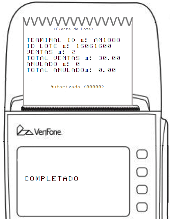</td>
		<td> 
			El ticket de Cierre de Lote incluye un número único de identificación generado por el servidor, la cantidad de transacciones procesadas desde el último cierre, el total de ventas, las anulaciones y el monto acumulado durante el período.
		</td>
	</tr>

</table>

### Reimprimir Último:
 Si por alguna circunstancia fuera necesario volver a imprimir el último ticket emitido (tipicamente cuando se trabó el papel de la impresora), esto puede ser realizado desde esta opción del menú. Para hacerlo presione la opción (2) en el menú de mantenimiento y siga las siguientes instrucciones:    

<table>
	<tr>
		<td width=50%>Imagen</td>
		<td width=50%>Descripción</td>
	</tr>
	<tr>
		<td>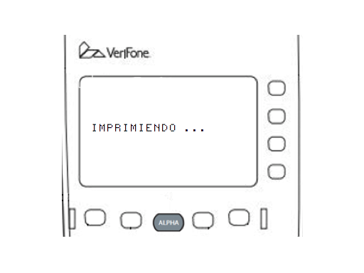</td>
		<td> 
			El TPV imprimirá automáticamente una copia del último ticket emitido. No es posible re-imprimir ningún otro ticket.
		</td>
	</tr>
	<tr>
		<td></td>
		<td> 
			A continuación el TPV ofrecerá imprimir una segunda copia para el cliente. Presione la tecla verde para imprimir o la tecla roja para no hacerlo.
		</td>
	</tr>
</table>

### Anular Transacción:
 Si se comete un error al procesar una transacción en el sistema y aún no se ha cerrado el turno, puede utilizarse esta opción para anular la misma y volver a procesarla correctamente.Para hacerlo presione la opción (3) en el menú de mantenimiento y siga las siguientes instrucciones: 

<table>
	<tr>
		<td width=50%>Imagen</td>
		<td width=50%>Descripción</td>
	</tr>
	<tr>
		<td>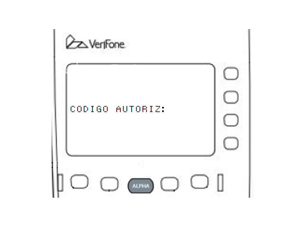</td>
		<td> 
			El TPV solicitará el ingreso del código de la transacción que se desea anular. Puede encontrar el código de autorización en el ticket correspondiente a la misma. Presione la tecla verde para procesar la anulacion.
		</td>
	</tr>
	<tr>
		<td></td>
		<td> 
			El TPV solicitará al Sistema Central anular la transacción. Durante ese proceso se mostrará la pantalla de "PROCESANDO...".
		</td>
	</tr>
	<tr>
		<td></td>
		<td> 
			Al terminar el proceso de anulación correctamente la TPV mostrará un mensaje indicándolo e imprimirá un ticket de confirmación o uno de error si el proceso hubiera fallado.
		</td>
	</tr>
</table>

### Activar Giftcard

Para activar una giftcard, elija la opcion 4 en el menu de mantenimiento. Luego de eso, la terminal le pedira la contraseña del administrador. Ingrese la contraseña y despues deslice la tarjeta por el lector.

## Menú de Configuración:
 El Menú de Configuración permite acceder a funciones de programación de parámetros de la TPV. Estas operaciones no son habituales y requieren en todos los casos clave de Supervisor. En este menú encontramos tres opciones: 
 
1) Clave Supervisor 
2) Otros Productos 

Para ingresar al menu de informacion de la app, presione la tecla 8.

### Clave Supervisor:
 Si desea cambiar la Clave de Supervisor asignada presione la tecla (1) en el Menú de Configuración y siga las siguientes instrucciones:  

<table>
	<tr>
		<td width=50%>Imagen</td>
		<td width=50%>Descripción</td>
	</tr>
	<tr>
		<td></td>
		<td> 
			Ingrese la clave actual para poder ejecutar esta opción. Presione la tecla verde para confirmar.
		</td>
	</tr>
	<tr>
		<td>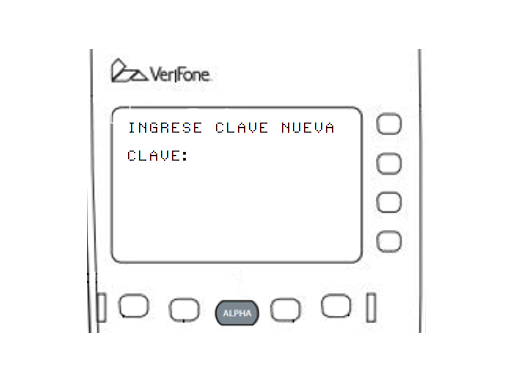</td>
		<td> 
			Ingrese la nueva clave y presione la tecla verde para confirmar.
		</td>
	</tr>
	<tr>
		<td></td>
		<td> 
			Al terminar el proceso de cambio de clave correctamente la TPV mostrará un mensaje de confirmación o uno de error si el proceso hubiera fallado.
		</td>
	</tr>
</table>

### Otros Productos:
 ATIONET permite trabajar también con productos no combustibles como aditivos, lubricantes, productos secos e incluso adelantos de efectivo. Para poder enviar al Servidor Central transacciones de autorización por estos productos primero hay que crear los mismos en el maestro de productos del TPV y asignarles un código de equivalencia con el código centralizado que se utiliza para ese producto a nivel de red. 
  
 Para dar de alta, modificar o borrar dichos productos a nivel TPV será necesario ingresar a la opción 2 del menú de configuración y mantener desde allí el maestro de otros productos. Es importante resaltar que esta modalidad de servicio depende de que la red a nivel central este configurada para aceptar estos productos y que se conozcan con precisión las equivalencias entre los productos locales en la estación y sus pares centrales a nivel de red.  
  
 Si desea crear, modificar o borrar alguno de estos productos presione la tecla (2) en el menú de configuración y siga las siguientes instrucciones:

<table>
	<tr>
		<td width=50%>Imagen</td>
		<td width=50%>Descripción</td>
	</tr>
	<tr>
		<td>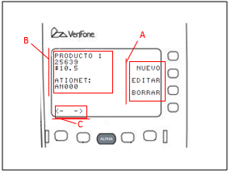</td>
		<td> 
			Al seleccionar la opción Otros Productos se desplegará una pantalla como la del ejemplo. En ella se pueden ver los datos del primer producto del catálogo y las teclas de opción para crear, editar y borrar productos así como las que permiten hacer scroll entre los productos: 
			 
			A. Teclas para Crear, Editar o Borrar 
			B. Datos del producto activo del catálogo 
			C. Teclas de scroll entre productos 
		</td>
	</tr>
</table>

### Crear Nuevos Productos:
 Para crear un nuevo producto en el catálogo local presione la tecla lateral de la pantalla correspondiente y sigas las siguientes instrucciones:  

<table>
	<tr>
		<td width=50%>Imagen</td>
		<td width=50%>Descripción</td>
	</tr>
	<tr>
		<td></td>
		<td> 
			Al presentarse la pantalla de Ingreso de Nuevo Nombre por favor escriba el nombre con que quiere identificar al mismo. Refierase al apartado ingreso de valores alfanuméricos de este manual para recordar como ingresar este tipo de datos. Cuando haya terminado presione la tecla verde para confirmar y continuar.
		</td>
	</tr>
	<tr>
		<td></td>
		<td> 
			Al presentarse la pantalla del código de producto, por favor ingrese el código con que quiere identificar al mismo. Refierase al apartado ingreso de valores alfanuméricos de este manual para recordar como ingresar este tipo de datos. Cuando haya terminado presione la tecla verde para confirmar y continuar.
		</td>
	</tr>
	<tr>
		<td>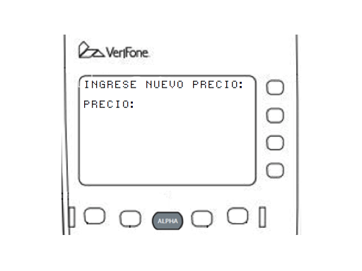</td>
		<td> 
			Al presentarse la pantalla de Ingreso de Nuevo Precio por favor escriba el Precio de Venta del producto. Cuando haya terminado presione la tecla verde para confirmar y continuar.
		</td>
	</tr>
	<tr>
		<td>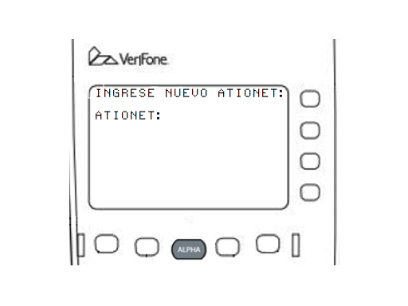</td>
		<td> 
			Al presentarse la pantalla de Ingreso de ATIONET por favor escriba el código de producto con que éste se identifica en la Red. Refierase al apartado ingreso de valores alfanumericos de este manual para recordar como ingresar este tipo de datos Cuando haya terminado presione la tecla verde para confirmar. El producto ha sido creado en el catálogo local.
		</td>
	</tr>
</table>

### Editar Productos:
 Para editar un producto en el catálogo local haga scroll con las teclas inferiores hasta que el producto a modificar se vea en pantalla y luego presione la tecla lateral de la pantalla correspondiente y sigas las instrucciones siguientes:

<table>
	<tr>
		<td width=50%>Imagen</td>
		<td width=50%>Descripción</td>
	</tr>
	<tr>
		<td>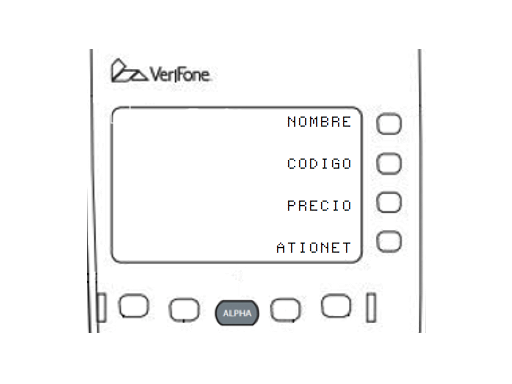</td>
		<td> 
			Al presentarse la pantalla de Edición de producto por favor elija el campo que desea editar utilizando las teclas laterales. Recuerde que el producto a editar debe ser elegido antes de presionar Editar en el paso anterior.
		</td>
	</tr>
	<tr>
		<td></td>
		<td> 
			Ingrese el nuevo valor para el campo editado siguiendo las mismas instrucciones que en la creación de producto. En el ejemplo: campo precio. Cuando haya terminado presione la tecla verde para confirmar.
		</td>
	</tr>
</table>

### Borrar Productos:
 Para borrar un producto en el catálogo local haga scroll con las teclas inferiores hasta que el producto a modificar se vea en pantalla y luego presione la tecla lateral de la pantalla. Al presionar la tecla lateral el producto que se ve en pantalla es borrado de forma definitiva. VERIFIQUE SIEMPRE ESTAR SOBRE EL PRODUCTO CORRECTO ANTES DE PRESIONAR BORRAR:

<table>
	<tr>
		<td width=50%>Imagen</td>
		<td width=50%>Descripción</td>
	</tr>
	<tr>
		<td>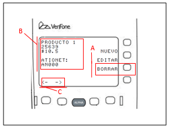</td>
		<td> 
			Para borrar un producto utilice las teclas de scroll (C) hasta que en el sector (B) se vea el producto que se desea borrar. Solo entonces presione la tecla Borrar (A)
		</td>
	</tr>
</table>

### Informacion de la app
 En este menu usted puede consultar los datos de la terminal, del sitio y de la comunicacion. Tambien puede imprimir un ticket con la informacion de la terminal presionando la tecla F8 (la de mas a la derecha) en cualquiera de las tres pantallas.

<table>
	<tr>
		<td width=50%>Imagen</td>
		<td width=50%>Descripción</td>
	</tr>
	<tr>
		<td>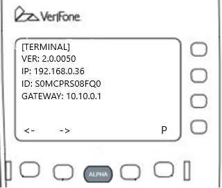</td>
		<td> 
			En esta pantalla, se muestra la version de la terminal, la IP de la terminal, el ID de la terminal y el gateway de la terminal. Para cambiar de pantalla presione la tecla F5 o F6.
		</td>
	</tr>
	<tr>
		<td>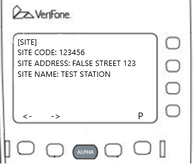</td>
		<td> 
			En esta pantalla, se muestra el codigo del sitio, la direccion del sitio y el nombre del sitio. Para cambiar de pantalla presione la tecla F5 o F6.
		</td>
	</tr>
	<tr>
		<td>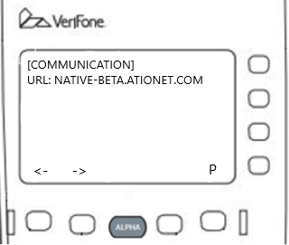</td>
		<td> 
			En esta pantalla, se muestra la URL a la cual apunta la terminal. Para cambiar de pantalla presione la tecla F5 o F6.
		</td>
	</tr>
	<tr>
		<td></td>
		<td>
			El ticket de informacion de terminal se puede obtener presionando la tecla F8, que es la que se encuentra abajo de la P que aparece en pantalla. El ticket se imprimira mostrando la fecha y la hora, y luego la informacion de terminal, sitio y comunicacion.
		</td>
	</tr>
</table>

