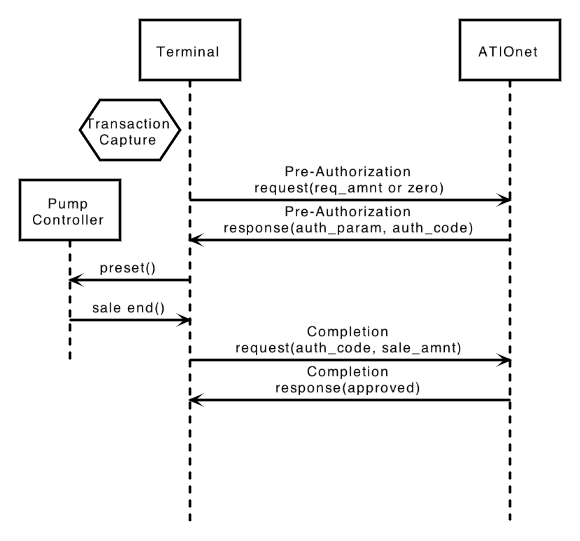
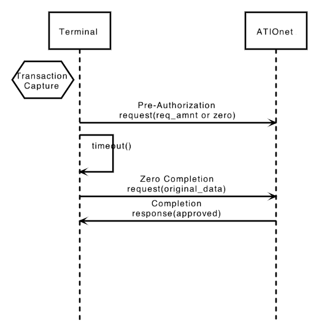
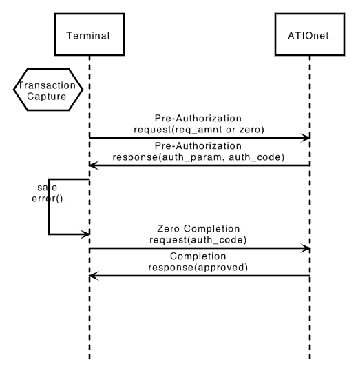
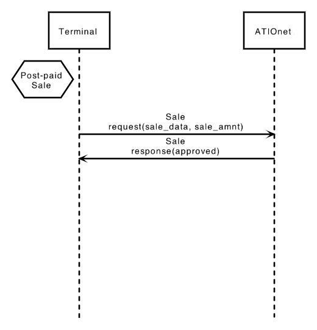
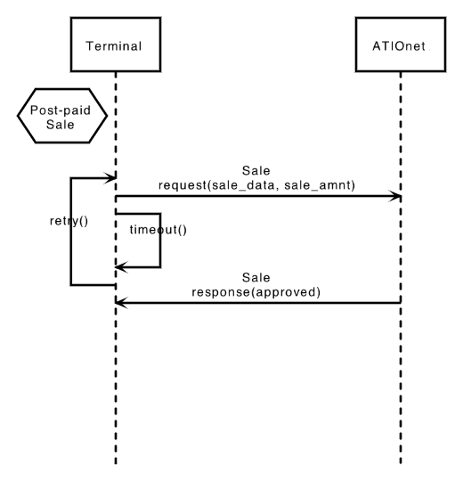
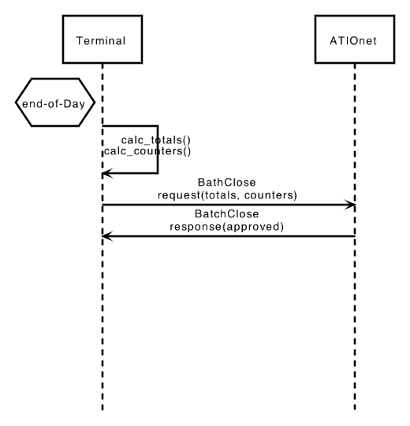
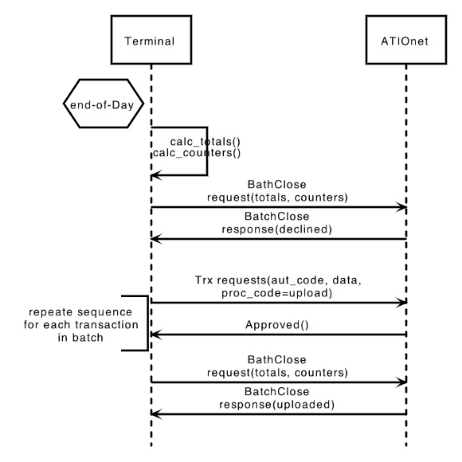

 
# ATIOnet Transaction Flows

> **About:** This document describes the typical interactions between a transaction Capture System and ATIOnet's Host. This information is based on the ATIOnet Native Transaction Protocol.   	
The information contained here is complementary of the Protocol manuals and it is provided under the assumption that the Capture System has at least the minimum set of capabilities required to process the described transactions.

<table>
	<thead>
		<tr>
			<td colspan="2" class="tablehead">Document Information</td>
		</tr>
	</thead>
	<tbody>
		<tr>
			<td width="20%" class="rowhead" align="right">File:</td>
			<td>AN-Transaction_Flows-TechGuide.md</td>
		</tr>
		<tr>
			<td align="right">Doc. Version:</td>
			<td>1.0</td>
		</tr>
		<tr>
			<td align="right">Release Date:</td>
			<td>20/July/2014</td>
		</tr>
		<tr>
			<td align="right">Author:</td>
			<td>ATIO International LLC</td>
		</tr>
	</tbody>
</table>

<table>
     <thead>
          <tr>
          	<td colspan="3">Change Log</td>
          </tr>
     </thead>
     <tbody>
        <tr>
          	<td>Ver.</td>
            <td>Date</td>
            <td>Change summary</td>
        </tr>
        <!-- Insert a table row like this for each version -->
        <tr>
          	<td>1.0</td>
          	<td>20/July/2014</td>
          	<td>Initial version</td>
        </tr>
        <!-- End of version table row -->
     </tbody>
</table>
 

### Contents
<!-- MarkdownTOC depth=3 -->

- Definitions
- Scope
- Pre-Authorization & Completion
- Post-paid Sale
- Refunds
- Batch Close

<!-- /MarkdownTOC -->

<!-- Optional Terms & Definition section -->
        
### Definitions	

<dl>
  <dt>Terminal</dt>
  <dd>System or Device installed at the site responsible to perform the payment or purchase transaction capture and to communicate with ATIOnet</dd>
  <dt>Regular Flow</dt>
  <dd>The standard interaction between both actors when all pre and post conditions are met and no errors occurs</dd>
  <dt>Alternative Flow</dt>
  <dd>A non-standard interaction resulting of an error condition or some other unexpected exception</dd>
</dl>

<!-- Content starts here -->
## Scope
This document comments the interactions between Terminal and ATIOnet, Regular and Alternative flows for the following operations:

- **Pre-Authorization & Completion**: Two steps operation typically used on fuel sales; may also include dry goods.
- **Post-paid Sale and Refunds**: Regular POS Sale
- **Batch Close**: End-of-shift or End-of-day batch close operation, used to group the transactions of a period. Includes Batch Upload alternative. 

>NOTE: Only main Alternative Flows that worth mentioning are included.

## Pre-Authorization & Completion
<table>
	<tr>
		<td colspan="2" align="left">Regular flow</td>
	</tr>
	<tr>
		<td width=50%>
			
		</td>
		<td>After a local process of capturing transaction and card data, the Terminal sends a Pre-Authorization request to ATIOnet. Request may include an amount or volume and product code; zero requests are also allowed.  On Response, ATIOnet sends the authorized amount or volume, authorized product and Authorization Code, which must be reserved and re-sent on the Completion Request. After fuel sale is complete, the Terminal sends a Completion with the actual value and data of the sale, including the Authorization Code received on the Pre-Auth response.  Authorization Code is the key to recover the pre-authorization on ATIOnet, and therefore no Completion would be accepted without a valid AuthCode.</td>
	</tr>
	<tr>
		<td colspan="2" align="left">Alternative - Pre-Authorization Failure</td>
	</tr>
	<tr>
		<td width=40%>
			
		</td>
		<td>In case the Terminal does not receive a Pre-authorizaton response from ATIOnet, approved or declined, the Terminal must send a Zero Completion request to ATIOnet. A Zero Completion is a regular with zero values.  As the Pre-Authorization response was never received, and the AuthCode is unknown, the Terminal must include a structure with part of the Pre-Auth request data called OriginalData  Terminal may then automatically retry the Pre-Authorization or completely fail the transaction and run a new capture flow. </td>
	</tr>
	<tr>
		<td colspan="2" align="left">Alternative - Sale fails</td>
	</tr>
	<tr>
		<td width=40%>
			
		</td>
		<td>When the sale process fails or is cancelled before reaching the point to send the Completion, a Zero Completion must be sent to release the balance retention set by the Pre-Auth.  In this case, as the Pre-Auth was received, the Zero Completion would use the AuthCode instead of the OriginalData</td>
	</tr>
	<tr>
		<td colspan="2" align="left">Alternative - Completion Retries</td>
	</tr>
	<tr>
		<td width=40%>
			
		</td>
		<td>When the Terminal fails to get a response a Completion request, this must be retried; there is no maximum number of retries from ATIOnet side. ATIONet will process the requirement only once and will automatically repeat the same response to any following request with the same TSN and AuthCode coming from the same Terminal.   When a Completion request is successfully processed, ATIOnet assignes the Completed status, and when is responded the status is changed to Confirmed. Transactions Completed (not sent), are shown on the Exceptions Report, because the Host can't confirm that the Terminal received them correctly.</td>
	</tr>

</table>

## Post-paid Sale
<table>
	<tr>
		<td colspan="2" align="left">Regular flow</td>
	</tr>
	<tr>
		<td width=50%>
			
		</td>
		<td>Once the Terminal reached the Totalize step of the sale transaction, sends a Sale request to ATIOnet. ATIOnet answer with a HTTP Response</td>
	</tr>
	<tr>
		<td colspan="2" align="left">Alternative - Response failure and retry</td>
	</tr>
	<tr>
		<td width=40%>
			
		</td>
		<td>In case the Terminal doesn't receive the response from ATIOnet, approved or declined, it may retry following its own business rules.   If the Sales request was already received and processed, ATIOnet will keep repeating the same response message to each request with the same TSN sent by the Terminal.</td>
	</tr>
</table>

## Refunds
Refunds proceed exactly in the same way than a Post-paid Sale transaction, Regular and Alternative flows.

## Batch Close
<table>
	<tr>
		<td colspan="2" align="left">Regular flow - Batch Close</td>
	</tr>
	<tr>
		<td width=50%>
			
		</td>
		<td>Batch Close is not mandatory in ATIOnet, its use and opportunity depends on the integration process with each Terminal, or its use is up to the end-user.  Batch Close message sends counters and totalizers for each type of transaction sent by the Terminal. Triggered by the message, ATIOnet processes its own counters and totalizers and Approves the Batch or Declined with or without the instruction to perform a Batch Upload, this will depend on the Terminal type configured for the site.</td>
	</tr>
	<tr>
		<td colspan="2" align="left">Alternative - Batch Close with Batch Upload</td>
	</tr>
	<tr>
		<td width=40%>
			
		</td>
		<td>In case the Terminal's figures don't match ATIOnet's calculations and an Upload is required, the Terminal must re-send requests for each transaction included in the failed Batch. Transactions must be sent with a ProcessingCode indicating that is a BatchUpload. All firm transactions must be sent: Completions, Sales and Refunds, both Approved and Declined. Pre-Authorization are not accepted.  New transactions from the next (current) batch can be sent during a Batch Upload sequence.  Batch Upload sequence ends with a new Batch Close message (retry of the rejected original). ATIOnet will always approve this Batch with a special response code "Approved pending review"</td>
	</tr>
</table>

	