 
# ATIOnet Views & Reports User Guide

> **About:** This document lists the full catalog of Views and Reports available on ATIOnet. For information about Administrative resources please check the Administrative Guides, the focus of this document is data reporting.

</br>

<table>
	<thead>
		<tr>
			<td colspan="2" class="tablehead">Document Information</td>
		</tr>
	</thead>
	<tbody>
		<tr>
			<td width="20%" class="rowhead" align="right">File:</td>
			<td>AN-Views_Catalog-UserGuide</td>
		</tr>
		<tr>
			<td align="right">Doc. Version:</td>
			<td>1.0</td>
		</tr>
		<tr>
			<td align="right">Release Date:</td>
			<td>01/Oct/2014</td>
		</tr>
		<tr>
			<td align="right">Author:</td>
			<td>ATIO International LLC</td>
		</tr>
	</tbody>
</table>

<table>
     <thead>
          <tr>
          	<td colspan="3">Change Log</td>
          </tr>
     </thead>
     <tbody>
        <tr>
          	<td>Ver.</td>
            <td>Date</td>
            <td>Change summary</td>
        </tr>
        <!-- Insert a table row like this for each version -->
        <tr>
          	<td>1.0</td>
          	<td>01/Oct/2014</td>
          	<td>Initial Version</td>
        </tr>
        <!-- End of version table row -->
     </tbody>
</table>
</br>

### Contents
<!-- MarkdownTOC depth=3 -->

- Overview
	- Named Filters
	- Use of list views
- Views
	- Transactions View
	- Aggregated Transaction Views
	- Outstanding Authorizations
	- Exceptions View
	- Current Accounts Views
	- Vehicles View (Network Users Version)
- Reports
	- Lists Reports
	- Vehicle Activity

<!-- /MarkdownTOC -->


<!-- Optional Terms & Definition section -->
        

<!-- Content starts here -->

## Overview
ATIOnet implements two types of reporting-oriented resources:

<dl>
	<dt>Views</dt>
	<dd>Views are web pages reports designed to be consumed directly from the screen instead of on print form. Views can be exported as MS-Excel files.
	<dt>Reports</dt>
	<dd>Reports are designed and implemented to be used on a hard-copy, and are oriented to fulfill the needs to archive specific views of data to comply with internal or external administrative requirements. Unlike Views, Reports may contain more complex data organization and subclassifications, for example subtotals breaks and grouping</dd>
</dl> 

### Named Filters
Any search criteria on any on-screen view in ATIOnet can be saved as a named filter. Filters not only let reuse previous search criteria, but also work as a user-defined site navigation tool, users can jump from anywhere on the site to the target view selecting the desired filter from the ```My Filters``` list. Saved Filters can be private, or shared with other users.

### Use of list views
List views have a consistent look and behavior to ease the operation of the site:

- The New link quits the list view and opens a new form to add a new record to the list. (only apply to some Lists views)
- You can select a Condesed or Detailed view with the control butons over the list's headings, next to the "New" link
- Check for column headings that can order the list
- The check marks on the left of the list allow to select multiple records -or all- to perform a Bulk Action
- The Options group of icons let you perform direct operations on the listed item. Usually Edit, Delete and mark as a Favorite
- Long lists will be split into pages, check the Current Page, Total of Pages and the navigation buttons displayed at the beginning and end of each page view

> **Note** Availability of the following features is subject to the user security role, the related entity and subscription type. Please refer to the About ATIOnet Document for details about subscription models and Actors for each model. 

## Views

### Transactions View
<table>
	<tr>
		<td align="right">Use:</td>
		<td>List Transactions. </br> Merchant's version does not include cardholder or other end-customer data</td>
	</tr>
	<tr>
		<td width="15%" class="rowhead" align="right">Subscriptions:</td>
		<td>Network, Retail, Homebase</td>
	</tr>
	<tr>
		<td align="right">Acessible to:</td>
		<td>Fleet Companies, Merchants, Subscribers</td>
	</tr>
	<tr>
		<td colspan="2">
			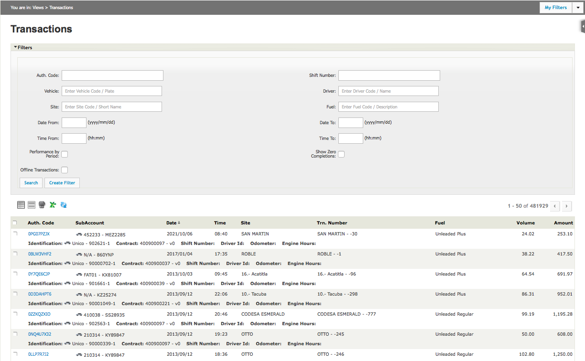
		</td>
	</tr>
</table>

### Aggregated Transaction Views
<table>
	<tr>
		<td align="right">Use:</td>
		<td>List Transactions with one or more aggreation criteria. </br> In addition to main aggregation criteria, other Group By fields may also add further level of aggregation. Merchant's only have By Site Version </br>
			Versions: By Vehicle, By Site, By Driver, By Fleet, By Merchant</td>
	</tr>
	<tr>
		<td width="15%" class="rowhead" align="right">Subscriptions:</td>
		<td>Network, Retail, Homebase</td>
	</tr>
	<tr>
		<td align="right">Acessible to:</td>
		<td>Fleet Companies, Merchants, Subscribers</td>
	</tr>
	<tr>
		<td colspan="2">
			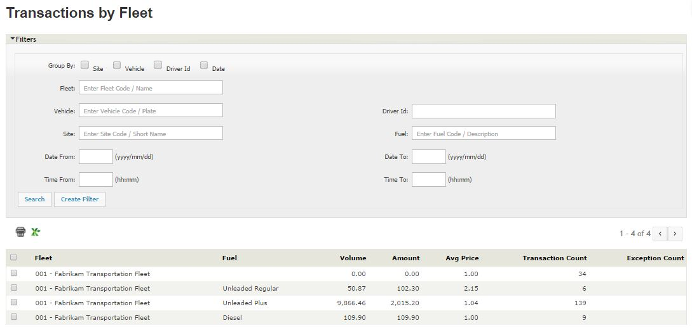
		</td>
	</tr>
	<tr>
		<td colspan="2"></td>
	</tr>
	<tr>
		<td colspan="2">
			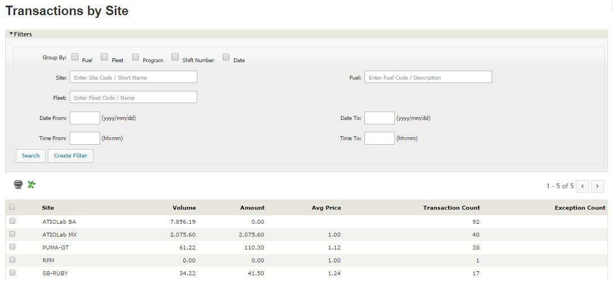
		</td>
	</tr>
	<tr>
		<td colspan="2"></td>
	</tr>
	<tr>
		<td colspan="2">
			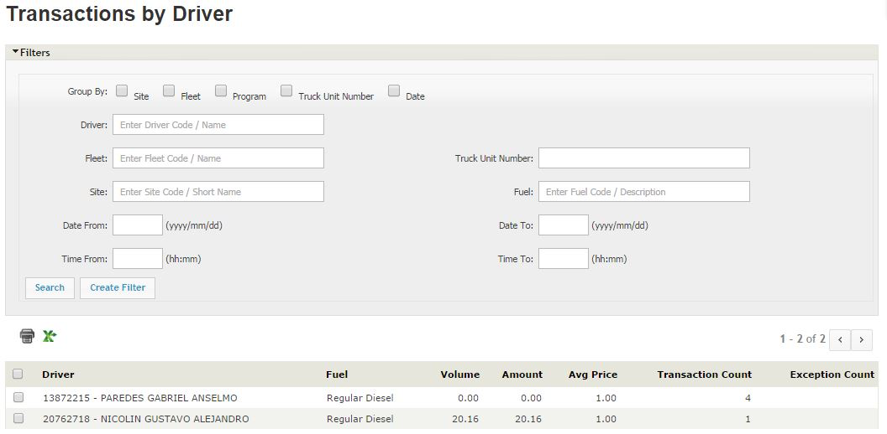
		</td>
	</tr>
	<tr>
		<td colspan="2"></td>
	</tr>
	<tr>
		<td colspan="2">
			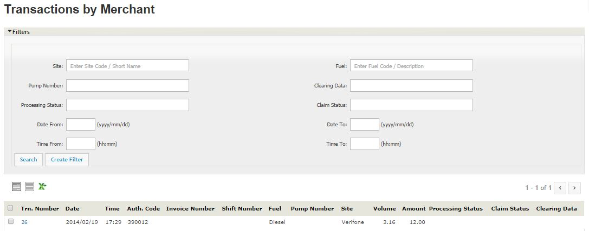
		</td>
	</tr>
	<tr>
		<td colspan="2"></td>
	</tr>
	<tr>
		<td colspan="2">
			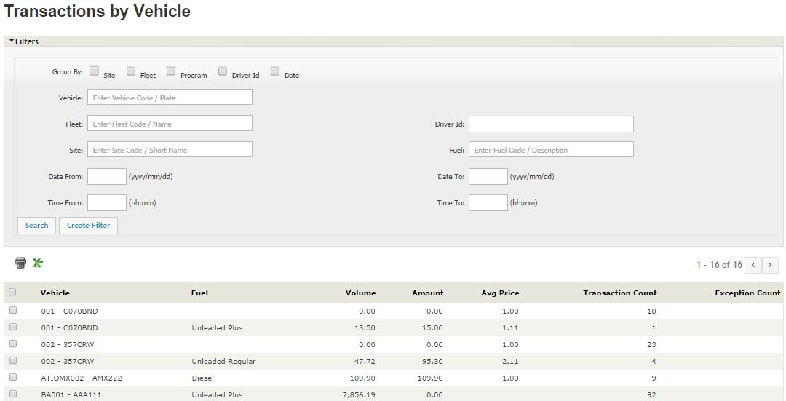
		</td>
	</tr>
</table>

### Outstanding Authorizations
<table>
	<tr>
		<td align="right">Use:</td>
		<td>List issued Pre-authorizations that are not yet completed. Each record represent a Balance Reserve. Usually  Outstanding Authorization point to on-going fuelings on a site, but holding records may indicate some level of problem, like cancelled fuelings or a site that went offline during a sale. </br> Authorized users can kill an outstanding authorization from this screen, triggering a Balance Reserve Reversal on the customer's account (releasing the blocked balance).</td>
	</tr>
	<tr>
		<td width="15%" class="rowhead" align="right">Subscriptions:</td>
		<td>Network, Retail, Homebase</td>
	</tr>
	<tr>
		<td align="right">Acessible to:</td>
		<td>Subscribers</td>
	</tr>
	<tr>
		<td colspan="2">
			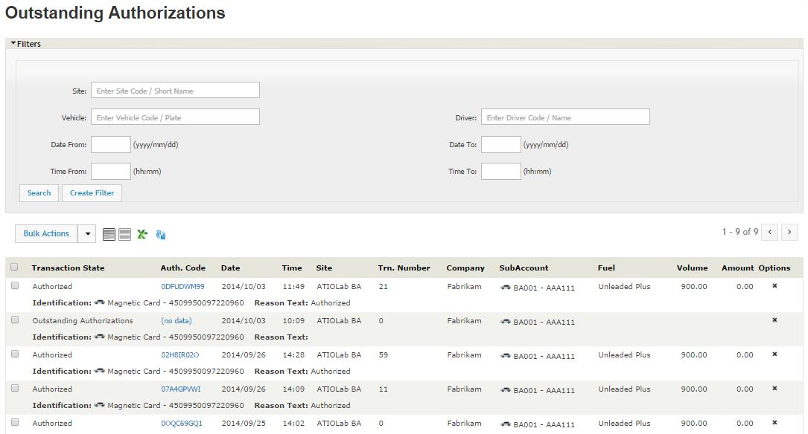
		</td>
	</tr>
</table>

### Exceptions View
<table>
	<tr>
		<td align="right">Use:</td>
		<td>Exceptions are transaction requests rejected or declined by the host. Excepction records can be filtered by type. </br> A particular type of exception is "To be Reviewed". This status flag transactions with minor failures that could be manually reviewed and approved/rejected by an authorized user.</td>
	</tr>
	<tr>
		<td width="15%" class="rowhead" align="right">Subscriptions:</td>
		<td>Network, Retail, Homebase</td>
	</tr>
	<tr>
		<td align="right">Acessible to:</td>
		<td>Subscribers</td>
	</tr>
	<tr>
		<td colspan="2">
			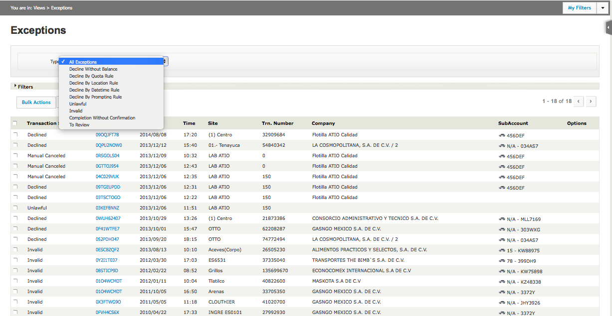
		</td>
	</tr>
</table>

### Current Accounts Views
<table>
	<tr>
		<td align="right">Use:</td>
		<td>List accounting movements and balances with different level of detail. </br> There are four sub-views: </br>
			Contract List: Displays current balance for each fleet-company contract on the filter scope </br>
			SubAccount List: Displays current balance for each card-holder on the selected contract </br>
			Contract Movements: List of the current account posts on the selected contract </br>
			SubAccount Movements: List of the current account posts on the selected card-holder </br> </br>
			NOTE: Transactions differ from Current Account Movements in several ways. Every transaction posts at least one CA movement but other operations like payments and balance transfer between subaccounts or between the contract and its subaccounts (cardholder's individual account) also post CA movement. Also, some transactions like a Pre-authorization/Completion pair post temporary CA movements to block balance until the completion is received and processed. Additionaly, the CA movement may show the contract price for the customer and/or Merchant, instead of the pump price that would be displayed on the Transaction View. </br> </br>
			NOTE 2: Merchants users will see their own Merchant CA, instead of the fleet companies ones. Sub-account versions of the views are not available to this users.
		</td>
	</tr>
	<tr>
		<td width="15%" class="rowhead" align="right">Subscriptions:</td>
		<td>Network, Retail</td>
	</tr>
	<tr>
		<td align="right">Acessible to:</td>
		<td>Fleet Companies, Merchants, Subscribers</td>
	</tr>
	<tr>
		<td colspan="2">
			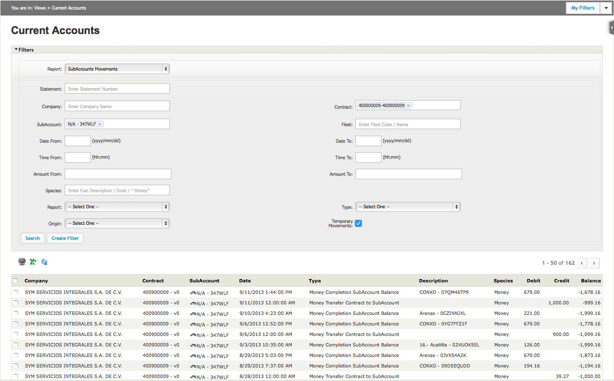
		</td>
	</tr>
	<tr>
		<td colspan="2"></td>
	</tr>
	<tr>
		<td colspan="2">
			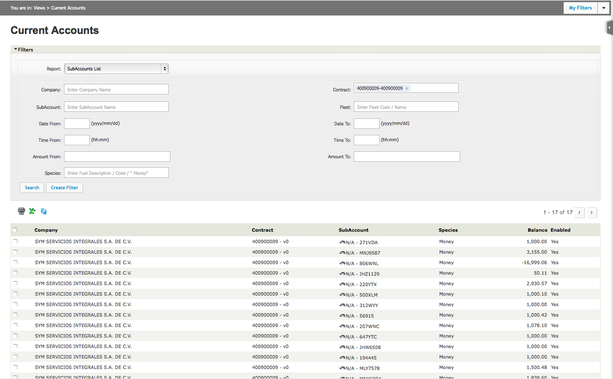
		</td>
	</tr>
	<tr>
		<td colspan="2"></td>
	</tr>
	<tr>
		<td colspan="2">
			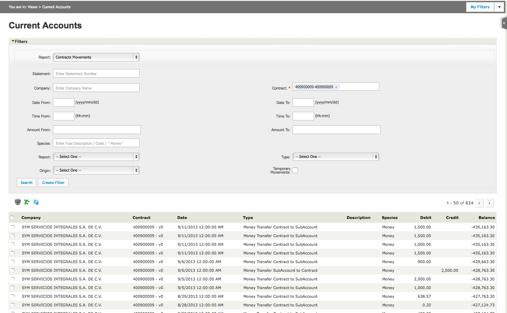
		</td>
	</tr>
	<tr>
		<td colspan="2"></td>
	</tr>
	<tr>
		<td colspan="2">
			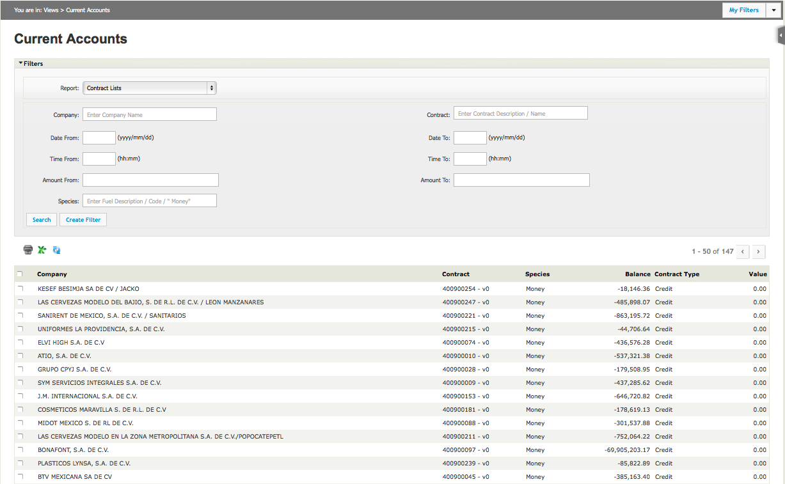
		</td>
	</tr>
</table>

### Vehicles View (Network Users Version)
<table>
	<tr>
		<td align="right">Use:</td>
		<td>As the Vehicles administration belongs to the Fleet Company domain, a Network (subscriber) user doesn't have access to the complete information of the Fleet's configuration.</br> The Vehicles View for Network users provides basic information about customer's vehicles without giving access to administration features available on the Company's version.</td>
	</tr>
	<tr>
		<td width="15%" class="rowhead" align="right">Subscriptions:</td>
		<td>Network, Retail, Homebase</td>
	</tr>
	<tr>
		<td align="right">Acessible to:</td>
		<td>Subscribers</td>
	</tr>
	<tr>
		<td colspan="2">
			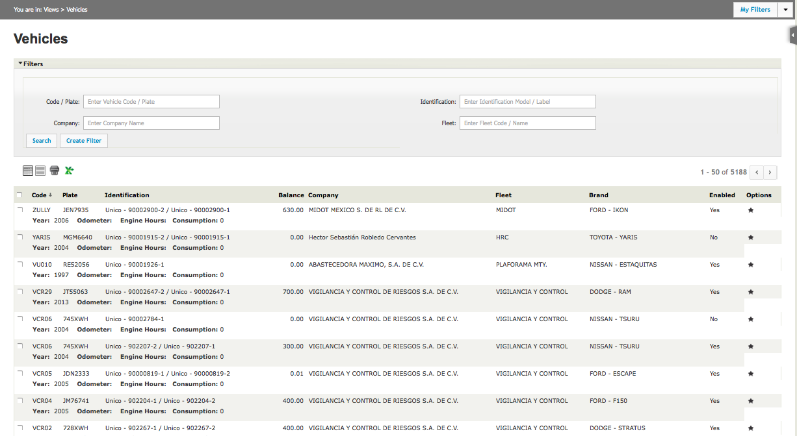
		</td>
	</tr>
</table>

## Reports

### Lists Reports
<table>
	<tr>
		<td align="right">Use:</td>
		<td>Provide printer-friendly version of: </br>
			Vehicles </br>
			Drivers </br>
			Sites </br>
			Transactions by Site </br>
		</td>
	</tr>
	<tr>
		<td width="15%" class="rowhead" align="right">Subscriptions:</td>
		<td>Network, Retail, Homebase</td>
	</tr>
	<tr>
		<td align="right">Acessible to:</td>
		<td>Subscribers, Companies</td>
	</tr>
	<tr>
		<td colspan="2">
			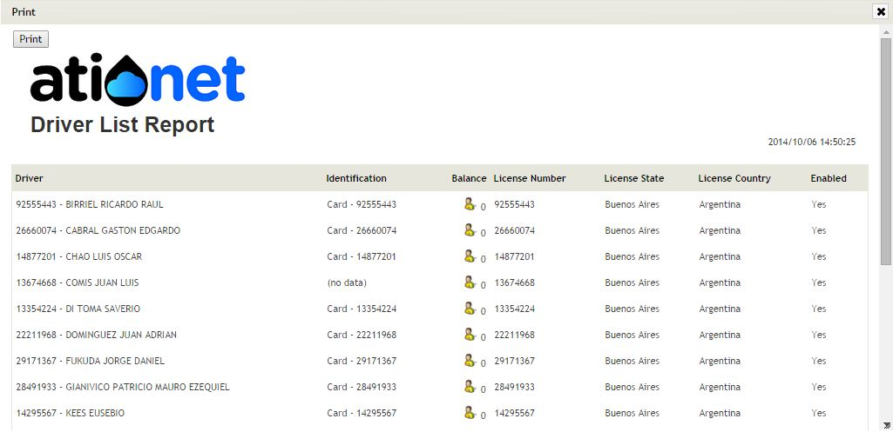
		</td>
	</tr>
	<tr>
		<td colspan="2"></td>
	</tr>
	<tr>
		<td colspan="2">
			
		</td>
	</tr>
	<tr>
		<td colspan="2"></td>
	</tr>
	<tr>
		<td colspan="2">
			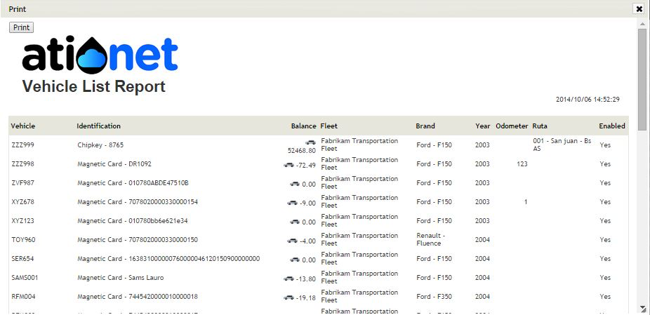
		</td>
	</tr>
	<tr>
		<td colspan="2"></td>
	</tr>
	<tr>
		<td colspan="2">
			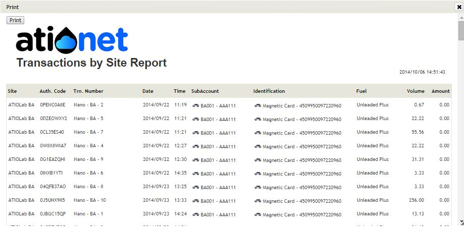
		</td>
	</tr>
	<tr>
		<td colspan="2"></td>
	</tr>
</table>


### Vehicle Activity
<table>
	<tr>
		<td align="right">Use:</td>
		<td>Provide detailed and summarized information about a Vehicle consumptions
		</td>
	</tr>
	<tr>
		<td width="15%" class="rowhead" align="right">Subscriptions:</td>
		<td>Network, Retail, Homebase</td>
	</tr>
	<tr>
		<td align="right">Acessible to:</td>
		<td>Subscribers, Companies</td>
	</tr>
	<tr>
		<td colspan="2">
			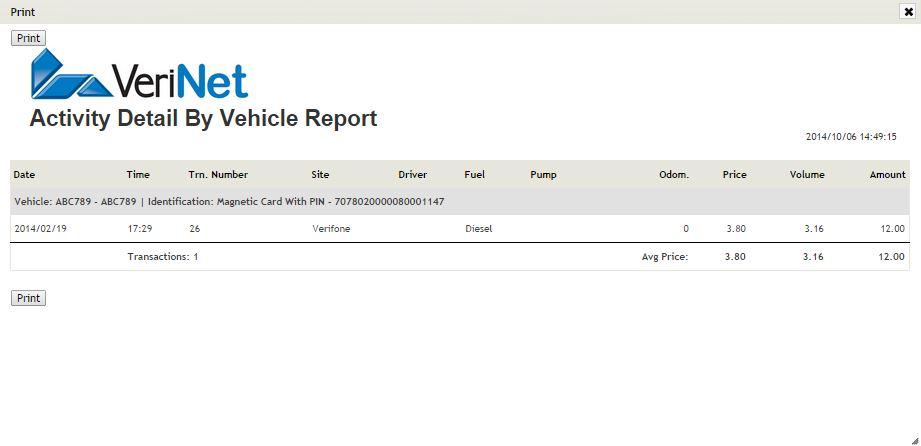
		</td>
	</tr>
</table>


