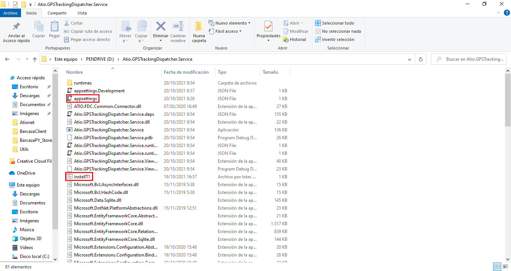
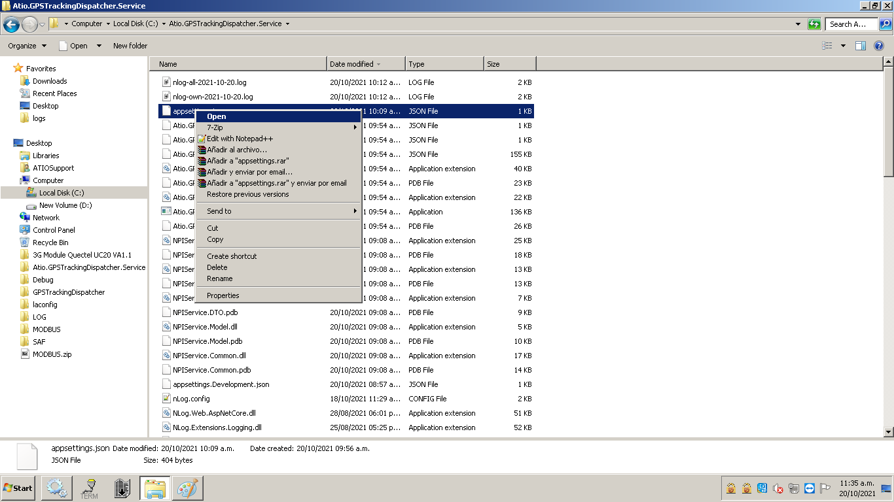
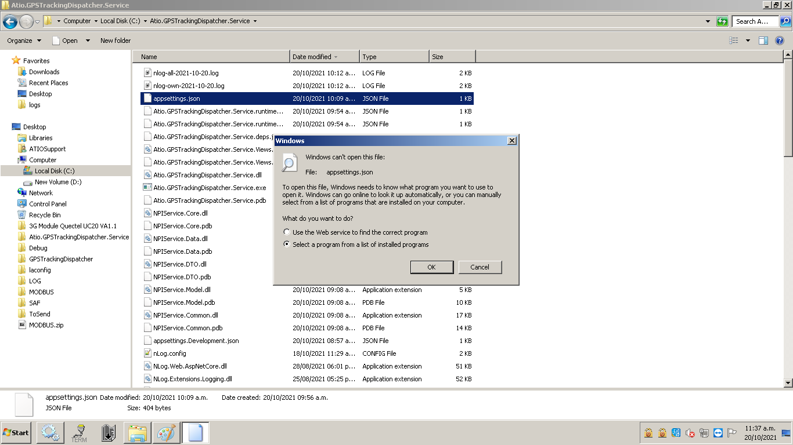
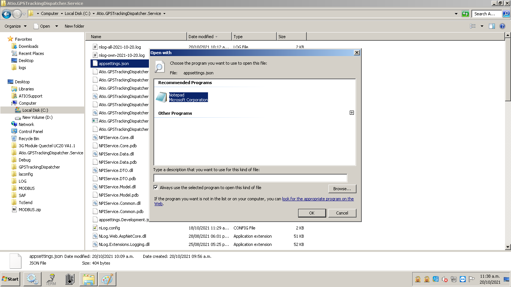

# ATIONET - GPS Tracking Dispatcher: Service installation and configuration guide

## Content ##

- [About this document](#About-this-document)
- [Requirements](#Requirements)
- [Installation](#Installation)
- [Service configuration](#Service-configuration)
- [Visual documentation](#Visual-documentation)
	- [Files used during service installation and configuration](#Files-used-during-service-installation-and-configuration)
	- [Guide on how to open the appsettings file](#Guide-on-how-to-open-the-appsettings-file)

### About this document

This document details how to install the service on the Local Agent (IGPC ICO 300 or other). This will be responsible for obtaining the GPS coordinates sent by this agent through the ATIO Nano StoreAndForward service installed in it, to later send them to the ATIO server for later use.

### Requirements

This service depends on the ATIO Nano StoreAndForward service for its correct functioning. In addition, it is required that for the first time, prior to its use, a file be configured where all the environment variables necessary for its correct operation will be configured.

### Installation

For installation, we first need to copy the content folder of the service to the local agent. Next, we need to navigate to the recently copied folder, find the installation file called ‘installT1.bat’ and run it.

``` 
Note: The service will be installed to run automatically when the local agent starts.
``` 

### Service configuration

Before we use the service for the first time we need to make some changes on the configuration file: Navigate to the service content folder, find the configuration file called 'appsettings' and open it with a text editor.’
Inside of the file, we can see the following custom settings:

* **IP:** Ip address used to connect with the 'ATIO Nano StoreAndForward' service.

```
Note: If both are installed on the same local agent, the IP address will be 127.0.0.1
```

* **Port:** Like the IP address, the port is used to connect to the local agent and get the GPS coordinates sent by request

* **TrackingInterval:** The time interval between GPS requests. this is expressed in milliseconds. For example, if we need 1 minute between requests, the tracking invested will be 60000

* **Url:** URL address to send our request with the information obtained to be stored

* **Authorization:** This field will be sent in the requests of the previous point in order to authenticate the information of the user who is making the requests.

* **DeviceID:** This field will contain the identification number of the device linked to this service.

Example of appsettings file

```
{
  "Logging": {
    "LogLevel": {
      "Default": "Information",
      "Microsoft": "Warning",
      "Microsoft.Hosting.Lifetime": "Information"
    }
  },
  "AllowedHosts": "*",

  "ip": "127.0.0.1",
  "port": "5666",
  "trackingInvertal": 60000,
  "url": "http://native-beta.ationet.com/v1/tracking",
  "authorization": "Basic usuario@dominio.com:clave",
  "DeviceID": "55prueb"
}
```

>Note: You should request your username and password from Ationet.

### Visual documentation

#### Files used during service installation and configuration



#### Guide on how to open the appsettings file





