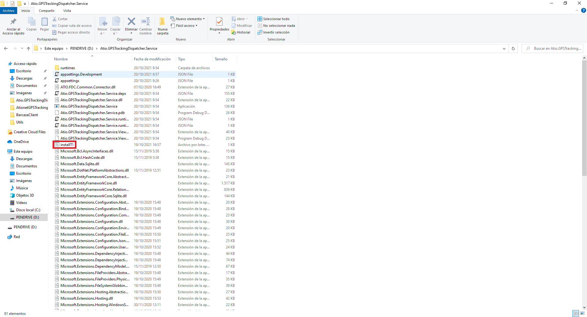
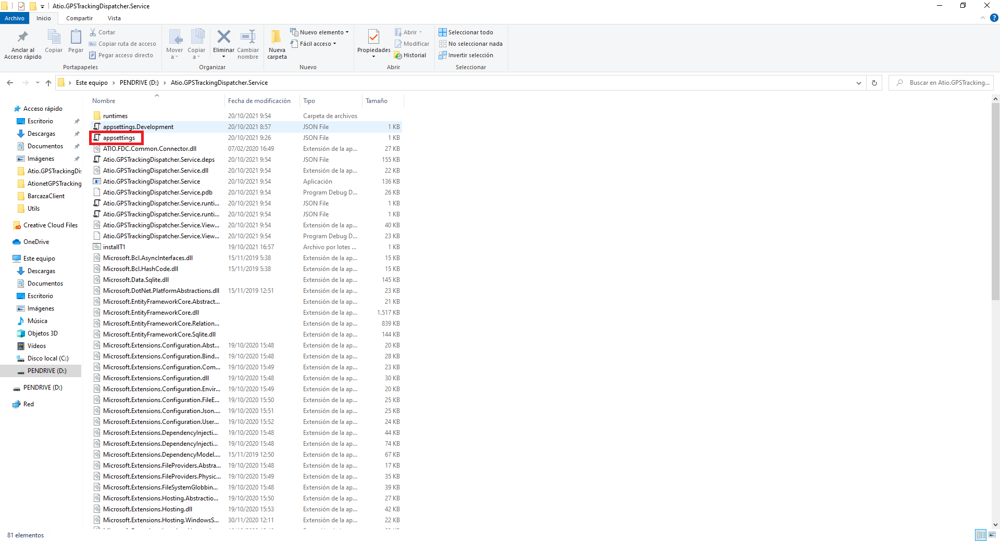

# ATIONET - GPS Tracking Dispatcher: Guia de instalación y configuración del servicio.

## Contenido ##

- [Sobre este documento](#Sobre-este-documento)
- [Requisitos](#Requisitos)
- [Instalación](#Instalación)
- [Configuración del servicio](#Configuración-del-servicio)

### Sobre este documento

Este documento detalla la forma de  instalación del servicio en el Local Agent (IGPC ICO 300 u otro). El mismo será el responsable de obtener las coordenadas de GPS enviadas por este agente a través del servicio ATIO Nano StoreAndForward instalado en él, para posteriormente enviarlas al servidor de ATIO para su posterior uso.

### Requisitos

Este servicio depende del servicio ATIO Nano StoreAndForward para su correcto funcionamiento. Adicionalmente se requerirá que por primera vez, previo a su uso, se configure un archivo donde se colocaran los valores de las variables de entorno necesarias para su correcto funcionamiento.

### Instalación

Para la instalación de este servicio, lo primero que necesitaremos será copiar la carpeta contenedora del mismo en nuestro Local Agent.
Luego, deberemos ingresar a la carpeta que acabamos de crear, buscar nuestro archivo de instalación llamado ‘installT1.bat’ y ejecutarlo para que realice la instalación del servicio.

``` 
Nota: Nuestro servicio se instalará para ejecutarse de manera automática cuando inicie nuestro agente local.
``` 



### Configuración del servicio

Previo a poder utilizar nuestro servicio deberemos realizar algunos cambios en nuestro archivo de configuración, para ello, deberemos dirigirnos a la carpeta desde donde ejecutamos el archivo de instalación, buscar un archivo llamado ‘appsettings’ y abrirlo con un editor de texto.



Dentro de la misma encontraremos los siguientes aspectos configurables:

* **IP:** Será la dirección ip que utilizaremos para conectarnos al servicio ‘ATIO Nano StoreAndForward’.

```
Nota: Si ambos servicios se encuentran instalados en nuestro agente local, la ip debería quedar configurada como 127.0.0.1
```

* **Port:** Sera el puerto encargado de escuchar al servicio de 'ATIO Nano StoreAndForward' para obtener las coordenadas GPS enviadas por este.

* **TrackingInterval:** Será el intervalo de tiempo entre cada request. El mismo se encuentra expresado en milisegundos. Por ejemplo, si queremos que espere un minuto entre cada petición, este campo deberá ser configurado en 60000

* **Url:** Será la dirección de la API de Ationet a la cual enviaremos nuestros request’s con la información obtenida para almacenarla.

* **Authorization:** Este campo se enviará en los request del punto anterior para poder autenticar la información del usuario que se encuentra realizando las peticiones.

```
Nota: Estos datos deberán ser solicitados al área de ingeniería de Ationet.
```

* **DeviceID:** Este punto contendrá el número de identificación del dispositivo vinculado a este servicio.

```
Nota: Estos datos deberán ser solicitados al área de ingeniería de Ationet.
```

Ejemplo de un archivo appsettings

```
{
  "Logging": {
    "LogLevel": {
      "Default": "Information",
      "Microsoft": "Warning",
      "Microsoft.Hosting.Lifetime": "Information"
    }
  },
  "AllowedHosts": "*",

  "ip": "127.0.0.1", //IP para conectarnos al servicio 'ATIO Nano StoreAndForward'
  "port": "5666", //Puerto para establecer la conexión con 'ATIO Nano StoreAndForward'
  "trackingInvertal": 5000, //Intervalo de tiempo entre cada request.
  "url": "http://native-beta.ationet.com/v1/tracking", //Direccion de la API de ationet para almacenar la información.
  "authorization": "Basic usuario@dominio.com:clave", //Autenticador de información de usuario que realiza las peticiones a la API de Ationet
  "DeviceID": "55prueb" //Identificación del dispositivo vinculado al servicio.
}
```

>Nota: Usted deberá solicitar su usuario y clave a Ationet.
