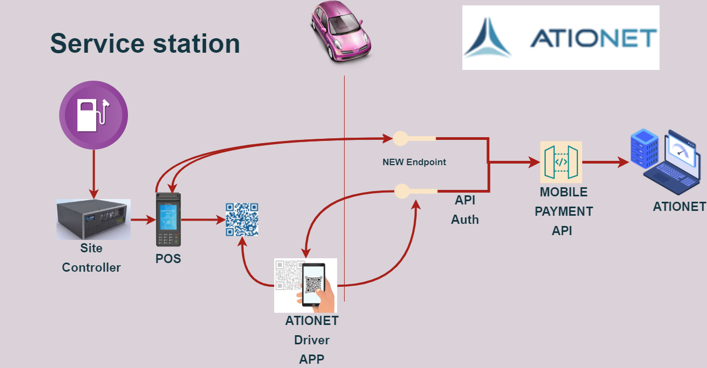
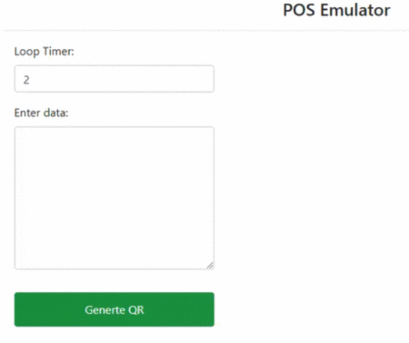
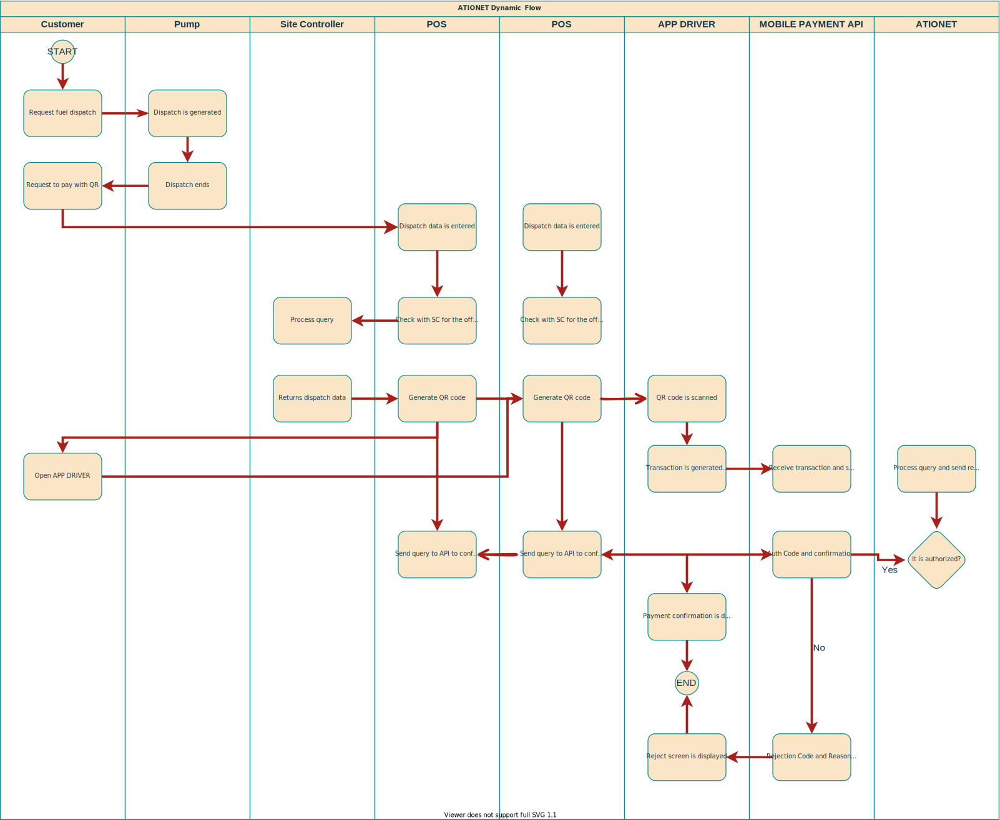

# ATIONet - Dynamic QR Code Payments #

|Document Information||
|--- |--- |
|File:|ATIONet - Dynamic QR Code Payments|
|Doc Version:|1.0|
|Release Date:|26, August 2021|
|Author:|ATIONet LLC|

|Change Log|||
|--- |--- |--- |
|Ver.|Date|Change Summary|
|1.0|26/August/2021|Initial version.|

## Contents ##

- [Overview](#overview)
	- [Introduction](#introduction)
	- [Overview of Dynamic QR Code](#Overview-of-Dynamic-QR-Code)
- [QR code Payments squence](#QR-code-Payments-squence)
- [Dynamic QR Code Payments Implementation](#Dynamic-QR-Code-Payments-Implementation)	
	- [Introduction](#Introduction)
	- [STEP 1 Get your authentication keys (Pending/ In progress)](#STEP-1-Get-your-authentication-keys)
	- [STEP 2 Create Dynamic QR Code](#STEP-2-Create-Dynamic-QR-Code)
	- [STEP 3 Customer scans Dynamic QR code](#STEP-3-Customer-scans-Dynamic-QR-code)
	- [STEP 4 Confirm the Transaction Status](#STEP-4-Confirm-the-Transaction-Status)
	- [Integration Checklist](#Integration-Checklist)
- [API Documentation](#API-Documentatio)
	 - [Get Sale Method](#Get-Sale-Method)
		- [Description](#Description)
		- [Request Format](#Request-Format)
		- [Response Format](#Request-Format)
	- [Sale Method](#Sale-Method)
		- [Description](#Description)
		- [Request Format](#Request-Format)
		- [Response Format](#Request-Format)
- [Messages-samples](#Messages-samples)
	- [Get Sale Method](#Get-Sale-method-sample)
	- [Sale Method](#Sale-method-sample)


## Overview



### Introduction

Ationet fleet Mobile payments - Dynamic QR  allows to generate the dynamic QR code from their Billing POS/System for a specific order/bill and must pass the order-specific information such as Dispatch ID, Order Amount, etc. while generating the code. The customer can scan this QR to make a payment and the POS's Backend can check the transaction status using the Dispatch ID and.

``` 
Note: A customer-facing screen is required, which will show the dynamically generated QR to him in order to be able to
scan it and generate the sale.

```

### Overview of Dynamic QR Code

<ol>
	<li>Customer chooses the goods/service in a store and shows the intent to the cashier for Ationet Driver App payment.</li>
	<li>Cashier creates an order with the bill amount and a unique Dispatch ID in the POS system.</li>
	<li>POS’s backend server  Create QR Code  and displays it to the Customer on the consumer-facing screen.</li>
	<li>Customer scans QR code via Ationet Driver App.</li>
	<li>POS’s backend server automatically starts polling the Transaction status every 8 times/minute using Dispatch ID.</li>
</ol>




## QR code Payments squence



## Dynamic QR Code Payments Implementation

### Introduction

The section describes the integration steps required to integrate ATIONe's Dynamic QR Code Payments with billing POS to accept contactless payment from your customer using the Ationet Driver App payment.

### STEP 1 Get your authentication keys
```
Importante: Pending/In progress. Ignore this step.
```
<ul>
	<li>POS's Backend Key: A unique secret key used to secure encryption of every request. This needs to be kept on server-side and should not be shared with anyone.</li>
</ul>

```
Note: Never share your secret POS's Backend Key with anyone.
```


### STEP 2 Create Dynamic QR Code

POS's Backend only encodes the minimum sale information in QR, It is the one that comes from site controller when generating a sale. The rest of the plot information is completed by the POS's Backend. The following table describes each field in the table, its description and its origin.

```
Important: Plot have to be in JSON format. QR image must be free text type.

```

<table>
	<thead>
		<tr valign="center">
			<th rowspan="2"  align="left">
				Name
			</th>
			<th rowspan="2" align="center">
				Type
			</th>
			<th rowspan="2" align="left">
				Origin
			</th>
			<th rowspan="8" align="left">
				Description
			</th>
		</tr>
	</thead>
	<tbody>
		<tr valign="top">
			<td>
				<p align="left">DispatchID</p>
			</td>
			<td>
				<p align="center">(string) Guid ID</p>
			</td>
			<td>
			 	<p align="center">Site controller or POS Backend</p>
			 </td>
			<td>
				<p>XXXXXXXX-XXXX-XXXX-XXXX-XXXXXXXXXXXX</p>
			</td>
		 </tr>
		 <tr valign="top">
			<td>
				<p align="left">PumpNumber</p>
			</td>
			<td>
				<p align="center">string</p>
			</td>
			<td>
			 	<p align="center">Site controller</p>
			 </td>
			<td>
				<p>“00”-“99”</p>
			</td>
		 </tr>
		 <tr valign="top">
			<td>
				<p align="left">TransactionSequenceNumber</p>
			</td>
			<td>
				<p align="center">integer</p>
			</td>
			<td>
			 	<p align="center">Site controller</p>
			 </td>
			<td>
				<p>Refer to Transaction Sequence Number in <a href="AN-Native_Transaction_Protocol-Spec.md#transaction-sequence-number">Field Description section.</a></p>
			</td>
		 </tr>
		<tr valign="top">
			<td>
				<p align="left">LocalTransactionDate</p>
			</td>
			<td>
				<p align="center">integer</p>
			</td>
			<td>
			 	<p align="center">Site controller</p>
			 </td>
			<td>
				<p>Local Transaction Date: yyyymmdd</p>
			</td>
		 </tr>
		<tr valign="top">
			<td>
				<p align="left">LocalTransactionTime</p>
			</td>
			<td>
				<p align="center">integer</p>
			</td>
			<td>
			 	<p align="center">Site controller</p>
			 </td>
			<td>
				<p>Local Transaction Time: hhmmss</p>
			</td>
		 </tr>
		<tr valign="top">
			<td>
				<p align="left">TerminalIdentification</p>
			</td>
			<td>
				<p align="center">string</p>
			</td>
			<td>
			 	<p align="center">Site controller/POS IdentificationAtionet</p>
			 </td>
			<td>
				<p>It must be requested from ationet</p>
			</td>
		 </tr>
		<tr valign="top">
			<td>
				<p align="left">TransactionAmount</p>
			</td>
			<td>
				<p align="center">double</p>
			</td>
			<td>
			 	<p align="center">Site controller</p>
			 </td>
			<td>
				<p>xxxxxxx.xx</p>
			</td>
		 </tr>
		<tr valign="top">
			<td>
				<p align="left">ProductCode</p>
			</td>
			<td>
				<p align="center">string</p>
			</td>
			<td>
			 	<p align="center">Site controller</p>
			 </td>
			<td>
				<p>“0”-“9999”</p>
			</td>
		 </tr>
		<tr valign="top">
			<td>
				<p align="left">ProductUnitPrice</p>
			</td>
			<td>
				<p align="center">double</p>
			</td>
			<td>
			 	<p align="center">Site controller</p>
			 </td>
			<td>
				<p>xxx.xx</p>
			</td>
		 </tr>
		<tr valign="top">
			<td>
				<p align="left">ProductAmount</p>
			</td>
			<td>
				<p align="center">double</p>
			</td>
			<td>
			 	<p align="center">Site controller</p>
			 </td>
			<td>
				<p>xxxxxxx.xx</p>
			</td>
		 </tr>
		<tr valign="top">
			<td>
				<p align="left">ProductQuantity</p>
			</td>
			<td>
				<p align="center">double</p>
			</td>
			<td>
			 	<p align="center">Site controller</p>
			 </td>
			<td>
				<p>xxxxxxx.xx</p>
			</td>
		 </tr>
		</tbody>
</table>

### Examples

#### Plot example
```
Complete Plot example in JSON Format:

{
    "DispatchID": "dc152309-6b50-45cc-939c-a43d69ec817a",
    "PumpNumber": "1",
    "TransactionSequenceNumber": 808,
    "LocalTransactionDate": 20210812, 
    "LocalTransactionTime": 113152, 
    "TerminalIdentification": "S2G321",
    "TransactionAmount": 99,
    "ProductCode": "1",
    "ProductUnitPrice": 1,
    "ProductAmount": 99,
    "ProductQuantity": 99
}
	
```

#### QR Image example


### STEP 3 Confirm the Transaction Status

When the QR code is generated for an specific transaction, the POS's Backend Get The Transaction status with a polling process using the [Transaction status API](#Get-Sale-Method).

```
Polling : Setup a polling process after regular intervals using the Transaction Status API. 
To get the best results out of a status query, you should check the status 8 times/minute.

```

### STEP 4 Customer scans Dynamic QR code

When the QR code is generated for an specific transaction, the customer scans that QR code and pays using Ationet Driver App payment. The customer is notified about the payment status on their Ationet Driver App  after the successful completion of payment. If you want to implement a new client app you can check the specification of the [create sale api](#Sale-Method).


```
Note: Customers cannot change the Transaction amount in their app on scanning the particular order QR code.
```


### Integration Checklist

Post completion of integration in your staging environment, it is mandatory to test the integration before moving into the live environment with production. Below points should be taken care of during the integration of the flow:

<ol>
   <li>The transaction status should be verified through the Transaction Status API in the payment flow.</li>	
   <li>The Dispacht ID passed to Ationet should be unique.</li>	
   <li>The amount must not contain more than 2 decimal points, comma, or any special characters.</li>	 
   <li>Dispatch ID parameter is mandatory for creating QR.</li>	
</ol>

## API Documentation

*URL:  ationetmobilepayment-appshost-test.azurewebsites.net* </br>

### Get Sale Method

#### Description

Return a Sale information.

#### Request Format

*URL: /api/ContactlessPayment/GetSale* </br>
*Method: POST* </br>
```
Body { 
     "DispatchID": "string",
    "ActionCode": "string",
    "SubscriberCode": "string",
    "LocalDateFrom": "Date",
    "LocalDateTo": "Date"
   }
```

#### Response Format
Header:
```
Content-Type: application/json; charset=utf-8
content-encoding: gzip 
```
```
body [

    {
        "TransactionId": "string",
        "SubscriberCode": "string",
        "TransactionSequenceNumber": "string",
        "AuthorizationCode": "string",
        "ResponseCode": "string",
        "ResponseMessage": "string",
        "Status": 3,
        "Mode": 0,
        "StatusDescription": "string",
        "HostDateTime": "string",
        "SubscriberDateTime": "string",
        "SubscriberTimeZone": "string",
        "SiteDateTime": "string",
        "SiteTimeZone": "string",
        "DateTime": "string",
        "MerchantCode": "string",
        "MerchantContractCode": "string",
        "MerchantName": "string",
        "MerchantCustomField0": null,
        "MerchantCustomField1": null,
        "MerchantCustomField2": null,
        "MerchantCustomField3": null,
        "SiteCode": "string",
        "SiteName": "string",
        "SiteShortName": "string",
        "TerminalCode": "string",
        "TerminalType": "string",
        "TerminalId": "string",
        "TerminalTypeId": "string",
        "SubAccountId": "string",
        "SecondarySubAccountId": null,
        "AccountTypeDescription": "string",
        "VehicleCode": "string",
        "DriverCode": null,
        "TransactionNetAmount": null,
        "ProductUnitPriceRequested": double,
        "ProductVolumeRequested": double,
        "ProductAmountRequested": double,
        "TransactionAmountRequested": double,
        "ProductUnitPriceAuthorized": double,
        "ProductVolumeAuthorized": double,
        "ProductAmountAuthorized": double,
        "TransactionAmountAuthorized": double,
        "ProductUnitPriceDispensed": double,
        "ProductVolumeDispensed": double,
        "ProductAmountDispensed": double,
        "ProductNetAmountDispensed": null,
        "TransactionAmountDispensed": double,
        "ProductUnitPriceCompany": double,
        "ProductUnitPriceMerchant": double,
        "ProductAmountCompany": double,
        "ProductAmountMerchant": double,
        "TransactionAmountCompany": double,
        "TransactionAmountMerchant": double,
        "MeasurementUnitCode": null,
        "CurrencyCode": "string",
        "FuelCode": "string",
        "FuelMasterCode": "string",
        "FuelMasterDescription": "string",
        "InvoiceNumber": null,
        "BatchNumber": null,
        "ShiftNumber": null,
        "PumpNumber": "string",
        "EntryMethod": "string",
        "CompanyCode": "string",
        "CompanyName": "string",
        "CompanyCustomField0": null,
        "CompanyCustomField1": null,
        "CompanyCustomField2": null,
        "CompanyCustomField3": null,
        "CompaniesGroupCode": "",
        "ClassificationLabel1": "string",
        "ClassificationLabel2": "string",
        "ClassificationLabel3": "string",
        "ClassificationLabel4": "string",
        "ContractCode": "string",
        "CompanyContractClassificationValue1": "string",
        "CompanyContractClassificationValue2": "string",
        "CompanyContractClassificationValue3": "string",
        "CompanyContractClassificationValue4": "string",
        "CompanyContractCustomField0": null,
        "CompanyContractCustomField1": null,
        "CompanyContractCustomField2": null,
        "CompanyContractCustomField3": null,
        "SubContractCode": "string",
        "PrimaryIdentificationTrack": "string",
        "SecondaryIdentificationTrack": null,
        "PrimaryIdentificationPAN": "string",
        "SecondaryIdentificationPAN": null,
        "PrimaryIdentificationLabel": "string",
        "SecondaryIdentificationLabel": null,
        "PrimaryIdentificationModelDescription": "string",
        "SecondaryIdentificationModelDescription": null,
        "FleetCode": "string",
        "FleetName": "string",
        "VehiclePlate": "string",
        "VehicleClassDescription": null,
        "VehicleClassificationValue1": null,
        "VehicleClassificationValue2": null,
        "VehicleClassificationValue3": null,
        "VehicleClassificationValue4": null,
        "DriverName": null,
        "DriverClassificationValue1": null,
        "DriverClassificationValue2": null,
        "DriverClassificationValue3": null,
        "DriverClassificationValue4": null,
        "CustomerData": {},
        "FastTrackData": {},
        "TaxesData": {},
        "FeesData": [
            {
                "Name": "string",
                "Value": double,
                "Id": "string"
            }
        ],
        "CompanyTaxpayerId": "string",
        "ApplicationCode": null,
        "DisputeDate": null,
        "Reason": null,
        "State": null,
        "DisputeCommentCompany": null,
        "ResolvedDate": null,
        "DisputeResolveNetworkComment": null,
        "Odometer": null,
        "SiteCountryId": "string",
        "SiteCountry": "string",
        "SiteAddress": "string",
        "SiteStateId": "string",
        "SiteState": "string",
        "SiteCity": "string",
        "SiteZipCode": null,
        "SiteClassificationValue1": "string",
        "SiteClassificationValue2": null,
        "SiteClassificationValue3": null,
        "SiteClassificationValue4": null,
        "SiteCustomField0": null,
        "SiteCustomField1": null,
        "SiteCustomField2": null,
        "SiteCustomField3": null,
        "DriverFirstName": null,
        "DriverLastName": null,
        "GPSVirtualOdometer": null,
        "GPSDistance": null,
        "GPSAddress": null,
        "GPSComment": null,
        "DriverCustomField0": null,
        "DriverCustomField1": null,
        "DriverCustomField2": null,
        "DriverCustomField3": null,
        "VehicleCustomField0": null,
        "VehicleCustomField1": null,
        "VehicleCustomField2": null,
        "VehicleCustomField3": null,
        "IdProgram": "string",
        "ProgramDescription": "string",
        "LatitudeStart": null,
        "LongitudeStart": null,
        "AltitudeStart": null,
        "LatitudeEnd": null,
        "LongitudeEnd": null,
        "AltitudeEnd": null,
        "ContingencyReason": null,
        "AuthorizationType": 0,
        "AttendantCode": null,
        "PumpSide": null,
        "VehicleBrand": "string",
        "VehicleModel": null,
        "Subsidized": null,
        "SiteCountryCode": "string",
        "CompanyContractCustomInterface0": bool,
        "CompanyContractCustomInterface1": bool,
        "CompanyContractCustomInterface2": bool,
        "CompanyContractCustomInterface3": bool,
        "CompanyContractCustomInterface4": bool,
        "CompanyContractCustomOperation0": bool,
        "CompanyContractCustomOperation1": bool,
        "CompanyContractCustomOperation2": bool,
        "CompanyContractCustomOperation3": bool,
        "CompanyContractCustomOperation4": bool,
        "ProductsData": [],
        "ModifiersData": []
    }
]
```

### Sale Method

#### Description

Create a Sale. The sale creation recibes a Dispatch ID. It's must be unic. 

#### Request Format

*URL: /api/ContactlessPayment/ProcessSale* </br>
*Method: POST* </br>
*Body { 
	"DispatchId": "string",</br>
	"PumpNumber": "string",</br> 
	"TransactionSequenceNumber": integer,</br>
	"LocalTransactionDate": integer,</br>
	"LocalTransactionTime": integer,</br>
	"TerminalIdentification": "string",</br>
	"PrimaryTrack": "string",</br> 
	"TransactionAmount": integer,</br> 
	"ProductCode": "string",</br>
	"ProductUnitPrice": double,</br> 
	"ProductAmount": double,</br> 
	"ProductQuantity": double,</br>
	
}*
#### Response Format 

Header:
```
Content-Type: application/json; charset=utf-8
content-encoding: gzip 
```

```
Body {
    "ApplicationType": "string",
    "ProcessingMode": "string",
    "MessageFormatVersion": "string",
    "TerminalIdentification": "string",
    "DeviceTypeIdentifier": "string",
    "TransactionCode": "string",
    "AccountType": "string",
    "EntryMethod": "string",
    "PumpNumber": "string",
    "ProductCode": string,
    "ProductUnitPrice": double,
    "ProductAmount": double,
    "ProductQuantity": double,
    "ProductData": [],
    "TransactionAmount": double,
    "UnitCode": string,
    "CurrencyCode": string,
    "BatchNumber": integerer,
    "ShiftNumber": string,
    "TransactionSequenceNumber": integer,
    "LocalTransactionDate": integerr,
    "LocalTransactionTime": integer,
    "CustomerData": {
        "ContractMode": "string"
    },
    "AuthorizationCode": "string",
    "InvoiceNumber": string,
    "ResponseCode": "string",
    "ResponseText": "string",
    "ReceiptData": "{ "CustomerName":"string", 
    		      "CustomerIdentification":"string", 
		      "CustomerPlate":"string", 
		      "CustomerPAN":"string", 
		      "CustomerLabel":"string",
		      "CompanyName":"string",
		      "CompanyCode":"string",
		      "TransactionId":"string",
		      "AuthorizationType":integer,
		      "CustomerVehiclePlate":"string",
		      "CustomerVehicleCode":"string",
		      "CustomerVehicleModel":"string",
		      "CustomerVehicleBrand":"string",
		      "CustomerTruckUnitNumber":"string",
		      "CustomerOdometer":"string", 
		      "CustomerDriverId":"string", 
		      "ContractCode":"string",
		      "CompanyTaxPayerId":"string",
		      "CompanyStreet1":"string",
		      "CompanyStreet2":"string",
		      "ContractBalanceMode":"string" }",
    "LongResponseText": "Autorizado"
}
```


## Messages samples

### Get sale method sample

#### Get Request example

```
{
    "DispatchID": "d27a1c89-ab2f-469e-91aa-3a20943ab79c",
    "ActionCode": "931",
    "SubscriberCode": "S2G",
    "LocalDateFrom": "2021/08/05 11:39:45",
    "LocalDateTo": "2021/08/05 11:39:45"
    
}
```

#### Response example

```
[
    {
        "TransactionId": "d27a1c89-ab2f-469e-91aa-3a20943ab79c",
        "SubscriberCode": "S2G",
        "TransactionSequenceNumber": "120",
        "AuthorizationCode": "075532151",
        "ResponseCode": "00000",
        "ResponseMessage": "Autorizado",
        "Status": 3,
        "Mode": 0,
        "StatusDescription": "Confirmed",
        "HostDateTime": "2021/08/06 15:31:52",
        "SubscriberDateTime": "2021/08/06 12:31:52",
        "SubscriberTimeZone": "Argentina Standard Time",
        "SiteDateTime": "2021/08/06 12:31:52",
        "SiteTimeZone": "Argentina Standard Time",
        "DateTime": "2021/08/06 12:31:52",
        "MerchantCode": "04012",
        "MerchantContractCode": "123",
        "MerchantName": "fuel company ",
        "MerchantCustomField0": null,
        "MerchantCustomField1": null,
        "MerchantCustomField2": null,
        "MerchantCustomField3": null,
        "SiteCode": "1524",
        "SiteName": "lomas",
        "SiteShortName": "lomas",
        "TerminalCode": "S2G321",
        "TerminalType": "ATIONET Mobile Payment",
        "TerminalId": "09c5e5fa-af46-49a3-a0ba-041535f5e870",
        "TerminalTypeId": "70e808d3-47d2-4ba8-893a-20babab46f91",
        "SubAccountId": "1200318c-1a25-4263-b75b-291ac3d28853",
        "SecondarySubAccountId": null,
        "AccountTypeDescription": "Vehicle",
        "VehicleCode": "5924",
        "DriverCode": null,
        "TransactionNetAmount": null,
        "ProductUnitPriceRequested": 1.000000,
        "ProductVolumeRequested": 99.000000,
        "ProductAmountRequested": 99.000000,
        "TransactionAmountRequested": 99.000000,
        "ProductUnitPriceAuthorized": 0.000000,
        "ProductVolumeAuthorized": 0.000000,
        "ProductAmountAuthorized": 0.000000,
        "TransactionAmountAuthorized": 0.000000,
        "ProductUnitPriceDispensed": 1.000000,
        "ProductVolumeDispensed": 99.000000,
        "ProductAmountDispensed": 99.000000,
        "ProductNetAmountDispensed": null,
        "TransactionAmountDispensed": 99.000000,
        "ProductUnitPriceCompany": 1.000000,
        "ProductUnitPriceMerchant": 1.000000,
        "ProductAmountCompany": 99.000000,
        "ProductAmountMerchant": 99.000000,
        "TransactionAmountCompany": 99.000000,
        "TransactionAmountMerchant": 99.000000,
        "MeasurementUnitCode": null,
        "CurrencyCode": "ARS",
        "FuelCode": "1",
        "FuelMasterCode": "022",
        "FuelMasterDescription": "Compressed Natural Gas",
        "InvoiceNumber": null,
        "BatchNumber": null,
        "ShiftNumber": null,
        "PumpNumber": "1",
        "EntryMethod": "S",
        "CompanyCode": "40206",
        "CompanyName": "CON'AUTO",
        "CompanyCustomField0": null,
        "CompanyCustomField1": null,
        "CompanyCustomField2": null,
        "CompanyCustomField3": null,
        "CompaniesGroupCode": "",
        "ClassificationLabel1": "Clasificador 1 Departamentos",
        "ClassificationLabel2": "Classification 2",
        "ClassificationLabel3": "Classification 3",
        "ClassificationLabel4": "Classification 4",
        "ContractCode": "40206",
        "CompanyContractClassificationValue1": "",
        "CompanyContractClassificationValue2": "",
        "CompanyContractClassificationValue3": "",
        "CompanyContractClassificationValue4": "",
        "CompanyContractCustomField0": null,
        "CompanyContractCustomField1": null,
        "CompanyContractCustomField2": null,
        "CompanyContractCustomField3": null,
        "SubContractCode": "40206",
        "PrimaryIdentificationTrack": "0000000000001",
        "SecondaryIdentificationTrack": null,
        "PrimaryIdentificationPAN": "004",
        "SecondaryIdentificationPAN": null,
        "PrimaryIdentificationLabel": "Identification1 ATIONet",
        "SecondaryIdentificationLabel": null,
        "PrimaryIdentificationModelDescription": "Card",
        "SecondaryIdentificationModelDescription": null,
        "FleetCode": "4210",
        "FleetName": "CONAUTO Fleet",
        "VehiclePlate": "HAL180",
        "VehicleClassDescription": null,
        "VehicleClassificationValue1": null,
        "VehicleClassificationValue2": null,
        "VehicleClassificationValue3": null,
        "VehicleClassificationValue4": null,
        "DriverName": null,
        "DriverClassificationValue1": null,
        "DriverClassificationValue2": null,
        "DriverClassificationValue3": null,
        "DriverClassificationValue4": null,
        "CustomerData": {},
        "FastTrackData": {},
        "TaxesData": {},
        "FeesData": [
            {
                "Name": "descuentos",
                "Value": 496.366000,
                "Id": "715a7981-84f1-477f-9360-626bf6addb41"
            }
        ],
        "CompanyTaxpayerId": "15024",
        "ApplicationCode": null,
        "DisputeDate": null,
        "Reason": null,
        "State": null,
        "DisputeCommentCompany": null,
        "ResolvedDate": null,
        "DisputeResolveNetworkComment": null,
        "Odometer": null,
        "SiteCountryId": "e8812e4f-406c-49dc-8b99-d985361af691",
        "SiteCountry": "Argentina",
        "SiteAddress": "Av. Muñiz 366, () (Martinez) Buenos Aires Argentina",
        "SiteStateId": "785f7886-3429-4f2e-b633-049e802a4ece",
        "SiteState": "Buenos Aires",
        "SiteCity": "Martinez",
        "SiteZipCode": null,
        "SiteClassificationValue1": "ZONA GOBIERNO 2",
        "SiteClassificationValue2": null,
        "SiteClassificationValue3": null,
        "SiteClassificationValue4": null,
        "SiteCustomField0": null,
        "SiteCustomField1": null,
        "SiteCustomField2": null,
        "SiteCustomField3": null,
        "DriverFirstName": null,
        "DriverLastName": null,
        "GPSVirtualOdometer": null,
        "GPSDistance": null,
        "GPSAddress": null,
        "GPSComment": null,
        "DriverCustomField0": null,
        "DriverCustomField1": null,
        "DriverCustomField2": null,
        "DriverCustomField3": null,
        "VehicleCustomField0": null,
        "VehicleCustomField1": null,
        "VehicleCustomField2": null,
        "VehicleCustomField3": null,
        "IdProgram": "d112c23a-4bdb-4c68-9bde-43cd334627c5",
        "ProgramDescription": "Classic",
        "LatitudeStart": null,
        "LongitudeStart": null,
        "AltitudeStart": null,
        "LatitudeEnd": null,
        "LongitudeEnd": null,
        "AltitudeEnd": null,
        "ContingencyReason": null,
        "AuthorizationType": 0,
        "AttendantCode": null,
        "PumpSide": null,
        "VehicleBrand": "TOYOTA",
        "VehicleModel": null,
        "Subsidized": null,
        "SiteCountryCode": "ARG",
        "CompanyContractCustomInterface0": false,
        "CompanyContractCustomInterface1": false,
        "CompanyContractCustomInterface2": false,
        "CompanyContractCustomInterface3": false,
        "CompanyContractCustomInterface4": false,
        "CompanyContractCustomOperation0": false,
        "CompanyContractCustomOperation1": false,
        "CompanyContractCustomOperation2": false,
        "CompanyContractCustomOperation3": false,
        "CompanyContractCustomOperation4": false,
        "ProductsData": [],
        "ModifiersData": []
    }
]
```

### Sale method sample

#### Request example

```
{
    "DispatchID": "d27a1c89-ab2f-469e-91aa-3a20943ab79c",
    "PumpNumber": "1",
    "TransactionSequenceNumber": 123,
    "TerminalIdentification": "S2G321",
    "PrimaryTrack": "0000000000001",
    "TransactionAmount": 99,
    "ProductCode": "1",
    "ProductUnitPrice": 1,
    "ProductAmount": 99,
    "ProductQuantity": 99
}
```

#### Response example

```
{
    "ApplicationType": "FCS",
    "ProcessingMode": "1",
    "MessageFormatVersion": "1.3",
    "TerminalIdentification": "S2G321",
    "DeviceTypeIdentifier": "4",
    "TransactionCode": "210",
    "AccountType": "1",
    "EntryMethod": "S",
    "PumpNumber": "1",
    "ProductCode": null,
    "ProductUnitPrice": null,
    "ProductAmount": null,
    "ProductQuantity": null,
    "ProductData": [],
    "TransactionAmount": null,
    "UnitCode": null,
    "CurrencyCode": null,
    "BatchNumber": null,
    "ShiftNumber": null,
    "TransactionSequenceNumber": 296,
    "LocalTransactionDate": 20210827,
    "LocalTransactionTime": 125346,
    "CustomerData": {
        "ContractMode": "1"
    },
    "AuthorizationCode": "052554144",
    "InvoiceNumber": null,
    "ResponseCode": "00000",
    "ResponseText": "Autorizado",
    "ReceiptData": "{\"CustomerName\":\"5924 - HAL180\",\"CustomerIdentification\":\"5924\",\"CustomerPlate\":\"HAL180\",\"CustomerPAN\":\"004\",\"CustomerLabel\":\"Identification1 ATIONet\",\"CompanyName\":\"CON'AUTO\",\"CompanyCode\":\"40206\",\"TransactionId\":\"00e49ed2-210f-4d0d-8093-dd80996c05e7\",\"AuthorizationType\":0,\"CustomerVehiclePlate\":\"HAL180\",\"CustomerVehicleCode\":\"5924\",\"CustomerVehicleModel\":null,\"CustomerVehicleBrand\":\"TOYOTA\",\"CustomerTruckUnitNumber\":null,\"CustomerOdometer\":\"\",\"CustomerDriverId\":null,\"ContractCode\":\"40206\",\"CompanyTaxPayerId\":\"15024\",\"CompanyStreet1\":\"Av. Conauto\",\"CompanyStreet2\":null,\"ContractBalanceMode\":\"4\"}",
    "LongResponseText": "Autorizado"
}
```
