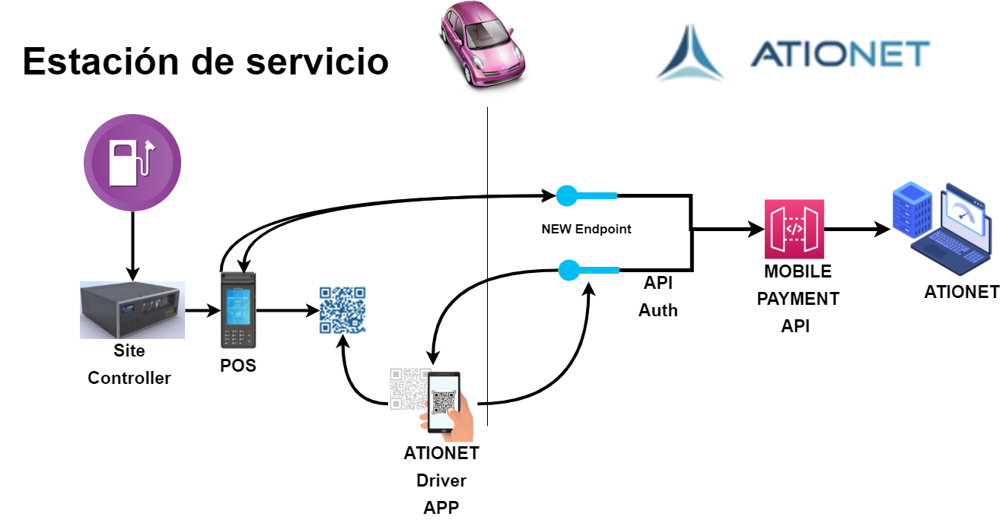
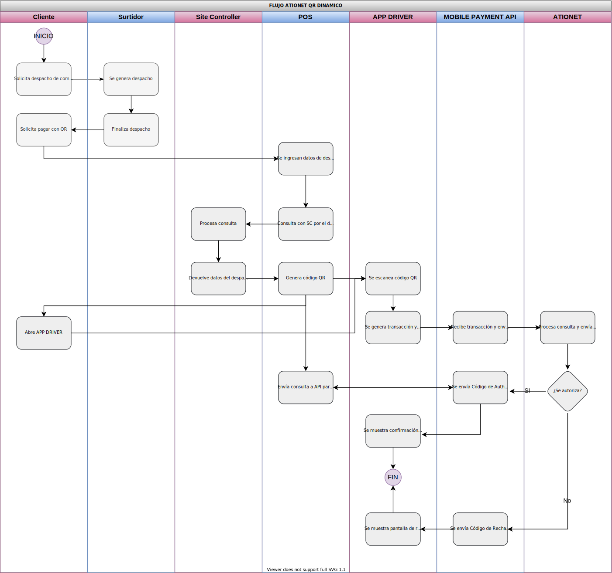
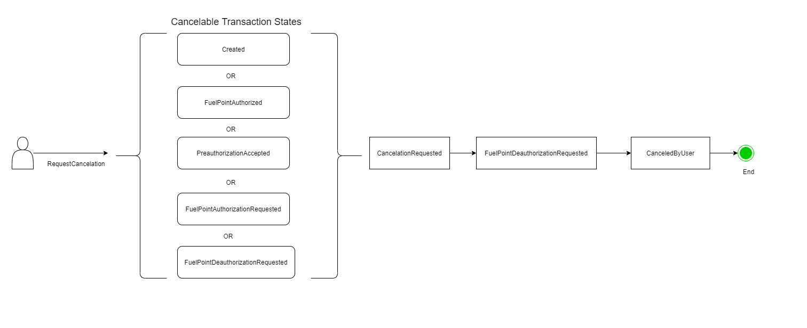

# ATIONet - Dynamic QR Code Payments #

|Document Information||
|--- |--- |
|File:|ATIONet - Dynamic QR Code Payments|
|Doc Version:|1.0|
|Release Date:|26, August 2021|
|Author:|ATIONet LLC|

|Change Log|||
|--- |--- |--- |
|Ver.|Date|Change Summary|
|1.0|26/August/2021|Initial version.|

## Contents ##

- [Overview](#overview)
- [Description](#description)
- [Details](#api-details)	
- [Supported Transactions](#supported-transactions)
- [Message Structure](#message-structure)
	- [MobilePayments](#mobilePayments)
	- [PreAuthorizedPayments](#preAuthorizedPayments)
	- [GetTransaction](#getTransaction)
	- [Cancel](#cancel)
- [Error Handling](#error-handling)
- [Field Descriptions](#field-descriptions)
- [Transactions States](#transactions-states)
	- [Transaction states sequence diagram on Pre authorization Request](#transactionstates-sequence-diagram-on-pre-authorization-request)
	- [Transaction states sequence diagram on Cancelation Request](#transaction-states-sequence-diagram-on-cancelation-request)
- [Response Codes](#response-codes)
	- [ MobilePayments | PreAuthorizedPayments Response codes](#mobilePayments-|-preAuthorizedpaymentsresponse-codes)
	- [ Cancelation Response codes](#cancelation-response-codes)
- [Message Samples](#message-samples)
	- [MobilePayments ](#mobilePayments)
	- [PreAuthorizedPayments ](#preAuthorizedpayments)
	- [GetTransaction ](#gettransaction)
	- [Cancel ](#cancel)
	

## Overview



### Introduction

ATIONet Dynamic QR Code Payments allows to generate the dynamic QR code from their Billing POS/System for a specific order/bill and must pass the order-specific information such as Order ID, Order Amount, etc. while generating the code. The customer can scan this QR to make a payment and the merchant can check the transaction status using the Dispatch ID and accordingly close the order/bill.

``` 
Note: A customer-facing screen is required, which will show the dynamically generated QR to him in order to be able to
scan it and generate the sale.

```

### Overview of Dynamic QR Code

<ol>
	<li>Customer chooses the goods/service in a store and shows the intent to the cashier for Ationet Driver App payment.</li>
	<li>Cashier creates an order with the bill amount and a unique Dispatch ID in the POS system.</li>
	<li>Merchant’s backend server  Create QR Code  and displays the QR Code to the Customer on the consumer-facing screen.</li>
	<li>Customer scans QR code via Paytm or any Ationet Driver App.</li>
	<li>Customer enters the  pin in the respective tionet Driver App app to complete the payment XXXXX</li>
	<li>Merchant's server receives the transaction confirmation by pulling them from an API to get the transaction confirmation against the order.</li>
	<li>Merchant's POS system closes the bill/order and shares the payment response with the customer..</li>
</ol>


## QR code Payments squence



## Dynamic QR Code Payments Implementation

### Introduction

This sections is intended to document Dynamic QR Code Payments API messaging format and related features required for usarage. The following sections only provide necessary descriptions  to implements Dynamic QR Code Payments. If you want to read full information of the messages themselves, the expected behaviour for each supported transaction type and a common ground for the functionality of each relevant item of this API, you can do this from <a href="AN-Native_Interface_Protocol-Spec.md"> here</a>.

### Description

This service receives the request from the client and create a Sale.

### API Details

*URL:  http://native-beta.ationet.com* </br>

### Request Format 

*URL: v1/auth* </br>
*Method: POST* </br>
*Body { "ProcessingMode": "string",
	"SystemModel": "string,</br>  
	"SystemVersion": "string",</br> 
	"TransactionCode": "string",</br> 
	"EntryMethod": "string",</br> 
	"ApplicationType": "string",</br> 
	"AccountType": "string",</br> 
	"MessageFormatVersion": "string",</br>
	"CurrencyCode": "string",</br> 
	"DeviceTypeIdentifier": "string",</br> 
	"PumpNumber": "string",</br> 
	"TransactionSequenceNumber": integer,</br>
	"LocalTransactionDate": integer,</br>
	"LocalTransactionTime": integer,</br>
	"TerminalIdentification": "string",</br>
	"PrimaryTrack": "string",</br> 
	"TransactionAmount": integer,</br> 
	"ProductCode": "string",</br>
	"ProductUnitPrice": double,</br> 
	"ProductAmount": double,</br> 
	"ProductQuantity": double,</br>
	"DispatchId": "string"</br>
}*

### Response Format 

*Body {
    "ApplicationType": "string",</br>
    "ProcessingMode": "string",</br>
    "MessageFormatVersion": "string",</br>
    "TerminalIdentification": "string",</br>
    "DeviceTypeIdentifier": "string",</br>
    "TransactionCode": "string",</br>
    "AccountType": "string",</br>
    "EntryMethod": "string",</br>
    "PumpNumber": "string",</br>
    "ProductCode": string,</br>
    "ProductUnitPrice": double,</br>
    "ProductAmount": double,</br>
    "ProductQuantity": double,</br>
    "ProductData": [],</br>
    "TransactionAmount": double,</br>
    "UnitCode": string,</br>
    "CurrencyCode": string,</br>
    "BatchNumber": integerer,</br>
    "ShiftNumber": string,</br>
    "TransactionSequenceNumber": integer,</br>
    "LocalTransactionDate": integerr,</br>
    "LocalTransactionTime": integer,</br>
    "CustomerData": {</br>
        "ContractMode": "string"</br>
    },</br>
    "AuthorizationCode": "string",</br>
    "InvoiceNumber": string,</br>
    "ResponseCode": "string",</br>
    "ResponseText": "string",</br>
    "ReceiptData": "{ "CustomerName":"string",</br> 
    		      "CustomerIdentification":"string",</br> 
		      "CustomerPlate":"string",</br> 
		      "CustomerPAN":"string",</br> 
		      "CustomerLabel":"string",</br>
		      "CompanyName":"string",</br>
		      "CompanyCode":"string",</br>
		      "TransactionId":"string",</br>
		      "AuthorizationType":integer,</br>
		      "CustomerVehiclePlate":"string",</br>
		      "CustomerVehicleCode":"string",</br>
		      "CustomerVehicleModel":"string",</br>
		      "CustomerVehicleBrand":"string",</br>
		      "CustomerTruckUnitNumber":"string",</br>
		      "CustomerOdometer":"string",</br> 
		      "CustomerDriverId":"string",</br> 
		      "ContractCode":"string",</br>
		      "CompanyTaxPayerId":"string",</br>
		      "CompanyStreet1":"string",</br>
		      "CompanyStreet2":"string",</br>
		      "ContractBalanceMode":"string" }",</br>
    "LongResponseText": "Autorizado"</br>
}*

### QR Code 

Merchant Backend only encodes the minimum sale information in QR, It is the one that comes from a terminal when generating a sale. The rest of the trama information is completed by the Merchant Backend (point of sale).The following table describes each field in the table, its description and its origin, being QR for values that have to be coded and POS for values that are completed by Merchant Backend.


<table>
	<thead>
		<tr valign="center">
			<th rowspan="2"  align="left">
				Name
			</th>
			<th rowspan="2" align="center">
				Type
			</th>
			<th rowspan="2" align="left">
				Origin
			</th>
			<th rowspan="8" align="left">
				Description
			</th>
		</tr>
	</thead>
	<tbody>
		 <tr valign="top">
			<td>
				<p align="left">ProcessingMode</p>
			</td>
			<td>
				<p align="center">string</p>
			</td>
			<td>
			 	<p align="center">POS</p>
			 </td>
			<td>
				<p>“0” = Host Capture Only “1” = Host Processing Required“2” = Operator Assisted Capture</p>
			</td>
		 </tr>
		<tr valign="top">
			<td>
				<p align="left">SystemModel</p>
			</td>
			<td>
				<p align="center">string</p>
			</td>
			<td>
			 	<p align="center">POS</p>
			 </td>
			<td>
				<p>It is the environment from which the request is made</p>
			</td>
		 </tr>
		<tr valign="top">
			<td>
				<p align="left">SystemVersion</p>
			</td>
			<td>
				<p align="center">string</p>
			</td>
			<td>
			 	<p align="center">POS</p>
			 </td>
			<td>
				<p>By default is NB</p>
			</td>
		 </tr>
		<tr valign="top">
			<td>
				<p align="left">TransactionCode</p>
			</td>
			<td>
				<p align="center">string</p>
			</td>
			<td>
			 	<p align="center">POS</p>
			 </td>
			<td>
				<p>Refer to Transactions Codes in Reference <a href="AN-Native_Transaction_Protocol-Spec.md#111-transaction-codes.md">Tables Section</a>.Use 200 for a Sale request</p>
			</td>
		 </tr>
		<tr valign="top">
			<td>
				<p align="left">EntryMethod</p>
			</td>
			<td>
				<p align="center">string</p>
			</td>
			<td>
			 	<p align="center">POS</p>
			 </td>
			<td>
				<p>“M” Manual Entry “S” Swap Card “T” Tag read</p>
			</td>
		 </tr>
		<tr valign="top">
			<td>
				<p align="left">ApplicationType</p>
			</td>
			<td>
				<p align="center">string</p>
			</td>
			<td>
			 	<p align="center">POS</p>
			 </td>
			<td>
				<p>“Always “FCS” Fleet Control System</p>
			</td>
		 </tr>
		<tr valign="top">
			<td>
				<p align="left">AccountType</p>
			</td>
			<td>
				<p align="center">string</p>
			</td>
			<td>
			 	<p align="center">POS</p>
			 </td>
			<td>
				<p>Refer to Account Types in <a href="AN-Native_Transaction_Protocol-Spec.md#track-data">Tables Section.</a> Use 1 for QR Payments</p>
			</td>
		 </tr>
		<tr valign="top">
			<td>
				<p align="left">MessageFormatVersion</p>
			</td>
			<td>
				<p align="center">string</p>
			</td>
			<td>
			 	<p align="center">POS</p>
			 </td>
			<td>
				<p>For QR Payments use 1.3</p>
			</td>
		 </tr>
		<tr valign="top">
			<td>
				<p align="left">MessageFormatVersion</p>
			</td>
			<td>
				<p align="center">string</p>
			</td>
			<td>
			 	<p align="center">POS</p>
			 </td>
			<td>
				<p>For QR Payments use 1.3</p>
			</td>
		 </tr>
		<tr valign="top">
			<td>
				<p align="left">CurrencyCode</p>
			</td>
			<td>
				<p align="center">string</p>
			</td>
			<td>
			 	<p align="center">POS</p>
			 </td>
			<td>
				<p>Refer to Currency Codes in Reference <a href="AN-Native_Transaction_Protocol-Spec.md#117-currency-codes">Tables Section.</a></p>
			</td>
		 </tr>
	</tbody>
</table>


## Message Structure

This section describe the message structure for each API Method available, as well as the responses messages for each one.

### MobilePayments 

Create a Sale with Ationet authorization. The sale creation recibes an ID, if this ID already exists then the method returns the Sale's Id.

#### Request Format

*URL: /api/MobilePayments* </br>
*Method: POST* </br>
*Body: { "siteCode":"string", "pumpNumber": integer, "fuelCode": "string", "amount": double, "primaryTrack": string, "terminalCode": "string", "mobilePaymentMode": integer, "potencyKeyId": "string" ,  "externalReferanceID":"string" }* </br>

#### Response Format

*Header:*

	Content-Type: application/json; charset=utf-8
	content-encoding: gzip 

*Body:	{ “TransactionId”:”StringValue” }*


### PreAuthorizedPayments

Create a Sale with external authorization. The sale creation recibes an ID, if this ID already exists then the method returns the Sale's Id.

#### Request Format

*URL: /api/PreAuthorizedPayments* </br>
*Method: POST* </br>
*Body: { "siteCode":"string", "pumpNumber":integer, "fuelCode":"string", "amount":double, "mobilePaymentMode":integer, "potencyKeyId":"string", "externalReferanceID":"string" }* </br>

#### Response Format

*Header:*

	Content-Type: application/json; charset=utf-8
	content-encoding: gzip 

*Body: { “TransactionId”:”StringValue” }*

### GetTransaction

#### Request Format

*URL: /api/MobilePayments/GetTransaction/{id}* </br>
*Method: GET* </br>
*Body: { "id": "string" }* </br>

#### Response Format

*Header:*

	Content-Type: application/json; charset=utf-8
	content-encoding: gzip 

*Body: {
  "id":"string", </br>
  "siteCode":"string", </br>
  "primaryTrack":"string", </br>
  "odometer": double, </br>
  "terminalIdentification":"string", </br>
  "transactionSequenceNumber":integer, </br>
  "state_Name":"string",</br>
  "state_Id":integer,</br>
  "paymentProcessorReferenceId":"string",</br>
  "paymentProcessorMessage":"string",</br>
  "siteSystemMessage":"string",</br>
  "fuelPointNumber":integer,</br>
  "paymentMethod":"string",</br>
  "requestedAmount":double,</br>
  "authorizedAmount":double,</br>
  "dispatchedAmount":double,</br>
  "dispatchedQuantity":double,</br>
  "productCode":"string",</br>
  "productDescription":"string",</br>
  "productUnitPrice":double,</br>
  "unitMeasure":"string",</br>
  "createDateTime":"string",</br>
  "updateDateTime":"string"</br>
}*

### Cancel 

Cancels a Sale that is in course as long as your status is correct. In the following diagram you can check all cancellable transaction statuses - [Transaction states sequence diagram on Cancelation Request](#transaction-states-sequence-diagram-on-cancelation-request)

#### Request Format

*URL: /api/MobilePayments/Cancel* </br>
*Method: POST* </br>
*Body:{ “TransactionId”:”StringValue” }* </br>

#### Response Format

*Header:*

	Content-Type: application/json; charset=utf-8
	content-encoding: gzip 

*Body:{ ”transactionId”: ”StringValue”, ”isSuccessCanceled”: ”bool”, ”responseCode"”: ”string”, ”responseMessage”: ”string” }*


## Error Handling

Success/failure exits on the Native Transaction Protocol will be handled via HTTP status codes.

Successful request will get a HTTP 200 and the resulting response.

Failure to process the request will be indicated by an HTTP 400’s range status code.

## Field Descriptions

This section describe through a table  all parameters from request.

<table>
	<thead>
		<tr valign="center">
			<th rowspan="3" width="400" align="left">
				Request
			</th>
			<th rowspan="3" width="125" align="left">
				Paramether
			</th>
			<th rowspan="3" width="125" align="left">
				Type
			</th>
			<th rowspan="3" width="225" align="left">
				Description
			</th>
		</tr>
	</thead>
	<tbody>
		 <tr valign="top">
			<td>
				<p align="left">MobilePayments | PreAuthorizedPayments</p>
			</td>
			<td>
				<p align="left">siteCode</p>
			</td>
			<td>
			 	<p align="left">string</p>
			 </td>
			<td>
				<p align="left">The site code</p>
			</td>
		 </tr>
		 <tr valign="top">
			<td>
				<p align="left">MobilePayments | PreAuthorizedPayments</p>
			</td>
			<td>
				<p align="left">pumpNumber</p>
			</td>
			<td>
			 	<p align="left">integer</p>
			 </td>
			<td>
				<p align="left">The pump number</p>
			</td>
		 </tr>
		<tr valign="top">
			<td>
				<p align="left">MobilePayments | PreAuthorizedPayments</p>
			</td>
			<td>
				<p align="left">fuelCode</p>
			</td>
			<td>
			 	<p align="left">string</p>
			 </td>
			<td>
				<p align="left">The fuel code</p>
			</td>
		 </tr>
		<tr valign="top">
			<td>
				<p align="left">MobilePayments | PreAuthorizedPayments</p>
			</td>
			<td>
				<p align="left">amount</p>
			</td>
			<td>
			 	<p align="left">double</p>
			 </td>
			<td>
				<p align="left">Number of liters of fuel to dispatch</p>
			</td>
		 </tr>
		<tr valign="top">
			<td>
				<p align="left">MobilePayments</p>
			</td>
			<td>
				<p align="left">primaryTrack</p>
			</td>
			<td>
			 	<p align="left">string</p>
			 </td>
			<td>
				<p align="left">The number associated with the card</p>
			</td>
		 </tr>
		<tr valign="top">
			<td>
				<p align="left">MobilePayments</p>
			</td>
			<td>
				<p align="left">terminalCode</p>
			</td>
			<td>
			 	<p align="left">string</p>
			 </td>
			<td>
				<p align="left">The terminal code</p>
			</td>
		 </tr>		
		<tr valign="top">
			<td>
				<p align="left">MobilePayments | PreAuthorizedPayments</p>
			</td>
			<td>
				<p align="left">mobilePaymentMode</p>
			</td>
			<td>
			 	<p align="left">integer</p>
			 </td>
			<td>
				<p align="left">The operation mode Code. It can be for 1 for Fullintegrated</p>
			</td>
		 </tr>
		<tr valign="top">
			<td>
				<p align="left">MobilePayments | PreAuthorizedPayments</p>
			</td>
			<td>
				<p align="left">potencyKeyId</p>
			</td>
			<td>
			 	<p align="left">string</p>
			 </td>
			<td>
				<p align="left">The Transaction's ID</p>
			</td>
		 </tr>		
		<tr valign="top">
			<td>
				<p align="left">PreAuthorizedPayments</p>
			</td>
			<td>
				<p align="left">externalReferenceID</p>
			</td>
			<td>
			 	<p align="left">string</p>
			 </td>
			<td>
				<p align="left">Authorization reference ID</p>
			</td>
		 </tr>
		<tr valign="top">
			<td>
				<p align="left">GetTransaction | Cancel</p>
			</td>
			<td>
				<p align="left">transactionId</p>
			</td>
			<td>
			 	<p align="left">string</p>
			 </td>
			<td>
				<p align="left">Transaction ID</p>
			</td>
		 </tr>
</table>


## Transactions States

This section describe through a table  all  states that a sale can have.


<table>
	<thead>
		<tr valign="center">
			<th rowspan="2" width="125" align="left">
				State name
			</th>			
			<th rowspan="2" width="125" align="left">
				ID
			</th>			
			<th rowspan="2" width="125" align="left">
				Message
			</th>
		</tr>		
	</thead>
	<tbody>
		 <tr valign="top">
			<td>
				<p align="left">Created</p>
			</td>
			<td>
				<p align="center">1</p>
			</td>
			<td>
				<p align="left">Created</p>
			</td>
		 </tr>
		<tr valign="top">
			<td>
				<p align="left">PreauthorizationAccepted</p>
			</td>
			<td>
				<p align="center">2</p>
			</td>
			<td>
				<p align="left">Preauthorization Accepted</p>
			</td>
		 </tr>
		<tr valign="top">
			<td>
				<p align="left">PreauthorizationRejected</p>
			</td>
			<td>
				<p align="center">3</p>
			</td>
			<td>
				<p align="left">Preauthorization Rejected</p>
			</td>
		 </tr>
		<tr valign="top">
			<td>
				<p align="left">FuelPointAuthorizationRequested</p>
			</td>
			<td>
				<p align="center">4</p>
			</td>
			<td>
				<p align="left">FuelPoint Authorization Requested</p>
			</td>
		 </tr>
		<tr valign="top">
			<td>
				<p align="left">PumpReserveAccepted</p>
			</td>
			<td>
				<p align="center">5</p>
			</td>
			<td>
				<p align="left">Site System Accept Pump Reserve</p>
			</td>
		 </tr>
		<tr valign="top">
			<td>
				<p align="left">PumpReserveRefused</p>
			</td>
			<td>
				<p align="center">6</p>
			</td>
			<td>
				<p align="left">Site System not Accept Pump Reserve</p>
			</td>
		 </tr>
		<tr valign="top">
			<td>
				<p align="left">FuelPointAuthorized</p>
			</td>
			<td>
				<p align="center">7</p>
			</td>
			<td>
				<p align="left">Fuel Point Authorized</p>
			</td>
		 </tr>
		<tr valign="top">
			<td>
				<p align="left">CanceledByFuelPoint</p>
			</td>
			<td>
				<p align="center">8</p>
			</td>
			<td>
				<p align="left">Canceled By Fuel Point</p>
			</td>
		 </tr>
		<tr valign="top">
			<td>
				<p align="left">Fueling</p>
			</td>
			<td>
				<p align="center">9</p>
			</td>
			<td>
				<p align="left">Fueling</p>
			</td>
		 </tr>
		<tr valign="top">
			<td>
				<p align="left">Complete</p>
			</td>
			<td>
				<p align="center">10</p>
			</td>
			<td>
				<p align="left">Complete</p>
			</td>
		 </tr>
		<tr valign="top">
			<td>
				<p align="left">CompleteFailed</p>
			</td>
			<td>
				<p align="center">11</p>
			</td>
			<td>
				<p align="left">Complete Failed</p>
			</td>
		 </tr>
		<tr valign="top">
			<td>
				<p align="left">CancelationRequested</p>
			</td>
			<td>
				<p align="center">12</p>
			</td>
			<td>
				<p align="left">Cancelation Requested</p>
			</td>
		 </tr>
		<tr valign="top">
			<td>
				<p align="left">CanceledByUser</p>
			</td>
			<td>
				<p align="center">13</p>
			</td>
			<td>
				<p align="left">Canceled By User</p>
			</td>
		 </tr>
		<tr valign="top">
			<td>
				<p align="left">CanceledBySiteSystem</p>
			</td>
			<td>
				<p align="center">14</p>
			</td>
			<td>
				<p align="left">Canceled By Site System</p>
			</td>
		 </tr>
		<tr valign="top">
			<td>
				<p align="left">FuelPointDeauthorizationRequested</p>
			</td>
			<td>
				<p align="center">15</p>
			</td>
			<td>
				<p align="left">Fuel Point Deauthorization Requested</p>
			</td>
		 </tr>
		<tr valign="top">
			<td>
				<p align="left">SessionError</p>
			</td>
			<td>
				<p align="center">16</p>
			</td>
			<td>
				<p align="left">Session not available</p>
			</td>
		 </tr>
		<tr valign="top">
			<td>
				<p align="left">UnknownError</p>
			</td>
			<td>
				<p align="center">17</p>
			</td>
			<td>
				<p align="left">Unknown error when trying to connect with session</p>
			</td>
		 </tr>
		<tr valign="top">
			<td>
				<p align="left">SiteSystemError</p>
			</td>
			<td>
				<p align="center">18</p>
			</td>
			<td>
				<p align="left">Site System Generic error</p>
			</td>
		 </tr>
		<tr valign="top">
			<td>
				<p align="left">SiteSystemError</p>
			</td>
			<td>
				<p align="center">19</p>
			</td>
			<td>
				<p align="left">Cancelled By MPPA</p>
			</td>
		 </tr>
</table>


### Transaction states sequence diagram on Pre authorization Request


### Transaction states sequence diagram on Cancelation Request




## Response Codes

### MobilePayments | PreAuthorizedPayments Response codes
	
Both methos response the same codes.

<table>
	<thead>
		<tr valign="center">
			<th rowspan="3" width="125" align="left">
				Code
			</th>
			<th rowspan="3" width="125" align="left">
				Description
			</th>
		</tr>
	</thead>
	<tbody>
		<tr valign="top">
			<td>
			<p align="left">200</p>
			</td>
			<td>
				<p align="left">Success</p>
			</td>
		 </tr>
			<tr valign="top">
			<td>
			<p align="left">400</p>
			</td>
			<td>
				<p align="left">Bad request</p>
			</td>
		 </tr>
	 </tbody>
		
</table>


### Cancelation Response codes

<table>
	<thead>
		<tr valign="center">
			<th rowspan="3" width="225" align="left">
				Code
			</th>
			<th rowspan="3" width="225" align="left">
				Response
			</th>
			<th rowspan="3" width="225" align="left">
				Response body Code
			</th>
			<th rowspan="3" width="225" align="left">
				Response body Message
			</th>
		</tr>
	</thead>
		<tbody>
		<tr valign="top">
			<td>
			<p align="left">200</p>
			</td>
			<td>
				<p align="left">Success</p>
			</td>
			<td>
				<p align="left">00000</p>
			</td>
			<td>
				<p align="left">Successfully Canceled</p>
			</td>
		 </tr>
		<tr valign="top">
			<td>
			<p align="left">200</p>
			</td>
			<td>
				<p align="left">Success</p>
			</td>
			<td>
				<p align="left">-10000</p>
			</td>
			<td>
				<p align="left">Invalid state - Transaction not updated</p>
			</td>
		 </tr>
		<tr valign="top">
			<td>
			<p align="left">200</p>
			</td>
			<td>
				<p align="left">Success</p>
			</td>
			<td>
				<p align="left">04001</p>
			</td>
			<td>
				<p align="left">Invalid state - Transaction status is alredy cancel</p>
			</td>
		 </tr>
		<tr valign="top">
			<td>
			<p align="left">200</p>
			</td>
			<td>
				<p align="left">Success</p>
			</td>
			<td>
				<p align="left">02001</p>
			</td>
			<td>
				<p align="left">Cancel by Generic error</p>
			</td>
		 </tr>
		<tr valign="top">
			<td>
			<p align="left">200</p>
			</td>
			<td>
				<p align="left">Success</p>
			</td>
			<td>
				<p align="left">04003</p>
			</td>
			<td>
				<p align="left">Invalid state - dispenser is fueling</p>
			</td>
		 </tr>
		<tr valign="top">
			<td>
			<p align="left">200</p>
			</td>
			<td>
				<p align="left">Success</p>
			</td>
			<td>
				<p align="left">04004</p>
			</td>
			<td>
				<p align="left">Invalid state - Transaction status is completed</p>
			</td>
		 </tr>
		<tr valign="top">
			<td>
			<p align="left">200</p>
			</td>
			<td>
				<p align="left">Success</p>
			</td>
			<td>
				<p align="left">04007</p>
			</td>
			<td>
				<p align="left">Unknow transaction or authorization</p>
			</td>
		 </tr>
		<tr valign="top">
			<td>
			<p align="left">200</p>
			</td>
			<td>
				<p align="left">Success</p>
			</td>
			<td>
				<p align="left">04008</p>
			</td>
			<td>
				<p align="left">Invalid state - Cancelation is alredy requested</p>
			</td>
		 </tr>
		<tr valign="top">
			<td>
			<p align="left">200</p>
			</td>
			<td>
				<p align="left">Success</p>
			</td>
			<td>
				<p align="left">04009</p>
			</td>
			<td>
				<p align="left">Invalid state - dispenser is fueling</p>
			</td>
		 </tr>
		<tr valign="top">
			<td>
			<p align="left">200</p>
			</td>
			<td>
				<p align="left">Success</p>
			</td>
			<td>
				<p align="left">04010</p>
			</td>
			<td>
				<p align="left">Transacion canceled by Session not available</p>
			</td>
		 </tr>
		<tr valign="top">
			<td>
			<p align="left">200</p>
			</td>
			<td>
				<p align="left">Success</p>
			</td>
			<td>
				<p align="left">04011</p>
			</td>
			<td>
				<p align="left">Transacion canceled by unknow error</p>
			</td>
		 </tr>
			<tr valign="top">
			<td>
			<p align="left">400</p>
			</td>
			<td>
				<p align="left">Bad request</p>
			</td>
			<td>
				<p align="center">-</p>
			</td>
			<td>
				<p align="center">-</p>
			</td>
		 </tr>
	 </tbody>

</table>
	
## Message Samples

### MobilePayments Sample
	
```
{
  "siteCode": "1524",
  "pumpNumber": 1,
  "fuelCode": "3",
  "amount": 9,
  "primaryTrack": "0000000000001",
  "terminalCode": "S2G321",
  "mobilePaymentMode": 1,
  "potencyKeyId": "5734cbb9-f78f-4ad4-aa87-79ed95181c5a"
}
	
```
	
### PreAuthorizedPayments

```
{
  "siteCode": "1524",
  "pumpNumber": 1,
  "fuelCode": "3",
  "amount": 9,
  "mobilePaymentMode": 1,
  "potencyKeyId": "5734cbb9-f78f-4ad4-aa87-79ed95181c5a",
  "externalReferanceID": "854712"
}

```
	
### GetTransaction

```
{
  "id": 5734cbb9-f78f-4ad4-aa87-79ed95181c5a
}
```
	
### Cancel

```
{
  "transactionId": "5664cbb9-f78f-4ad4-aa87-79ed95181c5a"
}
```
