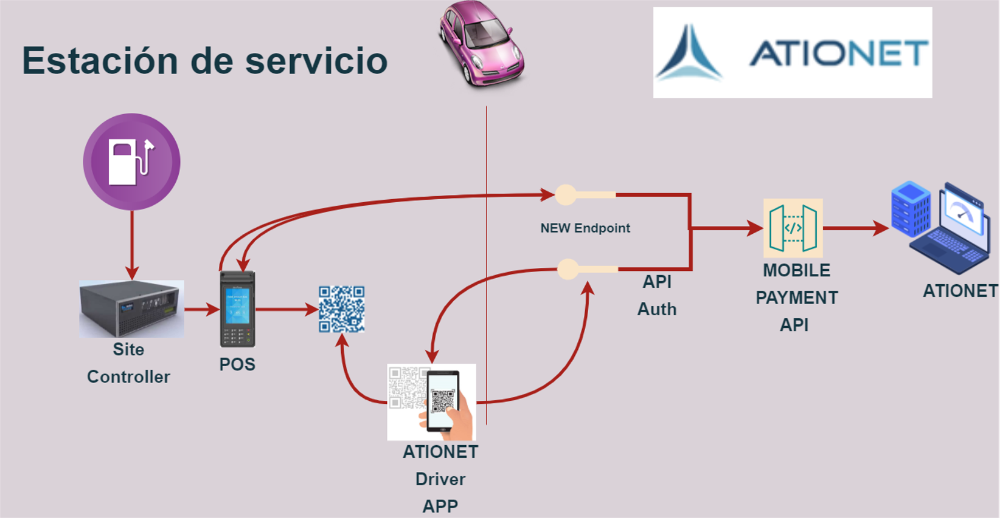
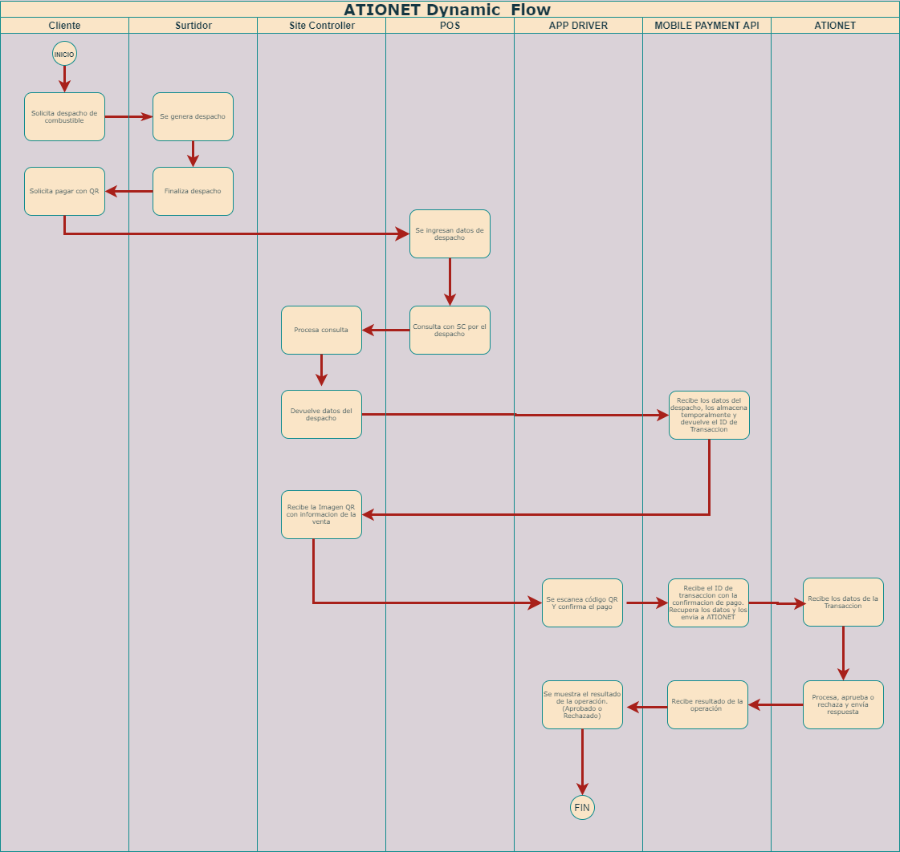

# ATIONet - Dynamic QR Code Payments #

|Document Information||
|--- |--- |
|File:|ATIONET - Pagos con código QR dinámico|
|Doc Version:|1.0|
|Release Date:|26, August 2021|
|Author:|ATIONet LLC|

|Change Log|||
|--- |--- |--- |
|Ver.|Date|Change Summary|
|1.0|26/August/2021|Initial version.|

## Contenido ##

- [Visión general](#Visión-general)
	- [Introduction](#Introduccion)
	- [Descripción general del codigo QR Dinámico](#Descripcion-general-del-codigo-QR-dinamico)
- [Secuencia de pagos con código QR](#Secuencia-de-pagos-con-código-QR)
- [Implementación de pagos con código QR dinámico](#Implementación-de-pagos-con-código-QR-dinámico)	
	- [Introducción](#Introducción)
	- [PASO 1 Obtener sus claves de autenticación (Pendiente/En desarrollo)](#PASO-1-Obtener-sus-claves-de-autenticación)
	- [PASO 2 Crear código QR dinámico](#PASO-2-Crear-código-QR-dinámico)
	- [PASO 3 Confirmar el estado de la Transacción](#PASO-3-Confirmar-el-estado-de-la-Transacción)
	- [PASO 4 El cliente escanea el código QR dinámico](#PASO-4-El-cliente-escanea-el-código-QR-dinámico)
	- [Posibles estados  de las Transacciones de QR Dinámico](#Posibles-estados--de-las-Transacciones-de-QR-Dinámico)
	- [Lista de verificación de integración](#Lista-de-verificación-de-integración)
- [Documentación de API](#Documentación-de-API)
	- [Método Crear](#Método-Crear)
	- [Método Obtener el estado de una Transacción](#Método-Obtener-el-estado-de-una-Transacción)
	- [Método Solicitud de pago de una venta](#Método-Solicitud-de-pago-de-una-venta)
	- [Método Proceso de pago de venta](#Método-Proceso-de-pago-de-venta)
	- [Método Rechazo de solicitud de Pago](#Método-Rechazo-de-solicitud-de-Pago)
- [Manejo de errores](#Manejo-de-errores)
- [Mensajes de ejemplo](#Mensajes-de-ejemplo)
	 - [Ejemplo método Crear](#Ejemplo-método-crear)
 	 - [Ejemplo método Obtener estado de una Transacción](#Ejemplo-métodoObtener-estado-de-una-Transacción)
 	 - [Ejemplo método Solicitud de pago de venta](#Ejemplo-método-Solicitud-de-pago-de-venta)
	 - [Ejemplo método Proceso de pago de venta](#Ejemplo-método-Proceso-de-pago-de-venta)
	 - [Ejemplo método Rechazo de solicitud de Pago](#Ejemplo-método-Rechazo-de-solicitud-de-Pago)
	

## Visión general



### Introduccion

Ationet fleet Mobile payments - Dynamic QR permite generar el código QR dinámico desde su POS/Sistema de facturación para un pedido/factura específico para lo cual se debe pasar la información específica del pedido, como el Dispatch ID, el monto del pedido, etc., mientras se genera la imagen del código QR. El cliente puede escanear este QR para realizar un pago y el Backend del POS puede verificar el estado de la transacción utilizando el ID de envío.

``` 
Nota: Se requiere una pantalla orientada al cliente, que le mostrará el QR generado dinámicamente para poder
escanearlo y generar la venta.

```

### Descripcion general del codigo QR dinamico

<ol>
	<li>El cliente elige los productos/servicios en una tienda y muestra la intención de pago usando la aplicación Ationet Driver.</li>
	<li>El cajero crea un pedido con el monto de la factura y un Dispatch ID único en el sistema POS.</li>
	<li>El servidor backend de POS crea un código QR y se lo muestra al cliente en la pantalla de cara al consumidor.</li>
	<li>El cliente escanea el codigo QR usando Ationet Driver App.</li>
	<li>El servidor de backend de POS comienza a sondear automáticamente el estado de la transacción 8 veces por minuto utilizando el Dispatch ID.</li>
</ol>


## Secuencia de pagos con código QR



## Implementación de pagos con código QR dinámico

### Introducción

La sección describe los pasos de integración necesarios para integrar los pagos con código QR dinámico de ATIONet con el punto de venta de facturación para aceptar pagos sin contacto de su cliente mediante la aplicación Ationet Driver.

### PASO 1 Obtener sus claves de autenticación

<ul>
	<li>Clave de backend de POS: una clave secreta única que se utiliza para asegurar el cifrado de cada solicitud. Esto debe mantenerse en el lado del servidor y no debe compartirse con nadie.</li>
</ul>

> Debe solicitar sus claves a ATIONET.

```
Nota: Nunca comparta la clave secreta de backend de su POS con nadie.
```


### PASO 2 Crear código QR dinámico

El Backend de POS solo codifica la información mínima de venta en la imagen QR, ésta información es la que proviene del controlador del sitio (Site controller) al generar una venta. El resto de la información de la trama se completa con el Backend del POS. La siguiente tabla describe cada campo en la tabla, su descripción y su origen.

```
Importante: La trama debe estar en formato JSON. La imagen del código QR debe ser de tipo texto libre.

```

<table>
	<thead>
		<tr valign="center">
			<th rowspan="2"  align="left">
				Nombre
			</th>
			<th rowspan="2" align="center">
				Tipo
			</th>
			<th rowspan="2" align="left">
				Origen
			</th>
			<th rowspan="8" align="left">
				Descripción
			</th>
		</tr>
	</thead>
	<tbody>
		<tr valign="top">
			<td>
				<p align="left">IDDispatch</p>
			</td>
			<td>
				<p align="center">(string) Guid</p>
			</td>
			<td>
			 	<p align="center">Site controller or POS Backend</p>
			 </td>
			<td>
				<p>XXXXXXXX-XXXX-XXXX-XXXX-XXXXXXXXXXXX</p>
			</td>
		 </tr>
		 <tr valign="top">
			<td>
				<p align="left">PumpNumber</p>
			</td>
			<td>
				<p align="center">string</p>
			</td>
			<td>
			 	<p align="center">Site controller</p>
			 </td>
			<td>
				<p>“00”-“99”</p>
			</td>
		 </tr>
		<tr valign="top">
			<td>
				<p align="left">TerminalIdentification</p>
			</td>
			<td>
				<p align="center">string</p>
			</td>
			<td>
			 	<p align="center">Site controller/POS IdentificationAtionet</p>
			 </td>
			<td>
				<p>Debe solicitarse a ATIONet</p>
			</td>
		 </tr>
		<tr valign="top">
			<td>
				<p align="left">ProductCode</p>
			</td>
			<td>
				<p align="center">string</p>
			</td>
			<td>
			 	<p align="center">Site controller</p>
			 </td>
			<td>
				<p>“0”-“9999”</p>
			</td>
		 </tr>
		<tr valign="top">
			<td>
				<p align="left">ProductUnitPrice</p>
			</td>
			<td>
				<p align="center">double</p>
			</td>
			<td>
			 	<p align="center">Site controller</p>
			 </td>
			<td>
				<p>xxx.xx</p>
			</td>
		 </tr>
		<tr valign="top">
			<td>
				<p align="left">ProductAmount</p>
			</td>
			<td>
				<p align="center">double</p>
			</td>
			<td>
			 	<p align="center">Site controller</p>
			 </td>
			<td>
				<p>xxxxxxx.xx</p>
			</td>
		 </tr>
		<tr valign="top">
			<td>
				<p align="left">ProductQuantity</p>
			</td>
			<td>
				<p align="center">double</p>
			</td>
			<td>
			 	<p align="center">Site controller</p>
			 </td>
			<td>
				<p>xxxxxxx.xx</p>
			</td>
		 </tr>
		<tr valign="top">
			<td>
				<p align="left">ProductDescription</p>
			</td>
			<td>
				<p align="center">string</p>
			</td>
			<td>
			 	<p align="center">Site controller</p>
			 </td>
			<td>
				<p>(OPCIONAL) La descripción del producto.</p>
			</td>
		 </tr>
		<tr valign="top">
			<td>
				<p align="left">ImageRequired</p>
			</td>
			<td>
				<p align="center">bool</p>
			</td>
			<td>
			 	<p align="center">Site controller or POS Backend</p>
			 </td>
			<td>
				<p>Si se verdadero la respuesta devolverá el campo image con la imagen de código Qr codificada en base 64. Por defecto es 					falso</p>
			</td>
		 </tr>
		</tbody>
</table>

### Ejemplos

En la seccion  [Ejemplo método Crear](#Ejemplo-método-crear) puede encontrar un ejemplo de como es la trama en formato `Json`.

#### Ejemplo de imagen QR


### PASO 3 Confirmar el estado de la Transacción

Cuando se genera el código QR para una Transacción específica, el backend del POS obtiene el estado de la transacción con un proceso de sondeo mediante la [Api de estado de una Transaccion](#Método-obtener-Venta). `Este sondeo se realiza utilizando el IdDispatch.`


>Sondeo: Configure un proceso de sondeo en intervalos regulares utilizando la API de estado de transacción.
>Para obtener los mejores resultados de una consulta de estado, debe verificar el estado 8 veces por minuto.


### PASO 4 El cliente escanea el código QR dinámico

Cuando se genera el código QR para una transacción específica, el cliente escanea ese código QR y paga mediante la aplicación Ationet Driver. Se notifica al cliente sobre el estado del pago en su aplicación Ationet Driver después de completar con éxito el pago. Si desea implementar una nueva aplicación de cliente, puede verificar la especificación de [API Crear venta](#Metodo-Venta).


```
Nota: Los clientes no pueden cambiar el monto de la transacción en su aplicación al escanear el código QR del pedido en particular.
```

### Posibles estados  de las Transacciones de QR Dinámico

<table>
	<thead>
		<tr valign="center">
			<th rowspan="2"  align="left">
				Nombre
			</th>
			<th rowspan="8" align="left">
				Descripción
			</th>
		</tr>
	</thead>
	<tbody>
		<tr valign="top">
			<td>
				<p align="left">QR Created</p>
			</td>
			<td>
				<p>Se reciben los datos de la venta y se crea la Transacción</p>
			</td>
		 </tr>
		<tr valign="top">
			<td>
				<p align="left">QR Read</p>
			</td>
			<td>
				<p>El Cliente escanea el código QR</p>
			</td>
		 </tr>
		<tr valign="top">
			<td>
				<p align="left">QR Confirmed</p>
			</td>
			<td>
				<p>El Cliente confirma el código QR y la transacción es aprobada</p>
			</td>
		 </tr>
		<tr valign="top">
			<td>
				<p align="left">QR Cancelled</p>
			</td>
			<td>
				<p>El Cliente rechaza el pago</p>
			</td>
		 </tr>
		<tr valign="top">
			<td>
				<p align="left">Transaction Refused</p>
			</td>
			<td>
				<p>La Transaccion es rechazada por el Procesador de pagos</p>
			</td>
		 </tr>
		<tr valign="top">
			<td>
				<p align="left">Cancelled By MPPA</p>
			</td>
			<td>
				<p>La Transaccion se vence por time out</p>
			</td>
		 </tr>
		</tbody>
</table>

### Lista de verificación de integración

Una vez finalizada la integración en su entorno de ensayo, es obligatorio probar la integración antes de pasar a un entorno en producción. Los siguientes puntos deben tenerse en cuenta durante el flujo integración:

<ol>
   <li>El estado de la Transacción debe verificarse a través de la API de estado de la transacción en el flujo de pago.</li>	
   <li>El Dispacht ID enviado a to ATIONet debe ser único.</li>	
   <li>La cantidad no debe contener más de 2 puntos decimales, comas o caracteres especiales.</li>	 
   <li>El parámetro Dispatch ID es obligatorio para crear la imagen con código QR.</li>	
</ol>

## Documentación de API 

*URL Productiva:  ationetmobilepayment-appshost.azurewebsites.net* </br>
*URL QA:  ationetmobilepayment-appshost-test.azurewebsites.net* </br>

### Método Crear

#### Descripción

Recibe la información de la venta. Devuelve en la respuesta el Id de Transaccion, el tipo de Imagen de código QR, la url para generar la venta, y una imagen del código QR codificada en base 64.

El IdDispatch enviado deberá ser único.

>`ADVERTENCIA`: usted tiene 120 segundos desde el momento de la creacion de la transaccion para confirmar la venta. Pasado este tiempo la transacción no estara disponible para realizar el pago. 

>Éste método requiere autenticacion a través del encabezado. Deberá ser de tipo basica. ejemplo: `Basic usuario:clave`

#### Formato de solicitud

*URL: /api/QR/Create* </br>
*Method: HTTPost* </br>

```
body {
  "Sale": {
    "IdDispatch":"string",    
    "PumpNumber": "string",
    "TerminalIdentification": "string",
    "ProductCode": "string",
    "ProductUnitPrice": double,
    "ProductAmount": double,
    "ProductQuantity": double,
    "ProductDescription": "string"
  },
  "ImageRequired": bool
}

```

>Puede consultar la descripcion de los valores en la sección [PASO 2 Crear código QR dinámico](#PASO-2-Crear-código-QR-dinámico)


#### Formato de respuesta

Header:
```
Content-Type: application/json; charset=utf-8
content-encoding: gzip 
```

```
body { 
	"IdTransaction":"string",
	"qrData":"string",
	"image":"string",
	"mpqrType":int
}
```

Descripcion de las propiedades de respuesta

```
"IdTransaction": Es el Id de la Transacción.
"qrData": Contieniene la información a ser codificada en la imagen de código QR.
"image": La imagén de codigo Qr codificada en base 64 o un valor vacio.
"mpqrType": Es el tipo de Imagen de codigo QR. Por defecto es 2, indicando que se trata de una Imagen de Código QR Dinámica.
```

### Método Obtener el estado de una Transacción

#### Descripción

Obtiene el estado de una Transacción.

>Éste método requiere autenticacion a través del encabezado. Deberá ser de tipo basica. ejemplo: `Basic usuario:clave`

#### Formato de solicitud

*URL: /api/QR/GetTransactionStatus* </br>
*Method: HTTPost* </br>

```
Body { "idDispatch": "string" }

```

##### Descripción de los propiedades

<table>
	<thead>
		<tr valign="center">
			<th rowspan="2"  align="left">
				Nombre
			</th>
			<th rowspan="8" align="left">
				Descripción
			</th>
		</tr>
	</thead>
	<tbody>
		<tr valign="top">
			<td>
				<p align="left">idDispatch</p>
			</td>
			<td>
				<p>Es el identificador de la transacción</p>
			</td>
		 </tr>
		</tbody>
</table>

#### Formato de respuesta
Header:
```
Content-Type: application/json; charset=utf-8
content-encoding: gzip 
```
```
body 
{ 
	"AuthorizationCode": "string", 
	"ResponseCode": "string", 
	"ResponseMessage":  "string", 
	"TransactionStatus":
		{
			"name":"string",
			"id": int
		} 
}

```

### Método Solicitud de pago de una venta

#### Descripción

Recibe el id el Id dispatch. Devuelve la informacion completa de la venta

>Éste método requiere autenticacion a través del encabezado. Deberá ser de tipo basica. ejemplo: `Basic usuario:clave`

#### Formato de solicitud

*URL: /api/QR/SalePaymentRequest/{IdDispatch}* </br>
*Method: HTTPGet* </br>

##### Descripción de los parámetros

<table>
	<thead>
		<tr valign="center">
			<th rowspan="2"  align="left">
				Nombre
			</th>
			<th rowspan="8" align="left">
				Descripción
			</th>
		</tr>
	</thead>
	<tbody>
		<tr valign="top">
			<td>
				<p align="left">IdDispatch</p>
			</td>
			<td>
				<p>Es el Id de despacho.</p>
			</td>
		 </tr>		
		</tbody>
</table>


#### Formato de respuesta

Header:
```
Content-Type: application/json; charset=utf-8
content-encoding: gzip 
```

```
{
    "idTransaction": "string",
    "saleContent": {
        "productCode": "string",
        "productAmout": double,
        "productUnitPrice": double,
        "productQuantity": double,
        "productDescription": "string"
    },
    "content": "string"
}
```

### Método Proceso de pago de venta 

#### Descripción

Crea una venta. Recibe el Id de Transacción y el primaryTrack del conductor.

>Éste método requiere autenticacion a través del encabezado. Deberá ser de tipo basica. ejemplo: `Basic usuario:clave`

#### Formato de solicitud

*URL: /api/QR/ProcessSalePayment* </br>
*Method: HTTPPost* </br>

```
Body { "idTransaction": "string", "primaryTrack": "string" }

```

##### Descripción de los parámetros

<table>
	<thead>
		<tr valign="center">
			<th rowspan="2"  align="left">
				Nombre
			</th>
			<th rowspan="8" align="left">
				Descripción
			</th>
		</tr>
	</thead>
	<tbody>
		<tr valign="top">
			<td>
				<p align="left">idTransaction</p>
			</td>
			<td>
				<p>Es el Id de la transacción.</p>
			</td>
		 </tr>	
		<tr valign="top">
			<td>
				<p align="left">primaryTrack</p>
			</td>
			<td>
				<p>Es el identificador del conductor.</p>
			</td>
		 </tr>	
		</tbody>
</table>


#### Formato de respuesta

Header:
```
Content-Type: application/json; charset=utf-8
content-encoding: gzip 
```

```
body { "AuthorizationCode": "string", "ResponseCode": "string", "ResponseMessage":  "string", "IdTransaction": "string" }

```

### Método Rechazo de solicitud de Pago 

#### Descripción

Rechaza la solicitud de Pago de una venta siempre y cuando el estado de la misma sea `QR Leido`. Recibe el Id de la Transaccion

>Éste método requiere autenticacion a través del encabezado. Deberá ser de tipo basica. ejemplo: `Basic usuario:clave`

#### Formato de solicitud

*URL: /api/QR/RefusePaymentRequest* </br>
*Method: HTTPPost* </br>

```
Body { "idTransaction": "string" }

```

##### Descripción de los parámetros

<table>
	<thead>
		<tr valign="center">
			<th rowspan="2"  align="left">
				Nombre
			</th>
			<th rowspan="8" align="left">
				Descripción
			</th>
		</tr>
	</thead>
	<tbody>
		<tr valign="top">
			<td>
				<p align="left">idTransaction</p>
			</td>
			<td>
				<p>Es el Id de la transacción.</p>
			</td>
		 </tr>	
		</tbody>
</table>


#### Formato de respuesta

Header:
```
Content-Type: application/json; charset=utf-8
content-encoding: gzip 
```

Éste metodo devuelve  una respuesta satisfactoria si pudo cancelar la venta (200 Ok). Devuelve Bad Request indicando en el campo `message` el motivo por el cual no pudo cancelar la transaccion.

### Manejo de errores

Las salidas exitosas / fallidas en la API de la interfaz se manejarán a través de códigos de estado HTTP.

La solicitud exitosa obtendrá un HTTP 200 y la respuesta resultante.

Si no se procesa la solicitud, se indicará mediante un código de estado de rango HTTP 400. El cuerpo contendrá un solo elemento con formato JSON con los campos "ResponseCode", "ResponseMessage" y "ResponseError".


## Mensajes de ejemplo

### Ejemplo método Crear

#### Formato de solicitud

```
body:

{
  "sale": {
    "IdDispatch":"de1ae20c-858c-4989-a334-43992df5c45c",
    "PumpNumber": "1",
    "TerminalIdentification": "S2G321",
    "ProductCode": "1",
    "ProductUnitPrice": 1,
    "ProductAmount": 10,
    "ProductDescription": "SUPER",
    "productQuantity": 299
},
  "imageRequired": true
}

```

#### Formato de respuesta

```
{
    "idTransaction": "9e19d7a7-34c3-400e-8fb6-d7fe9ff5d55e",
    "qrData": "https://ationetmobilepayment-appshost-test.azurewebsites.net/api/QR/SalePaymentRequest/?IdDispatch=de1ae20c-858c-4989-a334-43992df5c45c",
    "image": "iVBORw0KGgoAAAANSUhEUgAABRQAAAUUCAYAAACu5p7oAAAAAXNSR0IArs4c6QAAAARnQU1BAACxjwv8YQUAAAAJcEhZcwAADsMAAA7DAcdvqGQAAP+lSURBVHhe7NhRqizZtiPR1/9OV3XADvjGxA3lXC",
    "mpqrType": 2
}

```

### Ejemplo método Obtener estado de una Transacción

#### Formato de solicitud


```
{
  "idDispatch": "3fa85f64-5717-4562-b3fc-2c963f66afa6"
}
```

#### Formato de respuesta

```
{
  "authorizationCode": "072613127",
  "responseCode": "00000",
  "responseMessage": "Autorizado"
}

```

### Ejemplo método Solicitud de pago de venta

#### Formato de solicitud 

```
api/QR/SalePaymentRequest/?IdDispatch=a11be318-07dd-4318-bcc3-41704c54c995
```

#### Formato de respuesta

```
{
    "idTransaction": "624b8dc0-dfd5-46d3-b13a-61a4aac784af",
    "saleContent": {
        "productCode": "1",
        "productAmout": 10.00,
        "productUnitPrice": 1.00,
        "productQuantity": 299.00,
        "productDescription": "SUPER"
    },
    "content": "{\"ProcessingMode\":\"1\",\"SystemModel\":\"MOBILE\",\"SystemVersion\":\"NB\",\"TransactionCode\":\"200\",\"EntryMethod\":\"S\",\"ApplicationType\":\"FCS\",\"AccountType\":\"1\",\"MessageFormatVersion\":1.3,\"CurrencyCode\":\"ARS\",\"DeviceTypeIdentifier\":4,\"TransactionSequenceNumber\":0,\"LocalTransactionDate\":20211019,\"LocalTransactionTime\":140632,\"SiteCode\":null,\"TransactionAmount\":10,\"PrimaryTrack\":null,\"IdDispatch\":\"c421eea9-5b04-40ff-b857-67dfc71866d0\",\"PumpNumber\":\"1\",\"TerminalIdentification\":\"S2G321\",\"ProductCode\":\"1\",\"ProductUnitPrice\":1,\"ProductAmount\":10,\"ProductQuantity\":10,\"ProductDescription\":null}"
}

```


### Ejemplo método Proceso de pago de venta

#### Formato de solicitud 

```
{ "idDispatch": "3fa85f64-5717-4562-b3fc-2c963f66afa6", "primaryTrack": "00000001" }

```

#### Formato de respuesta

```
{
    "authorizationCode": "030744119",
    "responseCode": "00000",
    "responseMessage": "Autorizado",
    "transactionStatus": {
        "name": "QR Confirmed",
        "id": 22
    }
}

```

### Ejemplo método Rechazo de solicitud de Pago

#### Formato de solicitud 

```
{
  "idTransaction": "480ba3a1-ea50-48c8-911a-e0474af9a3da"
}

```

#### Formato de respuesta

```
{}

```
