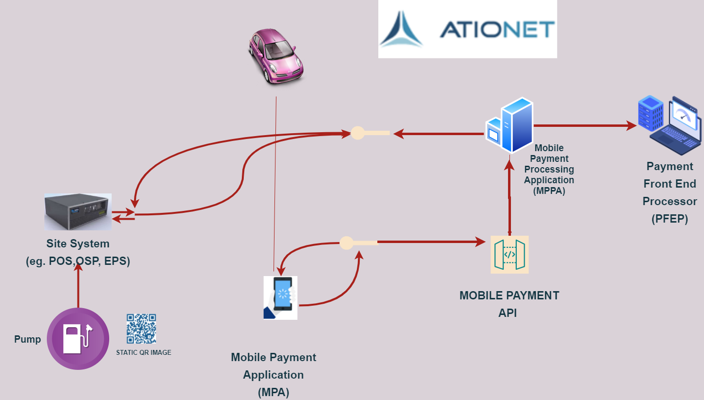
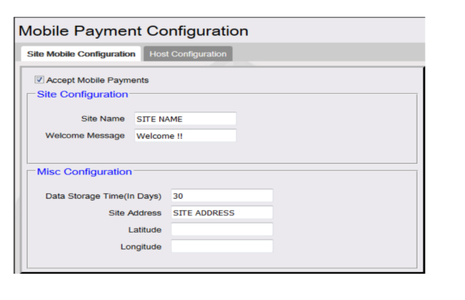
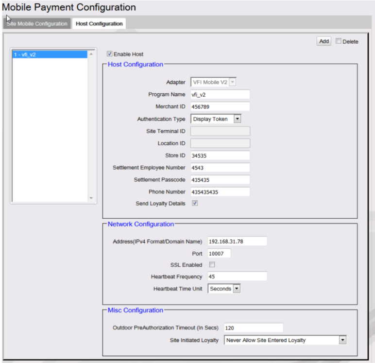
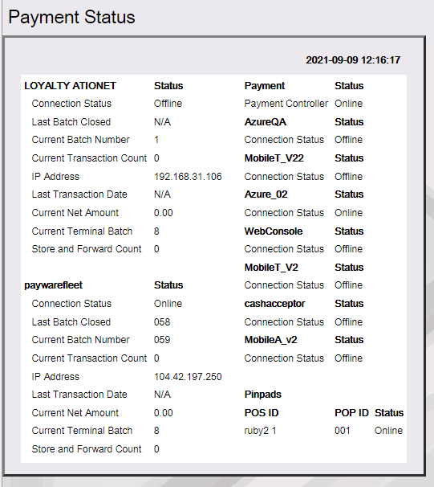
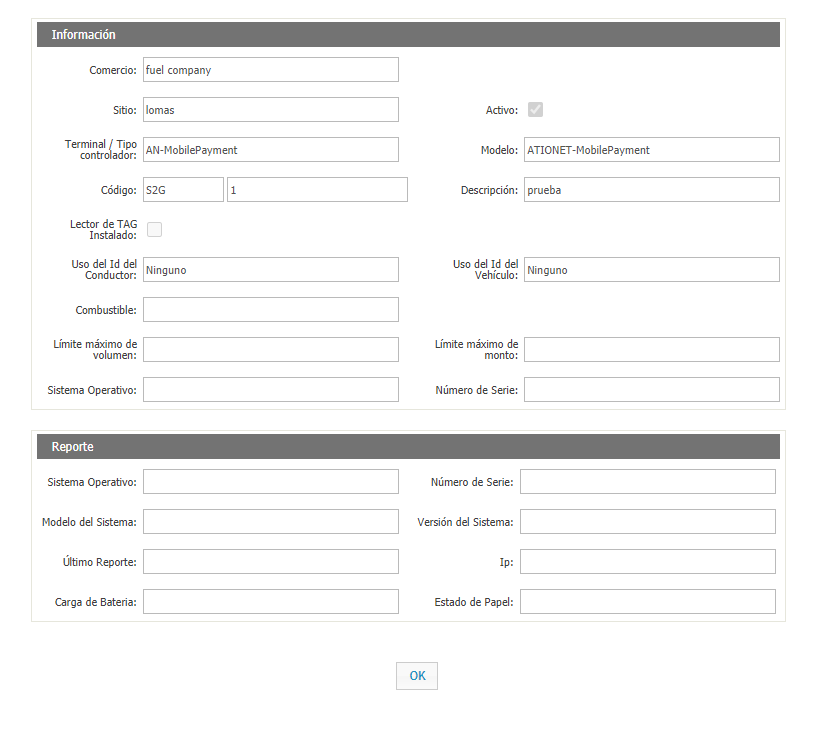
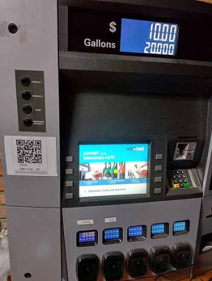
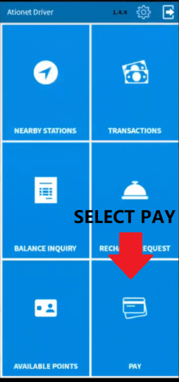

# Ationet Fleet Mobile Payment Fully Integrated #

|Document Information||
|--- |--- |
|File:|ATIONet - Dynamic QR Code Payments|
|Doc Version:|1.0|
|Release Date:|02, September 2021|
|Author:|ATIONet LLC|

|Change Log|||
|--- |--- |--- |
|Ver.|Date|Change Summary|
|1.0|02/September/2021|Initial version.|

## Contents ##

- [Overview](#overview)
	- [Introduction](#introduction)
	- [Entities](#Entities)
	- [Sequence diagram Pay at Pump with Above Site Payment Authorization](#Sequence-diagram-Pay-at-Pump-with-Above-Site-Payment-Authorization)
- [Site System Implementation guide](#Site-System-Implementation-guide)
	- [STEP 1 Site Mobile Configuration](#STEP-1-Site-Mobile-Configuration)
	- [STEP 2 Host Mobile Configuation](#STEP-2-Host-Mobile-Configuation)
		- [Check Status](#Check-Status)
		- [Values descriptions](#Values-descriptions)
		- [Status Codes and Messages](#Status-Codes-and-Messages)
	- [STEP 3 ATIONet Configuration](#STEP-3-ATIONet-Configuration)
	- [Static QR Image](#Static-QR-Image)
	- [How to generate QR Code Image](#How-to-generate-QR-Code-Image)
- [ATIONet PFEP Fleet Mobile Payment Api](#ATIONet-PFEP-Fleet-Mobile-Payment-Api)
	- [Description](#description)
	- [Details](#api-details)	
	- [Supported Transactions](#supported-transactions)
	- [Message Structure](#message-structure)
		- [MobilePayments](#mobilePayments)
		- [GetTransaction](#getTransaction)
		- [Cancel](#cancel)
	- [Field Descriptions](#field-descriptions)
	- [Error Handling](#error-handling)
	- [Transactions States](#transactions-states)
		- [Transaction states sequence diagram on Pre authorization Request](#transactionstates-sequence-diagram-on-pre-authorization-request)
		- [Transaction states sequence diagram on Cancelation Request](#transaction-states-sequence-diagram-on-cancelation-request)
	- [Response Codes](#response-codes)
	- [Message Samples](#message-samples)
		- [MobilePayments ](#mobilePayments)
		- [PreAuthorizedPayments ](#preAuthorizedpayments)
		- [GetTransaction ](#gettransaction)
		- [Cancel ](#cancel)
- [EXTERNAL PFEP Fleet Mobile Payment Api](EXTERNAL_Mobile_Payment_Fleet_Api_-EN.md)
</br>


><h3>IMPORTANT: The following document is only valid for the COMMANDER configuration.</h3>


## Overview



### Introduction

This Implementation Guide is intended to guide petroleum convenience retailers and their associated vendors when implementing mobile payment solutions consistent with
ISO 12812. 
</br>
>Note: ISO 12812 is document that will provide requirements, guidance and use cases for all stakeholders in the mobile payments arena.


### Entities

This section outlines the logical entities, including location options, for Mobile Payment and identifies possible physical architectures. The term “entity” is used in this
document to differentiate logical processing functionality without regard to its physical location in an implementation. 


```Mobile Payment Application (MPA):```  This entity is a software application embedded in a Mobile Device or downloaded by a consumer onto a Mobile Device, such as a smart
phone or tablet, which enables mobile payments for in-store and forecourt transactions.

```Mobile Payment Processing Application (MPPA):``` This entity is an application provided by the Mobile Payment Processor (MPP) not on the Mobile Device that is responsible for
interfacing between the Token Vault or Token/Trusted Service Provider, the MPA, the Site System, the Payment Front End Processor (PFEP), and the Loyalty Front End Processor (LFEP) in order to authorize transactions.

```Payment Front End Processor (PFEP):``` This entity is a host that facilitates the authorization of payment transactions between the MPPA or the Site System and the
Issuer networks. The standard does not dictate the processing that is performed by the PFEP for each payment method. This entity is sometimes referred to as the Front End
Processor (FEP).

```Site System:``` This entity encompasses the site equipment and components (hardware and software) and may perform the function of local card processing business rules,
such as consumer prompting, local velocity checking and receipt formatting and printing. Examples of site systems include Point of Sale (POS), Outside Sales Processor
(OSP), Electronic Payment Server (EPS) and Forecourt Device Controller (FDC).
</br>
>Note: MOBILE PAYMENT API is the common interface through which the MPA sends and receives requests from the MPPA. The description, you can read about  the methods and how to consume in [API Section](#ATIONet-PFEP-Fleet-Mobile-Payment-Api).


### Sequence diagram Pay at Pump with Above Site Payment Authorization 


<ol>
	<li>Mobile Payment Application (MPA) is activated by consumer.</li>
	<li>MPA determines location and fueling point.</li>
	<li>MPA sends information to MPPA as an Authorization Request.</li>
	<li>MPPA optionally sends a Mobile Pump Reserve Request to the Site System to reserve the fueling point.</li>
	<li>Site System responds to the Mobile Pump Reserve Request.</li>
	<li>The MPPA sends a Mobile Auth Request to the Site System. If generated, the validation code in the payload.</li>
	<li>The PFEP (through the site system) sends the Mobile Auth Response to the MPPA.</li>
	<li>The MPPA sends a Mobile Auth Request to Site Systen.</li>
	<li>The Site Systen response to MPPA with a Mobile Auth Response.</li>
	<li>MPPA sends an Authorizacion Response to MPA</li>
	<li>Mobile Begin Fueling Response is sent from MPPA to Site System.</li>
	<li>Site System sends a Mobile Loyalty Award Request message to give the MPPA the opportunity to adjust the rewards. This message is always sent after fueling as
the final amount is not determined until fueling is complete.</li>
	<li>The MPPA sends a response to the Site System with the additional rewards information.</li>
	<li>Site System sends Mobile Finalize Request to MPPA with completion information.</li>
	<li>MPPA sends Completion Request to PFEP.</li>
	<li>PFEP send Completion Response message to MPPA.</li>
	<li>MPPA sends Mobile Finalize Response to Site System. Note: If additional or
updated receipt information is included in this response, the Site System may
need to regenerate the receipt information.</li>
	<li>Site System sends receipt information to the MPPA.</li>
	<li> MPPA sends receipt information to MPA.</li>
	<li>Site System prints the receipt (if applicable).</li>
	<li>MPPA sends a receipt response back to the Site System.</li>
</ol>


# Site System Implementation guide

```Commander``` will provide a ConfigClient screen for configuration of Mobile Payments. These details will be provided by MPPA to commander. The screen will provide for configuration options for Site Details, and host configurations and connectivity parameters. The image below is an example. Some Mobile Payments
Processing Applications might require more information than others.
</br>
>You have to request de configuration values to ATIONet.

## STEP 1 Site Mobile Configuration

</br>

```
Note: The values in the image are for example. You must request the corresponding values from ATIONet.
```
</br>




## STEP 2 Host Mobile Configuation

</br>

```
Note: The values in the image are for example. You must request the corresponding values from ATIONet.
```
</br>



>We recommended check the conection status after complete configuration.

### Check Status

After completing the configuration, if all the entered values are correct, you should see the status of the site created `online`.

To be able to check this, go to the menu Tools -> Helpdesk Diagnostic -> Payment




### Values descriptions

</br>
<table>
	<thead>
		<tr valign="center">
			<th>
				Site configuration Information
			</th>
			<th>
				Description
			</th>
		</tr>
	</thead>
	<tbody>
		<tr valign="top">
			<td>
				<p align="left">Enable Host</p>
			</td>
			<td>
				<p align="left">Enable/Disable messaging to this particular host. If the box is not checked messages will not be sent to this particular host.</p>
			</td>
		 </tr>
		<tr valign="top">
			<td>
				<p align="left">Adapter</p>
			</td>
			<td>
				<p align="left">Mobile payment APIs used by commander for communication with MPPA.</p>
			</td>
		 </tr>
		<tr valign="top">
			<td>
				<p align="left">Program Name</p>
			</td>
			<td>
				<p align="left">Program name as defined by MPPA.</p>
			</td>
		 </tr>
		<tr valign="top">
			<td>
				<p align="left">Authentication Type</p>
			</td>
			<td>
				<p align="left">Authentication mode supported by MPPA for that adapter.</p>
			</td>
		 </tr>
		<tr valign="top">
			<td>
				<p align="left">Host IP address</p>
			</td>
			<td>
				<p align="left">IP address will be used by commander for communication with MPPA.</p>
			</td>
		 </tr>
		<tr valign="top">
			<td>
				<p align="left">Port</p>
			</td>
			<td>
				<p align="left">Service Port will be used by commander for communication with MPPA.</p>
			</td>
		 </tr>
		<tr valign="top">
			<td>
				<p align="left">SSL Enabled</p>
			</td>
			<td>
				<p align="left">Commander uses this Boolean for SSL communication or no-SSL communication between commander and MPPA.</p>
			</td>
		 </tr>
		<tr valign="top">
			<td>
				<p align="left">Site Terminal ID</p>
			</td>
			<td>
				<p align="left">This number is supplied by MPPA as terminal identification number.</p>
			</td>
		 </tr>
		<tr valign="top">
			<td>
				<p align="left">Merchant ID</p>
			</td>
			<td>
				<p align="left">Merchant Id given to the store by the MPPA.</p>
			</td>
		 </tr>
		<tr valign="top">
			<td>
				<p align="left">Location ID</p>
			</td>
			<td>
				<p align="left">Location ID is given by the MPPA which identifies a site of a merchant during on boarding process.</p>
			</td>
		 </tr>
		<tr valign="top">
			<td>
				<p align="left">Settlement Employee Number</p>
			</td>
			<td>
				<p align="left">Number used by commander for settlement with MPPA.</p>
			</td>
		 </tr>
		<tr valign="top">
			<td>
				<p align="left">Settlement Passcode</p>
			</td>
			<td>
				<p align="left">Password used during settlement assigned by MPPA.</p>
			</td>
		 </tr>
		</tbody>
</table>

</br>


<table>
	<thead>
		<tr valign="center">
			<th>
				Site Initiated Loyalty
			</th>
			<th>
				Description
			</th>
		</tr>
	</thead>
	<tbody>
		<tr valign="top">
			<td>
				<p align="left">Never Allow Site Entered Loyalty</p>
			</td>
			<td>
				<p align="left">If this option is selected, the site will be restricted to accepting loyalty only from the site or only from the MPPA. If a transaction already contains loyalty (i.e. the consumer has swiped a loyalty card prior to starting the mobile transaction) the MobileReserve / Auth will be rejected. This enforces that mobile loyalty and site entered loyalty cannot co-exist.</p>
			</td>
		 </tr>
		<tr valign="top">
			<td>
				<p align="left">Allow Site Entry i.e., Swiped Loyalty Card</p>
			</td>
			<td>
				<p align="left">Both Mobile loyalty and site card swipe loyalty are allowed and Mobile payments can be tendered at DCR.</p>
			</td>
		 </tr>
		<tr valign="top">
			<td>
				<p align="left">Allow Site Entered Loyalty if no Mobile Loyalty</p>
			</td>
			<td>
				<p align="left">
					<ol>
						<li>If Mobile Loyalty is not present, loyalty card swipe at DCR will be accepted.</li>
						<li>If Mobile Loyalty is present and Loyalty Card is swiped at DCR, MobileReserve/Auth will be rejected.</li>
					</ol>
				</p>
			</td>
		 </tr>
		</tbody>
</table>


### Status Codes and Messages

The first two digits of the response code identify the message pair type. The last 3 digits is the error identifier for the status. A ‘good’ status is always represented as 00000 regardless of the message type.


<table>
	<thead>
		<tr valign="center">
			<th>
				Message Type
			</th>
			<th>
				Response Code
			</th>
			<th>
				Message Code
			</th>
			<th>
				Overall Result
			</th>
			<th>
				Description
			</th>
		</tr>
	</thead>
	<tbody>
		<tr valign="top">
			<td>
				<p align="left">All</p>
			</td>
			<td>
				<p align="left">00000</p>
			</td>
			<td>
				<p align="left">Success</p>
			</td>
			<td>
				<p align="left">Success</p>
			</td>
			<td>
				<p align="left">Message was successfully processed.</p>
			</td>
		 </tr>
		<tr valign="top">
			<td>
				<p align="left">All</p>
			</td>
			<td>
				<p align="left">00001</p>
			</td>
			<td>
				<p align="left">Generic Error</p>
			</td>
			<td>
				<p align="left">Failure</p>
			</td>
			<td>
				<p align="left">An unexpected error has occurred while processing the request message.</p>
			</td>
		 </tr>
		<tr valign="top">
			<td>
				<p align="left">All</p>
			</td>
			<td>
				<p align="left">00001</p>
			</td>
			<td>
				<p align="left">Generic Error</p>
			</td>
			<td>
				<p align="left">MissingMandatoryData</p>
			</td>
			<td>
				<p align="left">Mandatory data is missing from the request header.</p>
			</td>
		 </tr>
		<tr valign="top">
			<td>
				<p align="left">MobileAuth</p>
			</td>
			<td>
				<p align="left">02001</p>
			</td>
			<td>
				<p align="left">Generic Error</p>
			</td>
			<td>
				<p align="left">Failure</p>
			</td>
			<td>
				<p align="left">Unexpected error while processing the MobileAuthRequest data.</p>
			</td>
		 </tr>
		<tr valign="top">
			<td>
				<p align="left">MobileAuth</p>
			</td>
			<td>
				<p align="left">02001</p>
			</td>
			<td>
				<p align="left">Generic Error</p>
			</td>
			<td>
				<p align="left">MissingMandatoryData</p>
			</td>
			<td>
				<p align="left">Mandatory data is missing from the MobileAuthRequest</p>
			</td>
		 </tr>
		<tr valign="top">
			<td>
				<p align="left">MobileAuth</p>
			</td>
			<td>
				<p align="left">02002</p>
			</td>
			<td>
				<p align="left">Invalid info in MobileTxnInfo element</p>
			</td>
			<td>
				<p align="left">Failure</p>
			</td>
			<td>
				<p align="left">The header info matches an already processed transaction.</p>
			</td>
		 </tr>
		<tr valign="top">
			<td>
				<p align="left">MobileAuth</p>
			</td>
			<td>
				<p align="left">02002</p>
			</td>
			<td>
				<p align="left">Invalid info in MobileTxnInfo element</p>
			</td>
			<td>
				<p align="left">MissingMandatoryData</p>
			</td>
			<td>
				<p align="left">The header is missing mandatory data to complete Auth processing.</p>
			</td>
		 </tr>
		<tr valign="top">
			<td>
				<p align="left">MobileAuth</p>
			</td>
			<td>
				<p align="left">02003</p>
			</td>
			<td>
				<p align="left">POS or Fueling Position in use</p>
			</td>
			<td>
				<p align="left">Failure</p>
			</td>
			<td>
				<p align="left">The targeted fueling position is already in use. (Unused) </p>
			</td>
		 </tr>
		<tr valign="top">
			<td>
				<p align="left">MobileAuth</p>
			</td>
			<td>
				<p align="left">02004</p>
			</td>
			<td>
				<p align="left">POS or Fueling Position in use</p>
			</td>
			<td>
				<p align="left">Failure</p>
			</td>
			<td>
				<p align="left">The Commander was unable to process the authorization request. Communication with the POS or fueling position has been lost.</p>
			</td>
		 </tr>
		<tr valign="top">
			<td>
				<p align="left">MobileAuth</p>
			</td>
			<td>
				<p align="left">02005</p>
			</td>
			<td>
				<p align="left">Unknown POS or Fueling Position</p>
			</td>
			<td>
				<p align="left">Failure</p>
			</td>
			<td>
				<p align="left">The targeted fueling position is not configured.(Unused)</p>
			</td>
		 </tr>
		<tr valign="top">
			<td>
				<p align="left">MobileCancel</p>
			</td>
			<td>
				<p align="left">04001</p>
			</td>
			<td>
				<p align="left">Generic Error</p>
			</td>
			<td>
				<p align="left">Failure</p>
			</td>
			<td>
				<p align="left">Unexpected error while trying to cancel the transaction. It is likely too late in the transaction to honor.</p>
			</td>
		 </tr>
		<tr valign="top">
			<td>
				<p align="left">MobileCancel</p>
			</td>
			<td>
				<p align="left">04003</p>
			</td>
			<td>
				<p align="left">04003</p>
			</td>
			<td>
				<p align="left">Failure</p>
			</td>
			<td>
				<p align="left">The Commander is beyond the point to honor a cancel request.</p>
			</td>
		 </tr>
		<tr valign="top">
			<td>
				<p align="left">MobileCancel</p>
			</td>
			<td>
				<p align="left">04004</p>
			</td>
			<td>
				<p align="left">Invalid state - dispenser is fueling</p>
			</td>
			<td>
				<p align="left">Failure</p>
			</td>
			<td>
				<p align="left">Cancel occurred while dispensing fuel.</p>
			</td>
		 </tr>
		<tr valign="top">
			<td>
				<p align="left">MobileCancel</p>
			</td>
			<td>
				<p align="left">04005</p>
			</td>
			<td>
				<p align="left">Invalid Dispenser number</p>
			</td>
			<td>
				<p align="left">Failure</p>
			</td>
			<td>
				<p align="left">The targeted fueling position does not match the original authorized fueling position.</p>
			</td>
		 </tr>
		<tr valign="top">
			<td>
				<p align="left">MobileCancel</p>
			</td>
			<td>
				<p align="left">04006</p>
			</td>
			<td>
				<p align="left">Invalid payment/auth information</p>
			</td>
			<td>
				<p align="left">Failure</p>
			</td>
			<td>
				<p align="left">The payment info does not match the original payment info.</p>
			</td>
		 </tr>
		<tr valign="top">
			<td>
				<p align="left">MobileCancel</p>
			</td>
			<td>
				<p align="left">04007</p>
			</td>
			<td>
				<p align="left">Unknown transaction or authorization</p>
			</td>
			<td>
				<p align="left">Failure</p>
			</td>
			<td>
				<p align="left">There is no active transaction to cancel matching the provided header.</p>
			</td>
		 </tr>
		<tr valign="top">
			<td>
				<p align="left">MobileCancel</p>
			</td>
			<td>
				<p align="left">04008</p>
			</td>
			<td>
				<p align="left">04008</p>
			</td>
			<td>
				<p align="left">Failure</p>
			</td>
			<td>
				<p align="left">Unexpectedly failed to cancel</p>
			</td>
		 </tr>
		<tr valign="top">
			<td>
				<p align="left">MobilePumpReserve</p>
			</td>
			<td>
				<p align="left">06001</p>
			</td>
			<td>
				<p align="left">Generic Error</p>
			</td>
			<td>
				<p align="left">Failure</p>
			</td>
			<td>
				<p align="left">Unexpected pump reserve failure</p>
			</td>
		 </tr>
		<tr valign="top">
			<td>
				<p align="left">MobilePumpReserve</p>
			</td>
			<td>
				<p align="left">06001</p>
			</td>
			<td>
				<p align="left">Generic Error</p>
			</td>
			<td>
				<p align="left">MissingMandatoryData</p>
			</td>
			<td>
				<p align="left">Data mandatory to handling the pump reserve request is not present.</p>
			</td>
		 </tr>
		<tr valign="top">
			<td>
				<p align="left">MobilePumpReserve</p>
			</td>
			<td>
				<p align="left">06002</p>
			</td>
			<td>
				<p align="left">Invalid info in MobileTxnInfo element</p>
			</td>
			<td>
				<p align="left">Failure</p>
			</td>
			<td>
				<p align="left">The header information(UMTI) was present in an already processed transaction.</p>
			</td>
		 </tr>
		<tr valign="top">
			<td>
				<p align="left">MobilePumpReserve</p>
			</td>
			<td>
				<p align="left">06002</p>
			</td>
			<td>
				<p align="left">Invalid info in MobileTxnInfo element</p>
			</td>
			<td>
				<p align="left">MissingMandatoryData</p>
			</td>
			<td>
				<p align="left">Data required to reserve a fueling position is missing from the request message.</p>
			</td>
		 </tr>
		<tr valign="top">
			<td>
				<p align="left">MobilePumpReserve</p>
			</td>
			<td>
				<p align="left">06003</p>
			</td>
			<td>
				<p align="left">Fueling Position in use</p>
			</td>
			<td>
				<p align="left">Failure</p>
			</td>
			<td>
				<p align="left">The dispenser is not ready to reserve for a mobile transaction. It is in use or handling configuration updates.</p>
			</td>
		 </tr>
		<tr valign="top">
			<td>
				<p align="left">MobilePumpReserve</p>
			</td>
			<td>
				<p align="left">06004</p>
			</td>
			<td>
				<p align="left">Fueling Position inaccessible/offline</p>
			</td>
			<td>
				<p align="left">Failure</p>
			</td>
			<td>
				<p align="left">The targeted dispenser is configured, but offline.</p>
			</td>
		 </tr>
		<tr valign="top">
			<td>
				<p align="left">MobilePumpReserve</p>
			</td>
			<td>
				<p align="left">06005</p>
			</td>
			<td>
				<p align="left">Unknown POS or Fueling Position</p>
			</td>
			<td>
				<p align="left">Failure</p>
			</td>
			<td>
				<p align="left">The targeted dispenser is not configured.</p>
			</td>
		 </tr>
		<tr valign="top">
			<td>
				<p align="left">MobileTransactionData</p>
			</td>
			<td>
				<p align="left">13001</p>
			</td>
			<td>
				<p align="left">Generic Error</p>
			</td>
			<td>
				<p align="left">MissingMandatoryData</p>
			</td>
			<td>
				<p align="left">The transaction data request is missing data required for processing.</p>
			</td>
		 </tr>
		<tr valign="top">
			<td>
				<p align="left">MobileTransactionData</p>
			</td>
			<td>
				<p align="left">13002</p>
			</td>
			<td>
				<p align="left">Invalid Transaction Data Header</p>
			</td>
			<td>
				<p align="left">Failure</p>
			</td>
			<td>
				<p align="left">This is a duplicate transaction for an already processed transaction, or the transaction does not exist on the system.</p>
			</td>
		 </tr>
		</tbody>
</table>

## STEP 3 ATIONet Configuration

### Sites

In the Sites menu, in the site that you want to start operating with Mobile Payments, you must update the information of the cell phone payment mode and add the FullyIntegraded type.

Once this is done you will be able to generate the QR code to paste on the pump. It should generate one per pump and each one must create introducing the Pump Code.


>You can read more about QR in the [Static QR Image](#Static-QR-Image) section.


### Terminals/Controlers

In the Terminals/ Cotrolers menu You have to create a new Terminal of the type AN-MobilePayment.



### Static QR Image

Static QR Image is a photo that is pasted in the Pump and contains the pump Number and the Site code, it's mandatory data to do a Transacction.
Below is an image as an example



```

Using the ATIONet Mobile Driver App, the Customer can read the Imagen QR and do a Transaction more easier.

```



<ol>
	<li>The customer arrives at the service station and chooses a free pump</li>
	<li>Customer open the ATIONet mobile driver app and select Pay</li>
	<li>Choses Scan the QR code using his cell phone option</li>
	<li>Customer scans the QR code and get the site info</li>
	<li>Finally, chooses Fuel and amount and touch confirm to approve Transaction</li>
</ol>


>Note: The QR code Image must be of the type free text.


# ATIONet PFEP Fleet Mobile Payment Api

### Introduction

This specification is intended to document ATIONet’s fleet Mobile Payment API messaging format and related features required for usarage. The following sections provide descriptions of the messages themselves, the expected behaviour for each supported transaction type and a common ground for the functionality of each relevant item.

>IMPORTANT: `ATIONet` is the PFEP that  facilitates the authorization of payment transactions between the MPPA and the Issuer networks. Fleet Mobile payment Api with External PFEP are available [here](EXTERNAL_Mobile_Payment_Fleet_Api_-EN.md).

 
## Description 

ATIONet’s fleet Mobile Payment API It is responsible for creating pre-authorizations, obtaining information on a Transaction and Canceling a pre-authorization, as long as it meets the requirements to do so.

### API Details

API URI: *ationetmobilepayment-appshost-test.azurewebsites.net/*

### Supported Transactions

<table>
	<thead>
		<tr valign="center">
			<th rowspan="2" width="125" align="left">
				Name
			</th>
			<th colspan="2" align="center">
				Ver.
			</th>
			<th rowspan="2" align="left">
				Description
			</th>
		</tr>
		 <tr valign="top">
			  <th align="center">
					Initial
			  </th>
			  <th align="center">
					Change
			  </th>
		 </tr>
	</thead>
	<tbody>
		 <tr valign="top">
			<td>
				<p align="left">MobilePayments</p>
			</td>
			<td>
				<p align="center">1.0</p>
			</td>
			<td></td>
			<td>
				<p align="left">Used to validate a sale request, return the Transaction ID. If the Sale already exists, returns the ID.</p>
			</td>
		 </tr>
		 <tr valign="top">
			<td>
				<p align="left">PreAuthorizedPayments</p>
			</td>
			<td>
				<p align="center">1.0</p>
			</td>
			<td></td>
			<td>
				<p align="left">Used to do a sale request with external approval, returns Transaction ID.
				</p>
			</td>
		 </tr>
		 <tr valign="top">
			<td>
				<p align="left">GetTransaction</p>
			</td>
			<td>
				<p align="center">1.0</p>
			</td>
			<td></td>
			<td>
				<p align="left">Returns a Sale information.</p>
			</td>
		 </tr>
		 <tr valign="top">
			<td>
				<p align="left">Cancel</p>
			</td>
			<td>
				<p align="center">1.1</p>
			</td>
			<td></td>
			<td>
				<p align="left">Cancels a Sale.</p>
			</td>
		 </tr>
		 
	
</table>


## Message Structure

This section describe the message structure for each API Method available, as well as the responses messages for each one.

### MobilePayments 

Create a Sale with Ationet authorization. The sale creation recibes an ID, if this ID already exists then the method returns the Sale's Id.

#### Request Format

*URL: /api/MobilePayments* </br>
*Method: POST* </br>
*Body: { "siteCode":"string", "pumpNumber": integer, "fuelCode": "string", "amount": double, "primaryTrack": string, "terminalCode": "string", "mobilePaymentMode": integer, "potencyKeyId": "string" ,  "externalReferanceID":"string" }* </br>

#### Response Format

*Header:*

	Content-Type: application/json; charset=utf-8
	content-encoding: gzip 

*Body:	{ “TransactionId”:”StringValue” }*


### GetTransaction

#### Request Format

*URL: /api/MobilePayments/GetTransaction/{id}* </br>
*Method: GET* </br>
*Body: { "id": "string" }* </br>

#### Response Format

*Header:*

	Content-Type: application/json; charset=utf-8
	content-encoding: gzip 

*Body: {
  "id":"string", </br>
  "siteCode":"string", </br>
  "primaryTrack":"string", </br>
  "odometer": double, </br>
  "terminalIdentification":"string", </br>
  "transactionSequenceNumber":integer, </br>
  "state_Name":"string",</br>
  "state_Id":integer,</br>
  "paymentProcessorReferenceId":"string",</br>
  "paymentProcessorMessage":"string",</br>
  "siteSystemMessage":"string",</br>
  "fuelPointNumber":integer,</br>
  "paymentMethod":"string",</br>
  "requestedAmount":double,</br>
  "authorizedAmount":double,</br>
  "dispatchedAmount":double,</br>
  "dispatchedQuantity":double,</br>
  "productCode":"string",</br>
  "productDescription":"string",</br>
  "productUnitPrice":double,</br>
  "unitMeasure":"string",</br>
  "createDateTime":"string",</br>
  "updateDateTime":"string"</br>
}*

### Cancel 

Cancels a Sale that is in course as long as your status is correct. In the following diagram you can check all cancellable transaction statuses - [Transaction states sequence diagram on Cancelation Request](#transaction-states-sequence-diagram-on-cancelation-request).

#### Request Format

*URL: /api/MobilePayments/Cancel* </br>
*Method: POST* </br>
*Body:{ “TransactionId”:”StringValue” }*
{
  "transactionId": "StringValue",
  "isSuccessCanceled": bool,
  "responseCode": "StringValue",
  "responseMessage": "StringValue"
}
</br>

#### Response Format

*Header:*

	Content-Type: application/json; charset=utf-8
	content-encoding: gzip 

*Body:{ ”transactionId”: ”StringValue”, ”isSuccessCanceled”: ”bool”, ”responseCode"”: ”string”, ”responseMessage”: ”string” }*


## Field Descriptions

This section describe through a table  all parameters from request.

<table>
	<thead>
		<tr valign="center">
			<th rowspan="3" width="400" align="left">
				Method
			</th>
			<th rowspan="3" width="125" align="left">
				Paramether
			</th>
			<th rowspan="3" width="125" align="left">
				Type
			</th>
			<th rowspan="3" width="225" align="left">
				Description
			</th>
		</tr>
	</thead>
	<tbody>
		 <tr valign="top">
			<td>
				<p align="left">MobilePayments</p>
			</td>
			<td>
				<p align="left">siteCode</p>
			</td>
			<td>
			 	<p align="left">string</p>
			 </td>
			<td>
				<p align="left">The site code</p>
			</td>
		 </tr>
		 <tr valign="top">
			<td>
				<p align="left">MobilePayments</p>
			</td>
			<td>
				<p align="left">pumpNumber</p>
			</td>
			<td>
			 	<p align="left">integer</p>
			 </td>
			<td>
				<p align="left">The pump number</p>
			</td>
		 </tr>
		<tr valign="top">
			<td>
				<p align="left">MobilePayments</p>
			</td>
			<td>
				<p align="left">fuelCode</p>
			</td>
			<td>
			 	<p align="left">string</p>
			 </td>
			<td>
				<p align="left">The fuel code</p>
			</td>
		 </tr>
		<tr valign="top">
			<td>
				<p align="left">MobilePayments</p>
			</td>
			<td>
				<p align="left">amount</p>
			</td>
			<td>
			 	<p align="left">double</p>
			 </td>
			<td>
				<p align="left">Number of liters of fuel to dispatch</p>
			</td>
		 </tr>
		<tr valign="top">
			<td>
				<p align="left">MobilePayments</p>
			</td>
			<td>
				<p align="left">primaryTrack</p>
			</td>
			<td>
			 	<p align="left">string</p>
			 </td>
			<td>
				<p align="left">The number associated with the card</p>
			</td>
		 </tr>
		<tr valign="top">
			<td>
				<p align="left">MobilePayments</p>
			</td>
			<td>
				<p align="left">terminalCode</p>
			</td>
			<td>
			 	<p align="left">string</p>
			 </td>
			<td>
				<p align="left">The terminal code</p>
			</td>
		 </tr>		
		<tr valign="top">
			<td>
				<p align="left">MobilePayments</p>
			</td>
			<td>
				<p align="left">mobilePaymentMode</p>
			</td>
			<td>
			 	<p align="left">integer</p>
			 </td>
			<td>
				<p align="left">The operation mode Code. It can be for 1 for Fullintegrated</p>
			</td>
		 </tr>
		<tr valign="top">
			<td>
				<p align="left">MobilePayments</p>
			</td>
			<td>
				<p align="left">potencyKeyId</p>
			</td>
			<td>
			 	<p align="left">string</p>
			 </td>
			<td>
				<p align="left">The Transaction's ID</p>
			</td>
		 </tr>		
		<tr valign="top">
			<td>
				<p align="left">PreAuthorizedPayments</p>
			</td>
			<td>
				<p align="left">externalReferenceID</p>
			</td>
			<td>
			 	<p align="left">string</p>
			 </td>
			<td>
				<p align="left">Authorization reference ID</p>
			</td>
		 </tr>
		<tr valign="top">
			<td>
				<p align="left">GetTransaction | Cancel</p>
			</td>
			<td>
				<p align="left">transactionId</p>
			</td>
			<td>
			 	<p align="left">string</p>
			 </td>
			<td>
				<p align="left">Transaction ID</p>
			</td>
		 </tr>
</table>


## Error Handling

Success/failure exits on the Native Transaction Protocol will be handled via HTTP status codes.

Successful request will get a HTTP 200 and the resulting response.

Failure to process the request will be indicated by an HTTP 400’s range status code.


## Transactions States

This section describe through a table  all  states that a sale can have.


<table>
	<thead>
		<tr valign="center">
			<th rowspan="2" width="125" align="left">
				State name
			</th>			
			<th rowspan="2" width="125" align="center">
				ID
			</th>			
			<th rowspan="2" width="125" align="left">
				Message
			</th>
		</tr>		
	</thead>
	<tbody>
		 <tr valign="top">
			<td>
				<p align="left">Created</p>
			</td>
			<td>
				<p align="center">1</p>
			</td>
			<td>
				<p align="left">Created</p>
			</td>
		 </tr>
		<tr valign="top">
			<td>
				<p align="left">PreauthorizationAccepted</p>
			</td>
			<td>
				<p align="center">2</p>
			</td>
			<td>
				<p align="left">Preauthorization Accepted</p>
			</td>
		 </tr>
		<tr valign="top">
			<td>
				<p align="left">PreauthorizationRejected</p>
			</td>
			<td>
				<p align="center">3</p>
			</td>
			<td>
				<p align="left">Preauthorization Rejected</p>
			</td>
		 </tr>
		<tr valign="top">
			<td>
				<p align="left">FuelPointAuthorizationRequested</p>
			</td>
			<td>
				<p align="center">4</p>
			</td>
			<td>
				<p align="left">FuelPoint Authorization Requested</p>
			</td>
		 </tr>
		<tr valign="top">
			<td>
				<p align="left">PumpReserveAccepted</p>
			</td>
			<td>
				<p align="center">5</p>
			</td>
			<td>
				<p align="left">Site System Accept Pump Reserve</p>
			</td>
		 </tr>
		<tr valign="top">
			<td>
				<p align="left">PumpReserveRefused</p>
			</td>
			<td>
				<p align="center">6</p>
			</td>
			<td>
				<p align="left">Site System not Accept Pump Reserve</p>
			</td>
		 </tr>
		<tr valign="top">
			<td>
				<p align="left">FuelPointAuthorized</p>
			</td>
			<td>
				<p align="center">7</p>
			</td>
			<td>
				<p align="left">Fuel Point Authorized</p>
			</td>
		 </tr>
		<tr valign="top">
			<td>
				<p align="left">CanceledByFuelPoint</p>
			</td>
			<td>
				<p align="center">8</p>
			</td>
			<td>
				<p align="left">Canceled By Fuel Point</p>
			</td>
		 </tr>
		<tr valign="top">
			<td>
				<p align="left">Fueling</p>
			</td>
			<td>
				<p align="center">9</p>
			</td>
			<td>
				<p align="left">Fueling</p>
			</td>
		 </tr>
		<tr valign="top">
			<td>
				<p align="left">Complete</p>
			</td>
			<td>
				<p align="center">10</p>
			</td>
			<td>
				<p align="left">Complete</p>
			</td>
		 </tr>
		<tr valign="top">
			<td>
				<p align="left">CompleteFailed</p>
			</td>
			<td>
				<p align="center">11</p>
			</td>
			<td>
				<p align="left">Complete Failed</p>
			</td>
		 </tr>
		<tr valign="top">
			<td>
				<p align="left">CancelationRequested</p>
			</td>
			<td>
				<p align="center">12</p>
			</td>
			<td>
				<p align="left">Cancelation Requested</p>
			</td>
		 </tr>
		<tr valign="top">
			<td>
				<p align="left">CanceledByUser</p>
			</td>
			<td>
				<p align="center">13</p>
			</td>
			<td>
				<p align="left">Canceled By User</p>
			</td>
		 </tr>
		<tr valign="top">
			<td>
				<p align="left">CanceledBySiteSystem</p>
			</td>
			<td>
				<p align="center">14</p>
			</td>
			<td>
				<p align="left">Canceled By Site System</p>
			</td>
		 </tr>
		<tr valign="top">
			<td>
				<p align="left">FuelPointDeauthorizationRequested</p>
			</td>
			<td>
				<p align="center">15</p>
			</td>
			<td>
				<p align="left">Fuel Point Deauthorization Requested</p>
			</td>
		 </tr>
		<tr valign="top">
			<td>
				<p align="left">SessionError</p>
			</td>
			<td>
				<p align="center">16</p>
			</td>
			<td>
				<p align="left">Session not available</p>
			</td>
		 </tr>
		<tr valign="top">
			<td>
				<p align="left">UnknownError</p>
			</td>
			<td>
				<p align="center">17</p>
			</td>
			<td>
				<p align="left">Unknown error when trying to connect with session</p>
			</td>
		 </tr>
		<tr valign="top">
			<td>
				<p align="left">SiteSystemError</p>
			</td>
			<td>
				<p align="center">18</p>
			</td>
			<td>
				<p align="left">Site System Generic error</p>
			</td>
		 </tr>
		<tr valign="top">
			<td>
				<p align="left">SiteSystemError</p>
			</td>
			<td>
				<p align="center">19</p>
			</td>
			<td>
				<p align="left">Cancelled By MPPA</p>
			</td>
		 </tr>
</table>


### Transaction states sequence diagram on Pre authorization Request


### Transaction states sequence diagram on Cancelation Request


## Response Codes

### MobilePayments codes
	
Both methos response the same codes.

<table>
	<thead>
		<tr valign="center">
			<th rowspan="3" width="125" align="left">
				Code
			</th>
			<th rowspan="3" width="125" align="left">
				Description
			</th>
		</tr>
	</thead>
	<tbody>
		<tr valign="top">
			<td>
			<p align="left">200</p>
			</td>
			<td>
				<p align="left">Success</p>
			</td>
		 </tr>
			<tr valign="top">
			<td>
			<p align="left">400</p>
			</td>
			<td>
				<p align="left">Bad request</p>
			</td>
		 </tr>
	 </tbody>
		
</table>


### Cancelation Response codes

<table>
	<thead>
		<tr valign="center">
			<th rowspan="3" width="225" align="left">
				Code
			</th>
			<th rowspan="3" width="225" align="left">
				Response
			</th>
			<th rowspan="3" width="225" align="left">
				Response body Code
			</th>
			<th rowspan="3" width="225" align="left">
				Response body Message
			</th>
		</tr>
	</thead>
		<tbody>
		<tr valign="top">
			<td>
			<p align="left">200</p>
			</td>
			<td>
				<p align="left">Success</p>
			</td>
			<td>
				<p align="left">00000</p>
			</td>
			<td>
				<p align="left">Successfully Canceled</p>
			</td>
		 </tr>
		<tr valign="top">
			<td>
			<p align="left">200</p>
			</td>
			<td>
				<p align="left">Success</p>
			</td>
			<td>
				<p align="left">-10000</p>
			</td>
			<td>
				<p align="left">Invalid state - Transaction not updated</p>
			</td>
		 </tr>
		<tr valign="top">
			<td>
			<p align="left">200</p>
			</td>
			<td>
				<p align="left">Success</p>
			</td>
			<td>
				<p align="left">04001</p>
			</td>
			<td>
				<p align="left">Invalid state - Transaction status is alredy cancel</p>
			</td>
		 </tr>
		<tr valign="top">
			<td>
			<p align="left">200</p>
			</td>
			<td>
				<p align="left">Success</p>
			</td>
			<td>
				<p align="left">02001</p>
			</td>
			<td>
				<p align="left">Cancel by Generic error</p>
			</td>
		 </tr>
		<tr valign="top">
			<td>
			<p align="left">200</p>
			</td>
			<td>
				<p align="left">Success</p>
			</td>
			<td>
				<p align="left">04003</p>
			</td>
			<td>
				<p align="left">Invalid state - dispenser is fueling</p>
			</td>
		 </tr>
		<tr valign="top">
			<td>
			<p align="left">200</p>
			</td>
			<td>
				<p align="left">Success</p>
			</td>
			<td>
				<p align="left">04004</p>
			</td>
			<td>
				<p align="left">Invalid state - Transaction status is completed</p>
			</td>
		 </tr>
		<tr valign="top">
			<td>
			<p align="left">200</p>
			</td>
			<td>
				<p align="left">Success</p>
			</td>
			<td>
				<p align="left">04007</p>
			</td>
			<td>
				<p align="left">Unknow transaction or authorization</p>
			</td>
		 </tr>
		<tr valign="top">
			<td>
			<p align="left">200</p>
			</td>
			<td>
				<p align="left">Success</p>
			</td>
			<td>
				<p align="left">04008</p>
			</td>
			<td>
				<p align="left">Invalid state - Cancelation is alredy requested</p>
			</td>
		 </tr>
		<tr valign="top">
			<td>
			<p align="left">200</p>
			</td>
			<td>
				<p align="left">Success</p>
			</td>
			<td>
				<p align="left">04009</p>
			</td>
			<td>
				<p align="left">Invalid state - dispenser is fueling</p>
			</td>
		 </tr>
		<tr valign="top">
			<td>
			<p align="left">200</p>
			</td>
			<td>
				<p align="left">Success</p>
			</td>
			<td>
				<p align="left">04010</p>
			</td>
			<td>
				<p align="left">Transacion canceled by Session not available</p>
			</td>
		 </tr>
		<tr valign="top">
			<td>
			<p align="left">200</p>
			</td>
			<td>
				<p align="left">Success</p>
			</td>
			<td>
				<p align="left">04011</p>
			</td>
			<td>
				<p align="left">Transacion canceled by unknow error</p>
			</td>
		 </tr>
			<tr valign="top">
			<td>
			<p align="left">400</p>
			</td>
			<td>
				<p align="left">Bad request</p>
			</td>
			<td>
				<p align="center">-</p>
			</td>
			<td>
				<p align="center">-</p>
			</td>
		 </tr>
	 </tbody>

</table>
	
## Message Samples

### MobilePayments Sample 


>Request Example
```
{
  "siteCode": "1524",
  "pumpNumber": 1,
  "fuelCode": "3",
  "amount": 9,
  "primaryTrack": "0000000000001",
  "terminalCode": "S2G321",
  "mobilePaymentMode": 1,
  "potencyKeyId": "5734cbb9-f78f-4ad4-aa87-79ed95181c5a"
}
	
```

>Response Example

```
{
  "transactionId": "5734cbb9-f78f-4ad4-aa87-79ed95181c5a"
}

```
	
### GetTransaction

>Request Example
>
```
{
  "id": 5734cbb9-f78f-4ad4-aa87-79ed95181c5a
}
```

>Response Example

```
{
  "id": "5734cbb9-f78f-4ad4-aa87-79ed95181c5a",
  "siteCode": "1524",
  "primaryTrack": "0000000000001",
  "odometer": 0,
  "terminalIdentification": null,
  "transactionSequenceNumber": 17565,
  "state_Name": "Site System not Accept Pump Reserve",
  "state_Id": 6,
  "paymentProcessorReferenceId": null,
  "paymentProcessorMessage": null,
  "siteSystemMessage": "Fueling Position inaccessible/offline",
  "fuelPointNumber": 1,
  "paymentMethod": "AtionetPrepaid",
  "requestedAmount": 9,
  "authorizedAmount": 0,
  "dispatchedAmount": 0,
  "dispatchedQuantity": 0,
  "productCode": null,
  "productDescription": null,
  "productUnitPrice": 0,
  "unitMeasure": null,
  "createDateTime": "2021-09-03T13:43:16.6157799",
  "updateDateTime": "2021-09-03T13:43:24.5466667"
}
```

### Cancel

>Request Example

```
{
  "transactionId": "5664cbb9-f78f-4ad4-aa87-79ed95181c5a"
}
```

>Response Example

```
{
  "transactionId": "5664cbb9-f78f-4ad4-aa87-79ed95181c5a",
  "isSuccessCanceled": true,
  "responseCode": "0",
  "responseMessage": "Successfully Canceled"
}

```
