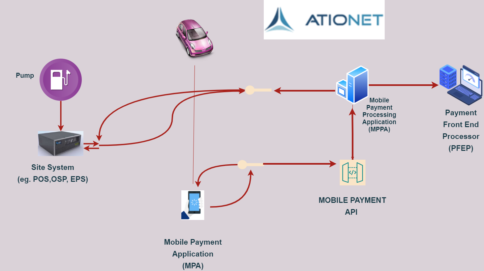
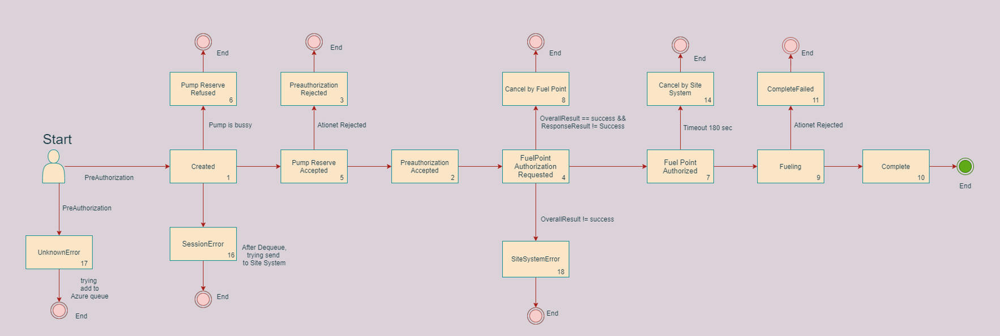

# ATIONet Fleet - Mobile Payment Api v1.0 #

|Document Information||
|--- |--- |
|File:|ATIONet-Mobile Payment Fleet Api|
|Doc Version:|1.0|
|Release Date:|2, August 2021|
|Author:|ATIONet LLC|

|Change Log|||
|--- |--- |--- |
|Ver.|Date|Change Summary|
|1.0|2/August/2021|Initial version.|

## Contents ##

- [Overview](#overview)
- [Description](#description)
- [Details](#api-details)	
- [Supported Transactions](#supported-transactions)
- [Message Structure](#message-structure)
	- [MobilePayments](#mobilePayments)
	- [PreAuthorizedPayments](#preAuthorizedPayments)
	- [GetTransaction](#getTransaction)
	- [Cancel](#cancel)
- [Error Handling](#error-handling)
- [Field Descriptions](#field-descriptions)
- [Transactions States](#transactions-states)
	- [Transaction states sequence diagram on Pre authorization Request](#transactionstates-sequence-diagram-on-pre-authorization-request)
	- [Transaction states sequence diagram on Cancelation Request](#transaction-states-sequence-diagram-on-cancelation-request)
- [Response Codes](#response-codes)
	- [ MobilePayments | PreAuthorizedPayments Response codes](#mobilePayments-|-preAuthorizedpaymentsresponse-codes)
	- [ Cancelation Response codes](#cancelation-response-codes)
- [Message Samples](#message-samples)
	- [MobilePayments ](#mobilePayments)
	- [PreAuthorizedPayments ](#preAuthorizedpayments)
	- [GetTransaction ](#gettransaction)
	- [Cancel ](#cancel)
	

## Overview

Explaining in a general way, ATIONet Fleet's Mobile Payments solution is divided into two parts. The first part is composed of the API, and the cloud server which is in charge of queuing the requests from cutomers.

The second part of the solution is divided into a socket Server that is responsible for unqueuing those requests, validating them against ATIONet, and in case of obtaining a positive response, processing them on the Site System side, and returning a result to the cutomer.





### Introduction

This specification is intended to document ATIONet’s fleet Mobile Payment API messaging format and related features required for usarage. The following sections provide descriptions of the messages themselves, the expected behaviour for each supported transaction type and a common ground for the functionality of each relevant item.

## Description 

ATIONet’s fleet Mobile Payment API It is responsible for creating pre-authorizations, obtaining information on a Transaction and Canceling a pre-authorization, as long as it meets the requirements to do so.

### API Details

API URI: *ationetmobilepayment-appshost-test.azurewebsites.net/*

### Supported Transactions

<table>
	<thead>
		<tr valign="center">
			<th rowspan="2" width="125" align="left">
				Name
			</th>
			<th colspan="2" align="center">
				Ver.
			</th>
			<th rowspan="2" align="left">
				Description
			</th>
		</tr>
		 <tr valign="top">
			  <th align="center">
					Initial
			  </th>
			  <th align="center">
					Change
			  </th>
		 </tr>
	</thead>
	<tbody>
		 <tr valign="top">
			<td>
				<p align="left">MobilePayments</p>
			</td>
			<td>
				<p align="center">1.0</p>
			</td>
			<td></td>
			<td>
				<p align="left">Used to validate a sale request, return the Transaction ID. If the Sale already exists, returns the ID</p>
			</td>
		 </tr>
		 <tr valign="top">
			<td>
				<p align="left">PreAuthorizedPayments</p>
			</td>
			<td>
				<p align="center">1.0</p>
			</td>
			<td></td>
			<td>
				<p align="left">Used to do a sale request with external approval, returns Transaction ID. If the Sale already exists, returns the ID</p>
			</td>
		 </tr>
		 <tr valign="top">
			<td>
				<p align="left">GetTransaction</p>
			</td>
			<td>
				<p align="center">1.0</p>
			</td>
			<td></td>
			<td>
				<p align="left">Returns a Sale information.</p>
			</td>
		 </tr>
		 <tr valign="top">
			<td>
				<p align="left">Cancel</p>
			</td>
			<td>
				<p align="center">1.1</p>
			</td>
			<td></td>
			<td>
				<p align="left">Cancels a Sale.</p>
			</td>
		 </tr>
		 
	
</table>


## Message Structure

This section describe the message structure for each API Method available, as well as the responses messages for each one.

### MobilePayments 

Create a Sale with Ationet authorization. The sale creation recibes an ID, if this ID already exists then the method returns the Sale's Id.

#### Request Format

*URL: /api/MobilePayments* </br>
*Method: POST* </br>
*Body: { "siteCode":"string", "pumpNumber": integer, "fuelCode": "string", "amount": double, "primaryTrack": string, "terminalCode": "string", "mobilePaymentMode": integer, "potencyKeyId": "string" ,  "externalReferanceID":"string" }* </br>

#### Response Format

*Header:*

	Content-Type: application/json; charset=utf-8
	content-encoding: gzip 

*Body:	{ “TransactionId”:”StringValue” }*


### PreAuthorizedPayments

Create a Sale with external authorization. The sale creation recibes an ID, if this ID already exists then the method returns the Sale's Id.

#### Request Format

*URL: /api/PreAuthorizedPayments* </br>
*Method: POST* </br>
*Body: { "siteCode":"string", "pumpNumber":integer, "fuelCode":"string", "amount":double, "mobilePaymentMode":integer, "potencyKeyId":"string", "externalReferanceID":"string" }* </br>

#### Response Format

*Header:*

	Content-Type: application/json; charset=utf-8
	content-encoding: gzip 

*Body: { “TransactionId”:”StringValue” }*

### GetTransaction

#### Request Format

*URL: /api/MobilePayments/GetTransaction/{id}* </br>
*Method: GET* </br>
*Body: { "id": "string" }* </br>

#### Response Format

*Header:*

	Content-Type: application/json; charset=utf-8
	content-encoding: gzip 

*Body: {
  "id":"string", </br>
  "siteCode":"string", </br>
  "primaryTrack":"string", </br>
  "odometer": double, </br>
  "terminalIdentification":"string", </br>
  "transactionSequenceNumber":integer, </br>
  "state_Name":"string",</br>
  "state_Id":integer,</br>
  "paymentProcessorReferenceId":"string",</br>
  "paymentProcessorMessage":"string",</br>
  "siteSystemMessage":"string",</br>
  "fuelPointNumber":integer,</br>
  "paymentMethod":"string",</br>
  "requestedAmount":double,</br>
  "authorizedAmount":double,</br>
  "dispatchedAmount":double,</br>
  "dispatchedQuantity":double,</br>
  "productCode":"string",</br>
  "productDescription":"string",</br>
  "productUnitPrice":double,</br>
  "unitMeasure":"string",</br>
  "createDateTime":"string",</br>
  "updateDateTime":"string"</br>
}*

### Cancel 

Cancels a Sale that is in course as long as your status is correct. In the following diagram you can check all cancellable transaction statuses - [Transaction states sequence diagram on Cancelation Request](#transaction-states-sequence-diagram-on-cancelation-request)

#### Request Format

*URL: /api/MobilePayments/Cancel* </br>
*Method: POST* </br>
*Body:{ “TransactionId”:”StringValue” }* </br>

#### Response Format

*Header:*

	Content-Type: application/json; charset=utf-8
	content-encoding: gzip 

*Body:{ ”transactionId”: ”StringValue”, ”isSuccessCanceled”: ”bool”, ”responseCode"”: ”string”, ”responseMessage”: ”string” }*


## Error Handling

Success/failure exits on the Native Transaction Protocol will be handled via HTTP status codes.

Successful request will get a HTTP 200 and the resulting response.

Failure to process the request will be indicated by an HTTP 400’s range status code.

## Field Descriptions

This section describe through a table  all parameters from request.

<table>
	<thead>
		<tr valign="center">
			<th rowspan="3" width="400" align="left">
				Request
			</th>
			<th rowspan="3" width="125" align="left">
				Paramether
			</th>
			<th rowspan="3" width="125" align="left">
				Type
			</th>
			<th rowspan="3" width="225" align="left">
				Description
			</th>
		</tr>
	</thead>
	<tbody>
		 <tr valign="top">
			<td>
				<p align="left">MobilePayments | PreAuthorizedPayments</p>
			</td>
			<td>
				<p align="left">siteCode</p>
			</td>
			<td>
			 	<p align="left">string</p>
			 </td>
			<td>
				<p align="left">The site code</p>
			</td>
		 </tr>
		 <tr valign="top">
			<td>
				<p align="left">MobilePayments | PreAuthorizedPayments</p>
			</td>
			<td>
				<p align="left">pumpNumber</p>
			</td>
			<td>
			 	<p align="left">integer</p>
			 </td>
			<td>
				<p align="left">The pump number</p>
			</td>
		 </tr>
		<tr valign="top">
			<td>
				<p align="left">MobilePayments | PreAuthorizedPayments</p>
			</td>
			<td>
				<p align="left">fuelCode</p>
			</td>
			<td>
			 	<p align="left">string</p>
			 </td>
			<td>
				<p align="left">The fuel code</p>
			</td>
		 </tr>
		<tr valign="top">
			<td>
				<p align="left">MobilePayments | PreAuthorizedPayments</p>
			</td>
			<td>
				<p align="left">amount</p>
			</td>
			<td>
			 	<p align="left">double</p>
			 </td>
			<td>
				<p align="left">Number of liters of fuel to dispatch</p>
			</td>
		 </tr>
		<tr valign="top">
			<td>
				<p align="left">MobilePayments</p>
			</td>
			<td>
				<p align="left">primaryTrack</p>
			</td>
			<td>
			 	<p align="left">string</p>
			 </td>
			<td>
				<p align="left">The number associated with the card</p>
			</td>
		 </tr>
		<tr valign="top">
			<td>
				<p align="left">MobilePayments</p>
			</td>
			<td>
				<p align="left">terminalCode</p>
			</td>
			<td>
			 	<p align="left">string</p>
			 </td>
			<td>
				<p align="left">The terminal code</p>
			</td>
		 </tr>		
		<tr valign="top">
			<td>
				<p align="left">MobilePayments | PreAuthorizedPayments</p>
			</td>
			<td>
				<p align="left">mobilePaymentMode</p>
			</td>
			<td>
			 	<p align="left">integer</p>
			 </td>
			<td>
				<p align="left">The operation mode Code. It can be for 1 for Fullintegrated</p>
			</td>
		 </tr>
		<tr valign="top">
			<td>
				<p align="left">MobilePayments | PreAuthorizedPayments</p>
			</td>
			<td>
				<p align="left">potencyKeyId</p>
			</td>
			<td>
			 	<p align="left">string</p>
			 </td>
			<td>
				<p align="left">The Transaction's ID</p>
			</td>
		 </tr>		
		<tr valign="top">
			<td>
				<p align="left">PreAuthorizedPayments</p>
			</td>
			<td>
				<p align="left">externalReferenceID</p>
			</td>
			<td>
			 	<p align="left">string</p>
			 </td>
			<td>
				<p align="left">Authorization reference ID</p>
			</td>
		 </tr>
		<tr valign="top">
			<td>
				<p align="left">GetTransaction | Cancel</p>
			</td>
			<td>
				<p align="left">transactionId</p>
			</td>
			<td>
			 	<p align="left">string</p>
			 </td>
			<td>
				<p align="left">Transaction ID</p>
			</td>
		 </tr>
</table>


## Transactions States

This section describe through a table  all  states that a sale can have.


<table>
	<thead>
		<tr valign="center">
			<th rowspan="2" width="125" align="left">
				State name
			</th>			
			<th rowspan="2" width="125" align="center">
				ID
			</th>			
			<th rowspan="2" width="125" align="left">
				Message
			</th>
		</tr>		
	</thead>
	<tbody>
		 <tr valign="top">
			<td>
				<p align="left">Created</p>
			</td>
			<td>
				<p align="center">1</p>
			</td>
			<td>
				<p align="left">Created</p>
			</td>
		 </tr>
		<tr valign="top">
			<td>
				<p align="left">PreauthorizationAccepted</p>
			</td>
			<td>
				<p align="center">2</p>
			</td>
			<td>
				<p align="left">Preauthorization Accepted</p>
			</td>
		 </tr>
		<tr valign="top">
			<td>
				<p align="left">PreauthorizationRejected</p>
			</td>
			<td>
				<p align="center">3</p>
			</td>
			<td>
				<p align="left">Preauthorization Rejected</p>
			</td>
		 </tr>
		<tr valign="top">
			<td>
				<p align="left">FuelPointAuthorizationRequested</p>
			</td>
			<td>
				<p align="center">4</p>
			</td>
			<td>
				<p align="left">FuelPoint Authorization Requested</p>
			</td>
		 </tr>
		<tr valign="top">
			<td>
				<p align="left">PumpReserveAccepted</p>
			</td>
			<td>
				<p align="center">5</p>
			</td>
			<td>
				<p align="left">Site System Accept Pump Reserve</p>
			</td>
		 </tr>
		<tr valign="top">
			<td>
				<p align="left">PumpReserveRefused</p>
			</td>
			<td>
				<p align="center">6</p>
			</td>
			<td>
				<p align="left">Site System not Accept Pump Reserve</p>
			</td>
		 </tr>
		<tr valign="top">
			<td>
				<p align="left">FuelPointAuthorized</p>
			</td>
			<td>
				<p align="center">7</p>
			</td>
			<td>
				<p align="left">Fuel Point Authorized</p>
			</td>
		 </tr>
		<tr valign="top">
			<td>
				<p align="left">CanceledByFuelPoint</p>
			</td>
			<td>
				<p align="center">8</p>
			</td>
			<td>
				<p align="left">Canceled By Fuel Point</p>
			</td>
		 </tr>
		<tr valign="top">
			<td>
				<p align="left">Fueling</p>
			</td>
			<td>
				<p align="center">9</p>
			</td>
			<td>
				<p align="left">Fueling</p>
			</td>
		 </tr>
		<tr valign="top">
			<td>
				<p align="left">Complete</p>
			</td>
			<td>
				<p align="center">10</p>
			</td>
			<td>
				<p align="left">Complete</p>
			</td>
		 </tr>
		<tr valign="top">
			<td>
				<p align="left">CompleteFailed</p>
			</td>
			<td>
				<p align="center">11</p>
			</td>
			<td>
				<p align="left">Complete Failed</p>
			</td>
		 </tr>
		<tr valign="top">
			<td>
				<p align="left">CancelationRequested</p>
			</td>
			<td>
				<p align="center">12</p>
			</td>
			<td>
				<p align="left">Cancelation Requested</p>
			</td>
		 </tr>
		<tr valign="top">
			<td>
				<p align="left">CanceledByUser</p>
			</td>
			<td>
				<p align="center">13</p>
			</td>
			<td>
				<p align="left">Canceled By User</p>
			</td>
		 </tr>
		<tr valign="top">
			<td>
				<p align="left">CanceledBySiteSystem</p>
			</td>
			<td>
				<p align="center">14</p>
			</td>
			<td>
				<p align="left">Canceled By Site System</p>
			</td>
		 </tr>
		<tr valign="top">
			<td>
				<p align="left">FuelPointDeauthorizationRequested</p>
			</td>
			<td>
				<p align="center">15</p>
			</td>
			<td>
				<p align="left">Fuel Point Deauthorization Requested</p>
			</td>
		 </tr>
		<tr valign="top">
			<td>
				<p align="left">SessionError</p>
			</td>
			<td>
				<p align="center">16</p>
			</td>
			<td>
				<p align="left">Session not available</p>
			</td>
		 </tr>
		<tr valign="top">
			<td>
				<p align="left">UnknownError</p>
			</td>
			<td>
				<p align="center">17</p>
			</td>
			<td>
				<p align="left">Unknown error when trying to connect with session</p>
			</td>
		 </tr>
		<tr valign="top">
			<td>
				<p align="left">SiteSystemError</p>
			</td>
			<td>
				<p align="center">18</p>
			</td>
			<td>
				<p align="left">Site System Generic error</p>
			</td>
		 </tr>
		<tr valign="top">
			<td>
				<p align="left">SiteSystemError</p>
			</td>
			<td>
				<p align="center">19</p>
			</td>
			<td>
				<p align="left">Cancelled By MPPA</p>
			</td>
		 </tr>
</table>


### Transaction states sequence diagram on Pre authorization Request





### Transaction states sequence diagram on Cancelation Request


## Response Codes

### MobilePayments | PreAuthorizedPayments Response codes
	
Both methos response the same codes.

<table>
	<thead>
		<tr valign="center">
			<th rowspan="3" width="125" align="left">
				Code
			</th>
			<th rowspan="3" width="125" align="left">
				Description
			</th>
		</tr>
	</thead>
	<tbody>
		<tr valign="top">
			<td>
			<p align="left">200</p>
			</td>
			<td>
				<p align="left">Success</p>
			</td>
		 </tr>
			<tr valign="top">
			<td>
			<p align="left">400</p>
			</td>
			<td>
				<p align="left">Bad request</p>
			</td>
		 </tr>
	 </tbody>
		
</table>


### Cancelation Response codes

<table>
	<thead>
		<tr valign="center">
			<th rowspan="3" width="225" align="left">
				Code
			</th>
			<th rowspan="3" width="225" align="left">
				Response
			</th>
			<th rowspan="3" width="225" align="left">
				Response body Code
			</th>
			<th rowspan="3" width="225" align="left">
				Response body Message
			</th>
		</tr>
	</thead>
		<tbody>
		<tr valign="top">
			<td>
			<p align="left">200</p>
			</td>
			<td>
				<p align="left">Success</p>
			</td>
			<td>
				<p align="left">00000</p>
			</td>
			<td>
				<p align="left">Successfully Canceled</p>
			</td>
		 </tr>
		<tr valign="top">
			<td>
			<p align="left">200</p>
			</td>
			<td>
				<p align="left">Success</p>
			</td>
			<td>
				<p align="left">-10000</p>
			</td>
			<td>
				<p align="left">Invalid state - Transaction not updated</p>
			</td>
		 </tr>
		<tr valign="top">
			<td>
			<p align="left">200</p>
			</td>
			<td>
				<p align="left">Success</p>
			</td>
			<td>
				<p align="left">04001</p>
			</td>
			<td>
				<p align="left">Invalid state - Transaction status is alredy cancel</p>
			</td>
		 </tr>
		<tr valign="top">
			<td>
			<p align="left">200</p>
			</td>
			<td>
				<p align="left">Success</p>
			</td>
			<td>
				<p align="left">02001</p>
			</td>
			<td>
				<p align="left">Cancel by Generic error</p>
			</td>
		 </tr>
		<tr valign="top">
			<td>
			<p align="left">200</p>
			</td>
			<td>
				<p align="left">Success</p>
			</td>
			<td>
				<p align="left">04003</p>
			</td>
			<td>
				<p align="left">Invalid state - dispenser is fueling</p>
			</td>
		 </tr>
		<tr valign="top">
			<td>
			<p align="left">200</p>
			</td>
			<td>
				<p align="left">Success</p>
			</td>
			<td>
				<p align="left">04004</p>
			</td>
			<td>
				<p align="left">Invalid state - Transaction status is completed</p>
			</td>
		 </tr>
		<tr valign="top">
			<td>
			<p align="left">200</p>
			</td>
			<td>
				<p align="left">Success</p>
			</td>
			<td>
				<p align="left">04007</p>
			</td>
			<td>
				<p align="left">Unknow transaction or authorization</p>
			</td>
		 </tr>
		<tr valign="top">
			<td>
			<p align="left">200</p>
			</td>
			<td>
				<p align="left">Success</p>
			</td>
			<td>
				<p align="left">04008</p>
			</td>
			<td>
				<p align="left">Invalid state - Cancelation is alredy requested</p>
			</td>
		 </tr>
		<tr valign="top">
			<td>
			<p align="left">200</p>
			</td>
			<td>
				<p align="left">Success</p>
			</td>
			<td>
				<p align="left">04009</p>
			</td>
			<td>
				<p align="left">Invalid state - dispenser is fueling</p>
			</td>
		 </tr>
		<tr valign="top">
			<td>
			<p align="left">200</p>
			</td>
			<td>
				<p align="left">Success</p>
			</td>
			<td>
				<p align="left">04010</p>
			</td>
			<td>
				<p align="left">Transacion canceled by Session not available</p>
			</td>
		 </tr>
		<tr valign="top">
			<td>
			<p align="left">200</p>
			</td>
			<td>
				<p align="left">Success</p>
			</td>
			<td>
				<p align="left">04011</p>
			</td>
			<td>
				<p align="left">Transacion canceled by unknow error</p>
			</td>
		 </tr>
			<tr valign="top">
			<td>
			<p align="left">400</p>
			</td>
			<td>
				<p align="left">Bad request</p>
			</td>
			<td>
				<p align="center">-</p>
			</td>
			<td>
				<p align="center">-</p>
			</td>
		 </tr>
	 </tbody>

</table>
	
## Message Samples

### MobilePayments Sample
	
```
{
  "siteCode": "1524",
  "pumpNumber": 1,
  "fuelCode": "3",
  "amount": 9,
  "primaryTrack": "0000000000001",
  "terminalCode": "S2G321",
  "mobilePaymentMode": 1,
  "potencyKeyId": "5734cbb9-f78f-4ad4-aa87-79ed95181c5a"
}
	
```
	
### PreAuthorizedPayments

```
{
  "siteCode": "1524",
  "pumpNumber": 1,
  "fuelCode": "3",
  "amount": 9,
  "mobilePaymentMode": 1,
  "potencyKeyId": "5734cbb9-f78f-4ad4-aa87-79ed95181c5a",
  "externalReferanceID": "854712"
}

```
	
### GetTransaction

```
{
  "id": 5734cbb9-f78f-4ad4-aa87-79ed95181c5a
}
```
	
### Cancel

```
{
  "transactionId": "5664cbb9-f78f-4ad4-aa87-79ed95181c5a"
}
```
