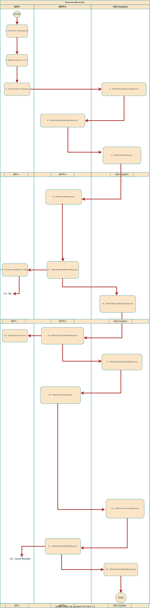

# External PFEP Fleet Mobile Payment Api #

|Document Information||
|--- |--- |
|File:|ATIONet - Dynamic QR Code Payments|
|Doc Version:|1.0|
|Release Date:|2, September 2021|
|Author:|ATIONet LLC|

|Change Log|||
|--- |--- |--- |
|Ver.|Date|Change Summary|
|1.0|2/September/2021|Initial version.|

## Contents ##


- [Overview](#overview)
	- [Introduction](#introduction)
	- [Entities](#Entities)
	
</br>

## Overview

This document is part of [Ationet Fleet Mobile Payment Fully Integrated](ATIONet_Mobile_Payment_Fleet_Api_-EN.md) and only describe  Mobile Payment Solution flow in which the PFEP is an external agent to `ATIONet`. 

## Sequence diagram Pay at Pump with external PFEP



## API Details

*API URI: ationetmobilepayment-appshost-test.azurewebsites.net/*

## Message Structure

This section describe the message structure for each API Method available, as well as the responses messages for each one.


### PreAuthorizedPayments

Create a Sale with external authorization. The sale creation recibes an ID, if this ID already exists then the method returns the Sale's Id.

#### Request Format

*URL: /api/PreAuthorizedPayments* </br>
*Method: POST* </br>
*Body: { "siteCode":"string", "pumpNumber":integer, "fuelCode":"string", "amount":double, "mobilePaymentMode":integer, "potencyKeyId":"string", "externalReferanceID":"string" }* </br>

#### Response Format

*Header:*

	Content-Type: application/json; charset=utf-8
	content-encoding: gzip 

*Body: { “TransactionId”:”StringValue” }*

## Error Handling

Success/failure exits on the Native Transaction Protocol will be handled via HTTP status codes.

Successful request will get a HTTP 200 and the resulting response.

Failure to process the request will be indicated by an HTTP 400’s range status code.

## Field Descriptions

This section describe through a table  all parameters from request.

<table>
	<thead>
		<tr valign="center">
			<th rowspan="3" width="125" align="left">
				Paramether
			</th>
			<th rowspan="3" width="125" align="left">
				Type
			</th>
			<th rowspan="3" width="225" align="left">
				Description
			</th>
		</tr>
	</thead>
	<tbody>
		 <tr valign="top">
			<td>
				<p align="left">siteCode</p>
			</td>
			<td>
			 	<p align="left">string</p>
			 </td>
			<td>
				<p align="left">The site code</p>
			</td>
		 </tr>
		 <tr valign="top">
			<td>
				<p align="left">pumpNumber</p>
			</td>
			<td>
			 	<p align="left">integer</p>
			 </td>
			<td>
				<p align="left">The pump number</p>
			</td>
		 </tr>
		<tr valign="top">
			<td>
				<p align="left">fuelCode</p>
			</td>
			<td>
			 	<p align="left">string</p>
			 </td>
			<td>
				<p align="left">The fuel code</p>
			</td>
		 </tr>
		<tr valign="top">
			<td>
				<p align="left">amount</p>
			</td>
			<td>
			 	<p align="left">double</p>
			 </td>
			<td>
				<p align="left">Number of liters of fuel to dispatch</p>
			</td>
		 </tr>
		<tr valign="top">
			<td>
				<p align="left">mobilePaymentMode</p>
			</td>
			<td>
			 	<p align="left">integer</p>
			 </td>
			<td>
				<p align="left">The operation mode Code. It can be for 1 for Fullintegrated</p>
			</td>
		 </tr>
		<tr valign="top">
			<td>
				<p align="left">potencyKeyId</p>
			</td>
			<td>
			 	<p align="left">string</p>
			 </td>
			<td>
				<p align="left">The Transaction's ID</p>
			</td>
		 </tr>		
		<tr valign="top">
			<td>
				<p align="left">externalReferenceID</p>
			</td>
			<td>
			 	<p align="left">string</p>
			 </td>
			<td>
				<p align="left">Authorization reference ID</p>
			</td>
		 </tr>
		
</table>

## Transactions States

This section describe through a table  all  states that a sale can have.


<table>
	<thead>
		<tr valign="center">
			<th rowspan="2" width="125" align="left">
				State name
			</th>			
			<th rowspan="2" width="125" align="center">
				ID
			</th>			
			<th rowspan="2" width="125" align="left">
				Message
			</th>
		</tr>		
	</thead>
	<tbody>
		 <tr valign="top">
			<td>
				<p align="left">Created</p>
			</td>
			<td>
				<p align="center">1</p>
			</td>
			<td>
				<p align="left">Created</p>
			</td>
		 </tr>
		<tr valign="top">
			<td>
				<p align="left">FuelPointAuthorizationRequested</p>
			</td>
			<td>
				<p align="center">4</p>
			</td>
			<td>
				<p align="left">FuelPoint Authorization Requested</p>
			</td>
		 </tr>
		<tr valign="top">
			<td>
				<p align="left">PumpReserveAccepted</p>
			</td>
			<td>
				<p align="center">5</p>
			</td>
			<td>
				<p align="left">Site System Accept Pump Reserve</p>
			</td>
		 </tr>
		<tr valign="top">
			<td>
				<p align="left">PumpReserveRefused</p>
			</td>
			<td>
				<p align="center">6</p>
			</td>
			<td>
				<p align="left">Site System not Accept Pump Reserve</p>
			</td>
		 </tr>
		<tr valign="top">
			<td>
				<p align="left">FuelPointAuthorized</p>
			</td>
			<td>
				<p align="center">7</p>
			</td>
			<td>
				<p align="left">Fuel Point Authorized</p>
			</td>
		 </tr>
		<tr valign="top">
			<td>
				<p align="left">CanceledByFuelPoint</p>
			</td>
			<td>
				<p align="center">8</p>
			</td>
			<td>
				<p align="left">Canceled By Fuel Point</p>
			</td>
		 </tr>
		<tr valign="top">
			<td>
				<p align="left">Fueling</p>
			</td>
			<td>
				<p align="center">9</p>
			</td>
			<td>
				<p align="left">Fueling</p>
			</td>
		 </tr>
		<tr valign="top">
			<td>
				<p align="left">Complete</p>
			</td>
			<td>
				<p align="center">10</p>
			</td>
			<td>
				<p align="left">Complete</p>
			</td>
		 </tr>
		<tr valign="top">
			<td>
				<p align="left">CancelationRequested</p>
			</td>
			<td>
				<p align="center">12</p>
			</td>
			<td>
				<p align="left">Cancelation Requested</p>
			</td>
		 </tr>
		<tr valign="top">
			<td>
				<p align="left">CanceledByUser</p>
			</td>
			<td>
				<p align="center">13</p>
			</td>
			<td>
				<p align="left">Canceled By User</p>
			</td>
		 </tr>
		<tr valign="top">
			<td>
				<p align="left">CanceledBySiteSystem</p>
			</td>
			<td>
				<p align="center">14</p>
			</td>
			<td>
				<p align="left">Canceled By Site System</p>
			</td>
		 </tr>
		<tr valign="top">
			<td>
				<p align="left">FuelPointDeauthorizationRequested</p>
			</td>
			<td>
				<p align="center">15</p>
			</td>
			<td>
				<p align="left">Fuel Point Deauthorization Requested</p>
			</td>
		 </tr>
		<tr valign="top">
			<td>
				<p align="left">SessionError</p>
			</td>
			<td>
				<p align="center">16</p>
			</td>
			<td>
				<p align="left">Session not available</p>
			</td>
		 </tr>
		<tr valign="top">
			<td>
				<p align="left">UnknownError</p>
			</td>
			<td>
				<p align="center">17</p>
			</td>
			<td>
				<p align="left">Unknown error when trying to connect with session</p>
			</td>
		 </tr>
		<tr valign="top">
			<td>
				<p align="left">SiteSystemError</p>
			</td>
			<td>
				<p align="center">18</p>
			</td>
			<td>
				<p align="left">Site System Generic error</p>
			</td>
		 </tr>
		<tr valign="top">
			<td>
				<p align="left">SiteSystemError</p>
			</td>
			<td>
				<p align="center">19</p>
			</td>
			<td>
				<p align="left">Cancelled By MPPA</p>
			</td>
		 </tr>
</table>

## Response Codes

### MobilePayments | PreAuthorizedPayments Response codes
	
Both methos response the same codes.

<table>
	<thead>
		<tr valign="center">
			<th rowspan="3" width="125" align="left">
				Code
			</th>
			<th rowspan="3" width="125" align="left">
				Description
			</th>
		</tr>
	</thead>
	<tbody>
		<tr valign="top">
			<td>
			<p align="left">200</p>
			</td>
			<td>
				<p align="left">Success</p>
			</td>
		 </tr>
			<tr valign="top">
			<td>
			<p align="left">400</p>
			</td>
			<td>
				<p align="left">Bad request</p>
			</td>
		 </tr>
	 </tbody>
		
</table>

## Message Samples

### PreAuthorizedPayments

```
{
  "siteCode": "1524",
  "pumpNumber": 1,
  "fuelCode": "3",
  "amount": 9,
  "mobilePaymentMode": 1,
  "potencyKeyId": "5734cbb9-f78f-4ad4-aa87-79ed95181c5a",
  "externalReferanceID": "854712"
}

```
